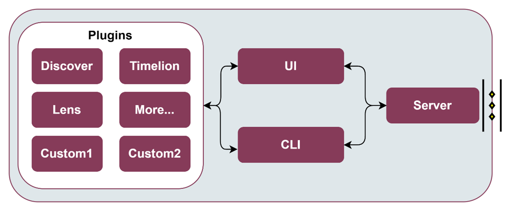
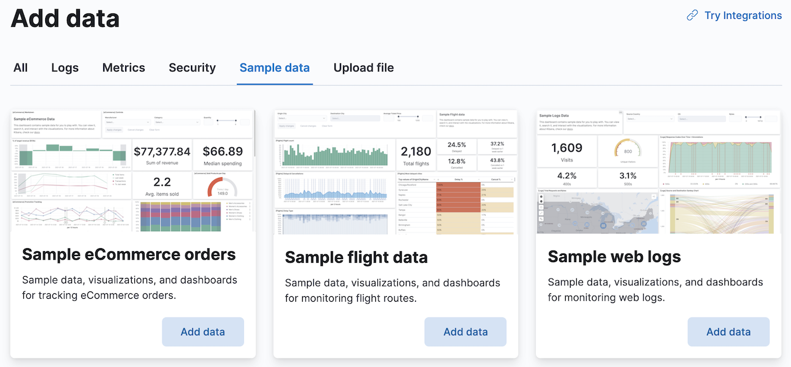
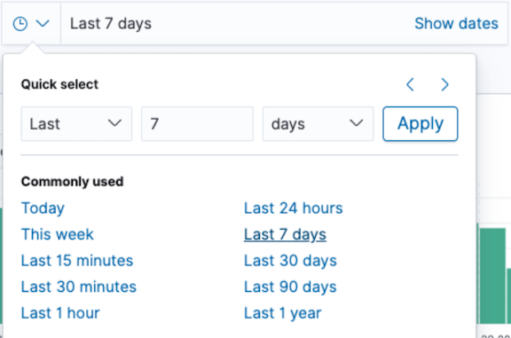
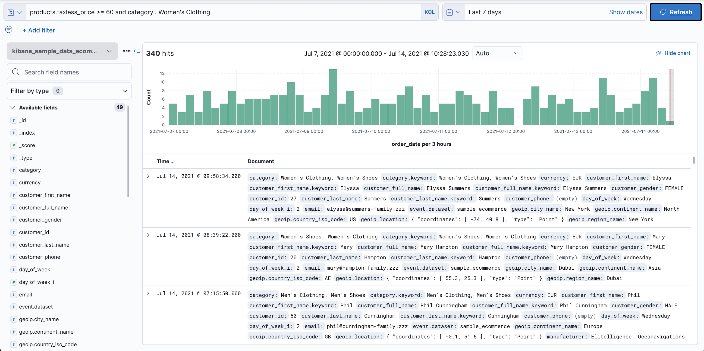
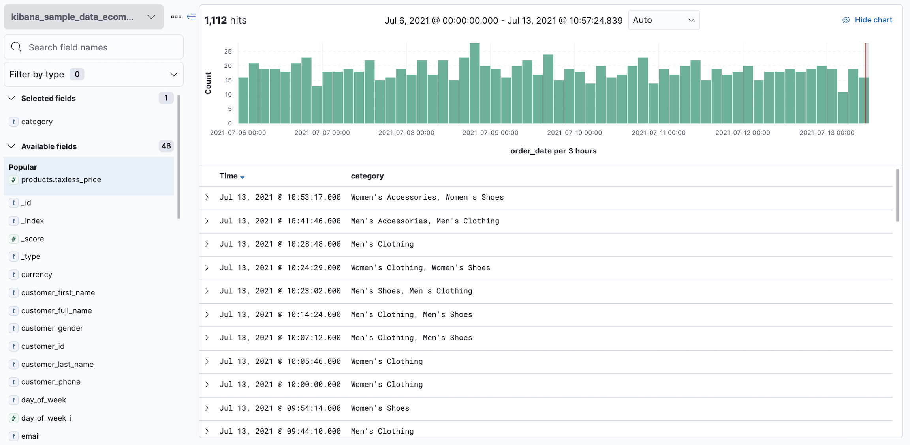
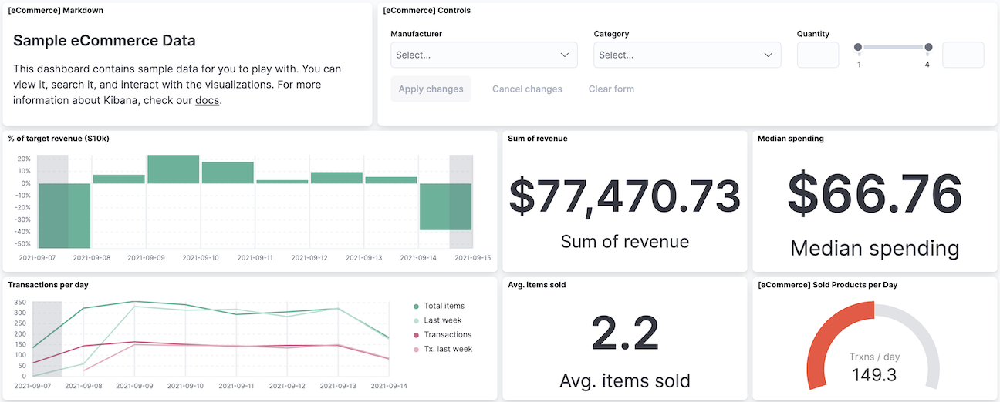
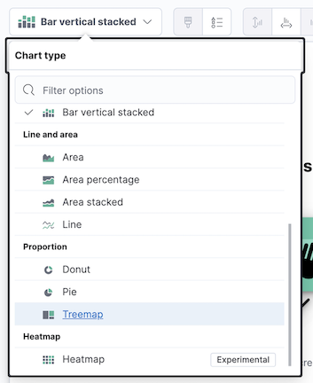
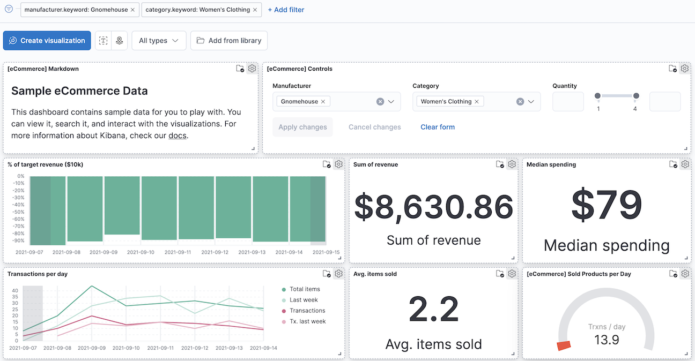

.. _Business KPI reporting enabler:

##############################
Business KPI reporting enabler
##############################

.. contents::
  :local:
  :depth: 1

***************
Introduction
***************
All valuable for log and time-series analytics or Key Performance Indicators (KPIs) desired by the end-user should be available for representation in graphs, charts, pies, etc. The Business KPI enabler will allow to embed them as User Interfaces (UIs) within the tactile dashboard. It will facilitate the visualization and combination of charts, tables, and other visualization graphs in order to search for hidden insights. 

The enabler is a simplified version of `Kibana <https://www.elastic.co/kibana/>`__ . Therefore, it follows the similar architecture. To sum up, it is composed of a server component containing the business logic engine, accompanied with a UI component that defines the graphical UI that users interact with, and a Command Line Interface (CLI) tool especially designed for developers.

***************
Features
***************
The following figure presents the architectural diagram of video augmentation enabler and inside components.

 
As it can be seen, it will be mainly formed by four components:

- **Business KPI Server**: Collects data from data collectors (e.g., tactile dashboard PUI9 database, LTSE, or EDBE enablers) into a dedicated database and provides access to it to the UI and CLI components via an internal REST API. 
- **Plugins**: Business KPI functionalities are implemented through modular plugins (Discover, Tag, Lens, Maps, etc.), which contain the business logic and communicate with the UI and CLI components, based on the data collected in the Business KPI server. Furthermore, if will, custom plugins can also be easily integrated if needed, thanks to having a modular approach.
- **Business KPI UI**: When the end-user accesses the Business KPI enabler via the Tactile Dashboard webpage, the UI component loads all server plugins that comprise the core functionalities of the Business KPI enabler. Hence, the UI component provides an editor to create and explore interactive visualizations and a set of functionalities to arrange the visualizations according to ASSIST-IoT end-user goals.
- **Business KPI CLI**: The CLI component enables custom plugins built by 3rd party developers to interact with the Business KPI Server, so that it is reachable from the UI to e.g., provide new data aggregation methods, or to visualize new chart types, colour palettes, etc.

*********************
Place in architecture
*********************

Business KPI reporting enabler is located in the Application and Service layer of the ASSIST-IoT architecture that provides application logic, including data visualisation and user interaction services, data analytics capabilities, various kinds of data protection support, and data management logic. 

***************
User guide
***************

    **Note**: This user guide follows the `Quick start guide <https://www.elastic.co/guide/en/kibana/current/get-started.html>`__  from Kibana documentation page.

Set up the installation
*******************
Go to the Instalattion section

Add sample data
*******************
Sample data sets come with sample visualizations, dashboards, and more to help you explore Business KPI enabler before you ingest or add your own data.

- On the home page, click **Add data**.

Explore the data
*******************
Discover displays the data in an interactive histogram that shows the distribution of data, or documents, over time, and a table that lists the fields for each document that matches the data view. To view a subset of the documents, you can apply filters to the data, and customize the table to display only the fields you want to explore.

- Open the main menu, then click **Discover**.
- Change the time filter to e.g., **Last 7 days**.

- To explore a specific filtered data, you can use of the `KQL <https://www.elastic.co/guide/en/kibana/current/kuery-query.html>`__ search field:

``products.taxless_price >= 60 and category : Women's Clothing``

   
- To view only the data categories that contain a specific filtered data, hover over the **category** field, then click **+**.

   
View and analyze the data
*******************

A dashboard is a collection of panels that you can use to view and analyze the data. Panels contain visualizations, interactive controls, text, and more.

- Open the main menu, then click **Dashboard**.

   
Create a visualization panel
*******************
Create a treemap panel that shows additional context information (such as top sales regions and manufacturers), then add the panel to the dashboard.

- In the toolbar, click **Edit**.
- On the dashboard, click **Create visualization**.
- In the drag-and-drop visualization editor, open the **Visualization type** dropdown, then select **Treemap**.
- Click **save and return**.

Filter the data
*******************
To view a subset of the data, you can apply filters to the dashboard panels. Apply a filter to view e.g., women’s clothing data generated on a specific day from a specific manufacturer.

- Click **Add filter**.
- From the **Field dropdown**, select filtered parameter.
- From the **Operator dropdown**, select **is**.
- From the **Value dropdown**, select the desired value.
- Click **Save**.

=======

REST API endpoints
*******************
The currently supported REST API endpoints are listed below:

+---------+--------------------------------+------------------------------------------------------+----------------------+------------------+
| Method  | Endpoint                       | Description                                          | Payload (if needed)  | Response format  |
+=========+================================+======================================================+======================+==================+
| POST    | /api/spaces/                   | Create a Business KPI space_name                     | <space_name>         |                  |
+---------+--------------------------------+------------------------------------------------------+----------------------+------------------+
| GET     | /api/spaces/                   | Retrieve a Business KPI space_name                   | <space_name>         |                  |
+---------+--------------------------------+------------------------------------------------------+----------------------+------------------+
| DELETE  | /api/spaces/                   | Delete a Business KPI space_name                     | <space_name>         |                  |
+---------+--------------------------------+------------------------------------------------------+----------------------+------------------+
| POST    | /api/data_views/               | Create a data view with a custom title (JSON file)   | <data_view>          |                  |
+---------+--------------------------------+------------------------------------------------------+----------------------+------------------+
| POST    | /api/saved_objects/data-view/  | Update <my-view> data view (JSON file)               | <my-view>            |                  |
+---------+--------------------------------+------------------------------------------------------+----------------------+------------------+
| GET     | /api/data_views/data_view/     | Retrieve the data view <my-view>                     | <my-view>            |                  |
+---------+--------------------------------+------------------------------------------------------+----------------------+------------------+
| DELETE  | /api/data_views/data_view/     | Delete a data view <my-view>                         | <my-view>            |                  |
+---------+--------------------------------+------------------------------------------------------+----------------------+------------------+

***************
Prerequisites
***************

- Kubernetes >= 1.14
- Helm >= 2.17.0
- `ElasticSearch Helm chart <https://artifacthub.io/packages/helm/elastic/elasticsearch>`__ 

***************
Installation
***************

Installing the chart
*******************
The enabler is provided as a Helm chart. To install the chart with the release name ``my-BKPI``:

``helm install my-BKPI BKPI``

The command deploys a Kibana helm chart on the Kubernetes cluster in the default configuration. The Configuration section lists the parameters that can be configured during installation.

Alternatively, a YAML file that specifies the values for the parameters can be provided while installing the chart. For example,

``helm install my-BKPI -f values.yaml BKPI``

Verification / Visualization
*******************
List all releases using ``helm list``

Uninstalling the Chart
*******************
To uninstall/delete the ``my-BKPI`` deployment:

``helm delete my-BKPI``

*********************
Configuration options
*********************

***************
Developer guide
***************

The following options are supported for the set up of the Business KPI enabler Helm chart:

+-------------------------+---------------------------------------------------------------------------------------------------------------------------------------------------------------------------------------+------------------------------------+
| Parameter               | Description                                                                                                                                                                           | Default                            |
+=========================+=======================================================================================================================================================================================+====================================+
| ``affinity``            | Configurable affinity                                                                                                                                                                 | {}                                 |
+-------------------------+---------------------------------------------------------------------------------------------------------------------------------------------------------------------------------------+------------------------------------+
| ``annotations``         | Configurable annotations on the deployment object                                                                                                                                     | {}                                 |
+-------------------------+---------------------------------------------------------------------------------------------------------------------------------------------------------------------------------------+------------------------------------+
| ``automountToken``      | Whether or not to automount the service account token in the Pod                                                                                                                      | true                               |
+-------------------------+---------------------------------------------------------------------------------------------------------------------------------------------------------------------------------------+------------------------------------+
| ``elasticsearchHosts``  | The URLs used to connect to Elasticsearch                                                                                                                                             | http://elasticsearch-master:9200   |
+-------------------------+---------------------------------------------------------------------------------------------------------------------------------------------------------------------------------------+------------------------------------+
| ``envFrom``             | Templatable string to be passed to the environment from variables which will be appended to the envFrom: definition for the container                                                 | []                                 |
+-------------------------+---------------------------------------------------------------------------------------------------------------------------------------------------------------------------------------+------------------------------------+
| ``extraContainers``     | Templatable string of additional containers to be passed to the tpl function                                                                                                          | []                                 |
+-------------------------+---------------------------------------------------------------------------------------------------------------------------------------------------------------------------------------+------------------------------------+
| ``extraEnvs``           | Extra environment variables which will be appended to the env: definition for the container                                                                                           | see values.yaml                    |
+-------------------------+---------------------------------------------------------------------------------------------------------------------------------------------------------------------------------------+------------------------------------+
| ``extraInitContainers`` | Templatable string of additional containers to be passed to the tpl function                                                                                                          | []                                 |
+-------------------------+---------------------------------------------------------------------------------------------------------------------------------------------------------------------------------------+------------------------------------+
| ``extraVolumeMounts``   | Configuration for additional volumeMounts                                                                                                                                             | []                                 |
+-------------------------+---------------------------------------------------------------------------------------------------------------------------------------------------------------------------------------+------------------------------------+
| ``extraVolumes``        | Configuration for additional volumes                                                                                                                                                  | []                                 |
+-------------------------+---------------------------------------------------------------------------------------------------------------------------------------------------------------------------------------+------------------------------------+
| ``fullnameOverride``    | Overrides the full name of the resources. If not set the name will default to " .Release.Name - .Values.nameOverride orChart.Name "                                                   | ""                                 |
+-------------------------+---------------------------------------------------------------------------------------------------------------------------------------------------------------------------------------+------------------------------------+
| ``healthCheckPath``     | The path used for the readinessProbe to check that Kibana is ready. If you are setting server.basePath you will also need to update this to /${basePath}/app/kibana                   | /app/kibana                        |
+-------------------------+---------------------------------------------------------------------------------------------------------------------------------------------------------------------------------------+------------------------------------+
| ``hostAliases``         | Configurable hostAliases                                                                                                                                                              | []                                 |
+-------------------------+---------------------------------------------------------------------------------------------------------------------------------------------------------------------------------------+------------------------------------+
| ``httpPort``            | The http port that Kubernetes will use for the healthchecks and the service                                                                                                           | 5601                               |
+-------------------------+---------------------------------------------------------------------------------------------------------------------------------------------------------------------------------------+------------------------------------+
| ``imagePullPolicy``     | The Kubernetes imagePullPolicy value                                                                                                                                                  | IfNotPresent                       |
+-------------------------+---------------------------------------------------------------------------------------------------------------------------------------------------------------------------------------+------------------------------------+
| ``imagePullSecrets``    | Configuration for imagePullSecrets so that you can use a private registry for your image                                                                                              | []                                 |
+-------------------------+---------------------------------------------------------------------------------------------------------------------------------------------------------------------------------------+------------------------------------+
| ``imageTag``            | The Kibana Docker image tag                                                                                                                                                           | 7.17.3                             |
+-------------------------+---------------------------------------------------------------------------------------------------------------------------------------------------------------------------------------+------------------------------------+
| ``image``               | The Kibana Docker image                                                                                                                                                               | docker.elastic.co/kibana/kibana    |
+-------------------------+---------------------------------------------------------------------------------------------------------------------------------------------------------------------------------------+------------------------------------+
| ``ingress``             | Configurable ingress to expose the Kibana service.                                                                                                                                    | see values.yaml                    |
+-------------------------+---------------------------------------------------------------------------------------------------------------------------------------------------------------------------------------+------------------------------------+
| ``kibanaConfig``        | Allows you to add any config files in /usr/share/kibana/config/ such as kibana.yml See values.yaml for an example of the formatting                                                   | {}                                 |
+-------------------------+---------------------------------------------------------------------------------------------------------------------------------------------------------------------------------------+------------------------------------+
| ``labels``              | Configurable labels applied to all Kibana pods                                                                                                                                        | {}                                 |
+-------------------------+---------------------------------------------------------------------------------------------------------------------------------------------------------------------------------------+------------------------------------+
| ``lifecycle``           | Allows you to add lifecycle hooks. See values.yaml for an example of the formatting                                                                                                   | {}                                 |
+-------------------------+---------------------------------------------------------------------------------------------------------------------------------------------------------------------------------------+------------------------------------+
| ``nameOverride``        | Overrides the chart name for resources. If not set the name will default to .Chart.Name                                                                                               | ""                                 |
+-------------------------+---------------------------------------------------------------------------------------------------------------------------------------------------------------------------------------+------------------------------------+
| ``nodeSelector``        | Configurable nodeSelector so that you can target specific nodes for your Kibana instances                                                                                             | {}                                 |
+-------------------------+---------------------------------------------------------------------------------------------------------------------------------------------------------------------------------------+------------------------------------+
| ``podAnnotations``      | Configurable annotations applied to all Kibana pods                                                                                                                                   | {}                                 |
+-------------------------+---------------------------------------------------------------------------------------------------------------------------------------------------------------------------------------+------------------------------------+
| ``podSecurityContext``  | Allows you to set the securityControl for the pod                                                                                                                                     | see values.yaml                    |
+-------------------------+---------------------------------------------------------------------------------------------------------------------------------------------------------------------------------------+------------------------------------+
| ``priorityClassName``   | The name of the PriorityClass. No default is supplied as the PriorityClass must be created first                                                                                      | ""                                 |
+-------------------------+---------------------------------------------------------------------------------------------------------------------------------------------------------------------------------------+------------------------------------+
| ``protocol``            | The protocol that will be used for the readinessProbe. Change this to https if you have server.ssl.enabled: true set                                                                  | http                               |
+-------------------------+---------------------------------------------------------------------------------------------------------------------------------------------------------------------------------------+------------------------------------+
| ``readinessProbe``      | Configuration for the readiness probe                                                                                                                                                 | see  values.yaml                   |
+-------------------------+---------------------------------------------------------------------------------------------------------------------------------------------------------------------------------------+------------------------------------+
| ``replicas``            | Kubernetes replica count for the Deployment (i.e. how many pods)                                                                                                                      | 1                                  |
+-------------------------+---------------------------------------------------------------------------------------------------------------------------------------------------------------------------------------+------------------------------------+
| ``resources``           | Allows you to set the resources for the Deployment                                                                                                                                    | see values.yaml                    |
+-------------------------+---------------------------------------------------------------------------------------------------------------------------------------------------------------------------------------+------------------------------------+
| ``secretMounts``        | Allows you easily mount a secret as a file inside the Deployment. Useful for mounting certificates and other secrets. See  for an example                                             | []                                 |
+-------------------------+---------------------------------------------------------------------------------------------------------------------------------------------------------------------------------------+------------------------------------+
| ``securityContext``     | Allows you to set the securityContext for the container                                                                                                                               | see values.yaml                    |
+-------------------------+---------------------------------------------------------------------------------------------------------------------------------------------------------------------------------------+------------------------------------+
| ``serverHost``          | The server.host Kibana setting. This is set explicitly so that the default always matches what comes with the Docker image                                                            | 0.0.0.0                            |
+-------------------------+---------------------------------------------------------------------------------------------------------------------------------------------------------------------------------------+------------------------------------+
| ``serviceAccount``      | Allows you to overwrite the "default" serviceAccount for the pod                                                                                                                      | []                                 |
+-------------------------+---------------------------------------------------------------------------------------------------------------------------------------------------------------------------------------+------------------------------------+
| ``service``             | Configurable service to expose the Kibana service.                                                                                                                                    | see values.yaml                    |
+-------------------------+---------------------------------------------------------------------------------------------------------------------------------------------------------------------------------------+------------------------------------+
| ``tolerations``         | Configurable tolerations                                                                                                                                                              | []                                 |
+-------------------------+---------------------------------------------------------------------------------------------------------------------------------------------------------------------------------------+------------------------------------+
| ``updateStrategy``      | Allows you to change the default updateStrategy for the Deployment. A standard upgrade of Kibana requires a full stop and start which is why the default strategy is set to Recreate  | type: Recreate                     |
+-------------------------+---------------------------------------------------------------------------------------------------------------------------------------------------------------------------------------+------------------------------------+

***************************
Version control and release
***************************
Version 1.0

***************
License
***************
Elastic License and Server Side Public License (SSPL)

********************
Notice(dependencies)
********************
Not applicable
