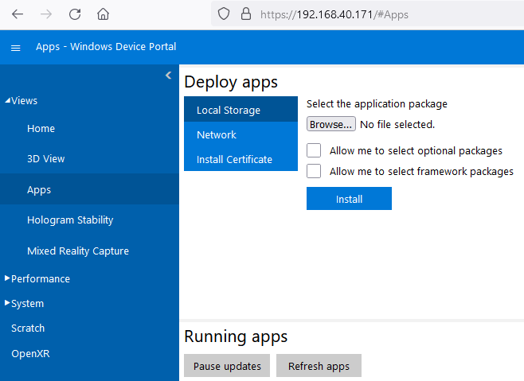

.. _MR enabler:

############
MR enabler
############

.. contents::
  :local:
  :depth: 1

***************
Introduction
***************
The MR enabler receives data and transforms it in a format suitable for visualisation through head-mounted MR devices. Data, which may come from long-term storage or real-time data streams, are requested according to its relevance to the user. Information is displayed to the user, according to their authorisation/access rights, via an MR device. The enabler supports user interaction with the virtual content and view customisation.

***************
Features
***************
The MR enabler: 
 * visualizes the model of the construction site through the head-mounted MR devices, along with the danger zones of the site. The model of the site and all its related data come from the long-term storage,
 * receives alert messages from real-time data streams and display them to the user
 * and captures and stores media files in order to include them in a report.

*********************
Place in architecture
*********************
The MR enabler is located in the application and service layer of Assist-IoT. It will provide immersive experience to practitioners of ASSIST-IoT, transforming collected data into more suitable formats for visualisation capabilities over head-mounted MR displays.
The ASSIST-IoT Application and Services plane is intended to provide access to data via human-centric visualisation enablers. 

***************
User guide
***************
In order to use the MR enabler, the user needs to power up the MR device, unlock it and then hold out one of their hands with the palm facing up and look at their wrist, where the menu button will appear. Pressing the button with their free hand will show up the central navigation menu, where the user can find and execute the MR enabler application. Alternatively, the user can use the device's portal of the MR device that will be available through any browser on a computer of the local network, using the MR device's local ip as the url. The MR enabler will load and visualize the construction site model, along with its relative data (for instance its dangerous zones) and its handles, that will allow the user to manipulate the model's transform (position, rotation and scale). The handles have different colors in order to be more understandable for the user about the model's transform attribute that they are affecting. The user has to keep the palm of their right hand open in order to access the MR enabler application's menu. The MR enabler can receive alerts from the real-time storage on runtime, visualize them to the user and then the user has the option to silence the alert from the menu, after that they have acknowledged about the incoming alert. The application's menu also offers the ability to capture a media (either a photo or a video) and store it in the device's storage in order to include it in a report. In order to capture a media file, the user needs to guide into the application's menu and click with their free hand the button "Open Camera" and use the Camera panel that pops up next to the menu. 

***************
Prerequisites
***************
The MR enabler is designed to be executed on a Microsoft Hololens 2 device with ARM64 architecture.

***************
Installation
***************
In order to install the application, the user has to use the device's portal of the MR device that will be available through any browser on a computer of the local network, using the MR device's local ip as the url. The users has to go to Views > Apps and find the Deploy apps section, click "Browse..." and select the appxbundle file of the MR enabler. The user should also check the box next to "Allow me to select framework packages", if it is the first time installing the app on their device. Finally, they should click on "Install" to complete the installation (or "Next" if option "Allow me to select framework packages" is selected).

*********************
Configuration options
*********************
The following table lists the configurable parameters of the MR enabler.

+------------------------+-------------------------------------------------------------------------------+
| Parameter              | Description                                                                   |
+========================+===============================================================================+
| ``alerting``           | Gets information about thresholds and ID/location of incidents                |
+------------------------+-------------------------------------------------------------------------------+
| ``authorization``      | Authenticates the MR application (HMD)                                        |
+------------------------+-------------------------------------------------------------------------------+
| ``authorization_pass`` | Authenticates the MR application (HMD)                                        |
+------------------------+-------------------------------------------------------------------------------+
| ``ifc_danger``         | Gets the IFC danger zones                                                     |
+------------------------+-------------------------------------------------------------------------------+
| ``ifc_models``         | Receives IFC models                                                           |
+------------------------+-------------------------------------------------------------------------------+
| ``localization``       | Gets location and orientation data of the MR interface (OSH inspector)        |
+------------------------+-------------------------------------------------------------------------------+
| ``media_files_path``   | Receives training and medical data                                            |
+------------------------+-------------------------------------------------------------------------------+
| ``mqtt``               | Access point of connection for consuming real–time data                       |
+------------------------+-------------------------------------------------------------------------------+
| ``name``               | Gets the name of the construction site                                        |
+------------------------+-------------------------------------------------------------------------------+
| ``network_ip``         | Connects MR interface to network and gets data                                |
+------------------------+-------------------------------------------------------------------------------+
| ``pilot_uuid``         | Gets the unique id of the construction site                                   |
+------------------------+-------------------------------------------------------------------------------+
| ``reports_files_path`` | Gets the path for uploading and saving reports                                |
+------------------------+-------------------------------------------------------------------------------+
| ``ssid``               | Gets the name of Wi-Fi network                                                |
+------------------------+-------------------------------------------------------------------------------+
| ``ssid_password``      | Receives the password key of the Wi-Fi network                                |
+------------------------+-------------------------------------------------------------------------------+

***************
Developer guide
***************
Not applicable.

***************************
Version control and release
***************************
Not applicable.

***************
License
***************
Not applicable.

********************
Notice(dependencies)
********************
Not applicable.

