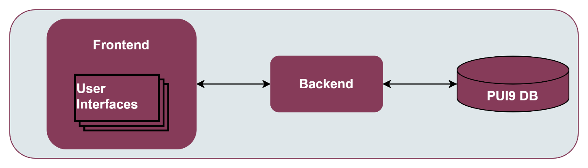
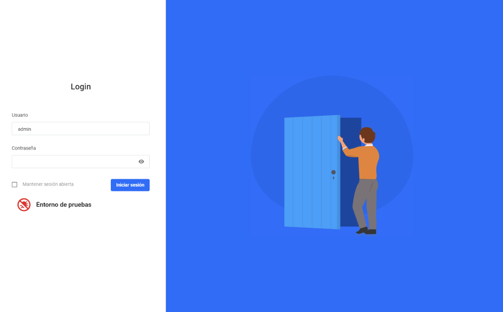
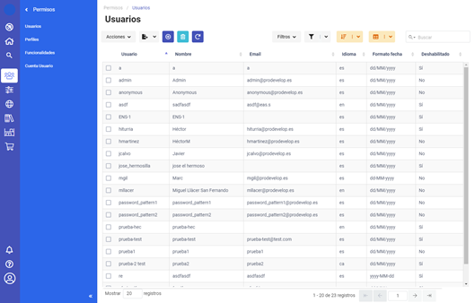

.. _Tactile dashboard enabler:

#########################
Tactile dashboard enabler
#########################

.. contents::
  :local:
  :depth: 1

***************
Introduction
***************
The Tactile Dashboard enabler has the capability of representing data through meaningful combined visualizations in real time. It also provides (aggregates and homogenizes) all the User Interfaces (UIs) for the configuration of the different ASSIST-IoT enablers, and associated components.

***************
Features
***************
The tactile dashboard allows the creation of fully reusable web components that can be used to create web pages (SPA) or complex web APPs. The tactile dashboard makes use of Prodevelop's `PUI9 framework <https://mvnrepository.com/artifact/es.prodevelop/es.prodevelop.pui9>`__, which in turn, is based on the `VueJS framework <https://vuejs.org/>`__. It In addition, new applications using the tactile dashboard framework have a basic layout with a login screen and a fully configurable menu. The main advantages of the tactile dashboard framework are:

- Modern, responsive and in some cases adaptive design.
- Very good performance
- Based on web components
- Responsive components
- Each component has its own HTML template, internal Javascript code, styles, and translations
- VueJS has a very gentle learning curve, so it is very easy and quick to start being productive.

Hence, each pilot will implement its own tactile dashboard according to their requirements, but all of them should be based on this framework, which will have in common that they are divided into three main components: Frontend, Backend, and PUI9 database. 

The following figure sketches the architectural diagram of tactile dashboard components.

   
- **Tactile frontend:** The tactile frontend is what the ASSIST-IoT user interacts with. Therefore, it is responsible for most of what a user actually sees, including the definition of the structure of the web page, the look and feel of the web page, and the implementation of mechanisms for responding to user interactions (clicking buttons, entering text, etc.)

-	**Tactile backend:** An HTTP server that listens to the requests coming from the tactile frontend in a specific port number, which is always associated with the IP address of the hosting computer. Thus, the tactile backend waits for tactile frontend requests coming to that specific port, performs any actions stated by the request, and sends any requested data via an HTTP response.

-	**PUI9 database:** It is the place to store the tactile embedded information so that it can easily be accessed, managed, and updated. It might store information about ASSIST-IoT pilot’s users, sensors’ data, list of daily instructions, or reports. When a user requests some data to the tactile dashboard frontend webpage, the data inserted into that page comes from the PUI9 database.

*********************
Place in architecture
*********************
Tactile dashboard is located in the Application and Service layer of the ASSIST-IoT architecture. As the rest of enablers of this horizontal plane, it is designed for for providing data visualisation and user interaction services.

***************
User guide
***************
The general design of a Tactile dashboard application contains basically a login screen, a side menu and breadcrumb for navigation between screens and lists/forms to display/edit the application content.

Below are a couple of screenshots of the Tactile dashboard example application.

The first one is the login screen from which you can access the rest of the application by username and password.

and the second one is the screen with the list of users of the application, composed by:

- The menu on the left side for navigation to the different screens/entities.
- The breadcrumb at the top for navigation on the hierarchy of the current component, in this case users, and the toolbar together with the list of users.
- The toolbar together with the list of users for the visualisation/editing of data.

   
***************
Prerequisites
***************
The main dependencies of the core framework are:

- `VueJS <https://vuetifyjs.com/en/>`__: Basic development framework 
- `Vuetify <https://vuetifyjs.com/en/>`__: Adds a set of base web components on which PUI9 components are built.
- `Vuex <https://vuex.vuejs.org/>`__: Adds a general model of the application
- `Vue-Router <https://router.vuejs.org/>`__: Adds routing in the application
- `Vue-18n <https://github.com/kazupon/vue-i18n>`__: Adds internationalisation of the application
- `Datatables <https://datatables.net/>`__: Allows the display of tabulated information
- `Axios <https://github.com/axios/axios>`__: To make AJAX requests
- `GoldenLayout <https://golden-layout.com/>`__: Adds advanced interface when displaying multi-windows

At development level the main dependencies are:

- `NPM <https://www.npmjs.com/>`__: Tool for dependency management 
- `Webpack <https://webpack.js.org/>`__: Tool for packaging the application.
- `Webpack-devserver <https://webpack.js.org/configuration/dev-server/>`__: Development server
- `Babel <https://babeljs.io/>`__: Tool for transpiling modern javascript code.
- `Eslint <https://eslint.org/>`__: Code format validator Webpack loaders.
- Set of loaders to manage VUE, Post-CSS, etc. files.

*********************
Configuration options
*********************
Will be determined after the release of the enabler.

***************
Developer guide
***************
PUI9 client is a front-end solution for implementing single-page application (SPA) data management interfaces. It is based on the progressive javascript framework Vue.js and uses the Vuetify user interface kit.

Install Node.js and NPM
*************************
For the development of PUI9 client applications it is essential to install `Node.js <https://nodejs.org/en/>`__ and the NPM package manager locally.

1. To do this, once the file has been downloaded, proceed with the installation, which is as simple as following the wizard and clicking next. 

    Note that together with Node.js, the NPM package manager will be installed. The only thing left to do is to test that it has been installed correctly. 
    
2. You have to verify that Node.js has been installed correctly. To do this, open a cmd console and run the following command, which will return the current version of Node.js (e.g., v12.13.0).

``node -v``

3. Next is to check the version of the NPM package manager installed, for this using the open console run the command, which will return the current version of NPM (e.g., 6.12.0).

``npm -v``

Install Visual Studio Code
*****************************
It is also recommended to use Visual Studio Code. To start building a new PUI9 client application from scratch you can/should use the PUI9 code generator. This code generator is integrated in eclipse and generates both the basic server and client structure. To develop the framework, the following Visual Studio Code plugins are used:

- Babel ES6/ES7
- Color Highlight
- EditorConfig for VS Code
- ESLint
- file-icons
- Mithril Emmet
- npm (npm support for VS Code)
- npm intellisense
- Prettier- Code formatter
- SVN
- Vetur

The following configuration (settings.json) is used for code formatting:

- ``editor.insertSpaces``: false
- ``prettier.tabWidth``: 4
- ``editor.renderWhitespace``: "none"
- ``prettier.useTabs``: true
- ``prettier.singleQuote``: true
- ``prettier.printWidth``: 150
- ``editor.formatOnSave``: true

In addition, the framework and petstore project has the **.editorconfig** file:

.. code-block:: java

  root = true
  [*]
 
  # Change these settings to your own preference
  indent_style = tab
  indent_size = 4
 
  # We recommend you to keep these unchanged
  end_of_line = lf
  charset = utf-8
  trim_trailing_whitespace = true
  insert_final_newline = true

Building Tactile dashboard Docker image
*****************************************
All the resources needed for building the image are located within ``dashboard.client``, ``docker`` folder,  such as the DockerFile, config fies and required scripts.

The image is built over a nginx image, which acts as reverse proxy for the demanded requests from ``dashboard.back``.

During the Docker build command, two environment variables needed for the java frontend-backend commuication are declared:

-  ``DASHBOARD_HOST_NAME`` -> Nombre del contenedor del dashboard.back, por defecto: ``back-dashboard-svc``
-  ``DASHBOARD_HOST_PORT`` -> Puerto expuesto del contendor, por defecto ``8080``.

For building the image, the following commands should be executed in the shell.

.. code:: bash

   cd dashboard.client

   ## Build image
   docker build -t pui9_dashboard-client:latest -f ./docker/Dockerfile .

where ``pui9_dashboard-client:latest`` is the image name, and ``latest`` refers to the version to be installed (in this case, last version).

For running a container with the built image:

.. code:: bash

   ## Run container
   docker run -d --name pui9_dashboard-client-container -p 80:80 pui9_dashboard-client:latest

**DEPENDENCIES**
~~~~~~~~~~~~~~~~

-  ``pui9_dashboard-back`` Image based on Apache Tomcat 9 with the RestAPI that exposes the services for ``pui9_dashboard-client``
-  ``postgres:14`` Image based on postgres:14 with default initialisation for ``pui9_dashboard-back``

Other commands:

.. code:: bash

   # Start container
   docker start pui9_dashboard-client-container

   #Stop container
   docker stop pui9_dashboard-client-container

**MINIKUBE**
~~~~~~~~~~~~

If you have already deployed a local minikube for testing, it is possible to add the image to minikue repo by running:

.. code:: bash

   cd dashboard.client
   eval $(minikube docker-env)
   docker run -d --name pui9_dashboard-client-container -p 80:80 pui9_dashboard-client:latest

To double check that the image has been properly built and it is allocated within the local minikube repo:

.. code:: bash

   minikube ssh
   docker images | grep pui9

Links: -
https://stackoverflow.com/questions/42564058/how-to-use-local-docker-images-with-minikube
    
Running Tactile dashboard Docker image
*****************************************
From the root of the project you can build an instance of the Dashboard with docker compose.

.. code:: bash

   # Starts the related containers in the docker-compose file
   docker compose up -d

Other commands

.. code:: bash

   # Stop the related containers
   docker compose stop

   # Start the related containers, once they have been stopped
   docker compose start

   # Delete the related containers
   docker compose down

Deploy with kuberntes without helm chart file
~~~~~~~~~~~~~~~~~~~~~~~~~~~~~~~~~~~~~~~~~~~~~
Create configmap for database initialization

.. code:: bash

   cd k8s-deployment
   kubectl create configmap pg-init-db --from-file=../postgres/assistiot.sql

.. code:: bash

   #From k8s-deployment folder
   kubectl apply -f .  
   
Building Tactile dashboard Helm Chart
*****************************************
For building the tactile dashboard Helm Chart the helm-chart generator script of the project enablers is needed: https://gitlab.assist-iot.eu/wp6/t6.3/helm-chart-generator and just following the instructions the Helm Chart is created. Once a default chart has been created, any associated file can be modified for personal configuration.

In addition, the following scripts have been added -
``files/docker-entrypoint-init.d/db.sql`` SQL script for Postgres DB inialisation for dashboard-pui9 -
``templates/backdashboard/initialization-configmap.yaml`` Transforms the previous SQL script in a config map that should be added to the corresponsding initialisation postgres container.

References links: -
https://github.com/helm/charts/blob/master/stable/postgresql/templates/initialization-configmap.yaml

Deploying Tactile dashboard Helm chart
*****************************************
For properly running the tactile dashboard as a Helm Chart, additional dependant enablers are needed:

1. LTSE. https://gitlab.assist-iot.eu/wp4/data-mgmt/ltse
2. Business KPI enabler
   https://gitlab.assist-iot.eu/wp4/applications/business-kpi-enabler/-/tree/main/

Given that the previous prerequisites are up and running, the tactile dashboard Helm Chart can be easily deploy with the following command:

.. code:: bash

   cd helm-chart
   helm install dashboard-pui9 .

Other commands

.. code:: bash

   # Get all release
   helm list

   #Delete release
   helm uninstall <name-release>

   #Delete all release
   helm ls --all --short | xargs -L1 helm delete

Suggested applications: - https://k9scli.io/

Basic structure
*********************
The basic structure of the generated client application is detailed below:

- ``public`` contains application startup files (favicon.ico and index.html)
- ``src`` main source code

  - ``assets`` module assets such as fonts, images (processed by webpack).
  - ``components`` application components
  - ``mixins`` reusable functionality
  - ``router`` router
  - ``store`` data storage
  - ``styles``  global css
  - ``App.vue`` core component
  - ``main.js`` application input file
  - ``vuetify.config.js`` vuetify configuration file

- ``.editorconfig`` visual studio code configuration
- ``.eslintignore`` folders and files to ignore in eslint
- ``.npmrc`` variable configuration for NPM
- ``.postcssrc.js`` postcss configuration 
- ``.prettierrc.js`` prettier configuration
- ``.babel.config.js`` babel configuration 
- ``package.json`` contains dependencies, startup and build scripts
- ``vue.config.js`` contains application title and development proxy

When the tactile dashaboard PUI9 application has been created

Install dependencies
*********************

``npm install``

Run the application
*********************

``npm run serve``

***************************
Version control and release
***************************
Will be determined after the release of the enabler.

***************
License
***************
Apache License Version 2.0

********************
Notice(dependencies)
********************
**NOTE:** It should be noticed that the tactile dashboard is a general GUI generation framework based on PRO own PUI9 framework. 
