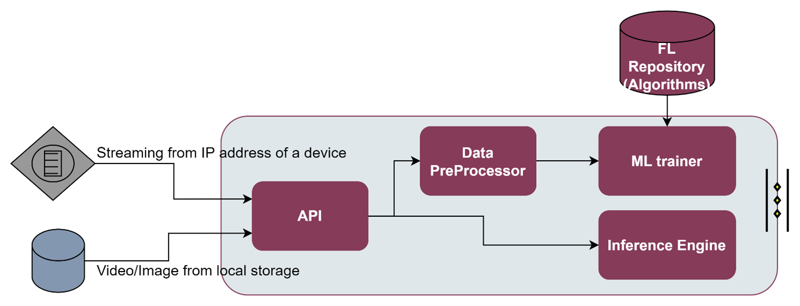
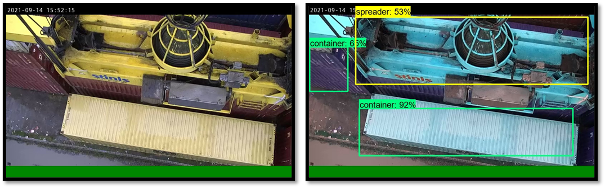

.. _Video augmentation enabler:

############
Video augmentation enabler
############

.. contents::
  :local:
  :depth: 1

***************
Introduction
***************
This enabler receives images or video captured either from ASSIST-IoT Edge nodes, or from ASSIST-IoT databases, and by means of Machine Learning Computer Vision functionalities, it provides object detection/recognition of particular end-user assets (e.g., cargo containers, cars’ damages). 

  **Note:** It should be noticed that to carry out the proper object recognition in operation, an appropriate annotated dataset should be ready and available for training and testing. 

***************
Features
***************
The following figure presents the architectural diagram of video augmentation enabler and inside components:

   
As it can be seen the Video Augmentation enabler is divided in 4 main components:

- **API:** The entrance gate to the video augmentation enabler. It provides a set of restful API endpoints, over which the user can easily interact with the enabler to e.g., run an ML training process, run an ML inference, or get the status of the current training process.
- **Data Pre-processor:** Since the dataset can be collected from various sources such as a Cameras or Databases, but it may not be used directly for performing ML analysis processes (e.g., the dataset contains unorganized or noisy data), a data pre-processing can be done. Data pre-processor provides tools for cleaning the raw data such as taking care of missing values, categorical features, and normalization.
- **ML trainer:** An ML model is a function with learnable parameters that maps an input to a desired output. The optimal parameters are obtained by training the model on data. ML Trainer will carry out the process of feeding the network with millions of training data points so that it systematically adjusts the knobs close to the correct values. Although the video augmentation ML trainer already support some ML models, additional ML models can be retrieved from the FL Repository. Since the training process of images/videos may be computationally intensive, because the data can be passed through Neural Network with several training rounds, it is recommended to have a dedicated GPU installed on the equipment in charge of performing the training.
- **Inference engine:** The Inference engine provides the process of running a trained ML over a specific input through an interpreter. The interpreter, based on TensorFlow, is designed to be lean and fast, and uses a static graph ordering and a custom (less-dynamic) memory allocator to ensure minimal load, initialization, and execution latency

The technologies that have been used for those components are:

- `FastAPI <https://fastapi.tiangolo.com/>`__: A modern, fast (high-performance), web framework for building APIs with Python 3.6+ based on standard Python type hints.

- `Tensorflow <https://github.com/tensorflow/tensorflow>`__: An end-to-end open source platform for machine learning

- `OpenCV <https://github.com/opencv/opencv>`__:  Provides a real-time optimized Computer Vision library, tools, and hardware

*********************
Place in architecture
*********************
Video Augmentation enabler is located in the Application and Service layer of the ASSIST-IoT architecture. As the rest of enablers of this horizontal plane, it is designed for for providing data visualisation and user interaction services, with a particular focus on smart object recognition capabilities.

***************
User guide
***************
The main objective of the Video Augmentation enabler is to on help with object recognition with visual guidelines highlighting the trained objects over which the user wants to detect. The process can be split in four parts.

Data collection
***************
Although there are several pre-trained models available online, the custom scenario of a user will probably differ with respect to these general models. FOr instance, a pre-trained model may be able to detect eggs but it will definitely not differentiate between good and bad eggs because it has never been taught to do so. Therefore, the first part is related with the collection of images/videos from similar scenarios. In the example above, the user needs to get lots of images of good and bad eggs and train a custom detection model.

The data can be collected from different sources:

1. Publicly available open labelled datasets like `ImageNet <https://www.kaggle.com/c/imagenet-object-localization-challenge/overview/description>`__, `COCO <https://cocodataset.org/#home>`__, or `Google Open Images <https://storage.googleapis.com/openimages/web/index.html>`__
2. Scraping the web
3. Taking photographs

Data annotation
***************
The second part is related with the annotation of the collected images. Annotated images are used in several verticals as it helps AI models to facilitate machine recognition through computer vision technology. With the help of computer vision technology, one can easily recognize and detect various objects. 

There are several techniques used for annotating the images (e.g., Semantic Segmentation, Polygon Annotation, Bounding Box, Landmarking, 3D Cuboid, and others). For ASSIST-IoT custom projects, the open-source Linux-based the bounding box software `LabelImg <https://github.com/tzutalin/labelImg>`__ has been used. It is written in Python and uses Qt IDE for its graphical interface. The annotations are saved as XML files in PASCAL VOC format (same format as ImageNet), and is also supported in YOLO and CreateML formats.

Moldel training
***************
The third part uses makes use of both Tensorflow Object Detection 2, and OpenCV frameworks. For the time being, several ML models from the pre-trained `TensorFlow 2 Zoo Detection library <https://github.com/tensorflow/models/blob/master/research/object_detection/g3doc/tf2_detection_zoo.md>`__ have been tested. 

Before training the model it is needed to create tensorflow records from the images and annotations. To do that you should execute the following `Tensorflow scripts <https://tensorflow-object-detection-api-tutorial.readthedocs.io/en/latest/training.html#create-tensorflow-records>`__:

``python generate_tfrecord.py -x /home/tensorflow/workspace/training/images/train -l ``
``/home/tensorflow/workspace/training/annotations/label_map.pbtxt -o ``
``/home/tensorflow/workspace/training/annotations/train.record``

``python generate_tfrecord.py -x /home/tensorflow/workspace/training/images/test -l``
``/home/tensorflow/workspace/training/annotations/label_map.pbtxt -o``
``/home/tensorflow/workspace/training/annotations/test.record``

The best results have been obtained with the ssd_resnet50_v1_fpn_640x640_coco17_tpu-8. Therefore, this is the model used by default, but you can download other models from the `TensorFlow 2 Zoo Detection library <https://github.com/tensorflow/models/blob/master/research/object_detection/g3doc/tf2_detection_zoo.md>`__

``python training/model_main_tf2.py --model_dir=training/models/my_ssd_resnet50_v1_fpn --``
``pipeline_config_path=training/models/my_ssd_resnet50_v1_fpn/pipeline.config``

Model evaluation / Inference
***************
Finally, the new trained model should be evaluated against new inputs. The term inference refers to the process of executing an ML model in order to make predictions based on novel input data. To perform an inference, the user must run it through an interpreter. 

For exporting the previous trained model, the user can run the following command:

``python training/exporter_main_v2.py --input_type image_tensor --pipeline_config_path``
``./training/models/my_ssd_resnet50_v1_fpn/pipeline.config --trained_checkpoint_dir ./training/models/my_ssd_resnet50_v1_fpn/ --output_directory``
``./training/exported-models/my_model``

Two modes are currently supported for the inference engine:

- For detecting objects in images using previous trained model. It is needed to define the IMAGE_PATHS value in the .py file:

``python training/plot_object_detection_saved_model.py``

- For detecting objects in video using previous trained model. It is needed to define the VIDEO_PATH value in the .py file:

``python training/plot_object_detection_saved_model_video.py``

An extract of the dataset used in the custom ASSIST-IoT object recognitio project, as well as the current outputs of the trained model are shown in the next figure.

REST API endpoints
***************
The third, and fourth part of process can be performed by communicating with the supported REST API endpoints listed below:

+---------+-----------------------+--------------------------------------------------------------------------------------------------------------------------+------------------------+------------------+
| Method  | Endpoint              | Description                                                                                                              | Payload (if needed)    | Response format  |
+=========+=======================+==========================================================================================================================+========================+==================+
| POST    | /train                | Executes a training session over the annotated data in the Video Augmentation data folder with the ML model {model_id}.  | {model_id}             |                  |
+---------+-----------------------+--------------------------------------------------------------------------------------------------------------------------+------------------------+------------------+
| GET     | /train_status         | Provides the status of the currently training model                                                                      |                        |                  |
+---------+-----------------------+--------------------------------------------------------------------------------------------------------------------------+------------------------+------------------+
| POST    | /inference_local      | Performs inference or validate process over the stored data (video or image) with the trained model model_id.            | {model_id}             |                  |
+---------+-----------------------+--------------------------------------------------------------------------------------------------------------------------+------------------------+------------------+
| POST    | /inference_streaming  | Performs inference or validate process over the video being streamed at IP_address with the trained model model_id.      | {ip_address,model_id}  |                  |
+---------+-----------------------+--------------------------------------------------------------------------------------------------------------------------+------------------------+------------------+

***************
Prerequisites
***************

The following prerequisites are needed before the installation:

- For building and running docker images it is needed to install `Docker <https://docs.docker.com/get-started/>`__. 

In addition, the following requirements from Tensorflow 2 Object Detection API tutorial should be supported:

- **OS:** Windows, Linux
- **Python:** >= 3.x
- **TensorFlow:** 2.5.0
- **CUDA Toolkit:** 11.2
- **CuDNN:** 8.1.0
- **Anaconda:** Python 3.8 (Optional)

    **Note:** The Video Augmentation enabler is encapsulated in the form of a Docker image. It has not been encapsulated as a Helm chart yet. Hence, it cannot be integrated within a K8s cluster yet. 

***************
Installation
***************

- Download project or clone from git repository
- Locate your images and annotations for training in *workspace/training/images/train*
- Locate your images and annotations for testing/evaluation in *workspace/training/images/test*

- Modify the *workspace/training/annotations/label_map.pbtxt* file to add your labels (if you do not know how to do that, take a look at the `official Tensorflow documentation <https://tensorflow-object-detection-api-tutorial.readthedocs.io/en/latest/training.html#create-label-map>`__. 

- Create image named 'od'
``docker build -t od .``

- Start image ``'od'`` publishing API in port 8000 and creating an interactive bash shell in the new container
``docker run -p 8000:8000 -it od``

This will install all the Python dependencies of FastAPI and Tensorflow, as well as the required libraries of OpenCV

*********************
Configuration options
*********************
Will be determined after the release of the enabler.

***************
Developer guide
***************
Please refer to official `TensorFlow 2 Object Detection API tutorial <https://tensorflow-object-detection-api-tutorial.readthedocs.io/en/latest/index.html>`__ and `OpenCV documentation <https://docs.opencv.org/3.0-last-rst/doc/py_tutorials/py_gui/py_video_display/py_video_display.html>`__  guides to get started.

***************************
Version control and release
***************************
- Version 1.0 notes:

  - All the components are already implemented, except for the API, which is still at a 20% of its development
  - Only some set of pre-trained models are supported. The integration of the Video Augmentation enabler with the FL repository has been postponed for the second term of the project
  - The Video Augmentation enabler is already encapsulated in the form of a Docker, but it is still not able to be deployed over a Kubernetes cluster, and no helm chart has been generated

***************
License
***************
Apache License Version 2.0

********************
Notice(dependencies)
********************
Will be determined after the release of the enabler.
