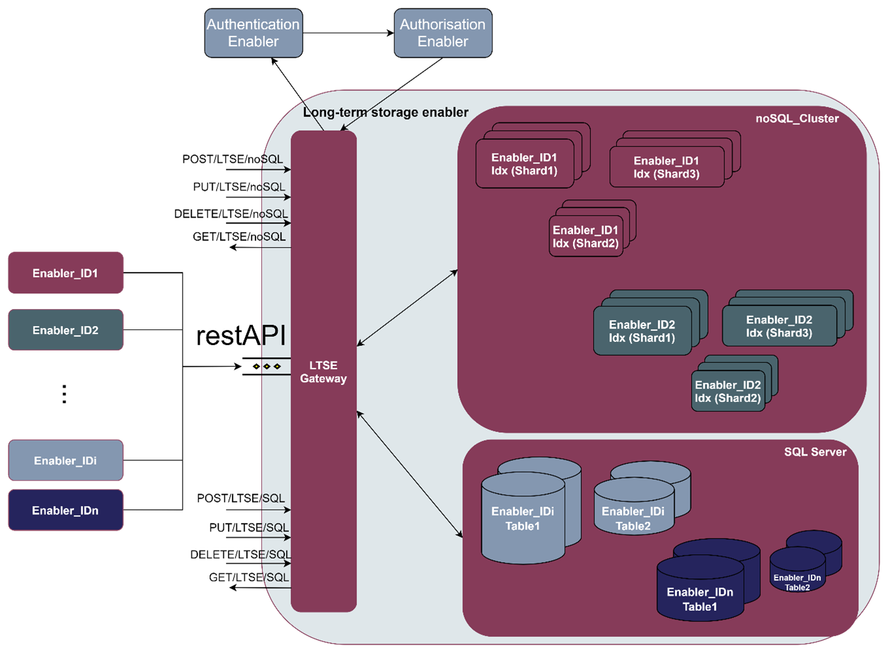
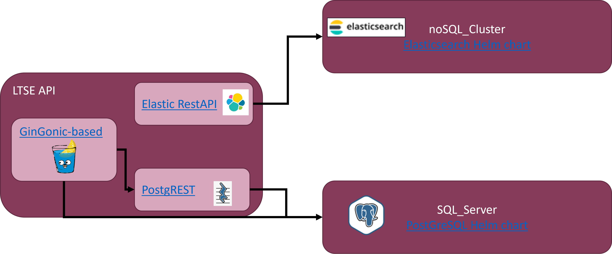

.. _Long term data storage enabler:

##############################
Long term data storage enabler
##############################

.. contents::
  :local:
  :depth: 1

***************
Introduction
***************
The role of the Long-Term Storage Enabler is to serve as a secure and resilient storage, offering different storage sizes and individual storage space for other enablers (which could request back when they are being initialising in Kubernetes pods). Therefore, it is considered as one of the ASSIST-IoT enablers envisioned to be deployed on the cloud rather than the edge. Next figure depicts the high-level overview of the LTSE components.

As it can be seen, it will be mainly formed by three components:

- **LTSE Gateway**: The entrance gate to the LTSE, acting as a proxy from ASSIST-IoT enablers and external services, whose data should be collected either at SQL server databases or noSQL cluster nodes. To do so, the LTSE Gateway is based on restAPI request, with append SQL/noSQL endpoints, respectively. Furthermore, the LTSE gateway also guarantees that the data will be kept safe, in face of various kinds of unauthorised access requests, or hardware failures, by only allowing access to the data once the Identity Manager and the Authorisation enablers have confirmed their access rights.

- **LTSE noSQL cluster**: A group of one or more LTSE NoSQL nodes instances that are connected together, and carries out the distribution of tasks, searching and indexing, across all the noSQL nodes. Every NoSQl node in the NoSQL cluster can handle HTTP and transport traffic by default with the external enablers through the LTSE gateway. The transport layer is used exclusively for communication between nodes; the HTTP layer is used by REST clients. The full hierarchy would be therefore, noSQL_Cluster > noSQL_Node > noSQL_Index > noSQL_document. For High Availability (HA), noSQL_document in LTSE_noSQL_Index may be distributed across multiple shards, which in turn are distributed across multiple nodes, if configured.

- **LTSE SQL server**: It manages the SQL databases, formed by different enablers data tables. It performs, hence, backup database actions on behalf of the enablers. The SQL_Server can handle multiple concurrent connections from external enablers via the LTSE Gateway. In general, the full hierarchy is: SQL_Cluster > SQL_Database > SQL_schema > SQL_table > SQL_row. For High Availability, a master database with one or more standby servers can be setup. 

***************
Features
***************
The LTSE is constructed as a Helm chart, formed by different subcharts. The following image illustrates the different frameworks/charts used for the instantiation of the LTSE components.

As it can be see, the main structure is the following:

- SQL server -->  `PostGreSQL 14.2.0 version <https://artifacthub.io/packages/helm/bitnami/postgresql>`__ 

- NoSQL cluster --> `ElasticSearch 7.16.3 <https://artifacthub.io/packages/helm/elastic/elasticsearch>`__ 

- LTSE gateway --> `Custom HTTP web framework (Gin) written in Go <https://github.com/gin-gonic/gin>`__  

*********************
Place in architecture
*********************
The Long Term data Storage enabler is part of the Data Management Plane of ASSIST-IoT. The Data Management plane encompasses any process, in which data is processed to deliver features concerning data interoperability, annotation, security, acquisition, provenance, aggregation, fusion, etc. This enabler serve as a secure and resilient storage of any ASSIST-IoT deployment.

***************
User guide
***************
The entry point to the LTSE is by the LTSE Gateway. The currently supported REST API endpoints are listed below:

REST API endpoints
*******************
+---------+------------------------------------------------------+------------------------------------------------------------------------------------------------------------------------------------------------------------------------------------+----------------------+------------------+
| Method  | Endpoint                                             | Description                                                                                                                                                                        | Payload (if needed)  | Response format  |
+=========+======================================================+====================================================================================================================================================================================+======================+==================+
| POST    | /sql/databases                                       | Creates a databasename in the ltse sql cluster                                                                                                                                     | databasename         |                  |
+---------+------------------------------------------------------+------------------------------------------------------------------------------------------------------------------------------------------------------------------------------------+----------------------+------------------+
| POST    | /sql/databases/:databasename/tables/                 | Creates a tablename in the databasename of ltse sql server                                                                                                                         | tablename            |                  |
+---------+------------------------------------------------------+------------------------------------------------------------------------------------------------------------------------------------------------------------------------------------+----------------------+------------------+
| POST    | /sql/databases/:databasename/tables/:tablename/data  | Inserts data into the tablename on the databasename of ltse sql server                                                                                                             | data                 |                  |
+---------+------------------------------------------------------+------------------------------------------------------------------------------------------------------------------------------------------------------------------------------------+----------------------+------------------+
| GET     | /sql/databases/:databasename/tables/                 | Obtains all the data contained within the tablename of the databasename of ltse sql server                                                                                         | tablename            |                  |
+---------+------------------------------------------------------+------------------------------------------------------------------------------------------------------------------------------------------------------------------------------------+----------------------+------------------+
| PUT     | /nosql/index/                                        | Creates a new index indexname in the ltse nosql cluster. when creating an index, you can specify the settings for the index, mappings for fields in the index, and index aliases   | indexname            |                  |
+---------+------------------------------------------------------+------------------------------------------------------------------------------------------------------------------------------------------------------------------------------------+----------------------+------------------+
| GET     | /nosql/index/                                        | Returns information about indexname index from the ltse nosql cluster                                                                                                              | indexname            |                  |
+---------+------------------------------------------------------+------------------------------------------------------------------------------------------------------------------------------------------------------------------------------------+----------------------+------------------+
| PUT     | /nosql/index/<indexname>/document/                   | Adds a json document to the specified <indexname > index of the ltse nosql cluster and makes it searchable with an <_id>                                                           | _id                  |                  |
+---------+------------------------------------------------------+------------------------------------------------------------------------------------------------------------------------------------------------------------------------------------+----------------------+------------------+
| GET     | /nosql/index/<indexname>/_doc/                       | Retrieves the specified json document <_id> from the indexname of the ltse nosql cluster.                                                                                          | _id                  |                  |
+---------+------------------------------------------------------+------------------------------------------------------------------------------------------------------------------------------------------------------------------------------------+----------------------+------------------+

***************
Prerequisites
***************
- Kubernetes 1.19+
- Helm 3.2.0+
- PV provisioner support in the underlying infrastructure
- Minimum cluster requirements include the following to run this chart with default settings. All of these settings are configurable:

  - Three Kubernetes nodes to respect the default "hard" affinity settings
  - 1GB of RAM for the JVM heap

***************
Installation
***************

Installing the chart
*******************
The enabler is provided as a Helm chart. To install the chart with the release name ``my-ltse``:

``helm install my-ltse ltse``

The command deploys PostgreSQL on the Kubernetes cluster in the default configuration. The Parameters section lists the parameters that can be configured during installation.

Alternatively, a YAML file that specifies the values for the parameters can be provided while installing the chart. For example,

``helm install my-ltse -f values.yaml ltse``

    **Tip**: List all releases using ``helm list``

Verification / Visualization
*******************
In order to properly understand the LTSE deployment, you can install two separte IDE clients for each of the storage services of the LTSE, as well as an API client. The following applicaitons are proposed:

- **Kibana**: It provides visualization capabilities on top of the content indexed on an Elasticsearch cluster (i.e., LTSE noSQL cluster).  `Kibana Helm Chart <https://github.com/elastic/helm-charts/tree/main/kibana>`__  
- **pgAdmin**: The most popular and feature rich Open Source administration and development platform for PostgreSQL (i.e., LTSE SQL server).  `Helm Chart for pgAdmin <https://github.com/cetic/helm-pgadmin>`__  
- **Postman**: an API platform for testing APIs (i.e., LTSE gateway). `Postman API client <https://learning.postman.com/docs/getting-started/installation-and-updates/>`__  

Uninstalling the Chart
*******************
To uninstall/delete the ``my-ltse`` deployment:

``helm delete my-ltse``

The command removes all the Kubernetes components but PVC's associated with the chart and deletes the release.

To delete the PVC's associated with ``my-ltse``:

``kubectl delete pvc -l release=my-ltse``

    **Note**: Deleting the PVC's will delete postgresql data as well. Please be cautious before doing it.

*********************
Configuration options
*********************
- The chart deploys a StatefulSet and by default will do an automated rolling update of your cluster. It does this by waiting for the cluster health to become green after each instance is updated. 
- It is important to verify that the JVM heap size in ``esJavaOpts`` and to set the CPU/Memory ``resources`` to something suitable for your cluster.

***************
Developer guide
***************
The following options are supported for each subchart. See values.yaml for more detailed documentation and examples:

noSQL cluster (Elasticsearch helm chart configuration)
*******************

SQL server (PostgreSQL helm chart configuration)
*******************

Global parameters
##############

+-------------------------------------------------+--------------------------------------------------------------------------------------------+---------+
| Name                                            | Description                                                                                | Value   |
+=================================================+============================================================================================+=========+
| ``global.imageRegistry``                        | Global Docker image registry                                                               | ""      |
+-------------------------------------------------+--------------------------------------------------------------------------------------------+---------+
| ``global.imagePullSecrets``                     | Global Docker registry secret names as an array                                            | []      |
+-------------------------------------------------+--------------------------------------------------------------------------------------------+---------+
| ``global.storageClass``                         | Global StorageClass for Persistent Volume(s)                                               | ""      |
+-------------------------------------------------+--------------------------------------------------------------------------------------------+---------+
| ``global.postgresql.auth.postgresPassword``     | Password for the "postgres" admin user (overrides auth.postgresPassword)                   | ""      |
+-------------------------------------------------+--------------------------------------------------------------------------------------------+---------+
| ``global.postgresql.auth.username``             | Name for a custom user to create (overrides auth.username)                                 | ""      |
+-------------------------------------------------+--------------------------------------------------------------------------------------------+---------+
| ``global.postgresql.auth.password``             | Password for the custom user to create (overrides auth.password)                           | ""      |
+-------------------------------------------------+--------------------------------------------------------------------------------------------+---------+
| ``global.postgresql.auth.database``             | Name for a custom database to create (overrides auth.database)                             | ""      |
+-------------------------------------------------+--------------------------------------------------------------------------------------------+---------+
| ``global.postgresql.auth.existingSecret``       | Name of existing secret to use for PostgreSQL credentials (overrides auth.existingSecret)  | ""      |
+-------------------------------------------------+--------------------------------------------------------------------------------------------+---------+
| ``global.postgresql.service.ports.postgresql``  | PostgreSQL service port (overrides service.ports.postgresql)                               | ""      |
+-------------------------------------------------+--------------------------------------------------------------------------------------------+---------+

Common parameters
##############

+-----------------------------+-----------------------------------------------------------------------------------------------+-----------------+
| Name                        | Description                                                                                   | Value           |
+=============================+===============================================================================================+=================+
| ``kubeVersion``             | Override Kubernetes version                                                                   | ""              |
+-----------------------------+-----------------------------------------------------------------------------------------------+-----------------+
| ``nameOverride``            | String to partially override common.names.fullname template (will maintain the release name)  | ""              |
+-----------------------------+-----------------------------------------------------------------------------------------------+-----------------+
| ``fullnameOverride``        | String to fully override common.names.fullname template                                       | ""              |
+-----------------------------+-----------------------------------------------------------------------------------------------+-----------------+
| ``clusterDomain``           | Kubernetes Cluster Domain                                                                     | cluster.local   |
+-----------------------------+-----------------------------------------------------------------------------------------------+-----------------+
| ``extraDeploy``             | Array of extra objects to deploy with the release (evaluated as a template)                   | []              |
+-----------------------------+-----------------------------------------------------------------------------------------------+-----------------+
| ``commonLabels``            | Add labels to all the deployed resources                                                      | {}              |
+-----------------------------+-----------------------------------------------------------------------------------------------+-----------------+
| ``commonAnnotations``       | Add annotations to all the deployed resources                                                 | {}              |
+-----------------------------+-----------------------------------------------------------------------------------------------+-----------------+
| ``diagnosticMode.enabled``  | Enable diagnostic mode (all probes will be disabled and the command will be overridden)       | false           |
+-----------------------------+-----------------------------------------------------------------------------------------------+-----------------+
| ``diagnosticMode.command``  | Command to override all containers in the statefulset                                         | ["sleep"]       |
+-----------------------------+-----------------------------------------------------------------------------------------------+-----------------+
| ``diagnosticMode.args``     | Args to override all containers in the statefulset                                            | ["infinity"]    |
+-----------------------------+-----------------------------------------------------------------------------------------------+-----------------+

SQL API (PostgREST helm chart configuration) 
*******************

+---------------------------------+-------------------------------------------------------------+-----------------------+
| Parameter                       | Description                                                 | Default               |
+=================================+=============================================================+=======================+
| ``replicaCount``                | Number of replicas                                          | 1                     |
+---------------------------------+-------------------------------------------------------------+-----------------------+
| ``image.repository``            | The image to run                                            | postgrest/postgrest   |
+---------------------------------+-------------------------------------------------------------+-----------------------+
| ``image.tag``                   | The image tag to pull                                       | v5.2.0                |
+---------------------------------+-------------------------------------------------------------+-----------------------+
| ``image.pullPolicy``            |                                                             | IfNotPresent          |
+---------------------------------+-------------------------------------------------------------+-----------------------+
| ``nameOverride``                |                                                             | n/a                   |
+---------------------------------+-------------------------------------------------------------+-----------------------+
| ``fullnameOverride``            |                                                             | n/a                   |
+---------------------------------+-------------------------------------------------------------+-----------------------+
| ``service.type``                | Type of Service                                             | ClusterIP             |
+---------------------------------+-------------------------------------------------------------+-----------------------+
| ``service.port``                | Port for kubernetes service                                 | 80                    |
+---------------------------------+-------------------------------------------------------------+-----------------------+
| ``service.annotations``         | Annotations to add to the service                           | {}                    |
+---------------------------------+-------------------------------------------------------------+-----------------------+
| ``ingress.hosts``               | PostGREST Ingress host names                                | []                    |
+---------------------------------+-------------------------------------------------------------+-----------------------+
| ``ingress.tls``                 | PostGREST Ingress TLS configuration (YAML)                  | []                    |
+---------------------------------+-------------------------------------------------------------+-----------------------+
| ``resources``                   | CPU/Memory resource requests/limits                         | {}                    |
+---------------------------------+-------------------------------------------------------------+-----------------------+
| ``nodeSelector``                | Settings for nodeselector                                   | {}                    |
+---------------------------------+-------------------------------------------------------------+-----------------------+
| ``tolerations``                 | Settings for toleration                                     | []                    |
+---------------------------------+-------------------------------------------------------------+-----------------------+
| ``affinity``                    | Settings for affinity                                       | {}                    |
+---------------------------------+-------------------------------------------------------------+-----------------------+
| ``postgrest.db_uri``            | PostgreSQL connection                                       | n/a                   |
+---------------------------------+-------------------------------------------------------------+-----------------------+
| ``postgrest.db_schema``         | Database schema to expose                                   | public                |
+---------------------------------+-------------------------------------------------------------+-----------------------+
| ``postgrest.db_pool``           | Number of connections to keep open                          | 100                   |
+---------------------------------+-------------------------------------------------------------+-----------------------+
| ``postgrest.server_host``       | Where to bind the PostgREST web server                      | *4                    |
+---------------------------------+-------------------------------------------------------------+-----------------------+
| ``postgrest.server_port``       | The port to bind the web server                             | 3000                  |
+---------------------------------+-------------------------------------------------------------+-----------------------+
| ``postgrest.server_proxy_uri``  | Overrides the base URL                                      | n/a`                  |
+---------------------------------+-------------------------------------------------------------+-----------------------+
| ``postgrest.jwt_secret``        | The secret or JSON Web Key (JWK) used to decode JWT tokens  | n/a                   |
+---------------------------------+-------------------------------------------------------------+-----------------------+
| ``postgrest.secret_is_base64``  |                                                             | false                 |
+---------------------------------+-------------------------------------------------------------+-----------------------+
| ``postgrest.jwt_aud``           |                                                             | n/a                   |
+---------------------------------+-------------------------------------------------------------+-----------------------+
| ``postgrest.max_rows``          | A hard limit to the number of rows PostgREST will fetch     | n/a                   |
+---------------------------------+-------------------------------------------------------------+-----------------------+
| ``postgrest.pre_request``       | A schema-qualified stored procedure                         | n/a                   |
+---------------------------------+-------------------------------------------------------------+-----------------------+
| ``postgrest.role_claim_key``    |                                                             | .role                 |
+---------------------------------+-------------------------------------------------------------+-----------------------+

***************************
Version control and release
***************************
- Version 1.0. - Currently LTSE does not communicate with Cybersecurity enablers. In addition, API is only able to create DBs and tables, but the rest of API functionalities are still not supported

- Improvements and new functionalities will be added in future versions.

***************
License
***************
TBD

********************
Notice(dependencies)
********************
TBD
