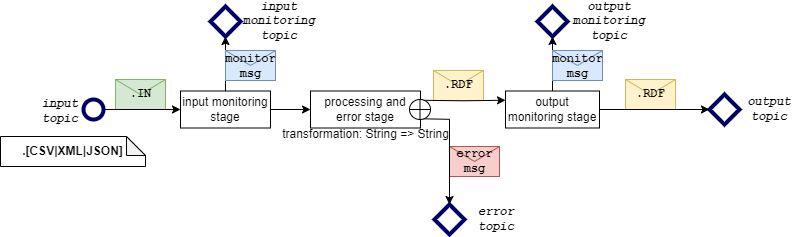

.. _Semantic Annotation Enabler:

###########################
Semantic Annotation Enabler
###########################

.. contents::
  :local:
  :depth: 1

Introduction
============

This enabler offers a service of syntactic transformation of JSON, CSV
and XML data formats into RML, also known as semantic lifting, or
semantic annotation.

It is primarily focused on streaming annotation through persistent
annotation channels on MQTT or Kafka brokers.

Annotations are defined using the
`CARML <https://github.com/carml/carml>`__ dialect of
`RML <https://rml.io/specs/rml/>`__ language.

The annotator is controlled via a REST API with Swagger documentation
(http://localhost:8080/swagger/#/ by default).

Features
========

Streaming Annotation Enabler has the following feaures:

-  Configurable annotation from JSON, XML and CSV into RDF using
   `CARML <https://github.com/carml/carml>`__
-  Streaming annotation through persistent, configurable annotation
   channels
-  Support for MQTT and/or Kafka brokers
-  Standalone mode (without persistence) for lighter storage and memory
   footprint.

Place in architecture
=====================

The Semantic Annotation Enabler is part of the Data Management Plane of
ASSIST-IoT.

The enabler requires at least one broker (Kafka or MQTT) to be present
in the system. Although the Docker compose file can be used to quickly
set everything up, the Semantic Annotator can connect to any broker and
does not require a separate instance just for itself. To run in the
persistent mode, and instance of MongoDB is also required. Setup details
are described further on in this documentation.

The core functionality is designed to be used either independently, or
integrated into a semantic pipeline before the Semantic Translation
enabler. In the latter case the RDF produced by Semantic Annotator is
consumed by Semantic Translator, so that the messages can then be
translated into different ontologies.

`CARML <https://github.com/carml/carml>`__ annotation configuration
files can optionally be shared in the Semantic Repository, provided,
that they do not contain any sensitive or confidential information about
used data models and formats.

Quick start
===========

Docker image
------------

This step requires `docker <https://www.docker.com/>`__ and
`docker-compose <https://docs.docker.com/compose/>`__.

The quickest way to set everything up is to build an image using the
provided Dockerfile and run it with the Docker compose file. Note that
this is a quick local setup. To run the enabler in an ASSIST-IoT system,
it is recommended to use the Helm chart and deploy it following the
general ASSIST-IoT Enabler deployment instructions, with the help of
ASSIST-IoT Manageability Enablers (e.g. the Smart Orchestrator).

To build the image:

::

   docker build -t seaman_core .

Docker compose
~~~~~~~~~~~~~~

Use the provided docker-compose.yml file to build and run the container
with all other components.

::

   docker-compose build
   docker-compose up

Environment variables can be set in the docker-compose.yml file. Shared
environment variables are additionally set in the .env file.
Docker-compose file also sets up a container for a persistent database.
If only the standalone mode is required, the database container does not
need to be run - it can be turned off, or removed from the
docker-compose.yml file altogether.

Unless configured otherwise, the REST API is available on port 8080 and
database GUI on port 8081. Access credentials for the database GUI are
set in the .env file. By default, the database port itself is not
exposed.

Quick start - Usage
-------------------

-  Run the Streamer via Docker compose and open
   `swagger <http://localhost:8080/swagger/>`__. Use examples from this
   documentation, or from the ``/src/test/resources`` directory in the
   source code to configure an annotation channel.
-  Use a GUI, such as `MQTT Explorer <https://mqtt-explorer.com/>`__ to
   send and receive the messages. Use example messages from this
   documentation, or from the ``/src/test/resources`` directory and send
   them to topics specified in the annotation channel configuration that
   you used.

Run only the core
~~~~~~~~~~~~~~~~~

Note, that this will start only the core, without all necessary
components. Do it if you want to prepare your own setup e.g. for
debugging or hacking the code. To tun it and bind ports:

::

   docker run -p [x]:[y] seaman_core

Ports are set in the src/main/resources/application.conf file, or via
environment variables passed to docker (their names are also in
application.conf). In general, only the REST port needs to be exposed
for incoming connections.

Prerequisites
=============

The persistent mode of the Annotator, that allows it to store annotation
channel configuration between restarts requires an instance of MongoDB
to be started and configured before running the enabler. Standalone mode
does not require a MongoDB instance (see configuration options for
details).

To send and receive messages at least one instance of a Kafka and/or
MQTT broker must be present. It does not need to be started before the
Annotator, and can be run afterwards. Each annotation channel is
configured independently and can use separate brokers, if need be. A
broker should be running before an annotation channel that uses it is
started. Otherwise the channel will fail to start and remain stopped.

The Semantic Annotator Enabler core itself has no particular
requirements to run, but practical usage requires familiarity with the
`CARML <https://github.com/carml/carml>`__ language.

Installation
============

The enabler is designed to be run from a Docker image. The recommended
way of running it in an ASSIST-IoT system, is to use the Helm chart
provided in the ASSIST-IoT Helm Chart repository and deploy it with the
help of ASSIST-IoT Manageability Enablers (e.g. the Smart Orchestrator),
following the general ASSIST-IoT Enabler deployment instructions.

Alternatively, the enabler can be run from the Docker compose file.

Finally, the code can be compiled and run locally.

Docker image
------------

For instructions about using the Docker image, see `Quick
start <quick-start>`__.

Manual compilation
------------------

Note that running the enabler code does not include and instance of a
MongoDB database, nor a streaming broker. Those need to be set up and
configured separately (see configuration options for details).

Universal package
~~~~~~~~~~~~~~~~~

Thanks to the `sbt-native-packager
plugin <https://www.scala-sbt.org/sbt-native-packager/index.html>`__,
the code can be packaged into a native executable.

For default settings, run ``$ sbt stage``. The application can be run
from target/universal/scripts/bin/[executable name]

For more packaging options, see `native packager project
archetypes <https://www.scala-sbt.org/sbt-native-packager/archetypes/index.html#archetypes>`__

JAR
~~~

To package the code into a .jar file, use sbt commands.

::

   sbt update
   sbt compile
   sbt package

The output .jar file can be found in target/scala-[version] directory
and can be run with the ``$ java -jar [.jar filename]`` command.`.

Alternatively you can *try* to build a far JAR using the sbt-assembly
plugin, but you’ll have to set and test a `merge
strategy <https://github.com/sbt/sbt-assembly#merge-strategy>`__.

::

   sbt assembly

User guide
==========

The Semantic Annotator turns JSON, XML or CSV files into RDF in a
streaming fashion. General usage requires preparation of
`CARML <https://github.com/carml/carml>`__ annotation files, setting up
an annotation channel through the REST API, and finally sending and
receiving messages from appropriate topics on the streaming broker.

Annotation files
----------------

Annotation files are written in
`CARML <https://github.com/carml/carml>`__ language, which is a dialect
of `RML <https://rml.io/specs/rml/>`__. Both are serialized in RDF
Turtle format. Any annotation file must contain a single “source” that
is a “CARML stream”, like in the following snippet:

.. code:: ttl

   @prefix rr: <http://www.w3.org/ns/r2rml#> .
   @prefix rml: <http://semweb.mmlab.be/ns/rml#> .
   @prefix map: <http://mapping.example.com/> .
   @prefix carml: <http://carml.taxonic.com/carml/> .

   map:example_map a rr:TriplesMap ;
       rml:logicalSource[
           a rml:LogicalSource  ;
           rml:source [
               a carml:Stream
               ];

           rml:referenceFormulation ql:JSONPath ;
           rml:iterator "$" ;
           ] 

       rr:predicateObjectMap map:example_000 ;
       rr:subjectMap [
           a rr:SubjectMap ;
           rr:template "example template"
           ] .

The meaning individual parts of the snippet is as follows:

-  A list of prefixes is required for technical correctness of the
   Turtle format. The prefixes listed here are used in every annotation
   file.

.. code:: ttl

   @prefix rr: <http://www.w3.org/ns/r2rml#> .
   @prefix rml: <http://semweb.mmlab.be/ns/rml#> .
   @prefix map: <http://mapping.example.com/> .
   @prefix carml: <http://carml.taxonic.com/carml/> .

-  A source of data must be defined - the annotator supports only CARML
   streaming sources. This part is also included in every annotation
   file.

.. code:: ttl

   map:example_map a rr:TriplesMap ;
       rml:logicalSource[
           a rml:LogicalSource  ;
           rml:source [
               a carml:Stream
               ];

-  The source must include a declaration of the input data format - in
   the example below JSON is declared, with the base selector “$” (see
   `here <https://support.smartbear.com/alertsite/docs/monitors/api/endpoint/jsonpath.html>`__
   for more details about JSON Path selectors).

.. code:: ttl

           rml:referenceFormulation ql:JSONPath ;
           rml:iterator "$" ;

-  Formally, an annotation file must contain a mapping, that connects
   the CARML source to the actual definition of the mapping
   (``example_000`` below). In actual annotation files, this part would
   be followed by the part of the file, that defines how the input is
   transformed into the output.

.. code:: ttl

       rr:predicateObjectMap map:example_000 ;
       rr:subjectMap [
           a rr:SubjectMap ;
           rr:template "example template"
           ] .

More details about how to write CARML files, as well as helpful tools
and examples can be found on the
`CARML <https://github.com/carml/carml>`__ and
`RML <https://rml.io/specs/rml/>`__ websites. To write your first
annotation file, it is recommended to start from an example provided in
the ``/src/test/resources`` directory in the source code and modify it.

Annotation channels
-------------------

This enabler uses a streaming channel architecture that annotates the
messages between a series of topics exposed by a streaming broker (see
figure below). Messages sent to the input topic are pushed through the
channel, processed at different stages, and finally the result is
written to the output topic. The input and output topics are always
used, whereas the rest is optional.

-  The first optional “input monitoring” stage outputs a simple message
   for any message that passes through in order to confirm that a
   message was received.

-  The processing and error stage attempts to transform the message
   using an annotation configuration file (CARML). If unsuccessful,
   errors are output on the error topic. Otherwise the annotated message
   passes through.
-  The “output monitoring” stage is equivalent to the “input monitoring”
   stage in its functionality
-  Finally, the annotated message is written to the output topic

Input and output topics are always active, provided that the channel is
not stopped. Monitoring and error topics can be optionally enabled or
disabled at runtime.

   SemAnnTopics

Setting up a channel
~~~~~~~~~~~~~~~~~~~~

To set up a channel one must prepare a channel configuration in JSON.
The configuration defines some metadata, annotation configuration
(CARML) and settings to connect to a broker, like in the snipped below:

.. code:: json

   {
     "metadata": {
       "name": "Demo channel",
       "description": "Demonstrative channel with example mapping.",
       "tags": ["example tag"],
       "mapping": {
         "name": "Demo CARML",
         "description": "Demonstrative CARML mapping",
         "tags": ["example tag"],
         "inputFormat": "JSON",
         "outputFormat": "TTL",
         "rml": "..."
       }
     },
     "settings": {
       "inputTopicSettings": {
         "topic": "test/demo/input",
         "brokerType": "MQTT",
         "mqttSettings": {
           "host": "127.0.0.1",
           "port": 1883,
           "protocol": "tcp",
           "user": "username",
           "password": "password"
         },
       },
       "outputTopicSettings": {
         "brokerType": "MQTT",
         "topic": "test/demo/output"
       },
       "errorTopicSettings": {
         "brokerType": "MQTT",
         "topic": "test/demo/error",
       },
     },
     "status": {
       "errorTopicEnabled": true,
       "isStopped": false
     }
   }

Here is a short explanation of the part of the snippet:

-  A channel has some metadata attached to it

.. code:: json

   "metadata": {
       "name": "Demo channel",
       "description": "Demonstrative channel with example mapping.",
       "tags": ["example tag"],
       "mapping": {
         "name": "Demo CARML",
         "description": "Demonstrative CARML mapping",
         "tags": ["example tag"],
         "inputFormat": "JSON",
         "outputFormat": "TTL",
         "rml": "..."
       }

-  Arguably the most important part is the definition of a CARML
   mapping. It declares the input (JSON, XML or CSV) and output (a
   serialization of RML, Turtle is recommended for readability and
   compactness) formats, and the CARML mapping itself. Note, that in the
   example below the actual CARML code is omitted. The actual ``"rml"``
   field should contain CARML code with JSON escaping, so that it can be
   put in a JSON string.

.. code:: json

       "mapping": {
         "name": "Demo CARML",
         "description": "Demonstrative CARML mapping",
         "tags": ["example tag"],
         "inputFormat": "JSON",
         "outputFormat": "TTL",
         "rml": "..."
       }

-  Broker settings are defined per topic. The only mandatory settings
   are the ones for input and output topics. A broker type (MQTT or
   Kafka) and a topic name must be defined. The values can be different
   for each topic, and a single channel may use some topics from a Kafka
   broker, and others from MQTT. The topics are entirely independent.
   Broker connection data (IP, port, authentication settings etc) can be
   specified per topic. If this data is missing, it will be filled in
   with default values (see `Configuration <configuration>`__).

.. code:: json

   "settings": {
       "inputTopicSettings": {
         "topic": "test/demo/input",
         "brokerType": "MQTT",
         "mqttSettings": {
           "host": "127.0.0.1",
           "port": 1883,
           "protocol": "tcp",
           "user": "username",
           "password": "password"
         },
       },
       "outputTopicSettings": {
         "brokerType": "MQTT",
         "topic": "test/demo/output"
       },

-  Additional settings for the optional topics follow the same rules, as
   for the input and output topics.

.. code:: json

       "errorTopicSettings": {
         "brokerType": "MQTT",
         "topic": "test/demo/error",
       },
     },

-  Finally, initial channel status can be set, so that channels can be
   defined, but not started. The same is true for the optional topics.

.. code:: json

     "status": {
       "errorTopicEnabled": true,
       "isStopped": false
     }

After loading the configuration in (see `REST API <rest-api>`__) you may
notice, that the file is larger than originally. This is because any
optional values are filled in with defaults after the file is loaded
(see `Configuration <configuration>`__).

For more information about JSON formats for channel configuration, see
`REST API <rest-api>`__.

Using a channel
---------------

Once a channel is defined and started (i.e. the ``isStopped`` flag is
not set to ``true``), you may write to the input topic on the configured
broker, and receive annotated messages on the output topic. Keep an eye
on the log file (or stdout of the running container), or the error topic
(if configured) in case of any problems.

Rest api
========

The annotator is controlled via a REST API. Full up-to-date
documentation with detailed explanation of all endpoints and data
formats can be found in the Swagger GUI available at ``/swagger/``
(e.g. http://localhost:8080/swagger/#/, if the enabler is running on
localhost with the default port number).

====== ========= ======================================================
Method Endpoint  Description
====== ========= ======================================================
GET    /swagger/ View the REST API documentation and Swagger interface.
====== ========= ======================================================

In summary, the API is divided into three endpoint groups:

Information
~~~~~~~~~~~

``/version``, ``/status``, ``/settings`` - These endpoints return
information about the running enabler. Note that global settings cannot
be modified at runtime (see `Configuration <configuration>`__), and can
only be read from these endpoints.

====== ========= ==========================================================
Method Endpoint  Description
====== ========= ==========================================================
GET    /version  Returns software version information.
GET    /status   Returns global status, including errors, if there are any.
GET    /settings Returns current global settings.
====== ========= ==========================================================

Annotations
~~~~~~~~~~~

``/annotations/*`` - These endpoints are used to access the annotation
storage. If the enabler is run in standalone mode (without persistence),
the endpoints are not available. The annotations storage is an
independent component that is meant to provide a dedicated space to
store annotations. The internal annotation IDs that are used to retrieve
annotations are not used outside of this component. Note, that the
channel configuration JSON does not refer to any annotation IDs and
instead contains full CARML definition.

+---+--------+----------------------------------------------------------+
| M | Endpoi | Description                                              |
| e | nt     |                                                          |
| t |        |                                                          |
| h |        |                                                          |
| o |        |                                                          |
| d |        |                                                          |
+===+========+==========================================================+
| G | /annot | Retrieve information about all annotations, or a single  |
| E | ations | annotation (if the optional annotationId is provided).   |
| T | /({ann | Additional parameters are supported, similar to the GET  |
|   | otatio | /channels endpoint.                                      |
|   | nId})  |                                                          |
+---+--------+----------------------------------------------------------+
| P | /annot | Add a new annotation to storage.                         |
| O | ations |                                                          |
| S |        |                                                          |
| T |        |                                                          |
+---+--------+----------------------------------------------------------+
| D | /annot | Remove an annotation from storage.                       |
| E | ations |                                                          |
| L | /{anno |                                                          |
| E | tation |                                                          |
| T | Id}    |                                                          |
| E |        |                                                          |
+---+--------+----------------------------------------------------------+

Channels
~~~~~~~~

``/channels/*`` - Group of endpoints to control channel creation,
removal, and status.

+---+-----+--------------------------------------------------------------+
| M | End | Description                                                  |
| e | poi |                                                              |
| t | nt  |                                                              |
| h |     |                                                              |
| o |     |                                                              |
| d |     |                                                              |
+===+=====+==============================================================+
| G | /ch | Retrieve information about all channels, or a single channel |
| E | ann | (if the optional channelId is provided). Additional          |
| T | els | parameters can be used to retrieve information selectively,  |
|   | /({ | e.g. ?settings=true returns settings information,            |
|   | cha | ?status=true returns status. Parameters may be used          |
|   | nne | together.                                                    |
|   | lId |                                                              |
|   | })  |                                                              |
+---+-----+--------------------------------------------------------------+
| P | /ch | Add a new channel definition, and optionally materialize and |
| O | ann | start the channel. This endpoint accepts channel             |
| S | els | configuration in JSON. Depending on initial status (written  |
| T |     | in the configuration file), the channel may be added, but    |
|   |     | not started.                                                 |
+---+-----+--------------------------------------------------------------+
| P | /ch | Updates the channel status with values provided in the       |
| A | ann | channel status object provided in the request body. With the |
| T | els | the channel status object, the channel can be started or     |
| C | /{c | stopped, or error/monitoring topic settings updated (see     |
| H | han | channel architecture below).                                 |
|   | nel |                                                              |
|   | Id} |                                                              |
+---+-----+--------------------------------------------------------------+
| P | /ch | Stop and then start a channel.                               |
| A | ann |                                                              |
| T | els |                                                              |
| C | /{c |                                                              |
| H | han |                                                              |
|   | nel |                                                              |
|   | Id} |                                                              |
|   | /re |                                                              |
|   | sta |                                                              |
|   | rt  |                                                              |
+---+-----+--------------------------------------------------------------+
| D | /ch | Stop and remove a channel.                                   |
| E | ann |                                                              |
| L | els |                                                              |
| E | /{c |                                                              |
| T | han |                                                              |
| E | nel |                                                              |
|   | Id} |                                                              |
+---+-----+--------------------------------------------------------------+

Annotations
===========

The Semantic Annotator uses `CARML <https://github.com/carml/carml>`__
language, which is a dialect of `RML <https://rml.io/specs/rml/>`__ to
define the annotations. CARML files are serialized in RDF. Large CARML
files, even if serialized to Turtle (a relatively compact RDF
serialization) can be very difficult to read and/or write. When writing
your own annotations we recommend starting from examples provided in the
``/src/test/resources`` directory in the source code of the enabler, and
modifying them step by step.

An alternative process is to author `RML <https://rml.io/specs/rml/>`__
files first, and then transform them to CARML. Because CARML and RML are
meant to be compatible, it mostly requires modifying only the “RML
source” part of the file to fit the “CARML stream” format (see `User
Guide <user-guide>`__ for details on how it looks like).

The easiest way to author RML files is to use an intermediary format
called `YARRML <https://rml.io/yarrrml/spec/>`__. It is a more
human-readable format, that compiles to RML. An online editor
`Matey <https://rml.io/yarrrml/matey/>`__ is available to quickly
prototype mappings.

Configuration
=============

Before running, configuration options for the enabler may be specified
in the application.conf file. This file is the final point where
configuration is stored. Other options of configuration, such as
environment variables values, all eventually end up in this file. With
this in mind, the enabler can be configured in the following ways:

-  If running from a Helm chart, in the values file
   (``/helm-chart/values.yaml``). More information about Helm values can
   be found
   `here <https://helm.sh/docs/chart_template_guide/values_files/>`__.
   Note, that the values can be overriden when deploying the chart in
   Kubernetes. The override can be done whether deploying from command
   line, or from ASSIST-IoT Smart Orchestrator. See the Smart
   Orchestrator documentation for details.
-  If running from Docker Compose, in the docker compose file
   (``/docker-compose.yml``) and in the environment variables file
   (``/.env``). Note, that the environment variables values can be
   overridden when running the docker compose command. See docker
   compose
   `documentation <https://docs.docker.com/compose/environment-variables/set-environment-variables/>`__
   for details.
-  If running from Docker, or directly from code, in the
   application.conf file (``/src/main/resources/application.conf``).
   Environment variables may be passed when running the docker, or jar
   commands.

Configuration options
---------------------

The configuration options are described as they appear in the
application.conf file. The names of the corresponding environment
variables (if available) are also given.

General settings
~~~~~~~~~~~~~~~~

::

   seaman {
       http {
         port = 8080
         host = "0.0.0.0"
       }
   }

Hostname and port on which the REST API will be available.

Environment variables: ``SEAMAN_REST_HOST`` and ``SEAMAN_REST_PORT``.

::

   seaman {
       max-shutdown-duration = "20 seconds"
       parallelism = 2
       buffer-size = 10
   }

-  Maximum time to wait for all channels to gracefully stop, after
   receiving the shutdown signal.
-  Default number of parallel threads per channel. Set this option to 1
   on less powerful systems with limited threading.
-  Default size of the message buffer on each stage of a channel.

These options do not have environment variables.

::

   seaman {   
       standalone-mode = false
       restore-channels-stopped = false
   }

-  Standalone mode means, that the MongoDB database is not used, and the
   streamer will not attempt to connect to it. This also means, that no
   channel configuration, or annotations are persisted between restarts.
   Use this option to reduce resource usage, but remember, that you will
   have to recreate all channels manually after restart. If set to
   ``true`` in the Helm chart, the MongoDB container will not be
   deployed. Environment variable: ``SEAMAN_STANDALONE_MODE``

-  If set to ``true``, all channels will be initially stopped after the
   streamer is started. Otherwise, the streamer will attempt to restore
   the status of the channels before shutdown. Note, that a graceful
   shutdown stops all channels anyway. This option is useful in case of
   frequent failures (e.g. network, power), to avoid too many reconnects
   to the broker. Environment variable: ``SEAMAN_RESTORE_STOPPED``

::

   seaman {   
       encryption {
           auth_secret = "..."
       }
   }

A secret key to encrypt passwords for storage. The key should have 32
characters. For additional security, each individual deployment should
have its own secret key. Note, that changing the secret key will prevent
the decryption of previously stored usernames and passwords. Environment
variable: ``SEAMAN_ENCRYPTION_AUTH_SECRET``

Logging
^^^^^^^

::

   akka {
     loglevel = "DEBUG"
   }

   seaman {   
       log-to-file = false
   }

Seamann writes log messages to stdout of the container in which it runs.
Additionally, it may write the log to file - the default path is
``log/seaman.log`` and can be configured in the logback file
()``/src/main/resources/logback.xml``) along with other logging options,
such as log rotation, buffering, etc.

`Logging level <https://sematext.com/blog/logging-levels/>`__ of
``DEBUG`` is not recommended for production deployments, because it
produces a lot of output.

Environment variables: ``SEAMAN_LOG_LEVEL``, ``SEAMAN_LOG_TO_FILE``

Database
~~~~~~~~

::

   mongodb-client {
       host = "127.0.0.1"
       port = 27017
       database = "seaman"
       user = "seaman"
       password = "..."
   }

If the streamer is not running in standalone mode (see above) it will
connect to a MongoDB database instance to store annotations and channel
configurations. These options define the connection string, including
the address of the database instance, user credentials, and name of the
database to use. When used with Docker compose, or the Helm chart, the
database container is automatically configured with the same values.
When using a custom setup with multiple containers you may need to make
sure, that container networks are visible to each other. Any error
messages will be written to log (see above).

Environment variables: ``MONGO_HOST``, ``MONGO_PORT``,
``MONGO_DATABASE``, ``MONGO_USER``, ``MONGO_PASSWORD``

Brokers
~~~~~~~

::

   kafka-broker = {
     host = "127.0.0.1"
     port = 9093
   }

   mqtt-broker = {
     protocol = "tcp"
     host = "127.0.0.1"
     port = 1883
   }

Connection settings for Kafka and MQTT brokers. Note that these values
are only the defaults and may not be used in practice. Each channel has
their own broker configuration options. The values provided here are
used only if the channel configuration does not explicitly define them.

Environment variables: ``SEAMAN_KAFKA_HOST``, ``SEAMAN_KAFKA_PORT``,
``SEAMAN_MQTT_PROTOCOL``, ``SEAMAN_MQTT_HOST``, ``SEAMAN_MQTT_PORT``

::

   mqtt-broker = {
     inputClientId = "semann/source",
     outputClientId = "semann/sink"
     errorClientId = "semann/error"
     monitorInputClientId = "semann/monitor/input"
     monitorOutputClientId = "semann/monitor/output"
   }

Default prefixes for MQTT topic names can also be set up. Just like the
broker connection strings, these are only the defaults and can be set up
individually per channel.

Environment variables: ``SEAMAN_MQTT_INPUT_CLIENT_ID``
``SEAMAN_MQTT_OUTPUT_CLIENT_ID``, ``SEAMAN_MQTT_ERROR_CLIENT_ID``,
``SEAMAN_MQTT_MONITOR_INPUT_CLIENT_ID``,
``SEAMAN_MQTT_MONITOR_OUTPUT_CLIENT_ID``

Developer guide
===============

The streaming component is built with
`Scala <https://www.scala-lang.org/>`__ using `Akka
Streams <https://doc.akka.io/docs/akka/current/stream/index.html>`__ and
`Akka Http <https://doc.akka.io/docs/akka-http/current/index.html>`__ -
parts of the `Akka <https://akka.io/>`__ framework, and depends
primarily on `Carml <https://github.com/carml/carml>`__ to process RML
files.

To start with development, follow the `Quick Start <quick-start>`__
guide, and see the Javadoc documentation included in the source code.

License
=======

The Semantic Annotator is licensed under the Apache License, Version 2.0
(the “License”).

You may obtain a copy of the License at: `Apache License
2.0 <http://www.apache.org/licenses/LICENSE-2.0>`__

RML Language and all relevant software, documentation, and reference
examples are licensed under MIT License. Note, that this enabler does
not use any RML software directly, and is therefore independently
licensed.

You may obtain a copy of the License at: `MIT
License <https://mit-license.org/>`__

