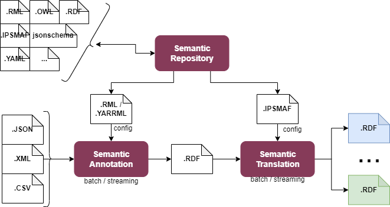
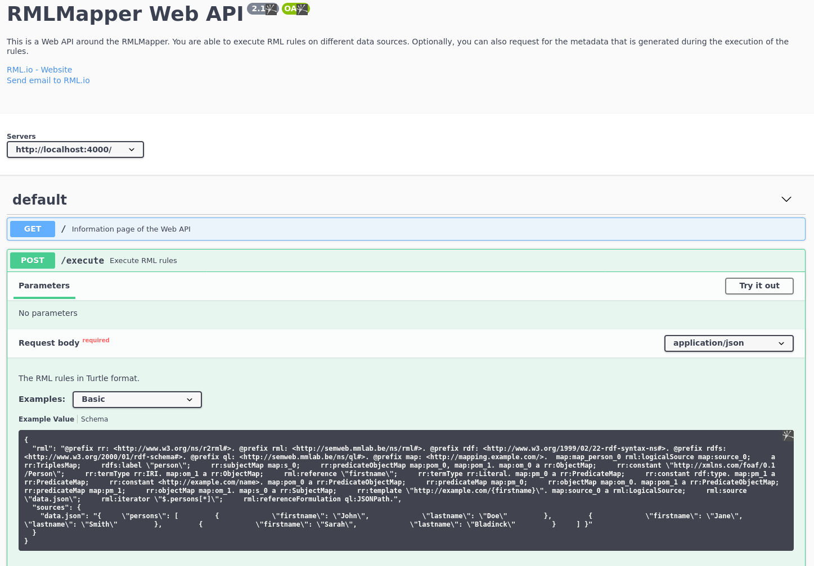
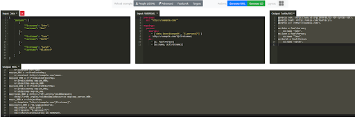

.. _Semantic Annotation Enabler:

###########################
Semantic Annotation Enabler
###########################

.. contents::
  :local:
  :depth: 1

Introduction
============

This enabler offers a service of syntactic transformation of JSON, CSV
and XML data formats into RML, also known as semantic lifting, or
semantic annotation.

Two methods of annotation are supported: one-time through a REST API,
and message-based through a persistent stream.

Annotations are configured using the `RML <https://rml.io/specs/rml/>`__
language.

In the first release, the REST API, with (optional) helper web GUI is
supported, as well as tentative streaming infrastructure on Apache
Flink. Final version will include a streaming processor for Kafka/MQTT
with persistent annotation channels.

Features
========

Streaming Annotation Enabler has the following main feaures:

-  Configurable annotation from JSON, XML and CSV into RDF using the RML
   language
-  Batch annotation via a stateless REST API
-  Streaming annotation through persistent, configurable annotation
   channels

In short, the annotator lifts data to RDF in batch or streaming fashion.
|SemAnn_flow|

.. |SemAnn_flow| figure:: semantic_annotation_enabler/uploads/images/SemAnn_base_flow.png

Place in architecture
=====================

The Semantic Annotation Enabler is part of the Data Management Plane of
ASSIST-IoT.

The core functionality is designed to be integrated into a pipeline
before the Semantic Translation enabler, which requires the use of RDF.
Semantic annotation lifts data to RDF, which can then be translated into
different ontologies. Configuration files for annotation (in RML format)
can optionally be shared in the Semantic Repository, provided, that they
do not contain any sensitive or confidential information about used data
models and formats.

   SemAnn_place_in_architecture

User guide
==========

Batch translation is offered as REST API, that can be tried out with a
simple example on a Swagger page. By default the Swagger Web GUI is
served on port 4000:

   RMLMapper_Web_API

Additionally, an editor for authoring files in
`RML <https://rml.io/specs/rml/>`__ and
`YARRML <https://rml.io/yarrrml/spec/>`__ formats is available (by
default on port 5000):

   Matey GUI

The GUI is connected to the batch annotation component served at the
/execute endpoint. This allows the users of the GUI editor to apply RML
files to some test data and validate, that the results are correct.

The GUI editor can be used to write annotations in the
`YARRML <https://rml.io/yarrrml/spec/>`__ format, which is more readable
and more succinct, than RML. The GUI editor can translate YARRML into
RML. Note, that YARRML is not used directly by other components, so
translation into RML is required for the annotation files to be used by
the enabler. Support for YARRML is limited to the GUI editor and
included for the sake of convenience.

Current streaming capability is offered through Apache Flink (by default
on port 8081). Detailed usage instructions can be found
`here <https://github.com/RMLio/RMLStreamer/blob/development/docker/README.md#3-deploy-rmlstreamer-using-the-flink-web-interface>`__.
Because of performance concerns, high resource usage, difficult
configuration and complicated deployment, Flink support will be removed
in the final version. Instead, a custom component for streaming with
Apache Kafka is being developed.

The streaming component in the final version will use
`CARML <https://github.com/carml/carml>`__ (RML extension), which has
the same syntax as RML, but requires different definition of data
source. RML is designed primarily for persisted data sources, such as
flat files. CARML extends RML to support messages passing through a
stream. Consequently, annotation configuration for batch annotation must
be slightly modified, before being used in streaming translation. The
modification involves only description of the data source. The actual
annotations of data can remain unchanged.

Prerequisites
=============

The Semantic Annotator Enabler has no particular requirements to run,
but practical usage requires familiarity with the
`RML <https://rml.io/specs/rml/>`__ language.

Installation
============

Current version requires `docker <https://www.docker.com/>`__ and
`docker-compose <https://docs.docker.com/compose/>`__, and is installed
by running the ASSIST_RML/docker-compose.yml file.

Build and run:

``cd ASSIST_RML``

``docker-compose up --build``

This creates the following services:

-  RML Mapper REST - Swagger at http://localhost:4000/
-  Matery YARRML helper editor at http://localhost:5000/
-  Apache Flink - Web interface at http://localhost:8081/

   -  Use RMLStreamer jar from `this
      link <https://github.com/RMLio/RMLStreamer/releases/download/v2.2.2/RMLStreamer-2.2.2.jar>`__

-  Kafka broker at localhost:9093

Note, that streaming with Apache Flink is set up temporarily, and will
be substituted with a custom Kafka/MQTT streaming solution in the
future.

Configuration
=============

Currently configuration of the enabler is limited to setting environment
variables in the docker-compose.yml file. If necessary, exposed ports
may be configured there.

Developer guide
===============

The Semantic Annotator Enabler is a combination of software written in
different technologies.

The one-time translation depends on: - `RML
Mapper <https://github.com/RMLio/rmlmapper-java>`__ - `RML
webapi <https://github.com/RMLio/rmlmapper-webapi-js>`__ -
`Matey <https://github.com/RMLio/matey>`__

Please, refer to the documentation for individual software to learn more
about development.

The streaming component is built with
`Scala <https://www.scala-lang.org/>`__ using `Akka
Streams <https://doc.akka.io/docs/akka/current/stream/index.html>`__ and
`Akka Http <https://doc.akka.io/docs/akka-http/current/index.html>`__ -
parts of the `Akka <https://akka.io/>`__ framework, and depends
primarily on `Carml <https://github.com/carml/carml>`__ to process RML
files.

Version control and releases
============================

0.25 (Mar 2022) - added documentation and examples 0.20 (Mar 2022) -
added GUI editor 0.10 (Feb 2022) - initial release with REST API

License
=======

The Semantic Annotator is licensed under the Apache License, Version 2.0
(the “License”).

You may obtain a copy of the License at: `Apache License
2.0 <http://www.apache.org/licenses/LICENSE-2.0>`__

RML Language and all relevant software, documentation, and reference
examples are licensed under MIT License.

You may obtain a copy of the License at: `MIT
License <https://mit-license.org/>`__

Notice (dependencies)
=====================

The Semantic Annotator Enabler is packaged to be available for use
without any external dependencies. However, depending on configuration,
it may use components outside of what is packaged. This pertains in
particular to streaming brokers for Kafka and MQTT. A broker is required
for the Enabler to support streaming annotation. To use a broker
different, than the ones provided in the package, simply configure the
relevant ports to point to Kafka or MQTT brokers already configured in
your network. Note, that the streaming annotation with Kafka/MQTT is
supported in the final release and missing from the initial release.

Included in the Enabler are RML software and libraries, including `RML
Mapper <https://github.com/RMLio/rmlmapper-java>`__, `RML
webapi <https://github.com/RMLio/rmlmapper-webapi-js>`__, and
`Matey <https://github.com/RMLio/matey>`__ for one-time translation, and
`Carml <https://github.com/carml/carml>`__ for streaming translation.

For more information about development libraries dependencies, see
`Developer guide <developer-guide>`__.

