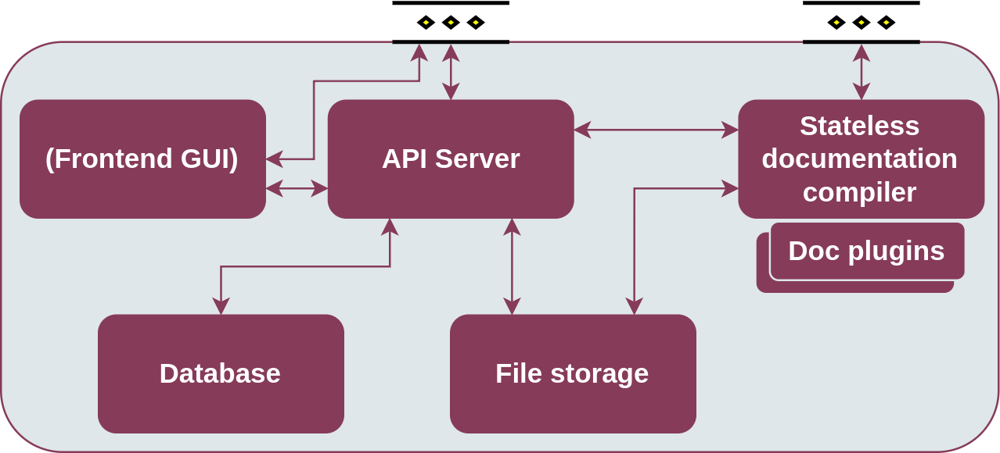

.. _Semantic Repository enabler:

###########################
Semantic Repository enabler
###########################

.. contents::
  :local:
  :depth: 1

Semantic Repository enabler of ASSIST-IoT.

***************
Introduction
***************

This enabler offers a “nexus” for data models, ontologies, and other
files, that can be uploaded in different file formats, and served to
users with relevant documentation. This enabler is aimed to support
files that describe data models or support data transformations, such as
ontologies, schema files, semantic alignment files etc. However, there
are no restrictions on file format and size.

Overall focus of the Semantic Repository’s design is high performance,
scalability, and resiliency. It should be able to scale up and down to
meet the specific use case.


***************
Features
***************

The enabler is in active development. Most features listed below are not
implemented yet. Marked in **bold** are those that are already
functioning.

Storing data models
###################

-  **Storage of any type of data model, both textual and binary.**
-  **Ability to provide multiple formats of one data model, depending on
   the requester’s preferences.**
-  **Grouping data models into namespaces.**
-  **Flexible versioning with arbitrary tag names.**
-  Granular and easy-to-use access control.

Metadata
########

-  Tracking provenance information (creation/modification dates,
   authors).
-  Ability to attach arbitrary additional metadata.
-  Metadata searching and sorting.

Documentation
#############

-  Support for Markdown/ASCIIDOC manual documentation pages.
-  Automatic documentation generation for some data model types.
-  Flexible plugin architecture for creating additional documentation
   generation modules.


*********************
Place in architecture
*********************

The Semantic Repository is located in the Data management plane of the
ASSIST-IoT architecture. It serves as a versioned and namespaced central
repository of data models and other files. It has few limitations with
regard to the content it can store, thus it can be used for diverse data
storage-related scenarios.


**********
User guide
**********

The Semantic Repository enabler exposes a single REST API endpoint for
both manipulating the repository’s contents, as well as for retrieving
stored data models. There is also a graphical user interface for
performing most of the same tasks.


Basic concepts
**************

-  **Namespace** – a top-level “group” in the repository, which can host
   any number of models.
-  **Model** – a data model, which can have many versions.
-  **Model version** – a specific version of a model. You can upload the
   content of a data model only to its specific version. The version can
   also have associated documentation pages and other metadata.
-  **Content** – each model version can have many content files
   attached, each in a different format.
There are few restrictions on how you can use these concepts to build
your repository. For example, it is possible to upload files of
arbitrary size and format.

To give some context, in GitHub terms, a **namespace** would translate a
user or a group. A **model** would be a repository, and a **model
version** would be a branch or tag. This is just an example, of course.

Model versions
**************

The Semantic Repository does not force a specific versioning scheme on
your models. You can use for example Git branches and tags, plain
numbers, or `Semantic Versioning <https://semver.org/>`__.

The ``latest`` version tag is special – it is a pointer to the most
recent version of the model, as set by the model’s owner. It must always
be set manually. A model may have no ``latest`` pointer, and the pointer
may lead to a non-existent version. Enforcing a specific style of use is
up to the owner.

The benefit of the ``latest`` tag is that it allows clients to easily
retrieve the most recent version of the model (see the API user guide).

Content
*******

One model version can have multiple content files attached, each in a
different format. The format is recommended to correspond to the `Media
Type <https://www.iana.org/assignments/media-types/media-types.xhtml>`__
of the file – this is to best support HTTP-based technologies, such as
`Linked Data <https://www.w3.org/standards/semanticweb/data>`__.
However, you can always set the format to whatever you like.

The content for one model version *should* be immutable, i.e., you
should avoid modifying the once-uploaded content for a specific version.
This is so that clients can expect that the content for a given version
will not change suddenly, introducing a backward-incompatible change. It
is however *possible* to overwrite earlier-uploaded content, in case of
a mistake, for example. See the API guide below for more details.

You can specify the default format to use when retrieving the content,
when no preferences were specified. See the API guide below for more
details.

Metadata
********

You can attach arbitrary metadata to namespaces, models, and model
versions. This metadata can serve a multitude of applications such as
dependency tracking, additional provenance information (e.g., author
email, license), indicating the source Git branch, etc.

Each entity (that is, a namespace, model, or model version) can have a
number of metadata keys. Each key can have either a single textual value
or several values (an array).
For example, if you want to indicate the authorship of a model version
and its source Git branch, its metadata could look like: - author: -
``Rob`` - ``Bob`` - branch: ``rob-bob-branch``

Or, in JSON:

::

   "metadata": {
     "author": ["Rob", "Bob"],
     "branch": "rob-bob-branch"
   }

This metadata can be filtered and sorted when browsing collections of
entities.

Refer to the API guide below for usage instructions.

Limits
^^^^^^

By default, the Semantic Repository limits the amount of metadata that
can be stored per entity. These default limits can be changed (see:
Configuration). - Maximum number of keys per entity: **64** - Maximum
number of values per one metadata key: **32** - Maximum length in
characters of an individual metadata value: **1024**

Documentation
~~~~~~~~~~~~~

To each model version you can attach documentation pages that, for
example, help explain users how to use the various fields in your data
model. Currently, the documentation must be uploaded in the form of
Markdown or reStructuredText source files. It also possible to attach
images to the documentation pages.

The documentation pages are generated from a given markup format with
the use of a *documentation plugin*. Currently, Semantic Repository
offers the following plugins: - ``markdown`` for text formatted in
`vanilla Markdown <https://daringfireball.net/projects/markdown/>`__;
accepted file extensions: ``.md``, ``.markdown`` - ``gfm`` for text in
`GitHub-flavored Markdown <https://github.github.com/gfm/>`__; accepted
file extensions: ``.md``, ``.markdown`` - ``rst`` for text in the
`reStructuredText <https://docutils.sourceforge.io/rst.html>`__ format;
accepted file extensions: ``.rst``

The documentation can be attached to a model version, but it is also
possible to test the behavior of the documentation generator in the
*sandbox*. Please refer to the REST API and the graphical interface
guides below for more information on how to upload and access
documentation.

File structure
^^^^^^^^^^^^^^

Multiple files can be uploaded as one *documentation set*, either in the
form of separate files or compressed (accepted are ``.tar``,
``.tar.gz``, and ``.tgz`` archives). Each documentation set must have at
least one source markup file for the home page, named ``README.md``,
``README.markdown``, or ``README.rst`` (depending on the source format).
All markup files will be compiled to human-readable HTML pages with
built-in navigation. The home page will be served under ``/``
(documentation root) and ``/index.html``. The other pages will simply
have their extension changed to ``.html``, so for an input file named
``extra.md``, a page named ``/extra.html`` will be produced.

The uploaded files can include subdirectories and additional image
files. When referencing images and other pages, please use relative
paths (e.g., ``img/image.png``).

**Example**

When given the following input file structure:

::

   /
   |- README.md
   |- api.md
   |- image1.png
   |- extra/
   |  |- image2.png
   |  |- extra.md

This output file structure will be produced:

::

   /
   |- index.html
   |- api.html
   |- image1.png
   |- extra/
   |  |- image2.png
   |  |- extra.html

-  To embed ``image1.png`` into ``README.md`` use:
   ````
-  To embed ``extra/image2.png`` into ``README.md`` use:
   ````
-  To embed ``image1.png`` into ``extra/extra.md`` use:
   ````
-  To link from ``README.md`` to ``extra.md`` use:
   ``[Link text](extra/extra)``

.. _limits-1:

Limits
^^^^^^

By default, the Semantic Repository places limits on the uploaded
documentation. These default limits can be changed (see: Configuration).
- Maximum number of files in a documentation set: **50** - Maximum total
size of files in a documentation set: **4MB** - Time after which
documentation in the sandbox expires and cannot be accessed anymore:
**24 hours**

REST API
########

The following is a brief guide to using the API in practice. The
examples follow a basic use case of storing several `W3C
ontologies <https://www.w3.org/standards/semanticweb/ontology>`__.

The full specification of the REST API can be found in the `REST API
reference <#rest-api-reference>`__ section.

General information
*******************

The API follows a very simple structure of
/{namespace}/{model}/{model_version}. In general, ``POST`` creates a new
*thing* at the given URL, ``GET`` retrieves it, ``DELETE`` deletes it,
and ``PATCH`` modifies it.

The API only returns responses in plain JSON. The following guide should
give you a good idea of what the responses look like, but you can also
find the full schemas in the `REST API
reference <#rest-api-reference>`__ section.

It generally does not matter whether a URL ends with a slash or not.

Creating and retrieving models
******************************

**Step 1: create a namespace**

First, we will need to create a namespace for your models. We will name
it ``w3c``.

============= ============
Request URL   Request body
============= ============
``POST /w3c`` (empty)
============= ============

============= ===========================================
Response code Response body
============= ===========================================
200           ``{"message": "Created namespace 'w3c'."}``
============= ===========================================

You can examine the created namespace by performing an HTTP GET request:

============ ============
Request URL  Request body
============ ============
``GET /w3c`` –
============ ============

============= ===================
Response code Response body
============= ===================
200           ``{"namespace": "w3c"}``
============= ===================

Currently, there is no other information in the namespace other than its
name.

You can also list all namespaces in the repository:

=========== ============
Request URL Request body
=========== ============
``GET /``   –
=========== ============

Response:

.. code:: json

   {
     "inViewCount": 1,
     "items": [{"namespace": "w3c"}],
     "page": 1,
     "pageSize": 20,
     "totalCount": 1
   }

A collection of namespaces is returned. Browsing such collections is
described in detail in the `Browsing
collections <#browsing-collections>`__ section below.

**Note:** namespace name must meet the following criteria: - be at least
3 characters, and at most 100 characters long - only contain lower or
upper letters of the latin alphabet, digits, dashes (``-``), and
underscores (``_``)


**Step 2: create models**

In this example we will create two models: ``sosa`` and ``ssn``,
corresponding to `two well-known IoT
ontologies <https://www.w3.org/TR/vocab-ssn/>`__. Creating a model is
similar to creating a namespace:

================= =======
Request           Body
================= =======
``POST /w3c/ssn`` (empty)
================= =======

============= ===========================================
Response code Body
============= ===========================================
200           ``{"message": "Created model 'w3c/ssn'."}``
============= ===========================================

and for sosa:

================== =======
Request            Body
================== =======
``POST /w3c/sosa`` (empty)
================== =======

============= ============================================
Response code Body
============= ============================================
200           ``{"message": "Created model 'w3c/sosa'."}``
============= ============================================

You can examine the created model:

================= ====
Request           Body
================= ====
``GET /w3c/sosa`` –
================= ====

============= ========================================
Response code Body
============= ========================================
200           ``{"namespace": "w3c", "model": "sosa"}``
============= ========================================

When you again examine the contents of the namespace (``GET /w3c``), you
will see a collection of models:

.. code:: json

   {
     "models": {
       "inViewCount": 2,
       "items": [
         {
           "model": "sosa",
           "namespace": "w3c"
         },
         {
           "model": "ssn",
           "namespace": "w3c"
         }
       ],
       "page": 1,
       "pageSize": 20,
       "totalCount": 2
     },
     "namespace": "w3c"
   }
Some additional information is also returned, such as ``page`` and
``totalCount``. These are described in detail in the `Browsing
collections section <#browsing-collections>`__.

**Note:** model names must meet the following criteria: - be at least 1
and at most 100 characters long - only contain lower or upper letters of
the latin alphabet, digits, dashes (``-``), and underscores (``_``) -
not start with one of the following characters: ``_-``


**Step 3: create versions**

You cannot upload content to a model directly. First, you must
explicitly create a specific version of the model and work with that.

For example, to create a version ``1.0`` of model ``sosa``:

====================== =======
Request                Body
====================== =======
``POST /w3c/sosa/1.0`` (empty)
====================== =======

============= ========================================================
Response code Body
============= ========================================================
200           ``{"message": "Created model version 'w3c/sosa/1.0'."}``
============= ========================================================

You can examine the content of this version:

===================== ====
Request               Body
===================== ====
``GET /w3c/sosa/1.0`` –
===================== ====

Response:

.. code:: json

   {
     "formats": {},
     "model": "sosa",
     "namespace": "w3c",
     "version": "1.0"
   }

You can also retrieve a list of versions for the model (again,
``GET /w3c/sosa``):

.. code:: json

   {
     "model": "sosa",
     "namespace": "w3c",
     "versions": {
       "inViewCount": 1,
       "items": [
         {
           "model": "sosa",
           "namespace": "w3c",
           "version": "1.0"
         }
       ],
       "page": 1,
       "pageSize": 20,
       "totalCount": 1
     }
   }

**Note:** version tags must meet the following criteria: - be at least 1
and at most 100 characters long - only contain lower or upper letters of
the latin alphabet, digits, dashes (``-``), underscores (``_``), dots
(``.``), and plus signs (``+``) - not start with one of the following
characters: ``._-+`` - not be ``latest``, which is a reserved tag (see
below)


``latest`` **pointer**

The ``latest`` version pointer can be set on a given model using a PATCH
request:

=================== ============================
Request             Body
=================== ============================
``PATCH /w3c/sosa`` ``{"latestVersion": "1.0"}``
=================== ============================

============= ============================================
Response code Body
============= ============================================
200           ``{"message": "Updated model 'w3c/sosa'."}``
============= ============================================

Now it can be used in GET requests instead of the explicit version. So,
``GET /w3c/sosa/latest`` is equivalent to ``GET /w3c/sosa/1.0``.

**Important:** to prevent accidental overwrites, **it is not possible to
make POST, PATCH, or DELETE requests via the ``latest`` pointer**. Use
the explicit version in the URL instead.

The version pointer can also be set during model creation:

================= ============================
Request           Body
================= ============================
``POST /w3c/ssn`` ``{"latestVersion": "1.0"}``
================= ============================

============= ===========================================
Response code Body
============= ===========================================
200           ``{"message": "Created model 'w3c/ssn'."}``
============= ===========================================

To change the pointer to a new value, simply make a PATCH request. To
**unset** the pointer completely, use the special ``@unset`` value in a
PATCH request:

=================== ===============================
Request             Body
=================== ===============================
``PATCH /w3c/sosa`` ``{"latestVersion": "@unset"}``
=================== ===============================

============= ============================================
Response code Body
============= ============================================
200           ``{"message": "Updated model 'w3c/sosa'."}``
============= ============================================

Uploading content
*****************

In the following examples we will focus on uploading and retrieving
content for the ``/w3c/sosa/1.0`` model version we have created in the
previous section.

To upload content in format ``text/turtle``:

================================================= ===============
Request                                           Body
================================================= ===============
``POST /w3c/sosa/1.0/content?format=text/turtle`` content: (file)
================================================= ===============

In the body of the request (form-data) set the field ``content`` to the
file you want to upload.

In response you will get:

.. code:: json

   {
       "message": "Uploaded content in format 'text/turtle' for model 'w3c/sosa/1.0'. Checksum: 5b844292b8402e448804f9c9f100d59e",
       "warnings": [
           "The default format of this model version was set to 'text/turtle'.'"
       ]
   }

The response notes that the default format of the model version was set
to “text/turtle” because that is the first format we have uploaded. You
can upload more content files for the model version in a similar manner.

The Semantic Repository support multipart, streaming uploads and can
handle files of any size this way.

To see the available formats, make a ``GET /w3c/sosa/1.0`` request:

.. code:: json

   {
     "defaultFormat": "text/turtle",
     "formats": {
       "text/turtle": {
         "contentType": "text/turtle",
         "md5": "5b844292b8402e448804f9c9f100d59e",
         "size": 27326
       }
     },
     "model": "sosa",
     "namespace": "w3c",
     "version": "1.0"
   }

In the response notice that: - ``defaultFormat`` has been set to
“text/turtle”. You can change that later. - ``formats`` is keyed by
format name. - ``contentType`` displays the content type of the uploaded
file, which in this case is the same as format. - ``md5`` is the MD5
checksum of the entire file. - ``size`` is the file’s size in bytes.

**Note:** format names must meet the following criteria: - be at least 1
and at most 100 characters long - only contain lower or upper letters of
the latin alphabet, digits, dashes (``-``), underscores (``_``), dots
(``.``), and plus signs (``+``) - not start with one of the following
characters: ``._-+``

Overwriting content
*******************

As noted in the `User guide <#user-guide>`__, the content for a specific
version of a model *should* be immutable. So, if you try to repeat the
request presented above, it will be rejected with an HTTP 400 error:

.. code:: json

   {
     "error": "Content in format 'text/turtle' already exists for this model version. If you want to update it, it is recommended to create a new version instead. If you really want to overwrite this content, retry the upload with the 'overwrite=1' query parameter."
   }

If you really want to overwrite this content (in case of a mistake, for
example), add the ``overwrite=1`` parameter:

=============================================================
===============
Request                                                       Body
=============================================================
===============
``POST /w3c/sosa/1.0/content?format=text/turtle&overwrite=1`` content: (file)
=============================================================
===============

Response:

.. code:: json

   {
     "message": "Uploaded content in format 'text/turtle' for model 'w3c/sosa/1.0'. Checksum: 5b844292b8402e448804f9c9f100d59e",
     "warnings": [
       "Overwrote an earlier version of the content."
     ]
   }

Changing the default format
***************************

The ``defaultFormat`` field of a model version indicates which content
format will be used, if no other preferences are specified. It is set
automatically to the first content format that is uploaded to the model
version, but can also be changed later.

Changing the ``defaultFormat`` field is done with a PATCH request:

======================= ============================================
Request                 Body
======================= ============================================
``PATCH /w3c/sosa/1.0`` ``{"defaultFormat": "application/json+ld"}``
======================= ============================================

============= ==========================================================
Response code Body
============= ==========================================================
200           ``{"message": "Updated model version 'w3c/sosa/1.0.0'."}``
============= ==========================================================

Now when you request ``GET /w3c/sosa/1.0/content`` (or any of the
equivalent forms shown above), the Repository will attempt to retrieve
content in the ``application/json+ld`` format.

Note that the Semantic Repository does not check whether the set default
format is actually present in the model version. In case it is not, you
will receive a 404 error when trying to retrieve the content.

The default format can also be set during model version creation:

===================== ============================================
Request               Body
===================== ============================================
``POST /w3c/ssn/1.0`` ``{"defaultFormat": "application/json+ld"}``
===================== ============================================

============= =======================================================
Response code Body
============= =======================================================
200           ``{"message": "Created model version 'w3c/ssn/1.0'."}``
============= =======================================================

If you set the default format during model version creation, the first
uploaded content will not overwrite this setting.

To change the default format to a new value, simply make a PATCH
request. To **unset** the default format completely, use the special
``@unset`` value in a PATCH request:

======================= ===============================
Request                 Body
======================= ===============================
``PATCH /w3c/sosa/1.0`` ``{"defaultFormat": "@unset"}``
======================= ===============================

============= ========================================================
Response code Body
============= ========================================================
200           ``{"message": "Updated model version 'w3c/sosa/1.0'."}``
============= ========================================================

Downloading the content
***********************

Downloading the models is very straightforward. The most explicit way is
to specify the namespace, model, version, and the desired format:

``GET /w3c/sosa/1.0/content?format=text/turtle``

You can also omit the ``format`` parameter to obtain the content in the
default format:

``GET /w3c/sosa/1.0/content``

If you have set the ``latest`` tag for this model, you can use it
instead of the explicit version, to fetch the most recent version of the
model.

There is also a second, shorter style of URLs for downloading content,
with the ``/c`` prefix:

1. ``GET /c/w3c/sosa/1.0/text/turtle``
2. ``GET /c/w3c/sosa/latest/text/turtle``
3. ``GET /c/w3c/sosa/1.0``
4. ``GET /c/w3c/sosa/latest``
5. ``GET /c/w3c/sosa``

Assuming that the ``latest`` tag is set to version ``1.0`` and the
default format is ``text/turtle``, all of the above requests will return
the same result. Request 5 is simply a shorthand for “the latest version
of this model, in the default format”, which should be sufficient for
most applications.

In all cases the response will be simply the stored file, with the
appropriate Content-Type header.

Attaching metadata
~~~~~~~~~~~~~~~~~~

As described in the User guide, you can attach arbitrary metadata to any
entity (namespace, model, model version). The API is identical for each
of those cases, the only difference is in the URL.

You can attach metadata when creating an entity via a POST request. For
example, if we wanted to create a new model in the ``w3c`` namespace:

Request: ``POST /w3c/dcat`` Body:

.. code:: json

   {
     "metadata": {
       "rdf-namespace": "https://www.w3.org/ns/dcat#",
       "external-docs": "https://www.w3.org/TR/vocab-dcat/",
       "editors": [
         "Riccardo Albertoni",
         "David Browning",
         "et al."
       ]
     }
   }

This request will create a new model with this metadata attached. The
metadata can be later modified, as explained below.

To examine the created model:

================= ====
Request           Body
================= ====
``GET /w3c/dcat`` –
================= ====

Response:

.. code:: json

   {
     "metadata": {
       "editors": [
         "Riccardo Albertoni",
         "David Browning",
         "et al."
       ],
       "external-docs": "https://www.w3.org/TR/vocab-dcat/",
       "rdf-namespace": "https://www.w3.org/ns/dcat#"
     },
     "model": "dcat",
     "namespace": "w3c",
     (...)
   }

**Note:** metadata keys must meet the following criteria: - be at least
1 and at most 100 characters long - only contain lower or upper letters
of the latin alphabet, digits, dashes (``-``), and underscores (``_``)

Values of the keys can be any strings (as long as they fit into the
length limit, 1024 characters by default) or arrays of such strings.
Values cannot be the exact string ``@unset``, which is a reserved
keyword. No other types of values (e.g., numeric, null…) are supported.

**Note:** the process of attaching metadata to namespaces and model
versions is identical and the same limitations apply.

Modifying metadata
~~~~~~~~~~~~~~~~~~

The metadata can be modified using PATCH requests with a very similar
syntax to the POST requests described above. There are three possible
operations that can be performed with each individual key in a request:
- Keep it unchanged. To do that, simply don’t include the key in the
request. - Set it to a new value. For that, just specify it along with
its new value, just like in a POST request. - Remove the key. This is
done by setting it to the reserved ``@unset`` keyword.

**Note:** individual array elements cannot be modified. You can only
change or remove entire keys.

In this example we will modify the previously created ``w3c/dcat``
model. We (1) remove the ``editors`` key (2) add the ``git-repo`` key
(3) change the value of ``external-docs`` to an array. The other keys
will remain unchanged.

Request: ``PATCH /w3c/dcat`` Body:

.. code:: json

   {
     "metadata": {
       "editors": "@unset",
       "git-repo": "https://github.com/w3c/dxwg/",
       "external-docs": [
         "https://www.w3.org/TR/vocab-dcat/",
         "https://w3c.github.io/dxwg/dcat-implementation-report/"
       ]
     }
   }

To examine the modified model:

================= ====
Request           Body
================= ====
``GET /w3c/dcat`` –
================= ====

Response:

.. code:: json

   {
     "metadata": {
       "external-docs": [
         "https://www.w3.org/TR/vocab-dcat/",
         "https://w3c.github.io/dxwg/dcat-implementation-report/"
       ],
       "rdf-namespace": "https://www.w3.org/ns/dcat#",
       "git-repo": "https://github.com/w3c/dxwg/"
     },
     "model": "dcat",
     "namespace": "w3c",
     (...)
   }

**Note:** the process of modifying metadata of namespaces and model
versions is identical and the same limitations apply.

Deleting models and other objects
*********************************

Namespaces, models, model versions, and contents can be permanently
deleted from the repository. The rules and the interface are identical
on all cases: - The entity must be “empty”, that is, must have no child
entities. For example, to delete a namespace, all its models must be
deleted beforehand. - To delete the entity, simply use the URL path you
would for a GET request, but use the DELETE method instead. -
Additionally, you must provide the ``force=1`` query parameter to the
request. This is to avoid accidental deletions.

For example, to delete a (previously emptied of any versions) model
``/w3c/dcat``:

============================ ====
Request                      Body
============================ ====
``DELETE /w3c/dcat?force=1`` –
============================ ====

Another example: deleting a specific content of a model version:

=========================================================== ====
Request                                                     Body
=========================================================== ====
``DELETE /w3c/sosa/1.0/content?format=text/turtle&force=1`` –
=========================================================== ====

**Note 1: deleting things from the Repository is discouraged**, do so
only in exceptional circumstances (e.g., a mistake). The contents of the
Repository should be mostly immutable.

**Note 2:** when deleting model versions you cannot use the ``latest``
version pointer. Similarly, when deleting content, you cannot rely on
the default format. You must always explicitly define the format and the
version to be deleted.

**Note 3:** when deleting the target of the ``latest`` version pointer,
or the content in the default format, this may result in broken
references. Make sure to set the version pointer and the default format
to a valid value afterwards.

Browsing collections
********************


The API supports browsing through long lists of namespaces, models, and
model versions. The mechanism is identical in all three cases and is
based on two query parameters: - ``page`` – 1-based number of the page
to display. - ``page_size`` – (optional) number of items to display per
page, 20 by default. This parameter is subject to a configurable limit,
set to 50 by default.

In the following example, let’s assume that we have namespace
``example`` with 20 models named from ``01`` to ``20``. To display the
third page of the list of models in this namespace, while showing 4
items per page:

=================================== ====
Request                             Body
=================================== ====
``GET /example?page=3&page_size=4`` –
=================================== ====

Response:

.. code:: json

   {
     "models": {
       "inViewCount": 4,
       "items": [
         {
           "model": "09",
           "namespace": "example"
         },
         {
           "model": "10",
           "namespace": "example"
         },
         {
           "model": "11",
           "namespace": "example"
         },
         {
           "model": "12",
           "namespace": "example"
         }
       ],
       "page": 3,
       "pageSize": 4,
       "totalCount": 20
     },
     "namespace": "example"
   }

The ``models`` key provides the following information: - ``items`` –
list of models on this page. - ``inViewCount`` – number of items
currently displayed. Always lower or equal to ``pageSize``. -
``totalCount`` – number of all items in this collection, given the
currently set filters. - ``pageSize`` – maximum number of items that can
be displayed on the page. - ``page`` – current page number (1-based).

**Note:** if you request a page number for which there are no results,
an empty set will be returned.

Browsing collections of namespaces and model versions is performed
identically.

Filtering and sorting collections
~~~~~~~~~~~~~~~~~~~~~~~~~~~~~~~~~

All collections that support paging (as described above) can be sorted
and filtered. There is support for filtering by one field at a time
(ascending or descending). An unlimited number of filters can be used –
all will be joined with the AND operator. The sort & filter parameters
can be freely combined with paging parameters.

The following fields can be sorted and filtered: - Namespace collection
(``/``): ``namespace``, ``metadata.*`` - Model collection (``/{ns}``):
``model``, ``latestVersion``, ``metadata.*`` - Model version collection
(``/{ns}/{model}``): ``version``, ``defaultFormat``, ``metadata.*``

The ``metadata.*`` field indicates it is possible to sort or filter by
any of the metadata properties. For example, to sort by metadata field
``source`` simple use the ``metadata.source`` field specifier.

Filtering
^^^^^^^^^

It is possible to filter for the exact value of one or more fields. Each
filter is specified with a query parameter in the form of
``f.{fieldName}={value}``, where ``fieldName`` corresponds to one of the
filter-able fields in this collection, as described above.

For example, to search for models that have the latest version set to
``1.0.0`` and their ``source`` metadata field is ``internal``:

================================================================= ====
Request                                                           Body
================================================================= ====
``GET /example?f.latestVersion=1.0.0&f.metadata.source=internal`` –
================================================================= ====

**Note 1:** metadata fields can have multiple values. A filter on such a
field will be satisfied if at least one value is equal to the filter
value.

**Note 2:** a filter will not be satisfied if a given field is not
present in the object.

Sorting
^^^^^^^

Only one field can be sorted at a time, ascending or descending. Sorting
is operated using two query parameters: ``sort_by={fieldName}`` and
``order={ascending|descending}``. The order parameter is optional and
set to ``ascending`` by default.

For example, to sort namespaces by their name, in descending order:

============================================ ====
Request                                      Body
============================================ ====
``GET /?sort_by=namespace&order=descending`` –
============================================ ====

**Note 1:** sorting is applied after filtering, but before paging. This
allows you to freely browse filtered and sorted collections.

**Note 2:** the sort order is undefined for items that don’t contain the
sorted field. This is especially relevant for sorting with metadata
fields.

Documentation
~~~~~~~~~~~~~

The Semantic Repository can store and serve generated documentation
pages – see the user guide for details on the available formats and
modes of operation. This functionality can be accessed via two
endpoints: - Documentation per model version:
``/{namespace}/{model}/{version}/doc`` - Documentation sandbox: ``/dg``

In the following sections, it is explained how to upload new
documentation jobs, monitor their status, and retrieve the generated
documentation pages.

Documentation sandbox
^^^^^^^^^^^^^^^^^^^^^

To create a new documentation generation job in the sandbox using the
``markdown`` plugin:

============================ ===============
Request                      Body
============================ ===============
``POST /dg?plugin=markdown`` content: (file)
============================ ===============

Here, the ``content`` body field can be one or more files to be
processed. In response you will receive an acknowledgement with your
job’s unique identifier in the ``handle`` field. You will need this ID
for further requests:

.. code:: json

   {
     "handle": "de61582b-fe42-4447-8555-4d1c736466bd",
     "message": "Compilation started.",
     "plugin": "markdown"
   }

The job has now been added to the queue and will be processed
asynchronously. You can check the job’s status by making a GET request
to ``/dg/{job_id}``. In our example:

================================================ ====
Request                                          Body
================================================ ====
``GET /dg/de61582b-fe42-4447-8555-4d1c736466bd`` –
================================================ ====

The status of the job will be returned:

.. code:: json

   {
     "ended": "2022-08-26T12:48:01",
     "jobId": "de61582b-fe42-4447-8555-4d1c736466bd",
     "plugin": "markdown",
     "started": "2022-08-26T12:48:00",
     "status": "Success"
   }

A documentation job can be in one of three states (the ``status``
field): - ``Started`` – the job has been enqueued and is either waiting
in line, or being processed. - ``Success`` – the job has finished
successfully, and the generated documentation can be accessed. -
``Failed`` – the job has ended with an error. The ``error`` field
provides additional detail as to the cause of the problem.

After the job has been finished successfully, you can access the
generated files at ``/dg/{job_id/doc/`` - ``GET /dg/{job_id}/doc``
redirects to ``GET /dg/{job_id}/doc/`` - ``GET /dg/{job_id}/doc/``
returns the content of the home page of the documentation
(``index.html``) - ``GET /dg/{job_id}/doc/{file_path}`` return the
content of the file under the given path.

Documentation for model versions
^^^^^^^^^^^^^^^^^^^^^^^^^^^^^^^^

The process for adding documentation to model versions is very similar.
To add documentation to model version ``/w3c/sosa/1.0``:

============================================== ===============
Request                                        Body
============================================== ===============
``POST /w3c/sosa/1.0/doc_gen?plugin=markdown`` content: (file)
============================================== ===============

Response:

.. code:: json

   {
     "handle": "w3c/sosa/1.0",
     "message": "Compilation started.",
     "plugin": "markdown"
   }

The returned job handle is not a unique ID, but rather the model
version’s name. To check the status of the job, simply retrieve the
details of the model version:

===================== ====
Request               Body
===================== ====
``GET /w3c/sosa/1.0`` –
===================== ====

This will return:

.. code:: json

   {
     "documentation": {
       "ended": "2022-08-26T12:49:33",
       "jobId": "9c37e741-349b-4353-8c71-8fab3c58d34e",
       "plugin": "markdown",
       "started": "2022-08-26T12:49:33",
       "status": "Success"
     },
     "formats": {},
     "model": "sosa",
     "namespace": "w3c",
     "version": "1.0"
   }

The generated documentation is available under
``GET /{namespace}/{model}/{version}/doc`` and is served in the same
manner as with sandbox jobs.

**Note:** when overwriting the documentation for a model version, it is
necessary to include the ``overwrite=1`` query parameter. Otherwise, the
request will be rejected.

It is also possible to delete the documentation for a model version. To
do this, simply call ``DELETE /{namespace}/{model}/{version}/doc`` with
the ``force=1`` parameter:

==================================== ====
Request                              Body
==================================== ====
``DELETE /w3c/sosa/1.0/doc?force=1`` –
==================================== ====

Response:

.. code:: json

   {
     "message": "Deleted documentation for model version 'w3c/sosa/1.0'."
   }

Documentation plugins info
^^^^^^^^^^^^^^^^^^^^^^^^^^

It is possible to list the installed documentation plugins and their
supported file extensions, with the ``/dg`` endpoint:

=========== ====
Request     Body
=========== ====
``GET /dg`` –
=========== ====

Response:

.. code:: json

   {
     "enabledPlugins": {
       "markdown": {
         "allowedFileExtensions": ["webp", "png", "gif", "md", "markdown", "jpg", "svg", "jpeg", "bmp"],
         "description": "Markdown (vanilla)"
       },
       "gfm": {
         "allowedFileExtensions": ["webp", "png", "gif", "md", "markdown", "jpg", "svg", "jpeg", "bmp"],
         "description": "GitHub-flavored Markdown"
       },
       "rst": {
         "allowedFileExtensions": ["webp", "png", "jpg", "svg", "jpeg", "bmp", "gif", "rst"],
         "description": "reStructuredText"
       }
     }
   }

Meta endpoints
**************


Will be implemented in the next release. TODO: health, doc plugins,
version, Swagger.


User guide – graphical user interface
########################
The GUI of the Semantic Repository is under development.


******************
REST API reference
******************
The REST API reference can be accessed through the following link:

.. toctree::
    :titlesonly:

    semantic_repository_enabler/rest_api_reference.rst


*************
Prerequisites
*************
There are currently no prerequisites for installing this enabler.


************
Installation
************


The installation procedure for this enabler is under development and
will be documented in the next release.
Development docker-compose stack
~~~~~~~~~~~~~~~~~~~~~~~~~~~~~~~~

To simplify development and integration with the Semantic Repository, a
simple docker-compose stack is provided. To use it, you will have to
first pull the Docker image of the core application from the registry,
or build it locally (see section below). Make sure that the
``docker-compose.yml`` file has the right container image tag set (by
default, it’s ``assistiot/semantic-repository``).

To deploy the stack, simply run:

.. code:: shell

   docker-compose up -d

You can also deploy only the services in the stack (MongoDB and minIO)
and run the Semantic Repository on localhost. This is especially useful
when you want to debug the application, or quickly iterate on it. To do
this: - In the ``docker-compose.yml`` file uncomment the line
``# MONGODB_ADVERTISED_HOSTNAME: localhost`` - Run
``docker-compose up -d mongo-primary minio`` - Run the Semantic
Repository on localhost. It should connect to the containerized
services.

Local Docker image build
^^^^^^^^^^^^^^^^^^^^^^^^

In general, it is easier to just pull the ready image from the container
registry, but if you need to build the container by yourself, it is also
possible.

First, check the Scala version used by your branch. You can find this in
the ``build.sbt`` file in the line that looks like
``scalaVersion := "3.1.3"``. Here we assume Scala version 3.1.3, replace
that in your commands as needed.

.. code:: shell

   sbt assembly
   mv target/scala-3.1.3/semantic-repository-assembly.jar .
   docker build -t assistiot/semantic-repository .

Demo database
~~~~~~~~~~~~~

The Semantic Repository comes with a script that can set up an example
database for you to get started. This is especially useful if you want
to try out the Repository’s features or integrate it with another
service. You will find the script and an appropriate ``README`` file in
the ``demo`` directory.

*************


Configuration
*************


Currently, there are no “nicely” packaged facilities for configuring the
enabler. However, for development and testing purposes, the available
configuration settings are documented below.
Semantic Repository Core
------------------------

The main JVM application is configured using the ``application.conf``
file.

Settings
~~~~~~~~

Temporarily, the only documentation of the settings is in the
configuration file itself.

Dependencies
~~~~~~~~~~~~

In the file, you can configure the libraries that Semantic Repository
uses, such as Akka. This way you can for example modify the size of the
thread pool. **These settings are generally only meant for advanced
users**, so proceed with caution. Please refer to the documentation of:
-
`Akka <https://doc.akka.io/docs/akka/current/general/configuration.html>`__
- `Akka
HTTP <https://doc.akka.io/docs/akka-http/current/configuration.html>`__
- `Akka
Streams <https://doc.akka.io/docs/akka/current/general/stream/stream-configuration.html>`__

***************
Developer guide
***************
The Semantic Repository is written in `Scala
3 <https://www.scala-lang.org/>`__, using the `Akka
framework <https://akka.io/>`__. The information about the managed
objects is stored in `MongoDB <https://www.mongodb.com/>`__ and the
files are stored in `MinIO <https://min.io/>`__ (S3-compatible storage).

Semantic Repository’s architecture (note that it is not fully
implemented yet):



   Enabler architecture

Running a dev deployment


See the page `Installation <installation>`__, section *Development
docker-compose stack* for details on how to deploy the Semantic
Repository locally for development purposes.

***************************
Version control and release
***************************
Version 0.1. Under development.


*******
License
*******
The Semantic Repository is licensed under the **Apache License, Version
2.0** (the “License”).

You may obtain a copy of the License at:
http://www.apache.org/licenses/LICENSE-2.0


*********************
Notice (dependencies)
*********************
Dependency list and licensing information will be provided before the
first major release.


