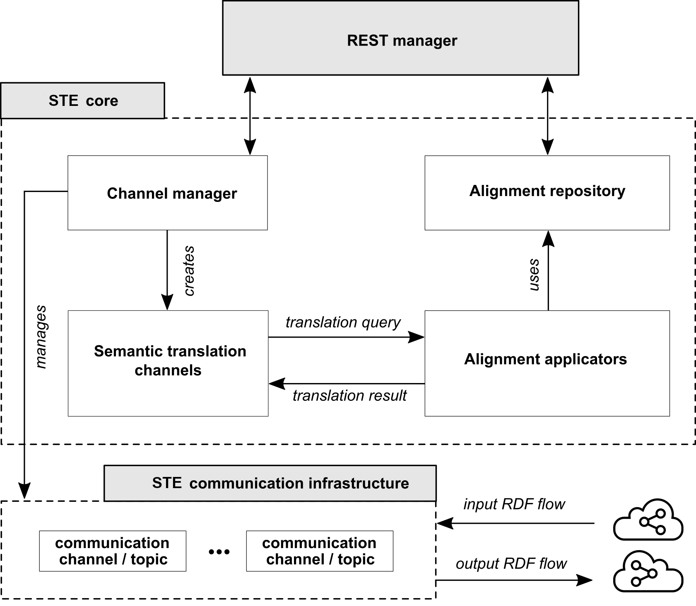
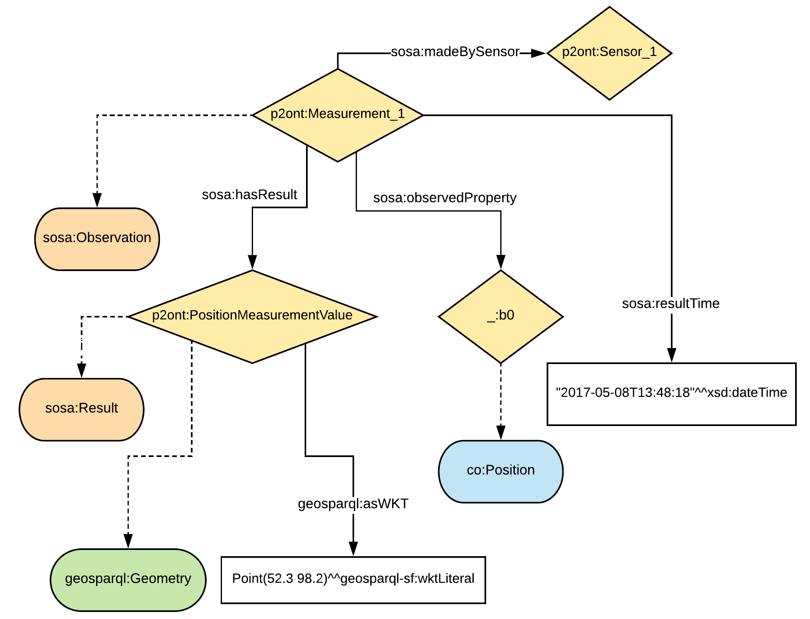

.. _Semantic Translation enabler:

############################
Semantic Translation enabler
############################

.. contents::
  :local:
  :depth: 1

Documentation for the Semantic Translation Enabler of ASSIST-IoT.

Introduction
============

Semantic interoperability is the ability of different applications and
business partners to exchange data with unambiguous, shared meaning. As
a result, data analysis and knowledge discovery can be done on a
federation of systems.

**Semantic Translation Enabler (STE)** enables alignments-based semantic
translation of RDF data (messages). At its core STE builds on a
considerably enhanced version of the Inter Platform Semantic Mediator
(IPSM) component, developed by the INTER-IoT project.

The translation performed by STE is based on alignments and uses a
deployment-specific modularized `central
ontology <IPSM/Central-ontology>`__. For IoT domain, the core modules
describing, e.g. devices, observations are (usually) based on `GOIoTP
(Generic Ontology of IoT
Platforms) <https://inter-iot.github.io/ontology>`__ that is a meta-data
reference data model. Additionally, any domain specific module can be
included e.g. medical ontology, logistic ontology. However, central
ontology can be any ontology that can serve as a central data model. It
is not directly used configure STE but should be considered when
defining alignments that are used for STE configuration. Additionally,
any domain specific module can be included e.g. medical ontology,
logistic ontology.

The alignment is a set of correspondences between simple entities or
complex structure from source and target ontologies. It contains rules
for transformation between input and output RDF graphs. Specifically,
STE translates RDF graph named *payload* (that is part of the message
send to STE). Alignments are parts of STE instance configuration, and
are used directly to execute translation. Semantic translation always
constitutes application of two alignments - one from source ontology to
central ontology, the other from central ontology to target ontology.

The following figure shows a sample situation with four IoT artifacts
(P1-4). Each with it’s own ontology (O1-4). The central ontology
contains modules g1…gn. The two-way communication requires preparation
of two alignments: (i) from artifact’s ontology to central ontology
e.g. A1G, (ii) from central ontology to artifact’s ontology e.g. AG1.
Each alignments contains correspondences between ontology modules that
are required for this part of communication. |Overview of translation
with central modularized ontology|

*Overview of translation with central modularized ontology*

To achieve semantic interoperability between two artifacts:

1. Instantiate modular central ontology
2. Select/define artifact’s ontologies: create from scratch or use one
   of existing tools
3. Align semantics between ontology of each artifact and central
   ontology (set of alignments)
4. Implement syntactic translators
5. Configure STE - upload alignments, create translation channels

The following figure shows a process of sending a message from source to
target artifact that needs to be semantically and syntactically
translated. |Process overview|\ *Process overview*

The message originates at source artifact in it’s format and semantics
e.g. XML message with respect to XML Schema. To use STE the message
needs to be transformed to RDF with source artifact’s semantics. This
translation is called `syntactic
translation <https://docs.google.com/document/d/1dXeOnX8_lQXBBMb17cbcevSf02mQX93apop6o6J3L94/edit>`__.
In fact, when STE is to be used in a standalone mode (without other
INTER-IoT layers), syntactic translation can be implemented in any
arbitrary component that will “prepare” input for semantic translation.
Note that, conversion to RDF may not be necessary, when artifacts
already have communication based on RDF. When a source artifact does not
support semantics, an RDF represantation of data exchanged with the
ecosystem needs to be proposed.

When the message arrives at STE, the RDF named graph *payload* is
translated with respect to configuration of the semantic translation
channel (see `Architecture <IPSM/Architecture>`__). Usually two
alignments are applied, however STE can be configured with special
predefined IDENTITY alignment that does not change the graph. Another
remark here, is that STE follows the rule: translate only what can be
translated, leave the rest as it was. The resultant message is expressed
in RDF with semantics corresponding to target semantic of last applied
alignment.

This message can be feed into another syntactic translator that will
transform it’s format to e.g. JSON cosidering target artifact’s
semantics. Another possible scenario is that there are applications
consuming data in RDF and central semantics. In such case, second
syntactic translation is not necessary.

.. |Process overview| image:: semantic_translation_enabler/uploads/process.png

IPSM Architecture
=================

STE is a component for performing semantic translation that can be use
in a standalone mode or in combination with other ASSIST-IoT enablers
and application-specific tools. It has a REST interface for
configuration, and both publish-subscribe and REST interfaces for
translation. The used communication infrastructure that follows
publish-subscribe paradigm is Apache Kafka.

Configuration includes:

1. Uploading alignment files that define the translation rules
2. Defining semantic translation channels - each channel is defined with
   input and output topic names, identifiers (name and version) of input
   and output alignments

Additionally, the following operations are possible:

1. List all uploaded alignments
2. Delete alignment identified by name and version
3. Retrieve alignment identified by name and version
4. List created translation channels
5. Delete channel identified by id

Performing semantic translation means sending input RDF message, and
receiving output RDF message. Client can publish message to input topic
of semantic translation channel, and consume message from output topic
of semantic translation channel.

Another possibility is to use REST API for performing a synchronous
semantic translation. Here, client in a request sends input RDF graph,
and a sequence of alignments that should be applied. The response
contains translated RDF graph.

|Architecture| *Architecture overview*

**Alignments and central ontology**

STE can perform translation between any pair of RDF graphs. The
translation can be direct or composed from multiple alignments depending
on the context. In a typical IoT platforms integration case, we use
Central Ontology (CO) so that the translation has two steps: translate
from source semantics to CO and translate from CO to target ontology. As
a result, integration of a new platform into the ecosystem means
preparing alignments to and/or from CO (depends on requirement for one-
or bi-directional communication requirement).

Direct translation means that only one alignment is applied that defines
mappings between source and target semantics. To configure STE to act in
this way a translation channel should be defined that has as input
alignment defined alignment and as output IDENTITY alignment (not
changing the RDF graph). Direct translation with REST API means
specifying a sequence of alignments to be applied consisting of only one
alignment.

Composed translation means applying more than one alignment. In pub-sub
approach, by default two alignments are used. In REST-based translation
an arbitrary alignments sequence can be specified.

Note that in each case, the translation process should be handled by one
semantic translation channel. By default, a translation channel is
configured with two alignments that are applied sequentially.

IPSM Central ontology
=====================

Central ontology is not directly used by STE, but it needs to be
established for a given STE deployment, to enable construction of
consistent alignments. It is modularized, so that alignments can be
created to and from selected modules, e.g. meteorological, logistic
events, depending on the context of “conversation”. Specifically, there
is no need to align the whole data models if an artifact that needs to
be connected to the ecosystem exchanges only message related only to one
aspect e.g. meteorological observation data.

In case of IoT-centric applications the central ontology can be based on
`GOIoTP (Generic Ontology of IoT
Platforms) <https://inter-iot.github.io/ontology>`__ and domain specific
modules.

|GOIoTP and GOIoTPex modules| *GOIoTP and GOIoTPex modules*

In general case, central ontology can be any aribitrary ontology, since
this does not influence the semantic translation engine provided by
IPSM. However, semantic engineer preparing the deployment should keep in
mind that:

-  central ontology should cover all “topics” of conversations in
   platforms ecosystem
-  it should be clear enough to enable querying and reasoning done
   directly on it
-  it should contain subject-specific modules that can be independently
   maintained and versioned (for easier change management)

.. |GOIoTP and GOIoTPex modules| image:: semantic_translation_enabler/uploads/giotp.png

User guide Alignment based semantic translation
===============================================

The process of semantic translation is performed by STE based on the
configuration of translation channel (using Apache Kafka
publish-subscribe mode) or sequence of alignments received in REST
request (using REST API). The ``steps`` element in an alignment will
defines in what order ``cells`` are applied. Each cell is applied to the
RDF graph being an output of previous cell. The application of a cell
means that SPARQL UPDATE is generated from graph patterns in ``entity1``
and ``entity2``.

Lets know analyze step by step an example of transformation of one
predefined RDF graph into another.

Let input RDF be:

::

   {
    "@id": "p1ont:PositionMeasurementValue",
    "@type": "geo:Point",
    "geo:lat": {
      "@type" : "http://www.w3.org/2001/XMLSchema#float",
      "@value" : "52.3"
    },
    "geo:long": {
      "@type" : "http://www.w3.org/2001/XMLSchema#float",
      "@value" : "98.2"
    }
   },
   {
    "@id": "p2ont:Sensor_1",
    "@type": "saref:Sensor",
    "saref:IsUsedFor": {
      "@id": "p2ont:position"
    },
    "saref:hasFunction": {
      "@id": "p2ont:sensingFunction"
    },
    "saref:makesMeasurement": {
      "@id": "p2ont:Measurement_1"
    }
   },
   {
    "@id": "p2ont:Measurement_1",
    "@type": "saref:Measurement",
    "saref:hasTimestamp": {
      "@id": "p2ont:Time_1"
    },
    "saref:hasValue": {
      "@id": "p2ont:PositionMeasurementValue"
    },
    "saref:relatesToProperty": {
      "@id": "p2ont:positionProperty"
    }
   },
   {
    "@id": "p2ont:Time_1",
    "@type": "time:Instant",
    "time:inXSDDateTime": {
      "@type" : "http://www.w3.org/2001/XMLSchema#dateTime",
      "@value" : "2017-05-08T13:48:18"
    }
   },
   {
    "@id": "p2ont:sensingFunction",
    "@type": "saref:SensingFunction"
   },
   {
    "@id": "p2ont:positionProperty",
    "@type": "saref-ps:PositionProperty"
   }

The corresponding diagram looks as follows:

   Input RDF

*RDF input*

The resultant RDF should be:

::

   {
      "@id" : "_:b0",
      "@type" : "InterIoT:central#Position"
    }, {
      "@id" : "p2ont:PositionMeasurementValue",
      "@type" : [ "sosa:Result", "http://www.opengis.net/ont/geosparql#Geometry" ],
      "http://www.opengis.net/ont/geosparql#asWKT" : {
        "@type" : "http://www.opengis.net/def/sf/wktLiteral",
        "@value" : "Point(52.3 98.2)"
      }
    }, {
      "@id" : "p2ont:Measurement_1",
      "@type" : "sosa:Observation",
      "sosa:hasResult" : {
        "@id" : "p2ont:PositionMeasurementValue"
      },
      "sosa:madeBySensor" : {
        "@id" : "p2ont:Sensor_1"
      },
      "sosa:observedProperty" : {
        "@id" : "_:b0"
      },
      "sosa:resultTime" : {
        "@type" : "xsd:dateTime",
        "@value" : "2017-05-08T13:48:18"
      }
    }
   ],
    "@id" : "InterIoTMsg:payload"
   }

The corresponding resultant graph is:

   Input RDF

*RDF output*

Please note, that not all part of RDF graph are translated. Some parts
will be left untouched as in input graph. The aforementioned code
snippet and image present only part of the RDF graph that is a result of
the translation.

Let us know analyze step by step an alignment that will allow to
translate part of the input RDF graph into aforementioned output RDF
graph.

::

   <Alignment
          xmlns:rdf="http://www.w3.org/1999/02/22-rdf-syntax-ns#"
          xmlns:wgs84_pos="http://www.w3.org/2003/01/geo/wgs84_pos#"
          xmlns:sripas="http://www.inter-iot.eu/sripas#"
          xmlns="http://www.inter-iot.eu/sripas#"
          xmlns:sosa="http://www.w3.org/ns/sosa/"
          xmlns:geosparql="http://www.opengis.net/ont/geosparql#"
          xmlns:saref="https://w3id.org/saref#"
          xmlns:saref-ps="http://ontology.tno.nl/saref/positionsensor#"
          xmlns:time="http://www.w3.org/2006/time#"
          xmlns:co="http://inter-iot.eu/central"
          xmlns:xsd="http://www.w3.org/2001/XMLSchema#"
          xmlns:geo-sf="http://www.opengis.net/def/sf/"
          name="alignDemo_P2_CO" version="1.0" creator="P2_admin">
      <onto1>
          <Ontology about="http://platform2.eu/sensors#">
              <formalism>
                  <Formalism name="OWL2.0" uri="http://www.w3.org/2002/07/owl#"/>
              </formalism>
          </Ontology>
      </onto1>
      <onto2>
          <Ontology about="http://www.inter-iot.eu/central">
              <formalism>
                  <Formalism name="OWL2.0" uri="http://www.w3.org/2002/07/owl#"/>
              </formalism>
          </Ontology>
      </onto2>
      <steps>
          <step order="1" cell="cell1"/>
          <step order="2" cell="cell2"/>
          <step order="3" cell="cell3"/>
      </steps>
      <map>
          <Cell id="cell1">
              <entity1>
                  <sripas:node_CTZ>
                      <saref:makesMeasurement>
                          <sripas:node_CTC>
                              <rdf:type rdf:resource="&saref;Measurement"/>
                              <saref:hasValue>
                                  <sripas:node_CTA/>
                              </saref:hasValue>
                              <saref:hasTimestamp>
                                  <sripas:node_CTB>
                                      <time:inXSDDateTime>
                                          <sripas:node_x/>
                                      </time:inXSDDateTime>
                                  </sripas:node_CTB>
                              </saref:hasTimestamp>
                          </sripas:node_CTC>
                      </saref:makesMeasurement>
                  </sripas:node_CTZ>
              </entity1>
              <entity2>
                  <sripas:node_CTC>
                      <rdf:type rdf:resource="&sosa;Observation"/>
                      <sosa:observedProperty>
                          <rdf:Description>
                              <rdf:type rdf:resource="&co;Position"/>
                          </rdf:Description>
                      </sosa:observedProperty>
                      <sosa:madeBySensor>
                          <sripas:node_CTZ/>
                      </sosa:madeBySensor>
                      <sosa:hasResult>
                          <sripas:node_CTA/>
                      </sosa:hasResult>
                      <sosa:resultTime>
                          <sripas:node_x/>
                      </sosa:resultTime>
                  </sripas:node_CTC>
              </entity2>
              <relation>=</relation>
              <typings>
                  <typing about="&sripas;node_x" datatype="&xsd;dateTime"/>
              </typings>
          </Cell>
          <Cell id="cell2">
              <entity1>
                  <sripas:node_CTX>
                      <rdf:type rdf:resource="&wgs84_pos;Point"/>
                      <wgs84_pos:lat>
                          <sripas:node_x/>
                      </wgs84_pos:lat>
                      <wgs84_pos:long>
                          <sripas:node_y/>
                      </wgs84_pos:long>
                  </sripas:node_CTX>
              </entity1>
              <entity2>
                  <sripas:node_CTX>
                      <rdf:type rdf:resource="&geosparql;Geometry"/>
                      <rdf:type rdf:resource="&sosa;Result"/>
                      <geosparql:asWKT>
                          <sripas:node_z/>
                      </geosparql:asWKT>
                  </sripas:node_CTX>
              </entity2>
              <relation>=</relation>
              <sripas:transformation>
                  <function about="str">
                      <param order="1" about="&sripas;node_x"/>
                      <return about="&sripas;node_sx"/>
                  </function>
                  <function about="str">
                      <param order="1" about="&sripas;node_y"/>
                      <return about="&sripas;node_sy"/>
                  </function>
                  <function about="concat">
                      <param order="1" val="Point("/>
                      <param order="2" about="&sripas;node_sx"/>
                      <param order="3" val=" "/>
                      <param order="4" about="&sripas;node_sy"/>
                      <param order="5" val=")"/>
                      <return about="&sripas;node_z"/>
                  </function>
              </sripas:transformation>
              <filters>
                  <filter about="&sripas;node_x" datatype="http://www.w3.org/2001/XMLSchema#float"/>
                  <filter about="&sripas;node_y" datatype="http://www.w3.org/2001/XMLSchema#float"/>
                  <filter about="&sripas;node_sx" datatype="http://www.w3.org/2001/XMLSchema#string"/>
                  <filter about="&sripas;node_sy" datatype="http://www.w3.org/2001/XMLSchema#string"/>
              </filters>
              <typings>
                  <typing about="&sripas;node_z" datatype="&geo-sf;wktLiteral"/>
              </typings>
          </Cell>
      </map>
   </Alignment>

The translation includes two steps as indicated in:

::

   <steps>
          <step order="1" cell="cell1"/>
          <step order="2" cell="cell2"/>
   </steps>

The first step is defined as:

::

    <Cell id="cell1">
              <entity1>
                  <sripas:node_CTZ>
                      <saref:makesMeasurement>
                          <sripas:node_CTC>
                              <rdf:type rdf:resource="&saref;Measurement"/>
                              <saref:hasValue>
                                  <sripas:node_CTA/>
                              </saref:hasValue>
                              <saref:hasTimestamp>
                                  <sripas:node_CTB>
                                      <time:inXSDDateTime>
                                          <sripas:node_x/>
                                      </time:inXSDDateTime>
                                  </sripas:node_CTB>
                              </saref:hasTimestamp>
                          </sripas:node_CTC>
                      </saref:makesMeasurement>
                  </sripas:node_CTZ>
              </entity1>
              <entity2>
                  <sripas:node_CTC>
                      <rdf:type rdf:resource="&sosa;Observation"/>
                      <sosa:observedProperty>
                          <rdf:Description>
                              <rdf:type rdf:resource="&co;Position"/>
                          </rdf:Description>
                      </sosa:observedProperty>
                      <sosa:madeBySensor>
                          <sripas:node_CTZ/>
                      </sosa:madeBySensor>
                      <sosa:hasResult>
                          <sripas:node_CTA/>
                      </sosa:hasResult>
                      <sosa:resultTime>
                          <sripas:node_x/>
                      </sosa:resultTime>
                  </sripas:node_CTC>
              </entity2>
              <relation>=</relation>
              <typings>
                  <typing about="&sripas;node_x" datatype="&xsd;dateTime"/>
              </typings>
          </Cell>

Here, a an input structure of RDF with device that makes a measurement
is specified according to SAREF ontology. Measurement has indicated
properties for value and time. This structure is translated to
observation made by sensor in SSN/SOSA ontology. In this case
observation is also characterized by result value and result time. Note,
that instance representing result is reused (the same URI) but it’s type
is translated. The entity stored in variable ``node_CTZ`` representing
SAREF device is placed in a different position in output graph - it’s
value of sosa:madeBySensor property.

In this step we also add information about observed property that is
related to SOSA observation with ``sosa:observedProperty``. Here, we
generate a blank node of type ``&co;Position``. This is class is assumed
to be a subclass of ``ssn:ObservableProperty`` in SSN/SOSA ontology, but
is specialized as property related to geospatial position. Note that the
first step defines a *large* transformation, however the same result can
be achived by applying several more simple consecutive steps. If the
input RDF graph is *stable* when it comes to structure then large part
of it can be translated in one step.

The SPARQL update for the above cell is:

::

   DELETE {
     ?node_CTZ <https://w3id.org/saref#makesMeasurement> ?node_CTC.
     ?node_CTB <http://www.w3.org/2006/time#inXSDDateTime> ?node_x.
     ?node_CTC <https://w3id.org/saref#hasTimestamp> ?node_CTB.
     ?node_CTC <http://www.w3.org/1999/02/22-rdf-syntax-ns#type> <https://w3id.org/saref#Measurement>.
     ?node_CTC <https://w3id.org/saref#hasValue> ?node_CTA.
   } INSERT {
     _:b0 <http://www.w3.org/1999/02/22-rdf-syntax-ns#type> <http://inter-iot.eu/central#Position>.
     ?node_CTC <http://www.w3.org/ns/sosa/resultTime> ?node_x_typed.
     ?node_CTC <http://www.w3.org/1999/02/22-rdf-syntax-ns#type> <http://www.w3.org/ns/sosa/Observation>.
     ?node_CTC <http://www.w3.org/ns/sosa/observedProperty> _:b0.
     ?node_CTC <http://www.w3.org/ns/sosa/madeBySensor> ?node_CTZ.
     ?node_CTC <http://www.w3.org/ns/sosa/hasResult> ?node_CTA.
   } WHERE {
     ?node_CTZ <https://w3id.org/saref#makesMeasurement> ?node_CTC.
     ?node_CTB <http://www.w3.org/2006/time#inXSDDateTime> ?node_x.
     ?node_CTC <https://w3id.org/saref#hasTimestamp> ?node_CTB.
     ?node_CTC <http://www.w3.org/1999/02/22-rdf-syntax-ns#type> <https://w3id.org/saref#Measurement>.
     ?node_CTC <https://w3id.org/saref#hasValue> ?node_CTA.
     BIND(STRDT(STR(?node_x), <http://www.w3.org/2001/XMLSchema#dateTime>) AS ?node_x_typed)
   }

The RDF graph after applying this cell is:

   RDF after applying *cell1*

*RDF after cell1*

Input and output RDF
====================

Deployment Installation
=======================

The installation procedure documentation for the Semantic Translation
Enabler is under development.

Developers guide REST API Overview
==================================

Semantic Translation Enabler API

Version information
~~~~~~~~~~~~~~~~~~~

*Version* : 1.0.0

URI scheme
~~~~~~~~~~

*BasePath* : / *Schemes* : HTTP

Tags
~~~~

-  Alignments
-  Channels
-  Logging
-  Translation

Consumes
~~~~~~~~

-  ``application/json``

Produces
~~~~~~~~

-  ``application/json``

Developers guide REST API Definitions
=====================================

### Alignment

============================ ===================== ============================
Name                         Description           Schema
============================ ===================== ============================
**creator** \ *optional*     Alignment creator     string
**description** \ *optional* Alignment description string
**map** \ *required*         map                   `map <#alignment-map>`__
**name** \ *required*        Alignment name        string
**onto1** \ *required*       onto1                 `onto1 <#alignment-onto1>`__
**onto2** \ *required*       onto2                 `onto2 <#alignment-onto2>`__
**steps** \ *required*       Steps                 `steps <#alignment-steps>`__
**version** \ *required*     Alignment version     string
============================ ===================== ============================

**map**

===================== =========== ==========================
Name                  Description Schema
===================== =========== ==========================
**Cell** \ *optional* Cell        `Cell <#alignment-cell>`__
===================== =========== ==========================

**Cell**

========================= ================================== ======
Name                      Description                        Schema
========================= ================================== ======
**entity1** \ *required*  The first aligned ontology entity  object
**entity2** \ *required*  The second aligned ontology entity object
**relation** \ *required* Relation                           string
========================= ================================== ======

**onto1**

========================= ========================================= ==================================
Name                      Description                               Schema
========================= ========================================= ==================================
**Ontology** \ *required* Contains the URI identifying the ontology `Ontology <#alignment-ontology>`__
========================= ========================================= ==================================

**Ontology**

====================== ============================ ======
Name                   Description                  Schema
====================== ============================ ======
**about** \ *optional* URI identifying the ontology string
====================== ============================ ======

**onto2**

========================= ========================================= ==================================
Name                      Description                               Schema
========================= ========================================= ==================================
**Ontology** \ *optional* Contains the URI identifying the ontology `Ontology <#alignment-ontology>`__
========================= ========================================= ==================================

**Ontology**

====================== ============================ ======
Name                   Description                  Schema
====================== ============================ ======
**about** \ *optional* URI identifying the ontology string
====================== ============================ ======

**steps**

===================== ============== ==========================
Name                  Description    Schema
===================== ============== ==========================
**step** \ *optional* Alignment step `step <#alignment-step>`__
===================== ============== ==========================

**step**

====================== ========================= =======
Name                   Description               Schema
====================== ========================= =======
**cell** \ *optional*  Alignment cell ID         string
**order** \ *optional* Order of cell application integer
====================== ========================= =======

### AlignmentID

======================== ================= ======
Name                     Description       Schema
======================== ================= ======
**name** \ *required*    Alignment name    string
**version** \ *required* Alignment version string
======================== ================= ======

### AlignmentInfo

+-----------------------+-----------------------+-----------------------+
| Name                  | Description           | Schema                |
+=======================+=======================+=======================+
| **creator**           | Alignment creator     | string                |
| \ *required*          |                       |                       |
+-----------------------+-----------------------+-----------------------+
| **date** \ *required* | UNIX timestamp of     | integer               |
|                       | upload to STE         |                       |
+-----------------------+-----------------------+-----------------------+
| **descId**            | Business identifier   | string                |
| \ *required*          |                       |                       |
+-----------------------+-----------------------+-----------------------+
| **description**       | Alignment description | string                |
| \ *required*          |                       |                       |
+-----------------------+-----------------------+-----------------------+
| **id** \ *required*   | Technical identifier  | integer               |
+-----------------------+-----------------------+-----------------------+
| **name** \ *required* | Name of the alignment | string                |
+-----------------------+-----------------------+-----------------------+
| **sourceOntologyURI** | URI of the source     | string                |
| \ *required*          | ontology for          |                       |
|                       | alignment             |                       |
+-----------------------+-----------------------+-----------------------+
| **targetOntologyURI** | URI of the target     | string                |
| \ *required*          | ontology for          |                       |
|                       | alignment             |                       |
+-----------------------+-----------------------+-----------------------+
| **version**           | Alignment version     | string                |
| \ *required*          |                       |                       |
+-----------------------+-----------------------+-----------------------+

### ChannelConfig

+-----------------------+-----------------------+-----------------------+
| Name                  | Description           | Schema                |
+=======================+=======================+=======================+
| **inpAlignmentName**  | Name of the input     | string                |
| \ *required*          | alignment, used for   |                       |
|                       | translating the       |                       |
|                       | incoming RDF data     |                       |
+-----------------------+-----------------------+-----------------------+
| **inpAlignmentVers    | Version of the input  | string                |
| ion**                 | alignment, used for   |                       |
| \ *required*          | translating the       |                       |
|                       | incoming RDF data     |                       |
+-----------------------+-----------------------+-----------------------+
| **outAlignmentName**  | Name of the output    | string                |
| \ *required*          | alignment, used for   |                       |
|                       | translating the       |                       |
|                       | outgoing RDF data     |                       |
+-----------------------+-----------------------+-----------------------+
| **outAlignmentVers    | Version of the output | string                |
| ion**                 | alignment, used for   |                       |
| \ *required*          | translating the       |                       |
|                       | outgoing RDF data     |                       |
+-----------------------+-----------------------+-----------------------+
| **parallelism**       | Internal parallelism  | integer               |
| \ *optional*          | of the channel, e.g., |                       |
|                       | the value 5 means     |                       |
|                       | that the channel can  |                       |
|                       | consume 5 messages in |                       |
|                       | parallel (preserving  |                       |
|                       | their time order)     |                       |
+-----------------------+-----------------------+-----------------------+
| **sink** \ *required* | Identifier of the     | string                |
|                       | sink of the channel,  |                       |
|                       | i.e., Apache Kafka    |                       |
|                       | topic to which STE    |                       |
|                       | publishes translated  |                       |
|                       | RDF data              |                       |
+-----------------------+-----------------------+-----------------------+
| **source**            | Identifier            | string                |
| \ *required*          | representing the      |                       |
|                       | source of the         |                       |
|                       | channel, i.e. Apache  |                       |
|                       | Kafka topicfrom which |                       |
|                       | STE reads the RDF     |                       |
|                       | data to be translated |                       |
+-----------------------+-----------------------+-----------------------+

### ChannelInfo

+-----------------------+-----------------------+-----------------------+
| Name                  | Description           | Schema                |
+=======================+=======================+=======================+
| **descId**            | Business identifier   | string                |
| \ *required*          | of the channel        |                       |
+-----------------------+-----------------------+-----------------------+
| **id** \ *required*   | Identifier of the     | integer               |
|                       | channel               |                       |
+-----------------------+-----------------------+-----------------------+
| **inpAlignmentName**  | Name of the input     | string                |
| \ *required*          | alignment, used for   |                       |
|                       | translating the       |                       |
|                       | incoming RDF data     |                       |
+-----------------------+-----------------------+-----------------------+
| **inpAlignmentVers    | Version of the input  | string                |
| ion**                 | alignment, used for   |                       |
| \ *required*          | translating the       |                       |
|                       | incoming RDF data     |                       |
+-----------------------+-----------------------+-----------------------+
| **outAlignmentName**  | Name of the output    | string                |
| \ *required*          | alignment, used for   |                       |
|                       | translating the       |                       |
|                       | outgoing RDF data     |                       |
+-----------------------+-----------------------+-----------------------+
| **outAlignmentVers    | Version of the output | string                |
| ion**                 | alignment, used for   |                       |
| \ *required*          | translating the       |                       |
|                       | outgoing RDF data     |                       |
+-----------------------+-----------------------+-----------------------+
| **sink** \            | Identifier of the     | string                |
|   *required*          | sink of the channel,  |                       |
|                       | i.e. Apache Kafka     |                       |
|                       | topic to which STE    |                       |
|                       | publishes translated  |                       |
|                       | RDF data              |                       |
+-----------------------+-----------------------+-----------------------+
| **source**            | Identifier            | string                |
| \ *required*          | representing the      |                       |
|                       | source of the         |                       |
|                       | channel, i.e. Apache  |                       |
|                       | Kafka topic from      |                       |
|                       | which STE reads the   |                       |
|                       | RDF data to be        |                       |
|                       | translated            |                       |
+-----------------------+-----------------------+-----------------------+

### Error

======================== ======
Name                     Schema
======================== ======
**message** \ *required* string
======================== ======

### LoggingResponse

======================== ================================================
Name                     Schema
======================== ================================================
**level** \ *required*   enum (ALL, TRACE, DEBUG, INFO, WARN, ERROR, OFF)
**message** \ *required* string
======================== ================================================

### Response

======================== ==================== ======
Name                     Description          Schema
======================== ==================== ======
**message** \ *required* Descriptive response string
======================== ==================== ======

### TranslationErrorResponse

========================= ========================================= ======
Name                      Description                               Schema
========================= ========================================= ======
**graphStr** \ *required* Empty string \ **Maximal length** : ``0`` string
**message** \ *required*  Info on the failure of the translation    string
========================= ========================================= ======

### TranslationRequest

+-----------------------+-----------------------+-----------------------+
| Name                  | Description           | Schema                |
+=======================+=======================+=======================+
| **alignIDs**          | Sequence of alignment | <                     |
| \ *required*          | IDs to ba applied     | `AlignmentID <definit |
|                       |                       | ions.md#alignmentid>` |
|                       |                       | __                    |
|                       |                       | > array               |
+-----------------------+-----------------------+-----------------------+
| **graphStr**          | JSON-LD message as a  | string                |
| \ *required*          | string                |                       |
+-----------------------+-----------------------+-----------------------+

### TranslationResponse

========================= ====================================== ======
Name                      Description                            Schema
========================= ====================================== ======
**graphStr** \ *required* Translated JSON-LD message as a string string
**message** \ *required*  Info on the success of the translation string
========================= ====================================== ======

### VersionResponse

======================== ======================= ======
Name                     Description             Schema
======================== ======================= ======
**name** \ *required*    Named of STE instance   string
**version** \ *required* Version of STE instance string
======================== ======================= ======

Developers guide REST API Paths
===============================

### Alignments

#### Upload new alignment

::

   POST /alignments

Parameters
~~~~~~~~~~

======== ===================== ======================= ========================================
Type     Name                  Description             Schema
======== ===================== ======================= ========================================
**Body** **conf** \ *required* Alignment configuration `Alignment <definitions.md#alignment>`__
======== ===================== ======================= ========================================

Responses
~~~~~~~~~~

========= ========================================================== ======================================
HTTP Code Description                                                Schema
========= ========================================================== ======================================
**201**   Alignment uploaded successfully                            `Response <definitions.md#response>`__
**208**   Alignment already uploaded                                 `Response <definitions.md#response>`__
**400**   Wrong arguments                                            `Error <definitions.md#error>`__
**409**   Alignment with the same ID but different definition exists `Error <definitions.md#error>`__
========= ========================================================== ======================================

Consumes
~~~~~~~~~~

-  ``application/xml``

Produces
~~~~~~~~~~

-  ``application/json``

#### List alignments

::

   GET /alignments

Description
~~~~~~~~~~~

Lists alignments uploaded to the STE.

.. _responses-1:

Responses
~~~~~~~~~~

========= ========================= ==========================================================
HTTP Code Description               Schema
========= ========================= ==========================================================
**200**   Available alignments info < `AlignmentInfo <definitions.md#alignmentinfo>`__ > array
========= ========================= ==========================================================

#### Get an alignment identified by name+version

::

   GET /alignments/{name}/{version}

.. _parameters-1:

Parameters
~~~~~~~~~~

======== ======================== ======================================== ======
Type     Name                     Description                              Schema
======== ======================== ======================================== ======
**Path** **name** \ *required*    Name of the alignment to be retrieved    string
**Path** **version** \ *required* Version of the alignment to be retrieved string
======== ======================== ======================================== ======

.. _responses-2:

Responses
~~~~~~~~~~

========= ============================== ================================
HTTP Code Description                    Schema
========= ============================== ================================
**200**   Alignment successfuly returned No Content
**400**   Alignment not found            `Error <definitions.md#error>`__
**500**   Alignment retrieval failed     `Error <definitions.md#error>`__
========= ============================== ================================

.. _consumes-1:

Consumes
~~~~~~~~~~

-  ``application/json``

.. _produces-1:

Produces
~~~~~~~~~~

-  ``application/xml``

#### Delete alignment identified by name+version

::

   DELETE /alignments/{name}/{version}

.. _parameters-2:

Parameters
~~~~~~~~~~

======== ======================== ================================== =======
Type     Name                     Description                        Schema
======== ======================== ================================== =======
**Path** **name** \ *required*    Name of the alignment to delete    string
**Path** **version** \ *required* Version of the alignment to delete string
======== ======================== ================================== =======

.. _responses-3:

Responses
~~~~~~~~~~

========= ========================= ================================
HTTP Code Description               Schema
========= ========================= ================================
**204**   Alignment deleted         No Content
**400**   Alignment not found       `Error <definitions.md#error>`__
**500**   Alignment deletion failed `Error <definitions.md#error>`__
========= ========================= ================================

#### Convert XML alignment into RDF/XML format

::

   POST /convert

.. _parameters-3:

Parameters
~~~~~~~~~~

======== ===================== ================ ======
Type     Name                  Description      Schema
======== ===================== ================ ======
**Body** **conf** \ *required* Alignment source string
======== ===================== ================ ======

.. _responses-4:

Responses
~~~~~~~~~~

========= ================================ ================================
HTTP Code Description                      Schema
========= ================================ ================================
**201**   Alignment converted successfully string
**500**   Alignment conversion failed      `Error <definitions.md#error>`__
========= ================================ ================================

.. _consumes-2:

Consumes
~~~~~~~~~~

-  ``application/xml``

.. _produces-2:

Produces
~~~~~~~~~~

-  ``application/xml``

#### Convert alignment cells to Turtle format

::

   POST /convert/TTL

.. _parameters-4:

Parameters
~~~~~~~~~~

======== ===================== ================ ======
Type     Name                  Description      Schema
======== ===================== ================ ======
**Body** **conf** \ *required* Alignment source string
======== ===================== ================ ======

.. _responses-5:

Responses
~~~~~~~~~~

========= ====================================== ================================
HTTP Code Description                            Schema
========= ====================================== ================================
**201**   Alignment cells converted successfully string
**500**   Alignment cells conversion failed      `Error <definitions.md#error>`__
========= ====================================== ================================

.. _consumes-3:

Consumes
~~~~~~~~~~

-  ``application/xml``

.. _produces-3:

Produces
~~~~~~~~~~

-  ``application/xml``

### Channels

#### Create new channel

::

   POST /channels

.. _parameters-5:

Parameters
~~~~~~~~~~

======== ===================== ===================== ================================================
Type     Name                  Description           Schema
======== ===================== ===================== ================================================
**Body** **conf** \ *required* Channel configuration `ChannelConfig <definitions.md#channelconfig>`__
======== ===================== ===================== ================================================

.. _responses-6:

Responses
~~~~~~~~~~

========= ========================================= ======================================
HTTP Code Description                               Schema
========= ========================================= ======================================
**201**   Channel created successfully              `Response <definitions.md#response>`__
**400**   Channel already exists or wrong arguments `Error <definitions.md#error>`__
========= ========================================= ======================================

.. _consumes-4:

Consumes
~~~~~~~~~~

-  ``application/json``

.. _produces-4:

Produces
~~~~~~~~~~

-  ``application/json``

#### List active STE channels

::

   GET /channels

.. _description-1:

Description
~~~~~~~~~~~

The endpoint returns the list of all STE channels which are currently
active.

.. _responses-7:

Responses
~~~~~~~~~~

========= ==================================== ======================================================
HTTP Code Description                          Schema
========= ==================================== ======================================================
**200**   Array of channel information records < `ChannelInfo <definitions.md#channelinfo>`__ > array
========= ==================================== ======================================================
 
 #### Delete channel based on the ID

::

   DELETE /channels/{channelId}

.. _parameters-6:

Parameters
~~~~~~~~~~

======== ========================== ======================= =======
Type     Name                       Description             Schema
======== ========================== ======================= =======
**Path** **channelId** \ *required* ID of channel to delete integer
======== ========================== ======================= =======

.. _responses-8:

Responses
~~~~~~~~~~

========= ====================== ================================
HTTP Code Description            Schema
========= ====================== ================================
**204**   Channel deleted        No Content
**400**   Channel not found      `Error <definitions.md#error>`__
**500**   Closing channel failed `Error <definitions.md#error>`__
========= ====================== ================================

### Logging

#### Get the current STE logging level

::

   GET /logging

.. _responses-9:

Responses
~~~~~~~~~~

========= ========================================== ====================================================
HTTP Code Description                                Schema
========= ========================================== ====================================================
**200**   Current logging level successfuly returned `LoggingResponse <definitions.md#loggingresponse>`__
========= ========================================== ====================================================

.. _produces-5:

Produces
~~~~~~~~~~

-  ``application/json``

#### Set logging level

::

   POST /logging/{level}

.. _parameters-7:

Parameters
~~~~~~~~~~

+-----------------+-----------------+-----------------+-----------------+
| Type            | Name            | Description     | Schema          |
+=================+=================+=================+=================+
| **Path**        | **level**       | Logging level   | enum (all,      |
|                 | \ *required*    |                 | trace, debug,   |
|                 |                 |                 | info, warn,     |
|                 |                 |                 | error, off)     |
+-----------------+-----------------+-----------------+-----------------+

.. _responses-10:

Responses
~~~~~~~~~~

========= ============================== ====================================================
HTTP Code Description                    Schema
========= ============================== ====================================================
**200**   Logging level set successfully `LoggingResponse <definitions.md#loggingresponse>`__
========= ============================== ====================================================

.. _produces-6:

Produces
~~~~~~~~~~

-  ``application/json``

### Translation

#### Translate JSON-LD message via sequence of alignments

::

   POST /translation

.. _parameters-8:

Parameters
~~~~~~~~~~

======== ===================== ======================== ==========================================================
Type     Name                  Description              Schema
======== ===================== ======================== ==========================================================
**Body** **data** \ *required* Translation request data `TranslationRequest <definitions.md#translationrequest>`__
======== ===================== ======================== ==========================================================

.. _responses-11:

Responses
~~~~~~~~~~

========= ======================== ======================================================================
HTTP Code Description              Schema
========= ======================== ======================================================================
**200**   Translation successful   `TranslationResponse <definitions.md#translationresponse>`__
**400**   Error during translation `TranslationErrorResponse <definitions.md#translationerrorresponse>`__
========= ======================== ======================================================================

.. _produces-7:

Produces
~~~~~~~~~~

-  ``application/json``

### Version

#### Get this STE version info

::

   GET /version

.. _responses-12:

Responses
~~~~~~~~~~

========= ===================================== ====================================================
HTTP Code Description                           Schema
========= ===================================== ====================================================
**200**   STE version info successfuly returned `VersionResponse <definitions.md#versionresponse>`__
========= ===================================== ====================================================

.. _produces-8:

Produces
~~~~~~~~~~

-  ``application/json``

License
=======

The Inter Platform Semantic Mediator is licensed under the **Apache
License, Version 2.0** (the “License”).

You may obtain a copy of the License at:
http://www.apache.org/licenses/LICENSE-2.0

Notice dependencies
===================

Dependency list and licensing information will be provided before the
first major release of the STE.

