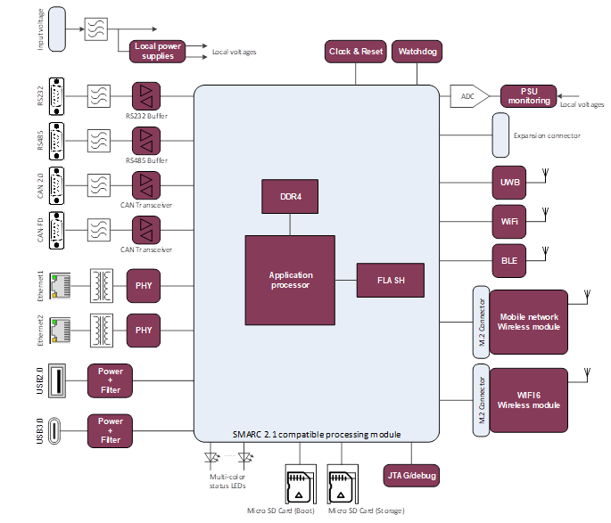
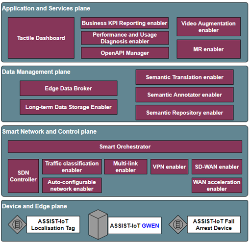

.. _GWEN:

####
GWEN
####

.. contents::
  :local:
  :depth: 1

************
Introduction
************
The GateWay/EdgeNode (GWEN) is a device used as interface between sensors & actuators on one side and a communication network on the other side. Sensors and actuators can be connected through wired and wireless interfaces. The interface with a network can also be wired or wireless.
Available wired interfaces are: Ethernet, RS232/485, CAN & CAN FD, USB2 and USB3
Available wireless interfaces are: WiFi, Bluetooth and 3G/4G/5G. In addition an UWB interfaces is available for localisation purposes.
The GWEN also contains compute power to be able to operate AI algorithms.
Docker is used as container runtime on top of Linux as OS.

********
Features
********
Available wired interfaces are: 
- Ethernet, 
- RS232/485, 
- CAN & CAN FD, 
- USB2 and 
- USB3.

Available wireless interfaces are: 
- WiFi, 
- Bluetooth and 3G/4G/5G.

SMARC2.1 interface for use of a System On Module (SOM) which implements the compute power.

Yocto based Linux is used as OS.

Here is also the block schemantic diagram of the GWEN device:

*********************
Place in architecture
*********************
The fall arrest device is part of the device and edge plane and more specifacially the place of the device in the ASSIST-IoT architecture can be viewed in the following picture:

**********
User guide
**********
In case of making use of the ASSIST-IoT’s GWEN as edge node, 12V± 15% power supply is required. An adapter from 230V is provided with it to generate the needed voltage. 

*************
Prerequisites
*************
The version control and release will be determined once the device is formally released. 

************
Installation
************
The GWEN needs to be mounted at a fixed point inside a buidling or car.

*********************
Configuration options
*********************
The version control and release will be determined once the device is formally released. 

***************
Developer guide
***************
The version control and release will be determined once the device is formally released. 

***************************
Version control and release
***************************
The version control and release will be determined once the device is formally released. 

*******
License
*******
The version control and release will be determined once the device is formally released. 

********************
Notice(dependencies)
********************
The version control and release will be determined once the device is formally released. 
