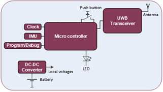

.. _fall_arrest:

##################
Fall Arrest Device
##################

.. contents::
  :local:
  :depth: 1

************
Introduction
************
The ASSIST-IoT fall arrest device is a localisation tag with an Inertial Measurement Unit (IMU) and a push button. The push button is used by the person wearing the tag, to indicate that this person is in an emergency situation and needs immediate help. The fall arrest device uses the IMU to determine if the person has fallen or not. If an emergency situation is detected, a message is transmitted to the anchors immediately. An enabler can pick up this message and act accordingly.

********
Features
********
The Fall arrest device supports the following features:

- It is a smart device that can provide localisation accuracy better than 50cm. 

- It has an internal IMU (Inertia Measurment Unit) and can be used to detect a fall.

Here is also the block schemantic diagram of the fall arrest device:

*********************
Place in architecture
*********************
The fall arrest device is part of the device and edge plane and more specifacially the place of the device in the ASSIST-IoT architecture can be viewed in the following picture:

.. image:: place_in_architecture.png

**********
User guide
**********
The battery of the fall arrest device has to be charged during non-working hours.
The monitored assets needs to have a tag attached (e.g., in case of a worker, he/she has to wear a belt or helmet with it).
Information about the correspondence between tag and asset must be noted, so they can be later on related. In case of a worker, information about whether it is connected to a belt or helmet should be noted as well.

*************
Prerequisites
*************
The fall arrest device determines its position relative to fixed anchors. This position is transmitted to the localization processing enabler. This enabler gathers the position of several fall arrest devices and needs to know which person is wearing which fall arrest device.

************
Installation
************
The fall arrest device has to be mounted to a belt or to a helmet.

*********************
Configuration options
*********************
Will be determined after the release of the enabler.

***************
Developer guide
***************
Will be determined after the release of the enabler.

***************************
Version control and release
***************************
The version control and release will be determined once the device is formally released.

*******
License
*******
Will be determined after the release of the enabler.

********************
Notice(dependencies)
********************
Will be determined after the release of the enabler.