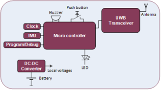

.. _localization_tag:

################
Localization Tag
################

.. contents::
  :local:
  :depth: 1

************
Introduction
************
The ASSIST-IoT localisation tag is a Smart IoT device used for indoor people localisation. This device has tag functionality, and it contains a buzzer and red LED. The buzzer is used to indicate to the person that he/she is in a restricted area. The button is used to alert the system when the worker detects an accident and immediate help is needed.

********
Features
********
The localization tag has a Push button and an IMU sensor (Inertia Measurement Unit). When a worker as part detects a dangerous situation, the button can be pushed to alert the system that a dangerous situation has been detected. The IMU is added for future use. The IMU can be used to detect if there is movement or not. 

Another feature provided by the Localization Tag is that the localisation accuracy is better than 50cm.

Here is also the block schemantic diagram of the device:

*********************
Place in architecture
*********************
The fall arrest device is part of the device and edge plane and more specifacially the place of the device in the ASSIST-IoT architecture can be viewed in the following picture:

.. image:: place_in_architecture.png

**********
User guide
**********
The battery of the tag has to be charged during non-working hours.
The monitored assets needs to have a tag attached (e.g., in case of a worker, he/she has to wear a belt or helmet with it).
Information about the correspondence between tag and asset must be noted, so they can be later on related. In case of a worker, information about whether it is connected to a belt or helmet should be noted as well.

*************
Prerequisites
*************
The fall localization tag determines its position relative to fixed anchors. This position is transmitted to the localization processing enabler. This enabler gathers the position of several fall arrest devices and needs to know which person is wearing which tag.

************
Installation
************
The localisation tag has to be mounted to a belt or to a helmet.

*********************
Configuration options
*********************
N/A

***************
Developer guide
***************
N/A

***************************
Version control and release
***************************
The version control and release will be determined once the device is formally released. 

*******
License
*******
N/A

********************
Notice(dependencies)
********************
N/A
