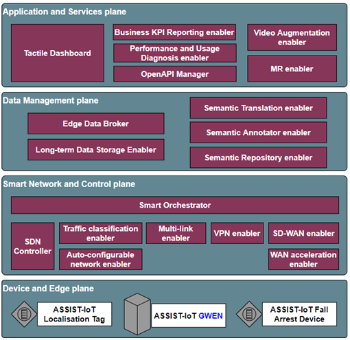

.. _localization_tag:

################
Localization Tag
################

.. contents::
  :local:
  :depth: 1

************
Introduction
************
The ASSIST-IoT localisation tag is a Smart IoT device used for indoor people localisation. This device has tag functionality, and it contains a buzzer and red LED. The buzzer is used to indicate to the person that he/she is in a restricted area. The button is used to alert the system when the worker detects an accident and immediate help is needed.

********
Features
********
The localization tag has a Push button and an IMU sensor (Inertia Measurement Unit). When a worker as part detects a dangerous situation, the button can be pushed to alert the system that a dangerous situation has been detected. The IMU is added for future use. The IMU can be used to detect if there is movement or not. 

Another feature provided by the Localization Tag is that the localisation accuracy is better than 50cm.

Here is also the block schemantic diagram of the device:

.. image:: tag.png

*********************
Place in architecture
*********************
The fall arrest device is part of the device and edge plane and more specifacially the place of the device in the ASSIST-IoT architecture can be viewed in the following picture:

**********
User guide
**********
The battery of the tag has to be charged during non-working hours.
The monitored assets needs to have a tag attached (e.g., in case of a worker, he/she has to wear a belt or helmet with it).
Information about the correspondence between tag and asset must be noted, so they can be later on related. In case of a worker, information about whether it is connected to a belt or helmet should be noted as well.

*************
Prerequisites
*************
The localization tag determines its position relative to fixed anchors. This position is transmitted to the localization processing enabler. This enabler gathers the position of several fall arrest devices and needs to know which person is wearing which tag.

************
Installation
************
The localisation tag has to be mounted to a belt. A small enclosure including battery has been provided for tags. These can be worn on a belt or in a pocket. The battery will last a few days in full time operation (depending on usage of data messaging such as an alarm)
The localization anchors which where provided for the Pilot (Pilot 2) were also battery operated. Since the anchors draw much more power than the Tags, these where equipped with a battery pack which lasts at least a week (based on 8 hours operation per day) The assembly of the anchor is placed inside a watertight enclosure designed for outdoor usage. The enclosure has a charging port for recharging the batterypack inside.

*********************
Configuration options
*********************
The TAG and Anchors are designed as stand-alone parts and therefore cannot be configured. The master Anchor is connected to the GWEN on which the UWB control system runs. This is where alarms are generated and user inputs are dealt with as well as geofencing or boundaries setting (could also still be done at a higher level).
The Anchors and Tags are embedded devices meant to do their job. Any configuration of tempering of these parts is unwanted because of stability. (similar to your GPS system, you cannot configure the GPS system such as timing, only the overlay)

***************
Developer guide
***************
For development several parameters can be adjusted to the UWB system. The issue which we faced during Pilots was updating speed. Therefore a development was started to make a faster version of the UWB to reduce latencies. This increase in speed has some influence on the size of the network as not as many hops are possible in the shorter time-frame. For the system we built (four times faster) no hops were possible, so all anchors must have a direct line-of-sight with the master node (range ~25m).
Note: the term network is deliberately used, as this does not effect scalability. For the original system multiple networks were possible always, increasing network speeds only require the amount of networks to go up faster to cover the same area.

***************************
Version control and release
***************************
Currently 2 versions are supported for the localization system. The difference is as mentioned before the network update speed. The standard version meant for normal operation operates at an update frequency of 1Hz. This speed allows up to 2 hops between anchors making the total network range ~75m).
The faster version to improve latencies is build at an update frequency of 4Hz. This speed is designed for operational use within a single room or labfloor. Where speed is of importance more than range. 

*******
License
*******
No specific license is needed for this enabler. The system is based upon a development kit of Qorvo with fully customized software. 

********************
Notice(dependencies)
********************
The system only works with the selected parts and is tailored for the Qorvo DWM1001c module. Since the beginning of the project UWB has developed considerably and the industrial world is becoming interested in the technology. Therefore at current date several new modules are available which can perform better than the one on which the Assist IoT system is based (choice dates back from the beginning of the project, at which time only a very limited hardware selection was available). With today’s knowledge a more common approach would be superior in which a line of modules (with commonalities) could be supported. However these module lines were not available at the start of the project.
