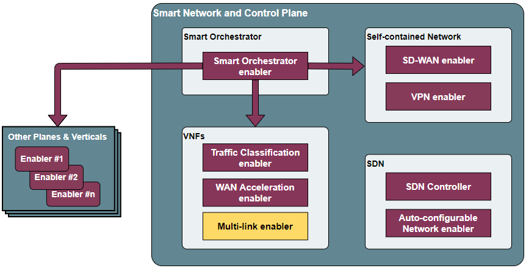
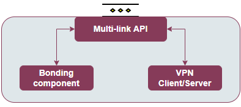

.. _Multi-link enabler:

##################
Multi-link enabler
##################

.. contents::
  :local:
  :depth: 1

***************
Introduction
***************
The main goal of this enabler is to manage different wireless access networks, 
so in case the primary link is down a second one is up without noticing (at least, 
not by the user) any kind of service disruption.

***************
Features
***************
The main concept of this enabler involves bringing the bonding capabilities of 
Ethernet interfaces belonging to a network, to multiple wireless ones. 
Three main features will be supported by this enabler:

- It is intended to work at least for WiFi, fluidmesh and 5G networks, allowing establishing prioritisation of channels.
- It will setup automatically the necessary tunnels.
- In case that the primary link is restored, it should go back to the initial wireless technology.

.. note:: 
  This enabler is stil under develoment, being subject to modifications of its scope.

*********************
Place in architecture
*********************
The Multi-link enabler is located in the Smart Network and Control plane of the ASSIST-IoT 
architecture. In particular, it will be one of the enablers devoted to extend the
basic features of the system, in this case serving as a bridge of multiple wireless access networks.

   
   Place of the Multi-link enabler within the Smart Network and Control Plance architecture

The enabler is composed of three main elements, as one can see in the figure below:

- **Traffic Classification API**: an API REST will facilitate the configuration of the enabler by an administrator user. 
- **Bonding component**: It will be used for establishing the necessary bridges, bonding and prioritisation rules in a GWEN (or similar gateway device). It will bond the tunnels that will travel over different radio technologies, establishing a primary one and backups.
- **VPN Client/Server**: P2P tunnels will be established over the system, so the wireless networks belong to the same virtual one. To that end, an underlying VPN technology is needed.

   Multi-link enabler architecture

.. note:: 
  This enabler will have two instances, one with the VPN client active and the other with the server, as these tunnels require implementing a server-client mode (hence, connected). For easing its management, they will be configured via a unified user interface.
  
  The “internal” VPN will have a different implementation than the VPN enabler. The internal VPN will require a “TAP” implementation, layer 2, being the homonymous enabler implemented in “TUN”, layer 3. The dedicated enabler supports much larger numbers of connections without reducing performance, whereas in this case this is not as important as great number of backup wireless technologies are not expected (tests will be done with three.

***************
User guide
***************

REST API endpoints
*******************
The API has not been developed yet, in the following table is presented the design 
of the endpoints that are intended to be implemented.

+--------+------------------------+----------------------------------------------------------------------------------------------------------------+
| Method | Endpoint               | Description                                                                                                    |
+========+========================+================================================================================================================+
| POST   | /interfaces/add        | Adds an interface to be bonded                                                                                 |
+--------+------------------------+----------------------------------------------------------------------------------------------------------------+
| GET    | /interfaces            | Gets a list of managed interfaces                                                                              |
+--------+------------------------+----------------------------------------------------------------------------------------------------------------+
| PUT    | /interfaces            | Modifies the order of priority among the managed interfaces                                                    |
+--------+------------------------+----------------------------------------------------------------------------------------------------------------+
| POST   | /tunnel/client/add     | Provisions a new client in the server, generating a set of keys (returned)                                     |
+--------+------------------------+----------------------------------------------------------------------------------------------------------------+
| GET    | /tunnel/client/        | Returns the list of clients registered in the server                                                           |
+--------+------------------------+----------------------------------------------------------------------------------------------------------------+
| PUT    | /tunnel/client/enable  | Enables a client with the specified the public key                                                             |
+--------+------------------------+----------------------------------------------------------------------------------------------------------------+
| PUT    | /tunnel/client/disable | Disables a client with the specified the public key                                                            |
+--------+------------------------+----------------------------------------------------------------------------------------------------------------+
| DELETE | /tunnel/client/delete  | Deletes a client with the specified the public key                                                             |
+--------+------------------------+----------------------------------------------------------------------------------------------------------------+
| POST   | /tunnel/attach         | (In the client side) Connects to a VPN server making use of the keys generated by the server when provisioned. |
+--------+------------------------+----------------------------------------------------------------------------------------------------------------+

***************
Prerequisites
***************
An analysis of the prerequisites is still under develoment. In this case, different
provisions related to rights over the host interfaces and operating system will be required.

***************
Installation
***************
Any Helm chart, dedicated K8s manifests or Docker compose file for deploying the enabler
has been developed yet, as the basic features are still under research and development.

*********************
Configuration options
*********************
An analysis of the configurations to be modifiable by a user is under assessment.
The exposed port for accessing the API will be one of the available options, as well
as the needed configurations for having execution rights over the host OS.

***************
Developer guide
***************
Will be determined after the release of the enabler.

***************************
Version control and release
***************************
Will be determined after the release of the enabler.

***************
License
***************
Will be determined after the release of the enabler.

*********************
Notice (dependencies)
*********************
This enabler will not require of any other enabler deployed to be fully functional.
