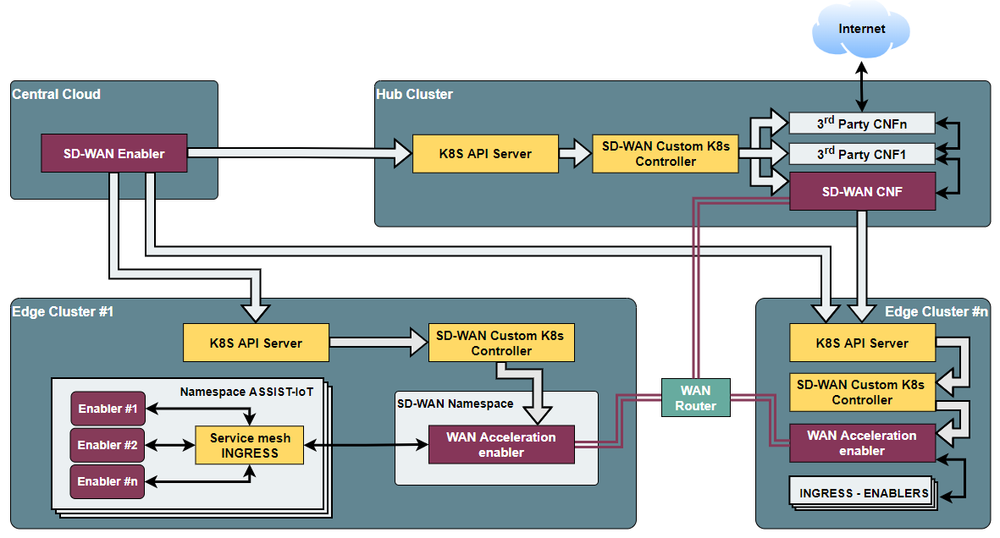
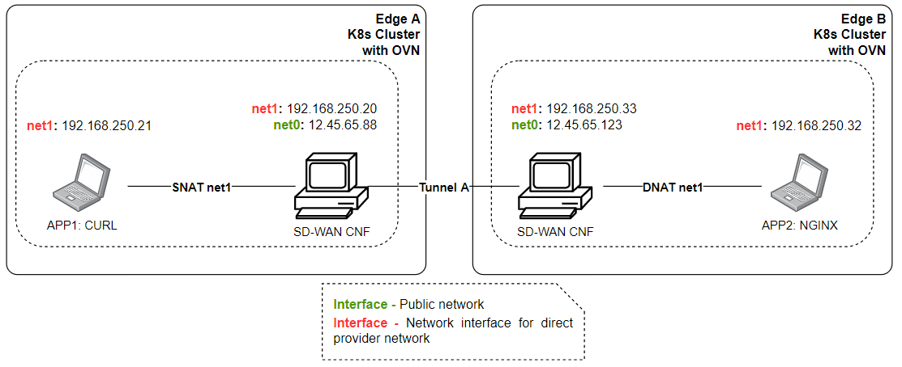
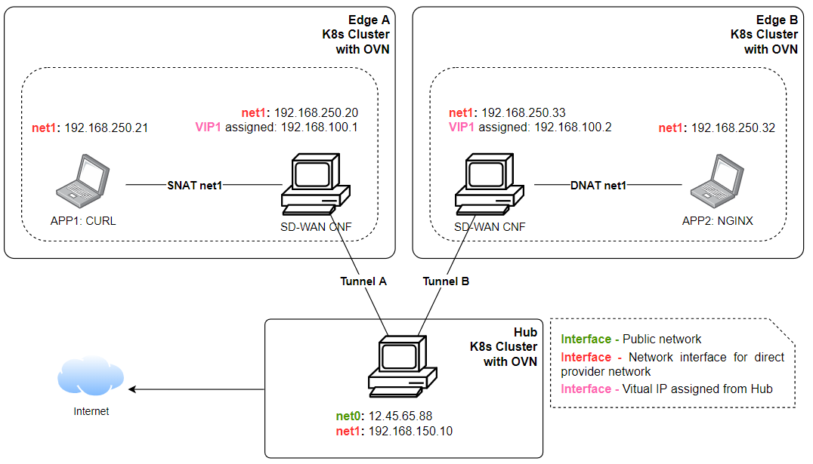

.. _SD-WAN enabler:

.. figure:: ./images/sd_wan_enabler/assist-IoT-logo.png 

##############
SD-WAN enabler
##############

.. contents::
  :local:
  :depth: 1

***************
Introduction
***************
The objective of this enabler is to provide access between nodes from different sites based on SD-WAN technology. 
It will work jointly with the WAN acceleration enabler to register managed hubs and clusters, establish private and scalable tunnels within managed K8 clusters.
 
***************
Features
***************
This enabler will implement mechanisms to connect K8s clusters via private tunnels,
facilitating (i) the deployment and chaining of virtual functions to secure 
connections between them and/or towards the Internet and (ii) the implementation 
of functions to optimise WAN traffic (via WAN Acceleration enabler), enabling
the chaining of (network) functions.

.. note:: 
  This enabler is stil under develoment, being subject to modifications of its scope.

*********************
Place in architecture
*********************
The SD-WAN enabler is located in the Smart Network and Control plane of the ASSIST-IoT 
architecture. In particular, it belongs to the building block related to self-contained networks,
which are the ones used for provisioning private networks over public ones.

.. figure:: ./images/sd_wan_enabler/sdwan_place.png 
   :alt: Place of the SD-WAN enabler within the Smart Network and Control Plance architecture
   :align: center
   
   Place of the SD-WAN enabler within the Smart Network and Control Plance architecture

The following diagram aims at describing the global operation of the SD-WAN architecture,
including the SD-WAN enabler and instances of WAN Acceleration enabler (each of them composed by an SD-WAN
custom k8s controller and an SD-WAN CNF).

   
   SD-WAN overall architecture

This overall SD-WAN architecture is guided by the following logic:

1. With the SD-WAN enabler, a user can define overlays, which are abstract groups of K8s clusters whose connections will be managed by the SD-WAN enabler.
2. Through this enabler, the user can define IPSec policies and IP ranges to later on establish tunnels among those clusters, which should have previously deployed an instance of the WAN acceleration enabler.
3. These clusters can act as edges or hubs. Hubs are particular instances of the WAN acceleration enabler that allow chaining network functions that will process the traffic among clusters and before navigating from/towards the Internet.

Particularly, the SD-WAN enabler is composed of four main elements, as one can see in the figure below:

- **SD-WAN Controller**: Component in charge of managing the aspects related to SD-WAN communication, including overlays, IP provisioning, tunnels, hub registration, connection and observation, and cluster addition to be managed by it. Provides a REST API to interact with it.
- **Rsync component**: Service that receives requests from the controller and dispatch K8s resources to the WAN acceleration enablers and K8s resources of the involved clusters to setup the dedicated tunnels. 
- **Database**: Stores key information regarding managed clusters, hubs, overlays, IP ranges, etc.
- **Etcd**: Internal metadata database used to exchange configuration between the controller and rsync component.

.. figure:: ./images/sd_wan_enabler/sdwan_arch.png 
   :alt: SD-WAN enabler architecture
   :align: center

   SD-WAN enabler architecture

***************
User guide
***************

REST API endpoints
*******************
In the following table are presented the endpoint ready to use:

+---------------------+-----------------------------------------+-------------------------------------------------------------------------------------------------------------------------------------------------+
| Method              | Endpoint                                | Description                                                                                                                                     |
+=====================+=========================================+=================================================================================================================================================+
| GET/POST/PUT/DELETE | /overlays                               | Endpoint in charge of creating, modifying, deleting and getting information regarding a set of edge clusters (and hubs) managed by the enabler. |
+---------------------+-----------------------------------------+-------------------------------------------------------------------------------------------------------------------------------------------------+
| GET/POST/PUT/DELETE | /overlays/{id}/proposal                 | Endpoint in charge of defining IPSec proposals that can be used for tunnels in an overlay.                                                      |
+---------------------+-----------------------------------------+-------------------------------------------------------------------------------------------------------------------------------------------------+
| GET/POST/PUT/DELETE | /overlays/{id}/ipranges                 | Defines the overlay IP range used for the edge clusters.                                                                                        |
+---------------------+-----------------------------------------+-------------------------------------------------------------------------------------------------------------------------------------------------+
| GET/POST/PUT/DELETE | /overlays/{id}/hubs                     | Define a traffic hub in an overlay. Requires certificate and kubeconfig file to be able to manage it.                                           |
+---------------------+-----------------------------------------+-------------------------------------------------------------------------------------------------------------------------------------------------+
| GET/POST/PUT/DELETE | /overlays/{id}/devices                  | Define an edge cluster location (with SD-WAN acceleration enabler). Among other input, it required kubeconfig file and certificate information. |
+---------------------+-----------------------------------------+-------------------------------------------------------------------------------------------------------------------------------------------------+
| GET/POST/PUT/DELETE | /overlays/{id}/hubs/{id}/devices/{id}   | Define a connection between a hub and an edge cluster.                                                                                          |
+---------------------+-----------------------------------------+-------------------------------------------------------------------------------------------------------------------------------------------------+
| GET                 | /overlays/{id}/devices/{id}/connections | Get connections between edge clusters.                                                                                                          |
+---------------------+-----------------------------------------+-------------------------------------------------------------------------------------------------------------------------------------------------+
| GET                 | /overlays/{id}/hubs/{id}/connections    | Get connections between hubs.                                                                                                                   |
+---------------------+-----------------------------------------+-------------------------------------------------------------------------------------------------------------------------------------------------+

***************
Prerequisites
***************
Prerrequisites are available to install in shell bash script named "kubernetes.sh" available in "wan-acceleration" gitlab repository.

***************
Installation
***************
The installation are done implemented by k8s manifests. In future releases, the installation will be by helm charts.

Steps of installation are avaible in gitlab repository.

*********************
Expected scenarios
*********************

* Scenario A: Site-to-Site tunnel with static public IP address

In this scenario, both sites have static public IP address and setup a tunnel between sites. After the tunnel is established, the clients within the site should be able to ping the clients on the other side through the tunnel. The tunnel is authenticated through pre-shared key.

   SD-WAN Scenario A

* Scenario B: Edge to traffic hub tunnel where inter micro-service communication across edges that attached to same traffic hub.

   SD-WAN Scenario B

1. Two Edge clusters have exactly the same POD IP Subnets.
2. They don't have any static public IP address.
3. They don't have any static domain name.
4. An application is deployed where one micro-service is client, placed in edge1.  Second micro-service is server placed in edge2.  They can be sleep, nginx.
5. Proof is that Edge1 sleep (via curl) should be table to talk to nginx in the edge2.

*********************
Configuration options
*********************
An analysis of the configurations to be modifiable by a user is under assessment.
The exposed port for accessing the API will be one of the available options, as well as the needed configurations for having execution rights over the involved K8s API endpoints.

***************
Developer guide
***************
Will be determined after the release of the enabler.

***************************
Version control and release
***************************
1.0.

***************
License
***************
Will be determined after the release of the enabler.

*********************
Notice (dependencies)
*********************
Although it can be deployed standalone, this enabler does not have any sense without
having WAN acceleration enablers deployed in the clusters to manage (as hubs or as edge nodes).
