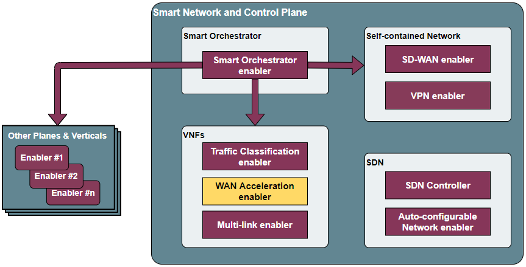
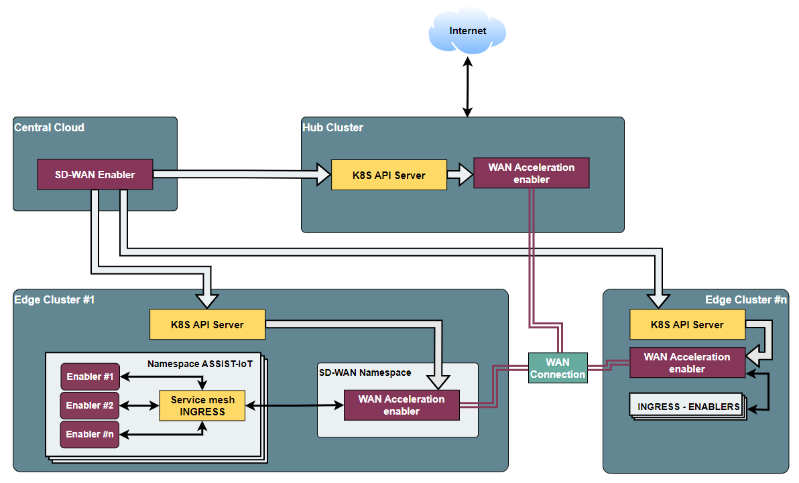
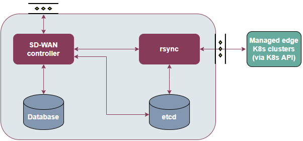
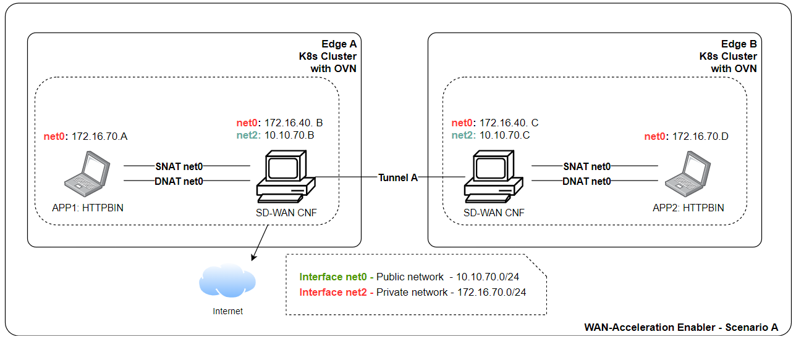
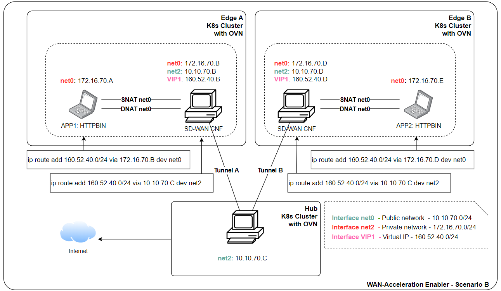

.. image:: https://user-images.githubusercontent.com/100677511/170439941-58810f43-b437-41e5-9976-899b60cf1e5e.png
   :alt: image-3

SD-WAN enabler
==============

Note: Currently in development

The installation has been verified on kubernetes v1.23.3

Introduction
------------

The objective of this enabler is to provide access between nodes from different sites based on SD-WAN technology. It will work jointly with the WAN acceleration enabler to register managed hubs and clusters, establish private and scalable tunnels within managed K8 clusters.

Features
--------

This enabler will implement mechanisms to connect K8s clusters via private tunnels, facilitating (i) the deployment and chaining of virtual functions to secure connections between them and/or towards the Internet and (ii) the implementation of functions to optimise WAN traffic (via WAN Acceleration enabler), enabling the chaining of (network) functions.

Place in architecture
---------------------

The SD-WAN enabler is located in the Smart Network and Control plane of the ASSIST-IoT architecture. In particular, it belongs to the building block related to self-contained networks, which are the ones used for provisioning private networks over public ones.

The following diagram aims at describing the global operation of the SD-WAN architecture, including the SD-WAN enabler and instances of WAN Acceleration enabler (each of them composed by an SD-WAN custom k8s controller and an SD-WAN CNF).

This overall SD-WAN architecture is guided by the following logic:

1. With the SD-WAN enabler, a user can define overlays, which are abstract groups of K8s clusters whose connections will be managed by the SD-WAN enabler.
2. Through this enabler, the user can define IPSec policies and IP ranges to later on establish tunnels among those clusters, which should have previously deployed an instance of the WAN acceleration enabler.
3. These clusters can act as edges or hubs. Hubs are particular instances of the WAN acceleration enabler that allow chaining network functions that will process the traffic among clusters and before navigating from/towards the Internet.

Particularly, the SD-WAN enabler is composed of four main elements, as one can see in the figure below:

- **SD-WAN Controller**: Component in charge of managing the aspects related to SD-WAN communication, including overlays, IP provisioning, tunnels, hub registration, connection and observation, and cluster addition to be managed by it. Provides a REST API to interact with it.
- **Rsync component**: Service that receives requests from the controller and dispatch K8s resources to the WAN acceleration enablers and K8s resources of the involved clusters to setup the dedicated tunnels.
- **Database**: Stores key information regarding managed clusters, hubs, overlays, IP ranges, etc.
- **Etcd**: Internal metadata database used to exchange configuration between the controller and rsync component.

User guide
-------------

In the following table are presented the endpoint ready to use:

**Overlay**

Define a group of edge location clusters (devices) and hubs, an overlay is usually owned by one customer and full mesh connections are set up automatically between hub-hub and device-device (with public IPs)

+------------+--------------------------------+----------------------+-------------------------------------------------------------------------+
| **Method** | **Endpoint**                   | **Description**      | **Payload (if need)**                                                   |
+============+================================+======================+=========================================================================+
| POST       | scc/v1/overlays                | Overlay registration | { "metadata": { "name": "overlay1", "description": "this is a test" } } |
+------------+--------------------------------+----------------------+-------------------------------------------------------------------------+
| GET        | scc/v1/overlays                | Get all overlays     |                                                                         |
+------------+--------------------------------+----------------------+-------------------------------------------------------------------------+
| GET        | scc/v1/overlays/{overlay-name} | Get overlay by name  |                                                                         |
+------------+--------------------------------+----------------------+-------------------------------------------------------------------------+
| PUT        | scc/v1/overlays/{overlay-name} | Update overlay       | { "metadata": { "name": "overlay1", "description": "this is a test" } } |
+------------+--------------------------------+----------------------+-------------------------------------------------------------------------+
| DELETE     | scc/v1/overlays/{overlay-name} | Delete overlay       |                                                                         |
+------------+--------------------------------+----------------------+-------------------------------------------------------------------------+

**Proposal** 

Define proposals which can be used for IPsec tunnel in this overlay.

+------------+----------------------------------------------------------+-----------------------+---------------------------------------------------------------------------------------------------------------------------------------------------------------------------------------------------------------------+
| **Method** | **Endpoint**                                             | **Description**       | **Payload (if need)**                                                                                                                                                                                               |
+============+==========================================================+=======================+=====================================================================================================================================================================================================================+
| POST       | scc/v1/overlays/{overlay-name}/proposals                 | Proposal registration | { "metadata": { "name": "proposal1", "description": "Example of proposal", "userData1": "Some data", "userData2": "Some more data" }, "spec": { "encryption": "aes256", "hash": "sha256", "dhGroup": "modp4096" } } |
+------------+----------------------------------------------------------+-----------------------+---------------------------------------------------------------------------------------------------------------------------------------------------------------------------------------------------------------------+
| GET        | scc/v1/overlays/{overlay-name}/proposals                 | Get all proposals     |                                                                                                                                                                                                                     |
+------------+----------------------------------------------------------+-----------------------+---------------------------------------------------------------------------------------------------------------------------------------------------------------------------------------------------------------------+
| GET        | scc/v1/overlays/{overlay-name}/proposals/{proposal-name} | Get proposal by name  |                                                                                                                                                                                                                     |
+------------+----------------------------------------------------------+-----------------------+---------------------------------------------------------------------------------------------------------------------------------------------------------------------------------------------------------------------+
| PUT        | scc/v1/overlays/{overlay-name}/proposals/{proposal-name} | Update proposal       | { "metadata": { "name": "proposal1", "description": "Example of proposal", "userData1": "Some data", "userData2": "Some more data" }, "spec": { "encryption": "aes256", "hash": "sha256", "dhGroup": "modp4096" } } |
+------------+----------------------------------------------------------+-----------------------+---------------------------------------------------------------------------------------------------------------------------------------------------------------------------------------------------------------------+
| DELETE     | scc/v1/overlays/{overlay-name}/proposals/{proposal-name} | Delete proposal       |                                                                                                                                                                                                                     |
+------------+----------------------------------------------------------+-----------------------+---------------------------------------------------------------------------------------------------------------------------------------------------------------------------------------------------------------------+

**IPRange**

Define the overlay IP range which will be used as OIP of devices.

+------------+--------------------------------------------------------+----------------------+-----------------------------------------------------------------------------------------------------------------------------------------------------------------------------------------------------+
| **Method** | **Endpoint**                                           | **Description**      | **Payload (if need)**                                                                                                                                                                               |
+============+========================================================+======================+=====================================================================================================================================================================================================+
| POST       | scc/v1/overlays/{overlay-name}/ipranges                | IPRange registration | { "metadata": { "name": "iprange1", "description": "Example of iprange", "userData1": "Some data", "userData2": "Some more data" }, "spec": { "subnet": "160.52.40.0", "minIp": 1, "maxIp": 100 } } |
+------------+--------------------------------------------------------+----------------------+-----------------------------------------------------------------------------------------------------------------------------------------------------------------------------------------------------+
| GET        | scc/v1/overlays/{overlay-name}/ipranges                | Get all IPRanges     |                                                                                                                                                                                                     |
+------------+--------------------------------------------------------+----------------------+-----------------------------------------------------------------------------------------------------------------------------------------------------------------------------------------------------+
| GET        | scc/v1/overlays/{overlay-name}/ipranges/{iprange-name} | Get IPRange by name  |                                                                                                                                                                                                     |
+------------+--------------------------------------------------------+----------------------+-----------------------------------------------------------------------------------------------------------------------------------------------------------------------------------------------------+
| PUT        | scc/v1/overlays/{overlay-name}/ipranges/{iprange-name} | Update IPRange       | { "metadata": { "name": "iprange1", "description": "Example of iprange", "userData1": "Some data", "userData2": "Some more data" }, "spec": { "subnet": "160.52.40.0", "minIp": 1, "maxIp": 100 } } |
+------------+--------------------------------------------------------+----------------------+-----------------------------------------------------------------------------------------------------------------------------------------------------------------------------------------------------+
| DELETE     | scc/v1/overlays/{overlay-name}/ipranges/{iprange-name} | Delete IPRange       |                                                                                                                                                                                                     |
+------------+--------------------------------------------------------+----------------------+-----------------------------------------------------------------------------------------------------------------------------------------------------------------------------------------------------+

**Hub Registration**

Define a traffic Hub in an overlay.

+------------+------------------------------------------------+-------------------------------+------------------------------------------------------------------------------------------------------------------------------------------------------------------------------------------------------------------------+
| **Method** | **Endpoint**                                   | **Description**               | **Payload (if need)**                                                                                                                                                                                                  |
+============+================================================+===============================+========================================================================================================================================================================================================================+
| POST       | scc/v1/overlays/{overlay-name}/hubs            | Hub registration              | { "metadata": { "name": "hub1", "description": "Example of hub", "userData1": "Some data", "userData2": "Some more data" }, "spec": { "publicIps": [ "10.10.70.40" ], "certificateId": "hub1", "kubeConfig": "xxx" } } |
+------------+------------------------------------------------+-------------------------------+------------------------------------------------------------------------------------------------------------------------------------------------------------------------------------------------------------------------+
| GET        | scc/v1/overlays/{overlay-name}/hubs            | Get all registered hubs       |                                                                                                                                                                                                                        |
+------------+------------------------------------------------+-------------------------------+------------------------------------------------------------------------------------------------------------------------------------------------------------------------------------------------------------------------+
| GET        | scc/v1/overlays/{overlay-name}/hubs/{hub-name} | Get a traffic hub by hub name |                                                                                                                                                                                                                        |
+------------+------------------------------------------------+-------------------------------+------------------------------------------------------------------------------------------------------------------------------------------------------------------------------------------------------------------------+
| PUT        | scc/v1/overlays/{overlay-name}/hubs/{hub-name} | Update hub                    | { "metadata": { "name": "hub1", "description": "Example of hub", "userData1": "Some data", "userData2": "Some more data" }, "spec": { "publicIps": [ "10.10.70.40" ], "certificateId": "hub1", "kubeConfig": "xxx" } } |
+------------+------------------------------------------------+-------------------------------+------------------------------------------------------------------------------------------------------------------------------------------------------------------------------------------------------------------------+
| DELETE     | scc/v1/overlays/{overlay-name}/hubs/{hub-name} | Delete hub by hub name        |                                                                                                                                                                                                                        |
+------------+------------------------------------------------+-------------------------------+------------------------------------------------------------------------------------------------------------------------------------------------------------------------------------------------------------------------+

**Device Registration**

Define an edge location device information which may be a CNF, VNF or PNF.

+------------+------------------------------------------------------+----------------------------+------------------------------------------------------------------------------------------------------------------------------------------------------------------------------------------------------------------------------------------------------------------------------------------------------------------------------------------------------------+
| **Method** | **Endpoint**                                         | **Description**            | **Payload (if need)**                                                                                                                                                                                                                                                                                                                                      |
+============+======================================================+============================+============================================================================================================================================================================================================================================================================================================================================================+
| POST       | scc/v1/overlays/{overlay-name}/devices               | Device registration        | { "metadata": { "name": "device1", "description": "Example of device 1", "userData1": "Some data", "userData2": "Some more data" }, "spec": { "publicIps": [ "10.10.70.42" ], "forceHubConnectivity": true, "proxyHub": "hub1", "proxyHubPort": 9001, "useHub4Internet": false, "dedicatedSFC": false, "certificateId": "device1", "kubeConfig": "xxx" } } |
+------------+------------------------------------------------------+----------------------------+------------------------------------------------------------------------------------------------------------------------------------------------------------------------------------------------------------------------------------------------------------------------------------------------------------------------------------------------------------+
| GET        | scc/v1/overlays/{overlay-name}/devices               | Get all registered devices |                                                                                                                                                                                                                                                                                                                                                            |
+------------+------------------------------------------------------+----------------------------+------------------------------------------------------------------------------------------------------------------------------------------------------------------------------------------------------------------------------------------------------------------------------------------------------------------------------------------------------------+
| GET        | scc/v1/overlays/{overlay-name}/devices/{device-name} | Get device by name         |                                                                                                                                                                                                                                                                                                                                                            |
+------------+------------------------------------------------------+----------------------------+------------------------------------------------------------------------------------------------------------------------------------------------------------------------------------------------------------------------------------------------------------------------------------------------------------------------------------------------------------+
| PUT        | scc/v1/overlays/{overlay-name}/devices/{device-name} | Update device              | { "metadata": { "name": "device1", "description": "Example of device 1", "userData1": "Some data", "userData2": "Some more data" }, "spec": { "publicIps": [ "10.10.70.42" ], "forceHubConnectivity": true, "proxyHub": "hub1", "proxyHubPort": 9001, "useHub4Internet": false, "dedicatedSFC": false, "certificateId": "device1", "kubeConfig": "xxx" } } |
+------------+------------------------------------------------------+----------------------------+------------------------------------------------------------------------------------------------------------------------------------------------------------------------------------------------------------------------------------------------------------------------------------------------------------------------------------------------------------+
| DELETE     | scc/v1/overlays/{overlay-name}/devices/{device-name} | Delete device by name      |                                                                                                                                                                                                                                                                                                                                                            |
+------------+------------------------------------------------------+----------------------------+------------------------------------------------------------------------------------------------------------------------------------------------------------------------------------------------------------------------------------------------------------------------------------------------------------------------------------------------------------+

**Hub-Device Connection**

Define a connection between hub and device.

+------------+----------------------------------------------------------------------+------------------------------------+------------------------------------------------------------------------------------------------------------------------------------------------------------------------------------------------------------------+
| **Method** | **Endpoint**                                                         | **Description**                    | **Payload (if need)**                                                                                                                                                                                            |
+============+======================================================================+====================================+==================================================================================================================================================================================================================+
| POST       | scc/v1/overlays/{overlay-name}/hubs/{hub-name}/connections           | Hub-Device connection registration | { "metadata": { "name": "hub1-device1", "description": "Example of hub1-device1 connection", "userData1": "Some data", "userData2": "Some more data" }, "spec": { "device": "device1", "isDelegateHub": true } } |
+------------+----------------------------------------------------------------------+------------------------------------+------------------------------------------------------------------------------------------------------------------------------------------------------------------------------------------------------------------+
| GET        | scc/v1/overlays/{overlay-name}/hubs/{hub-name}/devices               | Get all connections by hub name    |                                                                                                                                                                                                                  |
+------------+----------------------------------------------------------------------+------------------------------------+------------------------------------------------------------------------------------------------------------------------------------------------------------------------------------------------------------------+
| GET        | scc/v1/overlays/{overlay-name}/hubs/{hub-name}/devices/{device-name} | Delete Hub-Device connection       |                                                                                                                                                                                                                  |
+------------+----------------------------------------------------------------------+------------------------------------+------------------------------------------------------------------------------------------------------------------------------------------------------------------------------------------------------------------+

**Device-Device Connection**

Receive all connections between devices.

+------------+------------------------------------------------------------------+-------------------------------+-----------------------+
| **Method** | **Endpoint**                                                     | **Description**               | **Payload (if need)** |
+============+==================================================================+===============================+=======================+
| GET        | scc/v1/overlays/{overlay-name}/devices/{device-name}/connections | Get all connections by device |                       |
+------------+------------------------------------------------------------------+-------------------------------+-----------------------+

Prerequisites
-------------

The following prerequisites are completely necessary to be able to install and work with SD-WAN Enabler.

- Installed and use in each cluster to use the **WAN-Acceleration enabler**
- Script **kubernetes.sh** available on deployment folder.

Installation
------------

The installation is done implemented by k8s manifests. In future releases, the installation will be by helm charts.

Steps of installation are available in `deployment` folder.

Expected scenarios
------------------

**Scenario A: Site-to-Site tunnel with static public IP address**

In this scenario, both sites have static public IP address and setup a tunnel between sites. After the tunnel is established, the clients within the site should be able to ping the clients on the other side through the tunnel. The tunnel is authenticated through pre-shared key.

**Scenario B: Edge to traffic hub tunnel where inter micro-service communication across edges that attached to same traffic hub.**

1. Two Edge clusters have exactly the same POD IP Subnets.
2. They don't have any static public IP address.
3. They don't have any static domain name.
4. An application is deployed where one micro-service is client, placed in edge1. Second micro-service is server placed in edge2. They can be sleep, nginx.
5. Proof is that Edge1 sleep (via curl) should be table to talk to nginx in the edge2.

Configuration options
---------------------

An analysis of the configurations to be modifiable by a user is under assessment. The exposed port for accessing the API will be one of the available options, as well as the needed configurations for having execution rights over the involved K8s API endpoints.

Developer guide
---------------

Will be determined after the release of the enabler.

Version control and release
---------------------------

1.0

License
-------

Will be determined after the release of the enabler.

Notice (dependencies)
---------------------

Although it can be deployed standalone, this enabler does not have any sense without having WAN acceleration enablers deployed in the clusters to manage (as hubs or as edge nodes).
