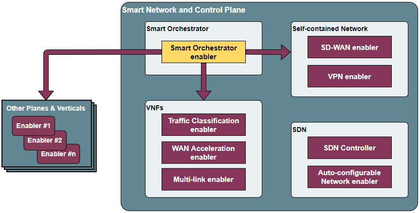

.. _Smart Orchestrator:

##################
Smart Orchestrator
##################

.. contents::
  :local:
  :depth: 1
  
***************
Introduction
***************
The Smart Orchestrator simplifies how user interfaces and other enablers
interact with the primary components of the MANO framework and
Kubernetes clusters. This enabler manages the complete lifecycle of
Containerized Functions, whether they are network-related or not, from
their creation to their termination, enabling deployment on any
available k8s cluster.

***************
Features
***************
The Smart Orchestrator has the goal of deploying, monitoring, and
orchestrating resources that have been instantiated in each of the
Kubernetes clusters that have been added to it. To achieve these
objectives, the enabler relies on four different technologies: API REST,
Prometheus, MongoDB, mck8s, and OSM. The Smart Orchestrator includes the
following main features:

-  **Decision intelligence**: The Smart Orchestrator offers Kubernetes
   decision intelligence by accessing the metrics servers in the other
   joined clusters to determine the optimal placement of enablers based
   on the resources available in each cluster.
-  **Lifecycle control**: The Smart Orchestrator provides lifecycle control,
   enabling the management of enablers from their deployment to their
   deletion.
-  **Energy saving**: The Smart Orchestrator saves energy by running a job
   only when it is required, rather than having a component continuously
   running for the sole purpose of servicing a single API call.

*********************
Place in architecture
*********************
The Smart Orchestrator is part of the  **Smart Network and Control plane ** in
the ASSIST-IoT architecture. It provides an intelligent and dynamic
network infrastructure where nodes work in parallel and communicate
seamlessly. The Smart Orchestrator monitors enablers and schedules them
efficiently based on CPU and memory resources.

  
The enabler is composed of these elements:

-  **API REST**: The entry point for user interaction and responsible for
   communication with other components to obtain, add, or delete
   resources such as enablers, clusters, or repositories.
-  **OSM**: Controls the entire lifecycle of Containerized Network Functions
   (CNFs), from their instantiation to their termination, allowing
   deployment in any available k8s cluster.
-  **Metrics server**: Collects performance metrics from targets (Kubernetes
   clusters).
-  **Scheduler**: Provides logic to place enablers based on resources
   available in the joined Kubernetes clusters.
-  **Multiservice controller**: Allows the connectivity from edge services
   to cloud services based in name service.

.. image:: https://user-images.githubusercontent.com/47482673/162279761-ce23e6c6-9c0c-4d0c-b2d3-150fe7c34843.PNG
  :alt: Smart Orchestrator enabler architecture
  :align: center
***************  
Pre-requisites
***************

-   **MINIMUM**: 2 CPUs, 6 GB RAM, 40GB disk and a single interface with Internet access.
-   **RECOMMENDED**: 2 CPUs, 8 GB RAM, 40GB disk and a single interface with Internet access.
-   **Base image**: Ubuntu 20.04 (64-bit variant required) in a clean machine.
*******************************
Installation Smart Orchestrator
*******************************

::

   1. git clone https://gitlab.assist-iot.eu/enablers-registry/public.git
   2. cd public/
   3. cd smartorchestrator/
   4. cd scripts/
   5. chmod +x smartOrchestrator.sh
   6. ./smartOrchestrator.sh -i
************************
Installation K8s cluster
************************

KUBEADM
----------

Install a K8s cluster located in the edge tier of the architecture using
Kubeadm.

::

   1. git clone https://gitlab.assist-iot.eu/enablers-registry/public.git
   2. cd public/
   3. cd smartorchestrator/
   4. cd scripts/
   5. chmod +x kubernetes.sh

..

.. warning::
   - ENSURE THAT ALL NODES ARE ADDED TO THE MAIN CLUSTER (MASTER NODE) PRIOR TO ADDING THE CLUSTER TO THE SMARTORCHESTRATOR.

Master node
-----------

Install a K8s cluster with a master node.

There are two important flags: - t: SERVER or AGENT (in this case
SERVER). - p: Pod CIDR Network (This MUST be different in each cluster.
If you choose 10.216.0.0/16, the other cluster MUST be for instance
10.215.0.0/16).

.. warning:: 
   - DO NOT REPEAT POD CIDR NETWORK. - 10.217.0.0/16 IS RESERVED FOR THE SMART ORCHESTRATOR CLUSTER.

.. code:: bash

   ./kubernetes.sh -t SERVER -p 10.216.0.0/16

Worker node
-----------

Install a K8s worker node to add an existing master node.

.. code:: bash

   ./kubernetes.sh -t AGENT

Once the worker node is ready, switch to the main cluster (master node)
and copy the output of this command:

.. code:: bash

   kubeadm token create --print-join-command

Switch again to the master node of the cluster and paste the command
output as *sudo*. 
.. note::
 - A KUBEADM node can not be joined to a k3s cluster. 
 - A k3s node can not be joined to a KUBEADM cluster.

K3S
------

Install a K3s (a lightweight K8s distribution) cluster located in the
edge tier of the architecture

::

   1. git clone https://gitlab.assist-iot.eu/enablers-registry/public.git
   2. cd public/
   3. cd smartorchestrator/
   4. cd scripts/
   5. chmod +x k3s.sh

..

.. warning::
   - ENSURE THAT ALL NODES ARE ADDED TO THE MAIN CLUSTER (MASTER NODE) PRIOR TO ADDING THE CLUSTER TO THE SMARTORCHESTRATOR. 
   - WE ARE FACING SOME ISSUES WITH CILIUM AND RPI, PLEASE WAIT UNTIL WE HAVE SOLVED IT.

.. _master-node-1:

Master node
-----------

Install a K8s cluster with a master node.

There are three important flags: - t: SERVER or AGENT (in this case
SERVER). - i: Server IP. If the edge is behind a NAT and the Smart
Orchestrator or the worker nodes are outside, the value is your Public
IP. - p: Pod CIDR Network (This MUST be different in each cluster. If
you choose 10.216.0.0/16, the other cluster MUST be for instance
10.215.0.0/16).

.. warning::
   - DO NOT REPEAT POD CIDR NETWORK. 
   - 10.217.0.0/16 IS RESERVED FOR THE SMART ORCHESTRATOR CLUSTER.

.. code:: bash

   sudo ./k3s.sh -t SERVER -i serverIP -p 10.213.0.0/16

.. _worker-node-1:

Worker node
-----------

Install a K8s worker node to add an existing master node.

There are three important flags: - s: Server IP (Master Node IP). -
k: The server token can be found on the master node machine, located at
the following path: */var/lib/rancher/k3s/server/node-token*

.. code:: bash

   sudo ./k3s.sh -t AGENT -i serverIP -k serverToken

..

   **Note** - K8s clusters cannot mix nodes from different K8s
   distributions (kubeadm, K3s, …) , all the nodes of a cluster must
   belong to the same distribution. - A KUBEADM node can not be joined
   to a k3s cluster. - A k3s node can not be joined to a KUBEADM
   cluster.
   
***************
User guide
***************
The enabler has a management API with a REST interface that allows you
to configure certain values. The API will respond with the requested
information or the result of the command you executed.

 ======== ================================== ========================================================= ================================================================================================================================== ========================================================================================================================================================================================================================= 
  Method   Endpoint                           Description                                               Payload                                                                                                                            Information                                                                                                                                                                                                              
 ======== ================================== ========================================================= ================================================================================================================================== ========================================================================================================================================================================================================================= 
  GET      /api/k8sclusters/                  Return K8s clusters                                                                                                                                                                                                                                                                                                                                                                                                   
  POST     /api/k8sclusters/                  Add a K8s cluster                                         {"name": String, "description": String, "credentials": Object,	"k8s_version": String}                                              Cluster name and all the names in the k8s credentials must be the same name.  First cluster to be added must be *cloud* cluster. If this steps are not followed the smartorchestrator does not allow to join a cluster.  
  DELETE   /api/k8sclusters/:id               Delete a k8s cluster by id                                                                                                                                                                                                                                                                                                                                                                                            
  GET      /api/chartrepo                     Return a helm repository                                                                                                                                                                                                                                                                                                                                                                                              
  POST     /api/chartrepo                     Add a helm repository                                     {"name": String, "description": String, "url": String}                                                                                                                                                                                                                                                                                                      
  DELETE   /api/chartrepo/:id                 Delete a helm repository by id                                                                                                                                                                                                                                                                                                                                                                                        
  GET      /api/enabler/instanced             Return the instanced enablers                                                                                                                                                                                                                                                                                                                                                                                         
  POST     /api/enabler/                      Instantiate an enabler                                    {"enablerName": String,"helmChart": String, "additionalParams": Object,"vim": String, "auto": Boolean,"placementPolicy": String}   The placementPolicy can be: worst-fit, best-fit or traffic-most                                                                                                                                                          
  POST     /api/enabler/:id /terminate        Terminate an enabler by id                                                                                                                                                                                                                                                                                                                                                                                            
  DELETE   /api/enabler/:id                   Delete an enabler by id                                                                                                                                                                                                                                                                                                                                                                                               
  GET      /api/enabler/enabler_cluster/:id   Get enablers in a cluster by cluster name                                                                                                                                                                                                                                                                                                                                                                             
  POST     /api/login/tokens                  Login                                                     {"username": String ,"password": String}                                                                                                                                                                                                                                                                                                                    
  DELETE   /api/enabler/pv/:id                Delete PV and PVC related with an enabler by enabler id                                                                                                                                                                                                                                                                                                                                                               
  GET      /api/k8sclusters/node/:clusterid   Get nodes by k8s cluster                                                                                                                                                                                                                                                                                                                                                                                              
 ======== ================================== ========================================================= ================================================================================================================================== ========================================================================================================================================================================================================================= 

K8s cluster addition to the Smart Orchestrator
----------------------------------------------

Here are the steps to follow for adding a cluster to the Smart
Orchestrator:

1. The cluster name and all associated names in the Kubernetes
   credentials must be identical.
2. The initial cluster added should be the *cloud* cluster, which serves
   as the smart orchestrator cluster.

Failure to follow these steps will result in the Smart Orchestrator
preventing the joining of a cluster.

.. warning::
   - ENSURE THAT ALL NODES ARE ADDED TO THE MAIN CLUSTER (MASTER NODE) PRIOR TO ADDING THE CLUSTER TO THE SMARTORCHESTRATOR. 
   - WE ARE FACING SOME ISSUES WITH CILIUM AND RPI, PLEASE WAIT UNTIL WE HAVE SOLVED IT.
***************
Troubleshooting
***************

SmartOrchestrator installation fails
------------------------------------

If the smartorchestrator installation fails, uninstall the installation
and try it again:

::

   1. ./smartOrchestrator.sh -u
   2. ./smartOrchestrator.sh -i

The installation can fail because of the pull request limit of Docker,
in that case contact with @framabio

Kubectl error
-------------

.. _kubeadm-1:

KUBEADM
~~~~~~~

1. The connection to the server localhost:8080 was refused - did you
   specify the right host or port?
2. Unable to connect to the server: x509: certificate signed by unknown
   authority

Please use this command:

.. code:: bash

   mkdir -p $HOME/.kube
   sudo cp -i /etc/kubernetes/admin.conf $HOME/.kube/config
   sudo chown $(id -u):$(id -g) $HOME/.kube/config

.. _k3s-1:

K3S
~~~

Please use this command:

.. code:: bash

   export KUBECONFIG=/etc/rancher/k3s/k3s.yaml

Reset kubernetes
----------------

.. _kubeadm-2:

KUBEADM
~~~~~~~

For reseting a kubernetes kubeadm cluster:

.. code:: bash

   sudo kubeadm reset

.. _k3s-2:

K3s
~~~

For reseting a kubernetes k3s server node:

.. code:: bash

   /usr/local/bin/k3s-uninstall.sh

For reseting a k3s agent node:

.. code:: bash

   /usr/local/bin/k3s-agent-uninstall.sh

***************
Developer Guide
***************

Once the code is made public, best practices for maintaining the code in
all aspects will be promoted. The maintenance team will be responsible
for accepting or rejecting updates.

***************
Version control and release
***************

Version 3.0.0. New features:

-  Auto-Clustermesh
-  MultiCluster Service Controller
-  Acceptance of any helm repository.
-  Improvement of enabler removal.

***************
License
***************

Apache 2.0
