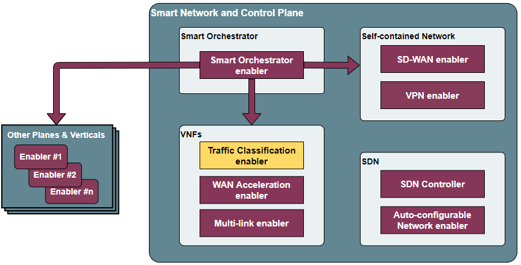
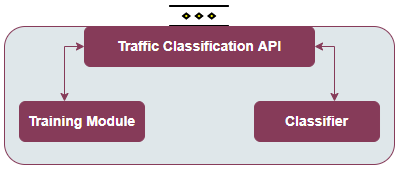

.. _Traffic classification enabler:

#############################
Traffic classification enabler
#############################

.. contents::
  :local:
  :depth: 1

***************
Introduction
***************
In SDN-enabled networks, a controller is responsible for controlling the underlying switches that distribute traffic according to different rules, including 
sources/sinks, ports and type of traffic. The aim of this enabler is aid the 
controller to classify network traffic into a number of application classes 
(video streaming, VoIP, Network control, best effort, OAM, etc.), making use 
of an AI/ML framework and dedicated algorithms. The traffic classification 
enabler can be seen as a service of the application layer of the general SDN 
architecture.

***************
Features
***************
Two main features are supported by this enabler, especifically:

- Training a machine learning model to classify traffic packets, in, type or application.
- To inference the type of traffic of a specific packet/s passed via .pcap file.

To that end, the enabler will rely on Convolutional Neural Network (CNN) and RESNET models.

.. note:: 
   At this moment, the enabler has only been validated to work with CNN models. Code for Resnet has been added and tested, but not validated with real data. Additional modifications are expected (code cleaning, management of models via SemRepo enabler, average of results of .pcap file rather than packet-based).

*********************
Place in architecture
*********************
The VPN enabler is located in the Smart Network and Control plane of the ASSIST-IoT 
architecture. In particular, it will be one of the enablers devoted to improve
the performance of the network, in this case acting as an application that aids the SDN 
controller.

   
   Place of the Traffic Classification enabler within the Smart Network and Control Plance architecture

The enabler is composed of three main elements, as one can see in the figure below:

- **Traffic Classification API**: an API REST will act as a central proxy of the operations that are offered by the enabler. It is responsible of managing the API calls related to starting a training and an inference process. It also includes necessary calls for preparing data used for further training.
- **Training Module**: It will be invoked for training the DNN model and sub-models by the user, ideally when an extended or new dataset is available. In future releases, this component might be conditionally deployed (as nodes with low resources might not be suitable for training operations).
- **Classifier**: It will contain the functions in charge of executing the inference process, taking a trained model and a set of packet features as inputs.

   Traffic Classification enabler architecture

***************
User guide
***************

REST API endpoints
*******************
The following API endpoints have been developed:

+--------+------------------------------+--------------------------------------------------------------------------------------------------------------------------------------------------------+-----------------------------------------------------------------------------------------------------------------------------+--------------------------------------------------+
| Method | Endpoint                     | Description                                                                                                                                            | Payload (if needed)                                                                                                         | Response format                                  |
+========+==============================+========================================================================================================================================================+=============================================================================================================================+==================================================+
| GET    | /version                     | Returns the version of the enabler.                                                                                                                    |                                                                                                                             | JSON with the output class                       |
+--------+------------------------------+--------------------------------------------------------------------------------------------------------------------------------------------------------+-----------------------------------------------------------------------------------------------------------------------------+--------------------------------------------------+
| GET    | /health                      | Returns status of the enabler (it is considered healthy if its components are deployed and can be communicated).                                       |                                                                                                                             | JSON with the output class                       |
+--------+------------------------------+--------------------------------------------------------------------------------------------------------------------------------------------------------+-----------------------------------------------------------------------------------------------------------------------------+--------------------------------------------------+
| get    | /v1/api-export               | Returns the openapi specifications of the enabler.                                                                                                     |                                                                                                                             | JSON with the output class                       |
+--------+------------------------------+--------------------------------------------------------------------------------------------------------------------------------------------------------+-----------------------------------------------------------------------------------------------------------------------------+--------------------------------------------------+
| POST   | /v1/preprocess               | Given a set of .pcap files via volume (in ML_folder/data), these are prepared for further training.                                                    |                                                                                                                             | Successful or error code depending on the result |
+--------+------------------------------+--------------------------------------------------------------------------------------------------------------------------------------------------------+-----------------------------------------------------------------------------------------------------------------------------+--------------------------------------------------+
| POST   | /v1/create_train_test_set    | Given a set of preprocessed files (in ML_folder/preprocessed), these are split in two sets for training and validation, and parcel files are prepared. |                                                                                                                             | Successful or error code depending on the result |
+--------+------------------------------+--------------------------------------------------------------------------------------------------------------------------------------------------------+-----------------------------------------------------------------------------------------------------------------------------+--------------------------------------------------+
| POST   | /v1/train                    | Given a set of prepared files (in ML_folder/target), a training process is started. This may take a long time depending on the input data volume       | {“model_type”: “cnn”, “task”: “app”} Other options: "resnet" and "traffic", respectively.                                   | Successful or error code depending on the result |
+--------+------------------------------+--------------------------------------------------------------------------------------------------------------------------------------------------------+-----------------------------------------------------------------------------------------------------------------------------+--------------------------------------------------+
| POST   | /v1/cnn_inference_app        | Returns the application of the packets of a .pcap file, considering a previously trained CNN model (present in ML_folder/model).                       |                                                                                                                             | JSON with inferenced application class/es        |
+--------+------------------------------+--------------------------------------------------------------------------------------------------------------------------------------------------------+-----------------------------------------------------------------------------------------------------------------------------+--------------------------------------------------+
| POST   | /v1/cnn_inference_traffic    | Returns the traffic type of the packets of a .pcap file, considering a previously trained CNN model (present in ML_folder/model).                      |                                                                                                                             | JSON with inferenced traffic class/es            |
+--------+------------------------------+--------------------------------------------------------------------------------------------------------------------------------------------------------+-----------------------------------------------------------------------------------------------------------------------------+--------------------------------------------------+
| POST   | /v1/resnet_inference_app     | Returns the application of the packets of a .pcap file, considering a previously trained resnet model (present in ML_folder/model).                    |                                                                                                                             | JSON with inferenced application class/es        |
+--------+------------------------------+--------------------------------------------------------------------------------------------------------------------------------------------------------+-----------------------------------------------------------------------------------------------------------------------------+--------------------------------------------------+
| POST   | /v1/resnet_inference_traffic | Returns the traffic type of the packets of a .pcap file, considering a previously trained resnet model (present in ML_folder/model).                   |                                                                                                                             | JSON with inferenced traffic class/es            |
+--------+------------------------------+--------------------------------------------------------------------------------------------------------------------------------------------------------+-----------------------------------------------------------------------------------------------------------------------------+--------------------------------------------------+

Currently, to classify a packet to get its class, a request has to be made to the IP address of the host and the corresponding port of the service (10000 by default). The request has to be accompanied by a body with the.pcap file with packets to classify. A request example for some of the above endpoints is attached below:

  .. code-block:: bash

        curl -F pcap_data=@email.pcap -X POST http://<IP_address>:10000/v1/cnn_inference_traffic 

***************
Prerequisites
***************
The current version works in a Docker environment with Docker Compose; or Kubernetes environment with Helm chart; or ASSIST-IoT environment managed by the Smart orchestrator. The two latter approaches are encouraged.

***************
Installation
***************
Enabler is provided as a Helm chart. Hence, it can be deployed with the manageability enablers (see 2.5.1) or directly via Helm install. Data and/or models are currently passed from a volume from the host's path (can be configured at *values.yaml*).

*********************
Configuration options
*********************
Only two configuration variables of the enabler can be configured right now. To set it
up, the chart's *values.yaml* manifest can be changed.

- **API_PORT**: Port where the Traffic Classification API is exposed.
- **ML_PORT**: Internal port for the traffic classification training and inference.

***************
Developer guide
***************
Will be determined after the release of the enabler.

***************************
Version control and release
***************************
Version 1.0. 

***************
License
***************
Apache License 2.0.

This work builds upon the research presented in Lotfollahi, M., Jafari Siavoshani, M., Shirali Hossein Zade, R. et al. Deep packet: a novel approach for encrypted traffic classification using deep learning. Soft Comput 24, 1999–2012 (2020). https://doi.org/10.1007/s00500-019-04030-2
It also extends the work done in: https://blog.munhou.com/2020/04/05/Pytorch-Implementation-of-Deep-Packet-A-Novel-Approach-For-Encrypted-Tra%EF%AC%83c-Classi%EF%AC%81cation-Using-Deep-Learning/

*********************
Notice (dependencies)
*********************
This enabler does not depend on any other. However, it provides an additional 
functionality for the SDN Controller, being interesting to be deployed together
(integration between them still pending).
