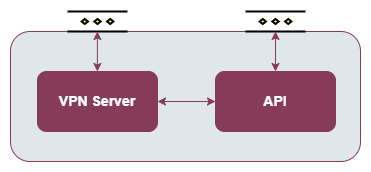

.. _VPN enabler:

###########
VPN enabler
###########

.. contents::
  :local:
  :depth: 1

***************
Introduction
***************
This enabler will facilitate the access to a node or device from a different network to the site's private network using a public network (e.g., the Internet) or a non-trusted private network.

***************
Features
***************
This enabler act as a VPN server (based on WireGuard VPN) that allows client connections to the created VPN network and, if allowed, to the host machine network. For that reason, this enabler can allow the connection 
to a Kubernetes node machine and its private network from a machine allocated in a different private network.
Furthermore, a REST API is included to facilitate the administration of the VPN network.

VPN clients information can be persisted in the LTSE or in an independent MongoDB instance.

.. note:: 
  At this point in time, this enabler is limited to one replica in each Kubernetes deployment and cannot be auto scaled due to its specific functionalities. If there are more than one replica, each pod will act as an independent VPN 
  because each pod will have its own WireGuard network interface at the container level which won't be synchronized among them. For example, a new client will only be created or deleted in one pod.

.. note:: 
  To connect two host machines directly using a VPN (for instance, to add it as a remote k8s cluster/node via VPN), it is recommended to use a VPN without using the containerised version. 
  For that, it can be followed the "Developer guide" in order to run the app using Node.js or create a custom Service in Linux. In addition, another option is to use directly the Wireguard
  commands, but the functionalities provided by the API will be lost.

*********************
Place in architecture
*********************
The VPN enabler is located in the Smart Network and Control plane of the ASSIST-IoT architecture.

The enabler is composed of two elements:

- **VPN Server**: the core of the VPN, the clients will connect to this component.
- **API REST**: an API REST is provided to manage the VPN clients (create, delete, enable and disable) and to obtain information about the VPN network and its clients.

***************
User guide
***************

REST API endpoints
*******************
+--------+-----------------+-----------------------------------------------------------------------+---------------------------------------------+-------------------------------------------------------------------------------------------------------------------------------+
| Method | Endpoint        | Description                                                           | Payload (if needed)                         | Response format                                                                                                               |
+========+=================+=======================================================================+=============================================+===============================================================================================================================+
| GET    | /version        | Get the enabler version                                               |                                             | { "enabler": String, "version": String }                                                                                      |
+--------+-----------------+-----------------------------------------------------------------------+---------------------------------------------+-------------------------------------------------------------------------------------------------------------------------------+
| GET    | /health         | Get the enabler's health status                                       |                                             |                                                                                                                               |
+--------+-----------------+-----------------------------------------------------------------------+---------------------------------------------+-------------------------------------------------------------------------------------------------------------------------------+
| GET    | /api-export     | Get the OpenAPI specification in JSON                                 |                                             | OpenAPI specification in JSON                                                                                                 |
+--------+-----------------+-----------------------------------------------------------------------+---------------------------------------------+-------------------------------------------------------------------------------------------------------------------------------+
| GET    | /info           | Get information of the WireGuard network interface                    |                                             | WireGuard output command in plain text                                                                                        |
+--------+-----------------+-----------------------------------------------------------------------+---------------------------------------------+-------------------------------------------------------------------------------------------------------------------------------+
| GET    | /info/conf      | Get the configuration file of the WireGuard network interface         |                                             | WireGuard configuration file in plain text                                                                                    |
+--------+-----------------+-----------------------------------------------------------------------+---------------------------------------------+-------------------------------------------------------------------------------------------------------------------------------+
| GET    | /keys           | Obtain the public, private and pre-shared keys to create a new client |                                             | {"public":String, "private":String, "preshared":String}                                                                       |
+--------+-----------------+-----------------------------------------------------------------------+---------------------------------------------+-------------------------------------------------------------------------------------------------------------------------------+
| POST   | /client         | Create a new client                                                   | {"publicKey":String, "presharedKey":String} | {"serverPublicKey":String, "serverIP":String, "serverPort":Integer, "clientIP":String, "allowedIPs":String, "message":String} |
+--------+-----------------+-----------------------------------------------------------------------+---------------------------------------------+-------------------------------------------------------------------------------------------------------------------------------+
| DELETE | /client         | Delete a client                                                       | {"publicKey":String}                        |                                                                                                                               |
+--------+-----------------+-----------------------------------------------------------------------+---------------------------------------------+-------------------------------------------------------------------------------------------------------------------------------+
| PUT    | /client/enable  | Enable a client                                                       | {"publicKey":String}                        |                                                                                                                               |
+--------+-----------------+-----------------------------------------------------------------------+---------------------------------------------+-------------------------------------------------------------------------------------------------------------------------------+
| PUT    | /client/disable | Disable a client                                                      | {"publicKey":String}                        |                                                                                                                               |
+--------+-----------------+-----------------------------------------------------------------------+---------------------------------------------+-------------------------------------------------------------------------------------------------------------------------------+

Generate a WireGuard server private key
******************************************

Using the WireGuard cli:

  .. code-block:: bash

    wg genkey

Create a VPN client
***********************

1. Generate the client keys (public, private and pre-shared) sending an HTTP GET request to the /keys endpoint. 

  .. code-block:: bash

    curl --location --request GET 'http://<wg_api_IP_address>:<wg_api_port>/keys'
  

Response example:

    .. code-block:: json

      {
        "public": "RfGgIjkPJC9U6b0OE8UHdnJwAA4hCV1FfQOX1/FaIzo=",
        "private": "YDhkBXyym+L255TwBGHWXXWcaMqaGqlJLLyc4XyyE18=",
        "preshared": "FIOSD2ErZISlHwFsBRK5RVyd7ENhvJ4x3W101BoewqQ="
      }

2. Create a client in the API making an HTTP POST request to the /client endpoint, including the generated public and pre-shared keys in the request body.

  .. code-block:: bash

    curl --location --request POST '<wg_api_IP_address>:<wg_api_port>/client' \
        --header 'Content-Type: application/json' \
        --data-raw '{
            "publicKey": <client_public_key>,
            "presharedKey": <client_preshared_key>
        }'

Response example:

  .. code-block:: json

    {
      "serverPublicKey": "iJT+CW4QoWNDIDo763CPx1TZ3x9bSNTN5t0uQbzo5jo=",
      "serverIP": "192.168.1.67",
      "serverPort": "51820",
      "clientIP": "192.168.2.56/32",
      "allowedIPs": "0.0.0.0/0,::/0",
      "message": "Peer added successfully"
    }

3. Create the WireGuard client configuration file (**.conf** file extension) with the data obtained in the responses of the last two requests. 
   A complete example filled with the responses of the last two example requests is provided, and, furtheremore, a configuration file template can be found in the next subsection.

  ::

    [Interface]
    PrivateKey = YDhkBXyym+L255TwBGHWXXWcaMqaGqlJLLyc4XyyE18=
    Address = 192.168.2.56/32

    [Peer]
    PublicKey = iJT+CW4QoWNDIDo763CPx1TZ3x9bSNTN5t0uQbzo5jo=
    PresharedKey = FIOSD2ErZISlHwFsBRK5RVyd7ENhvJ4x3W101BoewqQ=
    AllowedIPs = 0.0.0.0/0,::/0
    Endpoint = 192.168.1.67:51820
    PersistentKeepalive = 25

.. note:: 
  The *AllowedIPs* field must be filled by the user depending on the behaviour that expects from the VPN. A value of *0.0.0.0/0,::/0* will redirect all the traffic (including the internet) through the VPN, 
  . Specifying a subnetwork (e.g. 10.1.243.0/24), only the traffic with a destination inside this subnetwork will be sent via the VPN.

4. Connect to the VPN using a WireGuard client program. The instructions are provided in the *Connect to the VPN* subsection.

Client configuration file template
**********************************

::

  [Interface]
  PrivateKey = <wg_client_private_key>
  Address = <wg_client_IP_address>

  [Peer]
  PublicKey = <wg_server_public_key>
  PresharedKey = <wg_preshared_key>
  AllowedIPs = <wg_allowed_IPs>
  Endpoint = <wg_server_IP_address_or_DNS_name>:<wg_server_udp_port>
  PersistentKeepalive = <number_of_seconds> (no mandatory)

Connect to the VPN
******************

In Windows, use the TunSafe VPN client (https://tunsafe.com/):

1. Create the WireGuard configuration file
2. Import the configuration file
3. Connect to the VPN

In Linux, use the WireGuard cli.

1. Install WireGuard and WireGuard tools
2. Create the WireGuard configuration file
3. Create the WireGuard interface and connect to the VPN:

  .. code-block:: bash

    sudo wg-quick up <path_to_wg_config_file>

4. To disconnect:

  .. code-block:: bash

    sudo wg-quick down <path_to_wg_config_file>

***************
Prerequisites
***************
In Linux, set these sysctl values:

  ::

    sysctl -w net.ipv4.ip_forward=1
    sysctl -w net.ipv4.conf.all.src_valid_mark=1

Or edit these values in the */etc/sysctl.conf* file.

***************
Installation
***************
The enabler is provided as a Helm chart.

*********************
Configuration options
*********************
The enabler can be configured using the following environment variables:

- **WG_PRIVATE_KEY**: private key for the WireGuard server. To generate it, see the *Generate a WireGuard server private key* section.
- **API_PORT**: TCP port where it is exposed the API.
- **SERVER_IP**: public IP or DNS name of the machine where runs the VPN enabler.
- **WG_SUBNET**: internal subnet of the WireGuard interface. The value must be the first IP of the subnet in CIDR format (<subnet_first_ip>/<subnet_mask_bits>, e.g., for the subnet 192.168.2.0/24, the value must be 192.168.2.1/24). This parameter is important because determines the maximum number of clients of the VPN. For the example subnet, the maximum number of clients will be 253.
- **WG_PORT**: UDP port where it is exposed the WireGuard network interface.
- **PEER_ALLOWED_IPS**: allowed subnets for the clients. A value of *0.0.0.0/0,::/0* will allow the clients to connect to every network via the VPN, including to the internet. Specifying a subnetwork (e.g. 10.1.243.0/24) the client will only be able to reach this subnetwork.
- **MONGODB_HOST**: host of the MongoDB database.
- **MONGODB_PORT**: port number of the MongoDB database.
- **MONGODB_USER**: user of the MongoDB database.
- **MONGODB_PASS**: password for the selected user of the MongoDB database.
- **LTSE**: boolean value to use the LTSE or a MongoDB instance to store the VPN clients information.
- **LTSE_URL**: URL of the LTSE enabler.
- **LTSE_INDEX**: Elasticsearch index to store the VPN clients information.

***************
Developer guide
***************

Local code development
**********************

1. Install WireGuard and WireGuard tools in the machine: https://www.wireguard.com/install/ 
2. Create a WireGuard network interface for testing. A configuration file example for creating the interfacecan be found at the section below.
3. In Linux, run the app as *root* or add *sudo* before all the *wg* commands to run the API without being containerized, e.g.:

  .. code-block:: javascript

    utils/index.js, line 34:    await exec(`wg ...   -->   await exec(`sudo wg ... )

4. Install the dependencies. Execute: 

  .. code-block:: bash

    npm install

5. Run the enabler in development mode. Execute:

  .. code-block:: bash

    npm run server

WireGuard network interface configuration file
**********************************************

Template
--------

::

  [Interface]
  Address = <wg_network_interface_IP_address>
  PostUp = iptables -A FORWARD -i <wg_network_interface> -j ACCEPT; iptables -t nat -A POSTROUTING -o <host_network_interface> -j MASQUERADE
  PostDown = iptables -D FORWARD -i <wg_network_interface> -j ACCEPT; iptables -t nat -D POSTROUTING -o <host_network_interface> -j MASQUERADE
  ListenPort = <wg_udp_port>
  PrivateKey = <wg_private_key>

.. note:: 
  A possible feature to add in next releases is to bring new configurations and use cases for the VPN, or to improve the configuration possibilities of the VPN network.

Example: allow the client to redirect all the traffic through the VPN
--------------------------------------------------------------------------

::

  [Interface]
  Address = 192.168.2.1/24
  PostUp = iptables -A FORWARD -i wg0 -j ACCEPT; iptables -t nat -A POSTROUTING -o ens18 -j MASQUERADE
  PostDown = iptables -D FORWARD -i wg0 -j ACCEPT; iptables -t nat -D POSTROUTING -o ens18 -j MASQUERADE
  ListenPort = 51820
  PrivateKey = qAuVUEbmcI3ofLsjJmQ6+RtEejoNX+WHs7QOsIccn0Y=

Example: allow the client to only redirect the traffic to the configured local network (e.g. 10.0.0.0/24)
----------------------------------------------------------------------------------------------------------

::

  [Interface]
  Address = 192.168.2.1/24
  PostUp = iptables -I FORWARD -i wg0 -j DROP; iptables -I FORWARD -i wg0 -d 10.0.0.0/24 -j ACCEPT
  PostDown = iptables -D FORWARD -i wg0 -j DROP; iptables -D FORWARD -i wg0 -d 10.0.0.0/24 -j ACCEPT
  ListenPort = 51820
  PrivateKey = qAuVUEbmcI3ofLsjJmQ6+RtEejoNX+WHs7QOsIccn0Y=

Example: allow the client to only redirect the traffic to the VPN network
---------------------------------------------------------------------------

::

  [Interface]
  Address = 192.168.2.1/24
  PostUp = iptables -I FORWARD -i wg0 -j DROP;
  PostDown = iptables -I FORWARD -i wg0 -j DROP;
  ListenPort = 51820
  PrivateKey = qAuVUEbmcI3ofLsjJmQ6+RtEejoNX+WHs7QOsIccn0Y=

***************************
Version control and release
***************************
Version 1.0.0. Improvements and new functionalities will be added in future versions.

***************
License
***************
Apache License Version 2.0

*********************
Notice (dependencies)
*********************

ASSIST-IoT - Architecture for Scalable, Self-\*, human-centric, Intelligent, Se-cure, and Tactile next generation IoT

This project has received funding from the European Union's Horizon 2020
research and innovation programme under grant agreement No 957258.

VPN enabler

Copyright 2020-2023 Universitat Politècnica de València

I. Included Software

- Wireguard (https://www.wireguard.com/), GPLv2 license

II. Used Software

- types/node (https://github.com/DefinitelyTyped/DefinitelyTyped), MIT license
- types/webidl-conversions (https://github.com/DefinitelyTyped/DefinitelyTyped), MIT license
- types/whatwg-url (https://github.com/DefinitelyTyped/DefinitelyTyped), MIT license
- accepts 1.3.7 (https://github.com/jshttp/accepts), MIT license
- array-flatten 1.1.1 (https://github.com/blakeembrey/array-flatten), MIT license
- base64-js 1.5.1 (https://github.com/beatgammit/base64-js), MIT license
- body-parser 1.19.0 (https://github.com/expressjs/body-parser), MIT license
- bson 4.5.3 (https://github.com/mongodb/js-bson), Apache-2.0 license
- buffer 5.7.1 (https://github.com/feross/buffer), MIT license
- bytes 3.1.0 (https://github.com/visionmedia/bytes.js), MIT license
- content-disposition 0.5.3 (https://github.com/jshttp/content-disposition), MIT license
- content-type 1.0.4 (https://github.com/jshttp/content-type), MIT license
- cookie-signature 1.0.6 (https://github.com/visionmedia/node-cookie-signature), MIT license
- cookie 0.4.0 (https://github.com/jshttp/cookie), MIT license
- debug 2.6.9 (https://github.com/visionmedia/debug), MIT license
- denque 2.0.1 (https://github.com/invertase/denque), Apache-2.0 license
- depd 1.1.2 (https://github.com/dougwilson/nodejs-depd), MIT license
- destroy 1.0.4 (https://github.com/stream-utils/destroy), MIT license
- ee-first 1.1.1 (https://github.com/jonathanong/ee-first), MIT license
- encodeurl 1.0.2 (https://github.com/pillarjs/encodeurl), MIT license
- escape-html 1.0.3 (https://github.com/component/escape-html), MIT license
- etag 1.8.1 (https://github.com/jshttp/etag), MIT license
- express 4.17.1 (https://github.com/expressjs/express), MIT license
- finalhandler 1.1.2 (https://github.com/pillarjs/finalhandler), MIT license
- forwarded 0.2.0 (https://github.com/jshttp/forwarded), MIT license
- fresh 0.5.2 (https://github.com/jshttp/fresh), MIT license
- http-errors 1.7.2 (https://github.com/jshttp/http-errors), MIT license
- iconv-lite 0.4.24 (https://github.com/ashtuchkin/iconv-lite), MIT license
- ieee754 1.2.1 (https://github.com/feross/ieee754), BSD-3-Clause license
- inherits 2.0.3 (https://github.com/isaacs/inherits), ISC license
- ipaddr.js 1.9.1 (https://github.com/whitequark/ipaddr.js), MIT license
- media-typer 0.3.0 (https://github.com/jshttp/media-typer), MIT license
- memory-pager 1.5.0 (https://github.com/mafintosh/memory-pager), MIT license
- merge-descriptors 1.0.1 (https://github.com/component/merge-descriptors), MIT license
- methods 1.1.2 (https://github.com/jshttp/methods), MIT license
- mime-db 1.50.0 (https://github.com/jshttp/mime-db), MIT license
- mime-types 2.1.33 (https://github.com/jshttp/mime-types), MIT license
- mime 1.6.0 (https://github.com/broofa/node-mime), MIT license
- mongodb-connection-string-url 2.1.0 (https://github.com/mongodb-js/mongodb-connection-string-url), Apache-2.0 license
- mongodb 4.1.3 (https://github.com/mongodb/node-mongodb-native), Apache-2.0 license
- ms 2.0.0 (https://github.com/zeit/ms), MIT license
- ms 2.1.1 (https://github.com/zeit/ms), MIT license
- negotiator 0.6.2 (https://github.com/jshttp/negotiator), MIT license
- netmask 2.0.2 (https://github.com/rs/node-netmask), MIT license
- on-finished 2.3.0 (https://github.com/jshttp/on-finished), MIT license
- parseurl 1.3.3 (https://github.com/pillarjs/parseurl), MIT license
- path-to-regexp 0.1.7 (https://github.com/component/path-to-regexp), MIT license
- proxy-addr 2.0.7 (https://github.com/jshttp/proxy-addr), MIT license
- punycode 2.1.1 (https://github.com/bestiejs/punycode.js), MIT license
- qs 6.7.0 (https://github.com/ljharb/qs), BSD-3-Clause license
- range-parser 1.2.1 (https://github.com/jshttp/range-parser), MIT license
- raw-body 2.4.0 (https://github.com/stream-utils/raw-body), MIT license
- safe-buffer 5.1.2 (https://github.com/feross/safe-buffer), MIT license
- safer-buffer 2.1.2 (https://github.com/ChALkeR/safer-buffer), MIT license
- saslprep 1.0.3 (https://github.com/reklatsmasters/saslprep), MIT license
- send 0.17.1 (https://github.com/pillarjs/send), MIT license
- serve-static 1.14.1 (https://github.com/expressjs/serve-static), MIT license
- setprototypeof 1.1.1 (https://github.com/wesleytodd/setprototypeof), ISC license
- sparse-bitfield 3.0.3 (https://github.com/mafintosh/sparse-bitfield), MIT license
- statuses 1.5.0 (https://github.com/jshttp/statuses), MIT license
- toidentifier 1.0.0 (https://github.com/component/toidentifier), MIT license
- tr46 2.1.0 (https://github.com/jsdom/tr46), MIT license
- type-is 1.6.18 (https://github.com/jshttp/type-is), MIT license
- unpipe 1.0.0 (https://github.com/stream-utils/unpipe), MIT license
- utils-merge 1.0.1 (https://github.com/jaredhanson/utils-merge), MIT license
- vary 1.1.2 (https://github.com/jshttp/vary), MIT license
- webidl-conversions 6.1.0 (https://github.com/jsdom/webidl-conversions), BSD-2-Clause license
- whatwg-url 9.1.0 (https://github.com/jsdom/whatwg-url), MIT license

III. List of licenses

- GPLv2 license (https://www.gnu.org/licenses/old-licenses/gpl-2.0.html)
- Apache-2.0 license (https://www.apache.org/licenses/LICENSE-2.0)
- MIT license (https://opensource.org/licenses/MIT)
- ISC license (https://opensource.org/licenses/ISC)
- BSD-3-Clause license (https://opensource.org/licenses/BSD-3-Clause)
- BSD-2-Clause license (https://opensource.org/licenses/BSD-2-Clause)
