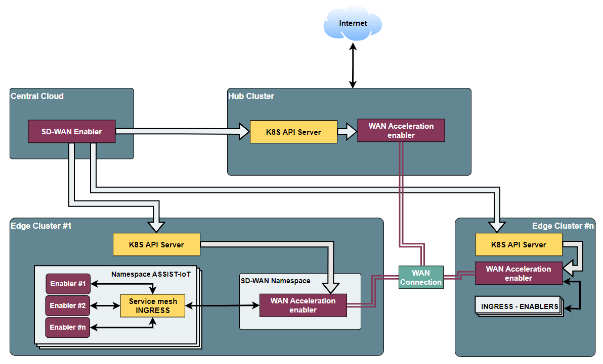
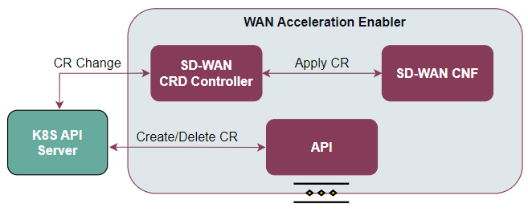

.. _WAN acceleration enabler:

########################
WAN-Acceleration enabler
########################

.. contents::
  :local:
  :depth: 1

***************
Introduction
***************
The WAN acceleration enabler will incorporate features that will improve the connections among the clusters and/or sites managed by ASSIST-IoT, and towards the Internet. 
It will work jointly with the SD-WAN enabler to establish scalable, private tunnels and 
introduce optimisation features such as traffic prioritisation.

***************
Features
***************
This enabler will be in charge of implementing features to support multiple WAN links, firewalling, tunnelling setups and traffic control, including traffic  shaping. Depending on its configuration (via the SD-WAN enabler), it can act as:

- An SD-WAN Edge component, present in each K8s cluster, with a dedicated K8s controller and a Containerised Network function (CNF) through which traffic goes through it. The CNF will embed functions to setup aspects such related to IPSec, firewalling, DNS, DHCP and WAN link management, whereas a Custom Definition Resource (CRD) controller contains all the sub-controllers to create, query and configure these features.
- A SD-WAN hub, which will act as a middleware among clusters and/or between them and the Internet, enabling the introduction of additional CNFs related to security, filtering, traffic shaping, etc. Once the basic features are implemented, the incorporation of additional ones (as CNFs) will be evaluated.

*********************
Place in architecture
*********************
The WAN Acceleration enabler is located in the Smart Network and Control plane of the ASSIST-IoT 
architecture. In particular, it belongs to the building block related to VNFs, specifically
(i) for provisioning private networks over public ones, jointly with the SD-WAN enabler, and
(ii) for supporting VNFs chaining (containerised, thus CNFs).

.. figure:: ./images/wan_acceleration_enabler/place-in-architecture.png  
   :alt: Place of the WAN Acceleration enabler within the Smart Network and Control Plance architecture
   :align: center
   
   Place of the WAN Acceleration enabler within the Smart Network and Control Plance architecture

The following diagram aims at describing the global operation of the SD-WAN architecture,
including the SD-WAN enabler and instances of the WAN Acceleration enabler (each of them composed by an SD-WAN
custom k8s controller and an SD-WAN CNF).

   
   SD-WAN overall architecture

This overall SD-WAN architecture is guided by the following logic:

1. With the SD-WAN enabler, a user can define overlays, which are abstract groups of K8s clusters whose connections will be managed by the SD-WAN enabler.
2. Through this enabler, the user can define IPSec policies and IP ranges to later on establish tunnels among those clusters, which should have previously deployed an instance of the WAN acceleration enabler.
3. These clusters can act as edges or hubs. Hubs are particular instances of the WAN acceleration enabler that allow chaining network functions that will process the traffic among clusters and before navigating from/towards the Internet.
4. Besides, interacting with the K8s API (not directly with a WAN Acceleration's CNF), a user can define firewall, wan and traffic optimisation policies in the edge clusters.

As aforementioned, the enabler is composed of two main elements, as one can see in the figure below:

- **CRD Controller**: Component that will receive API calls from the K8s API of the cluster to configure the CNF component.
- **SD-WAN CNF**: The CNF will embed functions to setup aspects such related to IPSec, firewalling, DNS, DHCP and WAN link management, exposing an API to be controlled/queried.

   WAN Acceleration enabler architecture

***************
User guide
***************

This enabler is not prepared to integrate a standard API, but works in conjunction with SD-WAN Enabler. Once WAN-Acceleration is installed, the SD-WAN Enabler REST API can be run. The user guide for configuration and main usages is available in the SD-WAN Enabler documentation.

***************
Prerequisites
***************
In this case, the enabler required some CNI plugins for K8s:

* Calico.
* Multus daemonset.
* OVN daemonset.
* OVN networks.
* Cert manager to manage connection between networks.

In addition, the enabler will require provisioning the *kubeconfig* files of the clusters to manage and  information about the involved certificates.

***************
Installation
***************
Prerrequisites are available to install in shell bash script named "kubernetes.sh". Rest of installation are done implemented by k8s manifests. In future releases, the installation will be by helm charts.

Steps of installation are avaible in gitlab repository.

*********************
Configuration options
*********************
An analysis of the configurations to be modifiable by a user is under assessment.
The exposed port for accessing the API will be one of the available options.

***************
Developer guide
***************
Will be determined after the release of the enabler.

***************************
Version control and release
***************************
Version 1.0. First release. Under development.

***************
License
***************
Will be determined after the release of the enabler..

*********************
Notice (dependencies)
*********************
This enabler can work in an standalone fashion to offer network-related features
related mostly to firewalling. It will be fully functional if it works jointly with
a SD-WAN enabler, enabling the setup of secured tunnels between clusters.
