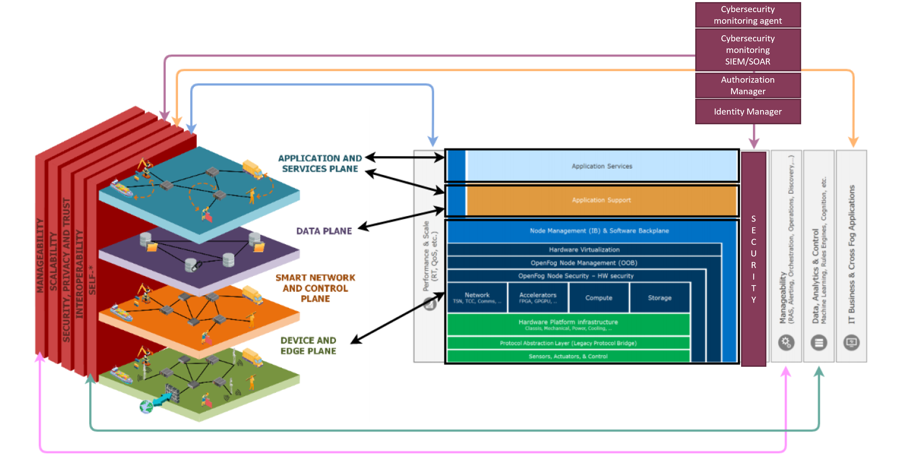

.. _Identity Manager enabler:

########################
Identity Manager enabler
########################

.. contents::
  :local:
  :depth: 1

***************
Introduction
***************
Using OAuth2 protocol, it will offer a federated identification service where service requester and provider will be able to establish a trusted relation without previously knowing each other. This way a secure identification process is completed without the service provider having received the re-quester credentials.

***************
Features
***************

- Identity Management enabler will store user credentials and data. Using OAuth2 protocol, it will offer a federated identification service where service requester
  and provider will be able to establish a trusted relation without previously knowing each other.

- When a requester asks for a service, the provider will redirect the request to a third-party identity server, known by both parties, so the requester can identify
  itself and obtain a session token. The service provider will ask the identity server to validate the token and provide data about the requester.
  This way a secure identification process is completed without the service provider having received the requester credentials.

- Identity Manager enabler admin 
  Contains the user or entities credentials store and data. It will offer a OpenId/OAuth2 interface. 

- Identity Manager enabler authentication 
  Offers will offer a OpenId/OAuth2 interface and validates agains the locla or user db. 

- Local user db 
  Contains the user or entities credentials store and data. 

*********************
Place in architecture
*********************

***************
User guide
***************

The identification server will offer two interfaces, OAuth2 for identity management and a REstFull interface for server management.

The API for management has the following specification:

+--------+-------------+----------------------------------------------------+----------------+
| Method | Endpoint    | Description                | Payload (if needed) | Response format  |
+========+=============+============================+=====================+==================+
|  GET   | /health     | Health check API endpoint  |                     | JSON             |
+--------+-------------+----------------------------+---------------------+------------------+
|  GET   | /api-export | Data import / export       |                     | JSON             |
+--------+-------------+----------------------------+---------------------+------------------+
|  GET   | /version​    | Current version            |                     | JSON             |
+--------+-------------+----------------------------+---------------------+------------------+
|  GET   | /metrics​    | Metric retrieval           |                     | JSON             |
+--------+-------------+----------------------------+---------------------+------------------+

The OAuth2 interface is provided based on the standard.

***************
Prerequisites
***************

The enabler is prepared to run in a K8S environment. The creation is prepared to be autonomous in such a working environment.

The service consumer will be required to communicate with the server using the standard OAuth2 interface.

***************
Installation
***************

Enabler is provided as a Helm chart. Refer to specific deployment instructions.

*********************
Configuration options
*********************

The IdM options for the rest API to connect are available in the **lib\config.py** file.

::

    remote_address: str = "keycloak"
    remote_port: str = "8080"
    remote_username: str = "admin"
    remote_password: str = "xxxx"
    remote_realm: str = "master"
    remote_https: str = "no"

    kc_api_token_url_pre: str = "/auth/realms/"
    kc_api_token_url_post: str = "/protocol/openid-connect/token"
    kc_api_serverinfo_url: str = "/auth/admin/serverinfo"

***************
Developer guide
***************

The IDM enabler exchanges data with the client application via REST API, as it is shown in previous section.
They way this exchange data works is at follows:

1)	The end user, via the client app, tries to access the service. If the app has not been logged against the IDM yet, it won’t have the required access-code and token. 
2)	The IDM will prompt a page to enter the login credentials (user + password). The IDM will provide an access code that must be sent as an url parameter named ‘code’ on further communications with the IDM (for example to be able to get the token). The app must save the access code and token during the session.
3)	The client app, then, with the access code, must request the token to the IDM.
4)	With the token received, the app can retrieve from the IDM the user info needed to exchange later with the authserver enabler or for the proper operation of the client app (username and user role, if provided)

User info format from Keycloack is the following:

::

  { 
  "sub":"49aa5eb0-3f3a-4aa2-8fcb-fd609fafe5b9",
  "resource_access":{ 
    "mobileapp":{
      "roles":[ "mobileapp-admin"] 
    },
    "account":{ "roles":[ "manage-account", "manage-account-links", "view-profile" ] }
  },
  "email_verified":false,
  "preferred_username":"demo_truck1"
  }

In this example:
  - IdM user is "demo_truck1"
  - IdM user Role for the App (Service) "mobileapp" is  "mobileapp-admin". Be sure to activate "Add to userinfo" Client Scopes-> roles -> Mappers -> client roles configurations.

***************************
Version control and release
***************************

Version 0.1. Under development.

***************
License
***************

Keycloak is licensed under Apache License Version 2.0.

RestEnabler module is propriety of S21Sec.

********************
Notice(dependencies)
********************
Will be determined after the release of the enabler.
