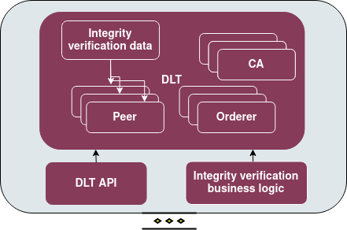

.. _Data integrity verification enabler:

###################################
Data integrity verification enabler
###################################

.. contents::
  :local:
  :depth: 1

***************
Introduction
***************
This is an enabler responsible for providing DLT-based data integrity verification mechanisms that allow data consumers to verify the integrity of any data at question.

***************
Features
***************
Network peers host smart contract (chaincode) which includes the data integrity business logic. It stores hashed data in a data structure and it compares it with the hashed data of the queries made by clients in order to verify their integrity.
 
*********************
Place in architecture
*********************
The Integrity Verification enabler is part of the vertical plane DLT enablers.

***************
User guide
***************
The enabler has the following API endpoints.

+--------+-----------------+----------------------------------------------------------------+---------------------+--------------------------------------------------------------------------------------+
| Method | Endpoint        | Description                                                    | Payload (if needed) | Response format                                                                      |
+========+=================+================================================================+=====================+======================================================================================+
| POST   | /api/insert     | Stores hashed data                                             | Described below     | Transaction key                                                                      |
+--------+-----------------+----------------------------------------------------------------+---------------------+--------------------------------------------------------------------------------------+
| POST   | /api/insertjson | Stores json data in the ledger                                 | Described below     | Transaction key                                                                      |
+--------+-----------------+----------------------------------------------------------------+---------------------+--------------------------------------------------------------------------------------+
| POST   | /api/verify     | Verifies is the hash of the data inserted in the ledger exists | Described below     | String: If the hashes match the message is: "Hashes match", if not: "Hash not found" |
+--------+-----------------+----------------------------------------------------------------+---------------------+--------------------------------------------------------------------------------------+
| GET    | /api/gets       | Gets the list of all stored hashed entries                     | No payload          | List of stored entries                                                               |
+--------+-----------------+----------------------------------------------------------------+---------------------+--------------------------------------------------------------------------------------+

For the post requests the payload is:

.. code:: python

  {
    "Value":"String",
  }

***************
Prerequisites
***************
Kubernetes cluster, Helm, Docker

***************
Installation
***************

**Important notice**

You will have to use the nodeSelector in order to deploy all DLT components in a single node, so in values.yaml file:

.. code:: bash

  # Deploy all the components in the same node. Replace k8s-node-02 with your node name.
  enablerNodeSelector: 
    kubernetes.io/hostname: k8s-node-02 

For quick installation use the name integrity (recommended)

.. code:: bash

  cd data_integrity_verification
  helm install integrity .

In case you want to use another name:

.. code:: bash

  cd data_integrity verification
  ./scripts/packageCC.sh

This will ask you for a $releaseName. Use the same $releaseName on you helm install command. 
Each time you want to use another name, you will have to run the packageCC.sh script and do it while in the data_integrity_verification folder.

*********************
Configuration options
*********************
The enabler is prepared to run in a K8s environment. The creation is prepared to be autonomous in such a working environment. The service consumer will be required to communicate with the server using the described Rest interface. In general there are several environment variables that can be configured, which is not recommended. 
The main configurable variable is the dltapi's nodePort which is preset to 31999.

***************
Developer guide
***************

**Check the installation**

You need to follow the logs of clipeer0org1. Get the pods and copy the name of the pod.

.. code:: bash

  kubectl get po
  kubectl logs -f $clipeer0org1_pod_name

When it is over you should be able to see in all chaincodes status 200

.. code:: bash

  INFO [chaincodeCmd] chaincodeInvokeOrQuery -> Chaincode invoke successful. result: status:200 

**In case you want to clean the pvc**

Important note, you need to deploy the pod inside the same node, so in dltinspectionpod.yaml you need to add the node name:

.. code:: bash

  nodeSelector:
    kubernetes.io/hostname: name_of_the_node

Inside the logging_auditing fodler:

.. code:: bash
  kubectl apply -f dltinspectionpod.yaml
  kubectl exec -it inspect  -- sh

Inside the container:

.. code:: bash
  rm -r data
  exit

It returns resource is busy, but it gets cleaned.
Back to the logging_auditing fodler:

.. code:: bash
  kubectl delete pod inspect

***************************
Version control and release
***************************
Version 0.2.0. Fully functional and able to retrieve all data even if the cluster fails.

***************
License
***************
Integrity verification enabler is under BSD 3-Clause "New" or "Revised" License.

********************
Notice(dependencies)
********************
ASSIST-IoT - Architecture for Scalable, Self-*, human-centric, Intelligent, Se-cure, and Tactile next generation IoT

This project has received funding from the European Union's Horizon 2020 research and innovation programme under grant agreement No 957258.

The software included is:

- Hyperledger Fabric (https://github.com/hyperledger/fabric) Apache 2.0 License

- Go programming language (https://github.com/golang/go) BSD 3-Clause "New" or "Revised" License
  
- Express JS (https://github.com/expressjs/express) MIT License
