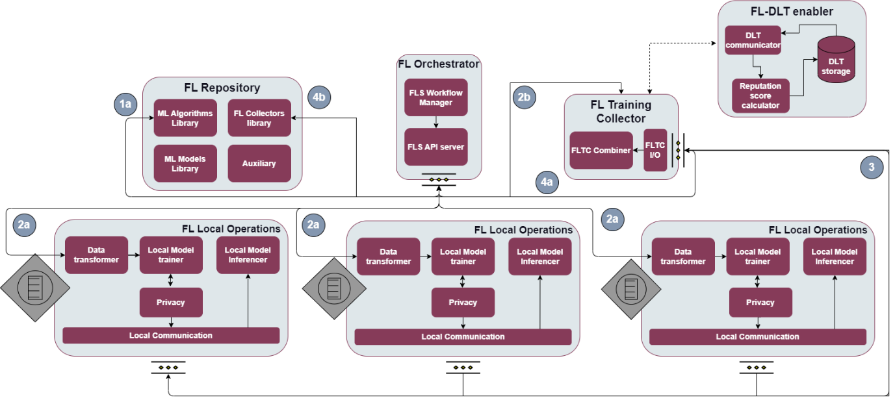

.. _DLT-based FL enabler:

############
DLT-based FL enabler
############

.. contents::
  :local:
  :depth: 1

***************
Introduction
***************
The DLT-based FL enabler is a system that provides a secure reputation mechanism for all local operators in a federated learning (FL) system. The reputation mechanism serves as a safeguard against free-riders and malicious adversaries, ensuring that only reputable local operators can contribute to the global model.

***************
Features
***************
The DLT can act as a component to manage AI contextual information and prevent any alteration to the data. The alteration of data is a threat to the Federated Learning approach and the DLT can help in mitigating the threat. Moreover, the enabler allows mitigating single-point of failures. Finally, the enabler can be charged with validating the individually trained models to rule out malicious updates that can harm the global model.

*********************
Place in architecture
*********************
The DLT-based FL enabler is part of the vertical plane DLT enablers.

***************
User guide
***************
The enabler has the following API endpoints.

+--------+--------------------------+------------------------------------------------------+---------------------+-----------------------------------+
| Method | Endpoint                 | Description                                          | Payload (if needed) | Response format                   |
+========+==========================+======================================================+=====================+===================================+
| POST   | /api/upload              | Upload files with weights, aggregated and per client | File array          | Transaction key                   |
+--------+--------------------------+------------------------------------------------------+---------------------+-----------------------------------+
| GET    | /api/FLDLT/gets          | Get list of all the entries of each training round   | No payload          | List of stored entries            |
+--------+--------------------------+------------------------------------------------------+---------------------+-----------------------------------+
| POST   | /api/FLDLT/getbyid       | Get client list by specific id                       | {"ID":"String"}     | List of clients                   |
+--------+--------------------------+------------------------------------------------------+---------------------+-----------------------------------+
| GET    | /api/FLDLT/getclients    | Get list of all clients with their scores            | No payload          | List of clients with their scores |
+--------+--------------------------+------------------------------------------------------+---------------------+-----------------------------------+
| POST   | /api/FLDLT/getbyidclient | Get client's score by specific client id             | {"ID":"String"}     | Client with score                 |
+--------+--------------------------+------------------------------------------------------+---------------------+-----------------------------------+

***************
Prerequisites
***************
Kubernetes cluster, Helm, Docker

***************
Installation
***************

**Important notice**

You will have to use the nodeSelector in order to deploy all DLT components in a single node, so in values.yaml file:

.. code:: bash

  # Deploy all the components in the same node. Replace k8s-node-02 with your node name.
  enablerNodeSelector: 
    kubernetes.io/hostname: k8s-node-02 

For quick installation use the name fl (recommended)

.. code:: bash

  cd dlt_based_fl
  helm install fl .

In case you want to use another name:

.. code:: bash

  cd dlt_based_fl
  ./scripts/packageCC.sh

This will ask you for a $releaseName. Use the same $releaseName on you helm install command. 
Each time you want to use another name, you will have to run the packageCC.sh script and do it while in the dlt_based_fl folder.

*********************
Configuration options
*********************
The enabler is prepared to run in a K8s environment. The creation is prepared to be autonomous in such a working environment. The service consumer will be required to communicate with the server using the described Rest interface. In general there are several environment variables that can be configured, which is not recommended. 
The main configurable variable is the dltapi's nodePort which is preset to 31999.

***************
Developer guide
***************

**Check the installation**

You need to follow the logs of clipeer0org1. Get the pods and copy the name of the pod.

.. code:: bash

  kubectl get po
  kubectl logs -f $clipeer0org1_pod_name

When it is over you should be able to see in all chaincodes status 200

.. code:: bash

  INFO [chaincodeCmd] chaincodeInvokeOrQuery -> Chaincode invoke successful. result: status:200 

**In case you want to clean the pvc**

Important note, you need to deploy the pod inside the same node, so in dltinspectionpod.yaml you need to add the node name:

.. code:: bash

  nodeSelector:
    kubernetes.io/hostname: name_of_the_node

Inside the logging_auditing fodler:

.. code:: bash
  kubectl apply -f dltinspectionpod.yaml
  kubectl exec -it inspect  -- sh

Inside the container:

.. code:: bash
  rm -r data
  exit

It returns resource is busy, but it gets cleaned.
Back to the logging_auditing fodler:

.. code:: bash
  kubectl delete pod inspect

***************************
Version control and release
***************************
Version 0.2.0. Fully functional and able to retrieve all data even if the cluster fails.

***************
License
***************
DLT-based FL enabler is under BSD 3-Clause "New" or "Revised" License.

********************
Notice(dependencies)
********************
ASSIST-IoT - Architecture for Scalable, Self-*, human-centric, Intelligent, Se-cure, and Tactile next generation IoT

This project has received funding from the European Union's Horizon 2020 research and innovation programme under grant agreement No 957258.

The software included is:

- Hyperledger Fabric (https://github.com/hyperledger/fabric) Apache 2.0 License

- Go programming language (https://github.com/golang/go) BSD 3-Clause "New" or "Revised" License
  
- Express JS (https://github.com/expressjs/express) MIT License
