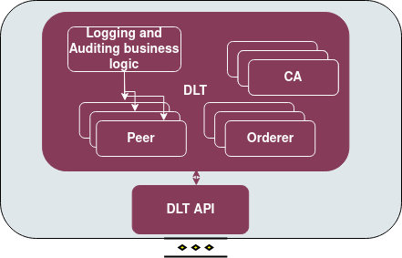

.. _Logging and auditing enabler:

############################
Logging and auditing enabler
############################

.. contents::
  :local:
  :depth: 1

***************
Introduction
***************
This enabler logs critical actions that happen during the data exchange between ASSIST-IoT stakeholders.

***************
Features
***************
This enabler allows transparency, auditing, non-repudiation and accountability of actions during the data exchange. It also logs resource requests and identified security events to help to provide digital evidence and resolve conflicts between stakeholders, when applicable. If there is a requirement of filtering prior to logging, the DLT API is the component responisble for this action.

*********************
Place in architecture
*********************
The logging and auditing enabler is part of the vertical plane DLT enablers.

***************
User guide
***************
The enabler has the following API endpoints.

+--------+----------------------+------------------------------------------------+---------------------+-----------------------------+
| Method | Endpoint             | Description                                    | Payload (if needed) | Response format             |
+========+======================+================================================+=====================+=============================+
| POST   | /api/logging/insert  | Insert an event (log) into the blockchain      | Described below     | Transaction key             |
+--------+----------------------+------------------------------------------------+---------------------+-----------------------------+
| POST   | /api/logging/getbyid | Get an event (log) by its transaction id       | Described below     | Requsested transasction     |
+--------+----------------------+------------------------------------------------+---------------------+-----------------------------+
| GET    | /api/logging/gets    | Get all events (logs) stored in the blockchain | No payload          | List of stored transactions |
+--------+----------------------+------------------------------------------------+---------------------+-----------------------------+
| POST   | /api/logging/inserts | Create logs for location with information      | Described below     | Transaction key             |
+--------+----------------------+------------------------------------------------+---------------------+-----------------------------+
| GET    | /api/logging/getlist | Get list of logs involving location            | No payload          | List of stored transactions |
+--------+----------------------+------------------------------------------------+---------------------+-----------------------------+
| POST   | /api/logging/getid   | Get log by specific id (location)              | Described below     | Requsested transasction     |
+--------+----------------------+------------------------------------------------+---------------------+-----------------------------+

For the post request the payload is:

.. code:: python

  {
    "device_id":"String",
    "value":"String",
    "timestamp":"String",
    "partition":"String",
    "offset":"String",
    "warning":"String"
  }

For the getbyid and getid requests the payload is (where the UUID is the transaction id):

.. code:: python

  {
  "UUID":"String"
  }

For the getbyid request the payload is:

.. code:: python

  {
    "id":"String",
    "tag_id":"String",
    "lat":"String",
    "lon":"String",
  }

***************
Prerequisites
***************
Kubernetes cluster, Helm, Docker

***************
Installation
***************

**Important notice**

You will have to use the nodeSelector in order to deploy all DLT components in a single node, so in values.yaml file:

.. code:: bash

  # Deploy all the components in the same node. Replace k8s-node-02 with your node name.
  enablerNodeSelector: 
    kubernetes.io/hostname: k8s-node-02 

For quick installation use the name logging (recommended)

.. code:: bash

  cd logging_auditing
  helm install logging .

In case you want to use another name:

.. code:: bash

  cd logging_auditing
  ./scripts/packageCC.sh

This will ask you for a $releaseName. Use the same $releaseName on you helm install command. 
Each time you want to use another name, you will have to run the packageCC.sh script and do it while in the logging_auditing folder.

*********************
Configuration options
*********************
The enabler is prepared to run in a K8s environment. The creation is prepared to be autonomous in such a working environment. The service consumer will be required to communicate with the server using the described Rest interface. In general there are several environment variables that can be configured, which is not recommended. 
The main configurable variable is the dltapi's nodePort which is preset to 31999.

***************
Developer guide
***************

**Check the installation**

You need to follow the logs of clipeer0org1. Get the pods and copy the name of the pod.

.. code:: bash

  kubectl get po
  kubectl logs -f $clipeer0org1_pod_name

When it is over you should be able to see in all chaincodes status 200

.. code:: bash

  INFO [chaincodeCmd] chaincodeInvokeOrQuery -> Chaincode invoke successful. result: status:200 

**In case you want to clean the pvc**

Important note, you need to deploy the pod inside the same node, so in dltinspectionpod.yaml you need to add the node name:

.. code:: bash

  nodeSelector:
    kubernetes.io/hostname: name_of_the_node

Inside the logging_auditing fodler:

.. code:: bash
  kubectl apply -f dltinspectionpod.yaml
  kubectl exec -it inspect  -- sh

Inside the container:

.. code:: bash
  rm -r data
  exit

It returns resource is busy, but it gets cleaned.
Back to the logging_auditing fodler:

.. code:: bash
  kubectl delete pod inspect

***************************
Version control and release
***************************
Version 0.2.0. Fully functional and able to retrieve all data even if the cluster fails.

***************
License
***************
Logging and auditing enabler is under BSD 3-Clause "New" or "Revised" License.
 
********************
Notice(dependencies)
********************
ASSIST-IoT - Architecture for Scalable, Self-*, human-centric, Intelligent, Se-cure, and Tactile next generation IoT

This project has received funding from the European Union's Horizon 2020 research and innovation programme under grant agreement No 957258.

The software included is:

- Hyperledger Fabric (https://github.com/hyperledger/fabric) Apache 2.0 License

- Go programming language (https://github.com/golang/go) BSD 3-Clause "New" or "Revised" License
  
- Express JS (https://github.com/expressjs/express) MIT License

