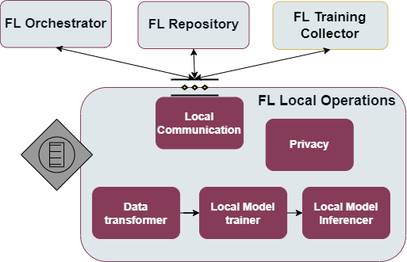

.. _FL Local Operations enabler:

###########################
FL Local Operations enabler
###########################

.. contents::
  :local:
  :depth: 1

Introduction
============

One of key goals of FL is to assure protection of privacy of data, owned
by individual stakeholders. Therefore, data is expected to be used only
locally, to train local version of the shared model, and only parameters
update proposals of the ML algorithm are shared with others. When the FL
training process has concluded, the final shared ML model is used to
deliver specific functionality, also called inference engine. Both
operations (model training and model inference) involve access to
private data. This means that it is crucial to “encapsulate” local
processes within a single “node” (that is controlled by data owner).
However, it should be noticed that the data that is being used in both
FL training processes has to be in the same format, which is imposed by
the ML model that is being employed. In order to carry out with all
these local operations, the FL Local Operation enabler is proposed. It
consists of a few different modules: a data transformation module (the
module handles the process of negotiating a suitable transformation
pipeline for a given data format in order to allow for the training or
inference of a specific model, and will be further extended in future
works), a component encapsulated in a web application and responsible
for model training, a component equipped with gRPC services and
responsible for model inference, as well as a privacy module providing
two selected privacy mechanisms for the FL training process (adaptive
differential privacy and homomorphic encryption).

Features
========

-  Enabler embedded in each FL involved party performing local training.
-  The possibility of conducting such training using PyTorch and Keras
   libraries, additionally allowing for the detailed configuration of
   appropriate optimizers, schedulers and callbacks.
-  Verification of local data formats compatibility with data formats
   required by FL (This particular feature will still be expanded upon).
-  Transformation of local data formats to the format required by the ML
   system by specifying a chain of atomic transformations along with the
   appropriate parameters (this feature will, too, be expanded upon in
   the future versions).
-  Local storage of models for training process optimization purposes is
   allowed.
-  The local results are be sent to the FL Training Collector in order
   to carry out the appropriate aggregation methodology over the common
   shared model.
-  There are multiple aggregation algorithms provided, with an added
   possibility to implement and include an additional one.
-  The inference module allows for placing models in the TFLite format
   on inference. Combined with the inclusion of gRPC for inference
   module communication, it provides a particularly lightweight
   inference solution.
-  Communication of model updates via encryption mechanisms. Homomorphic
   encryption will not permit outsiders to see the output model of each
   device/party (MITM attacks), whereas methods for creating
   differentially private noise will guarantee that Malicious Aggregator
   cannot be allowed to infer which records are actual models and which
   not.
-  Unit tests are included which can be ran using ``pytest``.

Place in architecture
=====================

FL Local Operations enabler is one of the Federated Learning enablers
that together enable to deploy a Federated Learning environment.
Functionally, it operates on scalability and manageability verticals in
the Assist-IoT architecture.

More specifically the following figure provides the semantic diagam of the enabler:

User guide
==========

Interactions with this enabler are done through a REST API. In the FL
environment the FL Orchestrator enabler sends appropriate configuration
to FL Local Operations that later on communicate with FL Training
Collector and FL Repository if required.

The enabler exposes REST API (see endpoints below) to communicate with
external enablers/applications but also uses gRPC to communicate with FL
Training Collector during model trainings.

+-----------------+----------------------+-----------------------------+
| Method          | Endpoint             | Description                 |
+=================+======================+=============================+
| POST            | /job/config/{id}     | Receive configuration for a |
|                 |                      | training job                |
+-----------------+----------------------+-----------------------------+
| PUT             | /model/{id}/{version | Receive a new shared model  |
|                 | }                    |                             |
+-----------------+----------------------+-----------------------------+
| GET             | /status              | Get current status of the   |
|                 |                      | enabler                     |
+-----------------+----------------------+-----------------------------+
| POST            | /job/transformer/{id | Receive any required data   |
|                 | }                    | transformer for job with    |
|                 |                      | identifier id               |
+-----------------+----------------------+-----------------------------+
| POST            | /predict/model/{id}/ | Inference with model        |
|                 | {version}            |                             |
+-----------------+----------------------+-----------------------------+

Prerequisites
=============

The main prerequisities are the installation of Docker and
docker-compose. These prerequisites are necessary in case of running the
enabler as a container (Docker). However, it is also possible to run the
component independently. In this case, it’s mandatory to have Python
installed on the machine where the enabler will be executed. At least
version 3.8 is recommended (this is the version of the Python image
being used). It is also necessary to install some additional libraries
or packages. These additional packages can be seen in the
requirements.txt file (inside the application folder).

Installation
============

The installation procedure for this enabler is under development and
will be provided once the release of the enabler is completed.

Configuration options
=====================

The configuration of the training process for the FL Local Operations
enabler is done with a request to REST API where the following
parameters for a training job to be executed can be set:

-  client_type_id - type of client indicating what mechanisms are used
   in it, e.g. “keras1”
-  server_address - address of FL Training Collector,
   e.g. “training_collector”
-  eval_metrics - list of evaluation metrics, e.g. [“MSE”]
-  eval_func - evaluation function, e.g. “Huber”
-  eval_metrics_value - the baseline value of the metrics, e.g. 0
-  num_classes - number of classes, e.g. “10”
-  model_id - model identifier, e.g. “10”
-  model_version - model version, e.g. “10”
-  shape - shape of the data, e.g. [“32”, “32”, “3”]
-  training_id - the id of this specific training process
-  model_name - the name of the model to be loaded for the training
-  model_version - the version of the model to be loaded for the
   training
-  config - a dictionary specifying configuration values specific to
   this training process, like “batch_size” or “learning_rate”
-  optimizer_config - a dictionary specifying the type of the optimizer
   to be used, as well as parameter values specific to this optimizer
-  scheduler_config - a dictionary specifying the type of the scheduler
   to be used, as well as parameter values specific to this scheduler
-  warmup_config - a dictionary specifying the type of the warmup to be
   used, as well as parameter values specific to this warmup
-  privacy_mechanisms - a dictionary specifying whether the client
   should use privacy mechanisms and with what kind of parameters, with
   the possibility to select Homomorphic Encryption, Differential
   Privacy, none or both of them

Developer guide
===============

Components
----------

Local model trainer
~~~~~~~~~~~~~~~~~~~

The Local Model Training component is responsible for local model
training. During configuration it instantiates appropriate ML training
libraries and, if this is the beginning of the process, initial version
of the shared model. This step can be completed locally by the node
owner, but this is unlikely. The main priority lies in assuring
uniformity of training methods across nodes belonging to different
owner. The necessary modules (ML algorithm libraries and the initial
version of the shared model) will be downloaded from the FL Repository.

Local model inferencer
~~~~~~~~~~~~~~~~~~~~~~

The component is responsible for use of the trained model. Here, the
model may be used: (1) after the FL process is completed, or (2) it may
start to be used from a certain (predefined by the owner) level of
quality of the shared model. In the latter case, each new version of the
shared model would replace the previous one. Obviously, it is implicitly
assumed that each new version of the shared global model will deliver
better quality of results. Here, data to be fed into the trained model
can be transformed using the Data Transformation Module. Interpretation
of the results of application of the model to specific input data
(including actions to be, possibly, undertaken on the basis of the
results) is likely to be provided by the data owner. However, it is also
possible that appropriate module is going to be downloaded from the FL
Repository.

Local communication
~~~~~~~~~~~~~~~~~~~

Responsible for communication between external entities and the enabler.

Data transformer
~~~~~~~~~~~~~~~~

In IoT ecosystems, each partner may (and is likely to) store data in its
own (private/local) format. Use of FL requires transformation of
appropriate parts of local data into the correct format. This format has
to be described as part of the FL configuration, and all participating
nodes have to oblige. This may be achieved by node owner providing a set
of the appropriate transformation components, that applied in a certain
order may allow for data format unification. However, such components
have to be flexibly downloaded from the FL Repository enabler.

Privacy
~~~~~~~

The privacy capabilities of this module currently include two possible
methods. The first, Homomorphic Encryption, relies on the implementation
provided by the TenSEAL library to decrypt and encrypt the data as
efficiently as possible. Unfortunately, due to the high memory usage of
this encryption method, it can be used only for extremely small model
architectures (such as Logistic Regression). Therefore, the encryption
is included in the enabler only in its most basic form, with
pregenerated secret files (which can nevertheless be later easily
swapped and regenerated). Differential Privacy with adaptive clipping,
on the other hand, is a method that can be applied in the training
process regardless of the model size. A more detailed explanation of the
functioning and modifiable parameters offered by the method can be found
in: https://arxiv.org/pdf/1905.03871.pdf

Technologies
------------

scikit-learn
~~~~~~~~~~~~

A popular machine learning library often used for data preprocessing and
transformation, for example encoding labels. It is open source and
widely used in the industry.

pyTorch
~~~~~~~

An open source machine learning framework based on the Torch library,
used for applications such as computer vision and natural language
processing, primarily developed by Facebook’s AI Research lab (FAIR).

Python
~~~~~~

Python is an interpreted high-level general-purpose programming language
with a set of libraries. Very popular for data analysis and ML
applications.

TensorFlow
~~~~~~~~~~

A free and open-source software library for machine learning and
artificial intelligence. It can be used across a range of tasks but has
a particular focus on training and inference of deep neural networks.

Tensorflow Lite
^^^^^^^^^^^^^^^

A mobile library allowing for easy, lightweight deployment of ML models
on mobile, microcontrollers and edge device. It employs, for example,
quantization in order to decrease the resources consumed by the model
during inference.

Flower
~~~~~~

A federated learning framework designed to work with a large number of
clients. It is both compatible with a variety of ML frameworks and
supports a wide range of devices.

OpenCV
~~~~~~

A real-time computer vision library providing already optimized models.
It is cross-platform and open-source.

Pailier Encryption, Affine Homomorphic Encryption
~~~~~~~~~~~~~~~~~~~~~~~~~~~~~~~~~~~~~~~~~~~~~~~~~

A library that empowers users to easily conduct Homomorphic Encryption
operations on tensors, built on top of Microsoft SEAL. Since the
underlying implementation uses C++, the resulting methods consume as
little resources as possible.

gRPC
^^^^

A modern open source, high performance Remote Procedure Call (RPC)
framework. gRPC works across many languages and platforms, is
exceptionally efficient and scalable.

FastAPI
~~~~~~~

A popular web microframework written in Python, FastAPI is known for
being both robust and high performing. It is based on OpenAPI
(previously Swagger) standards.

Version control and release
===========================

Version control and release details will be provided in the next release
of the documentation.

Licence
=======

The FL Local Operations is licensed under the **Apache License,
Version2.0** (the “License”).

You may obtain a copy of the License at:
http://www.apache.org/licenses/LICENSE-2.0

Notice (dependencies)
=====================

The information about the dependencies needed to run a specific part of
the application can be found described in the appropriate
``requirements.txt`` files located. However, since they are downloaded
automatically during the construction of the appropriate Docker images,
the local dependencies needed to deploy the application include only a
local Docker along with Docker Compose or Kubernetes installation.

