.. _FL Orchestrator:

############
FL Orchestrator
############

.. contents::
  :local:
  :depth: 1

***************
Introduction
***************
**FL Orchestrator** is one of the enablers developed in the context of the **FL System** of the `ASSIST-IoT project.

***************
Features
***************

FL Orchestrator is responsible of specifying details of FL workflow(s)/pipeline(s). Among these details or features are:

- FL job scheduling
- Manage the FL life cycle
- Selecting and delivering initial version(s) of the shared algorithm
- Delivering the version(s) of modules used in various stages of the process, such as training stopping criteria
- Handling the different “error conditions” that may occur during the FL process

*********************
Place in architecture
*********************
Next picture depicts the FL architecture

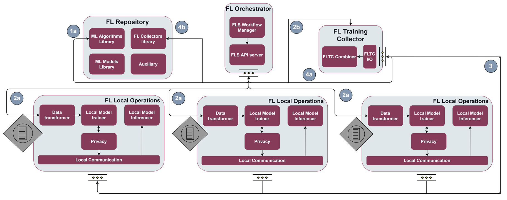

It is in the centre of the image. It is the core element of the architecture and is responsible for initiating the different iterations of model training.

***************
User guide
***************
In order to manage the training of the models in a simple way, an interface has been developed to start the training rounds of the different models available in the FL Repository.

This is how it looks like.

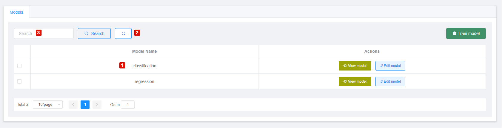

This is the meaning of the numbers shown in the picture:

- **1**. List of models retrieved from the FL Repository.
- **2**. Reload the list of models.
- **3**. Option that allows filtering by the modelName field to search for a model from those retrieved from the FL Repository.

The **Actions** colummn includes these functionalities:

- **View model**. Displays the JSON of the model. It can be seen in the following picture.

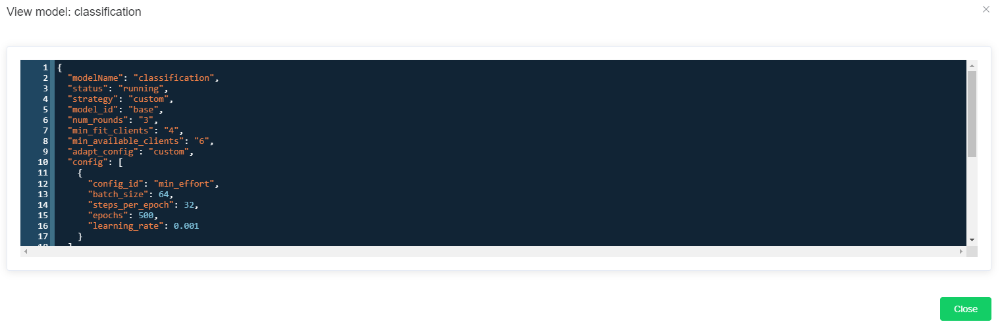

- **Edit model**. Displays a form to insert/update the training configuration of the selected model. The following picture depicts the appearance of this form.

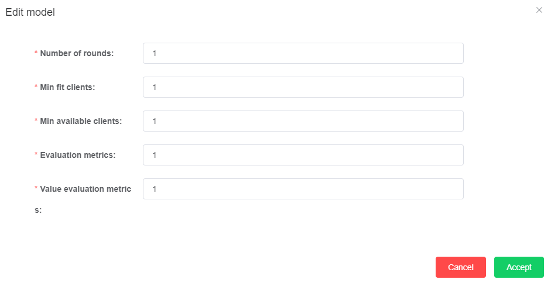

Taking these functionalities into account, the steps to start a training round are as follows:

- Select one of the models from the list retrieved from the FL Repository.

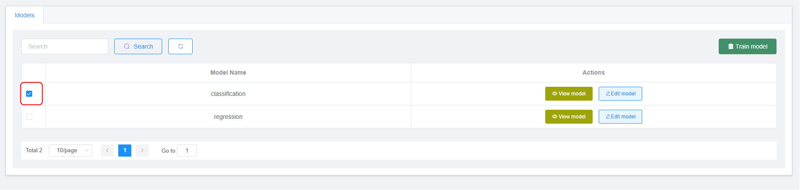

- Verify that a configuration exists for the selected model. If we pass over the Train model button and it appears disabled, it is because there is no configuration, So, the next step is to register one going to the Edit model option. Once the configuration has been saved, click on the Train model button. If the Train model is enabled, click on this option for start the training.

- Click over the Train model button will show this form to confirm that will start the training for the model selected.

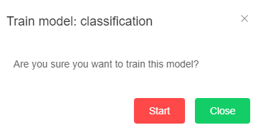

Once the user clicks over the Start button the training starts. UI will receive updates each time a round finishes.

***************
Prerequisites
***************

The main prerequisites are the installation of
`Docker <https://docs.docker.com/get-started/overview/>`__ and `Docker-compose <https://docs.docker.com/compose/>`__.

The following links provide information on how to install `Docker <https://www.digitalocean.com/community/tutorials/how-to-install-and-use-docker-on-ubuntu-20-04>`__
and `Docker-compose <https://www.digitalocean.com/community/tutorials/how-to-install-and-use-docker-compose-on-ubuntu-20-04>`__.

These prerequisites are necessary in case of running the enabler as a container (**Docker**). However, it is also possible to run the component independently. In this case, it’s mandatory to have Python installed on the machine where the Orchestrator will be executed. At least version 3.8 is recommended (this is the version of the Python image being used). It is also necessary to install some additinal libraries or packages. These additional packages can be seen in the requirements.txt file (inside the orchestrator folder).

The following image illustrates the libraries needed for the orchestrator.

.. figure:: ./requirements.PNG
   :alt: Additional pacckages in the requirements.txt file

***************
Installation
***************
The first version of FL Orchestrator will be deployed with **docker-compose**. This file includes all the services needed to be able to deploy the FL Orchestrator API.

Next picture depicts the content of this docker-compose.

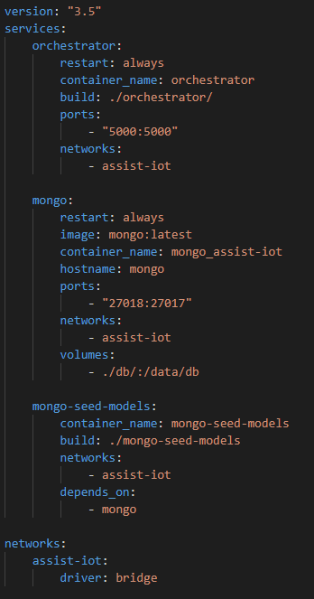

This version of docker-compose file includes 2 services:

- **orchestrator**. Core of the enabler. Includes the definition of the API, interaction with other enablers and their main features.
- **mongo**. Deploys a `MongoDB <https://en.wikipedia.org/wiki/MongoDB>`__ instance used by the orchestrator to store and retrieve the configurations for the models stored in MongoDB (**FL Repository**).
   
Verification
------------
FL Orchestrator and the other enablers have been conceived as APIs that will have methods that interact with each other. Therefore, the best to verify their correct deployment and operation is to test these APIs.

FL Orchestrator has a `Swagger <https://swagger.io/docs/specification/2-0/what-is-swagger/>`__ that allows to test all its methods. This swagger is deployed at the
following URL: http://localhost:5000/api/docs

Next picture shows the appearance of the swagger and its methods.

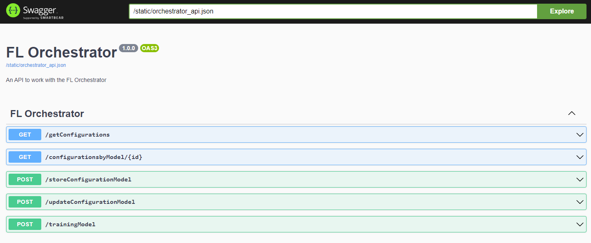

Expanding the method area (/getConfigurations) in our case. The Execute option appears. Clicking on this button and if the method has the required parameters, the result code is obtained (200, in case it has gone well). Also in the `curl <https://curl.se/>`__ area, it is possible to see the request that would be made to execute this method externally. In the Response body area it is possible to see the result, the list of the configurations that currently are stored in the FL Orchestrator.

Next picture depicts what has been explained in the previous paragraph. The areas **code**, **curl** and **Response body** are highlight.

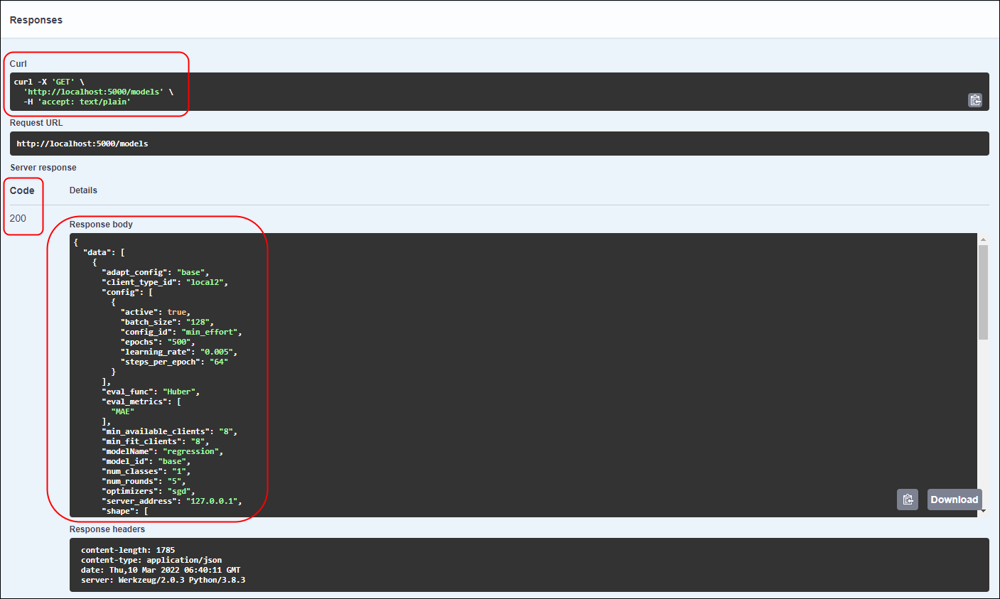
   
Building the Docker image
------------

The different Docker images needed to be able to deploy all the services are defined / created in files called `Dockerfile <https://docs.docker.com/engine/reference/builder/>`__.

These files are based on an initial image and the rest of the packages / libraries needed to execute the `Python <https://www.python.org/doc/essays/blurb/>`__ scripts (in our case) are installed on top of it.

Next picture depicts the content of one of this Dockerfile.

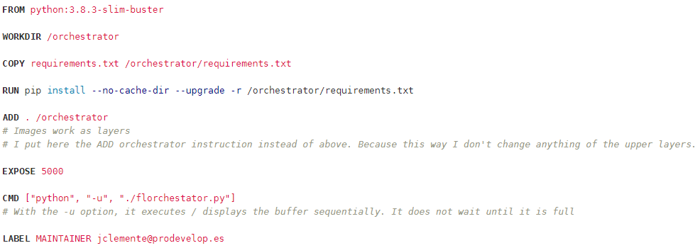

Deploying with Kubernetes and Helm3
------------
Will be determined after the release of the enabler.

Verification the deployment
------------
Will be determined after the release of the enabler.

*********************
Configuration options
*********************
Will be determined after the release of the enabler.

***************
Developer guide
***************
Will be determined after the release of the enabler.

***************************
Version control and release
***************************
The table of this section it is a software release overview of the different elements for the orchestrator’s enabler. The division has been made on the basis of the different files (or folders) needed to execute the component. This is shown in the following figure.

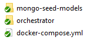

+-------------------------+-------------------------------+-----------+
| File Name / Folder      | Description                   | Language  |
+=========================+===============================+===========+
| docker-compose.yml      | Docker compose file           | `YAML <ht |
|                         | responsible for launching the | tps://en. |
|                         | services needed for the       | wikipedia |
|                         | orchestrator                  | .org/wiki |
|                         |                               | /YAML>`__ |
+-------------------------+-------------------------------+-----------+
| orchestrator            | Folder containing the scripts | Python,   |
|                         | needed to run the             | YAML,     |
|                         | orchestrator service. It also | `CSS <htt |
|                         | contains the files and        | ps://www. |
|                         | folders necessary to be able  | w3schools |
|                         | to deploy a swagger of the    | .com/css/ |
|                         | component                     | css_intro |
|                         |                               | .asp>`__, |
|                         |                               | `HT       |
|                         |                               | ML <https |
|                         |                               | ://www.w3 |
|                         |                               | schools.c |
|                         |                               | om/html/h |
|                         |                               | tml_intro |
|                         |                               | .asp>`__, |
|                         |                               | `         |
|                         |                               | JavaScrip |
|                         |                               | t <https: |
|                         |                               | //www.w3s |
|                         |                               | chools.co |
|                         |                               | m/whatis/ |
|                         |                               | whatis_js |
|                         |                               | .asp>`__, |
|                         |                               | `JS       |
|                         |                               | ON <https |
|                         |                               | ://www.w3 |
|                         |                               | schools.c |
|                         |                               | om/js/js_ |
|                         |                               | json_intr |
|                         |                               | o.asp>`__ |
+-------------------------+-------------------------------+-----------+
***************
License
***************
Will be determined after the release of the enabler.

********************
Notice(dependencies)
********************
Will be determined after the release of the enabler.
