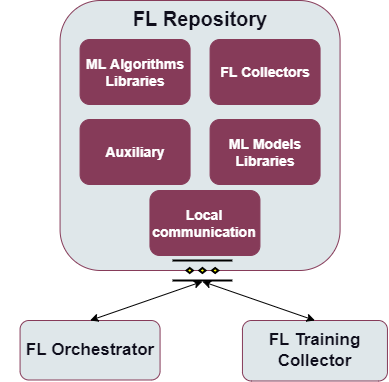

.. _FL Repository enabler:

#####################
FL Repository enabler
#####################

.. contents::
  :local:
  :depth: 1

Introduction
============

The FL Repository is a set of different collections stored in a MongoDB
database, including initial ML models ready for training, weight results
and metrics stored after specific training processes, various
aggregation strategies, ML collectors responsible for properly loading
data in a specific format, as well as numerous data transformations
which can be combined and used in order to properly process the data
across multiple heterogenous devices, in addition to any auxiliary
collections for other functionalities that may be needed, and are not
specifically identified yet.

Features
========

-  Provide storage for FL related data like: initial ML model weights
   and structure, the resulting training weights of specific ML models
   combined with stored metrics, aggregation strategies encapsulating
   different model weight averaging approaches, ML collectors for
   loading data of a certain format, data transformations for reusable
   data preprocessing, and auxiliary repositories for other additional
   functionalities that may be needed, and are not specifically
   identified yet.
-  Provide interfaces to put and retrieve data from different components
   of the enabler.
-  Communication with other FL enablers.

Place in architecture
=====================

FL Repository enabler is one of the Federated Learning enablers that
together enable to deploy a federated learning environment.
Functionally, it operates on scalability and manageability verticals in
the Assist-IoT architecture.

More specifically the following figure provides the semantic diagam of the enabler:

User guide
==========

Interactions with this enabler are done through a REST API. In the FL
environment this enabler interacts with FL Orchestrator, FL Training
Collector and FL Local Operations.

+-----------------+----------------------+-----------------------------+
| Method          | Endpoint             | Description                 |
+=================+======================+=============================+
| POST            | /model               |  Adds new ML model metadata |
|                 |                      | to the library              |
+-----------------+----------------------+-----------------------------+
| PUT             | /model/{model_name}/ | Update the data (the        |
|                 | {model_version}      | structure and the weights)  |
|                 |                      | of the model stored in FL   |
|                 |                      | Repository                  |
+-----------------+----------------------+-----------------------------+
| PUT             | /model/meta/{model_n | Update metadata of a model  |
|                 | ame}/{model_version} | that is already in the      |
|                 |                      | repository under identifier |
|                 |                      | model name and version      |
+-----------------+----------------------+-----------------------------+
| GET             | /model               | Retrieve list of all models |
|                 |                      | stored in the repository    |
+-----------------+----------------------+-----------------------------+
| GET             | /model/meta/{model_n | Retrieve the metadata of a  |
|                 | ame}/{model_version} | model with a specific model |
|                 |                      | name and version            |
+-----------------+----------------------+-----------------------------+
| GET             | /model/{model_name}/ | Retrieve the data           |
|                 | {model_version}      | specifying the structure    |
|                 |                      | and weights of a model with |
|                 |                      | a specific name and version |
|                 |                      | in the format of zipped     |
|                 |                      | files                       |
+-----------------+----------------------+-----------------------------+
| DELETE          | /model/{model_name}/ | Delete a model with a       |
|                 | {model_version}      | specific model name and     |
|                 |                      | version                     |
+-----------------+----------------------+-----------------------------+
| POST            | /training-results    |  Adds new ML training       |
|                 |                      | results to the collection   |
+-----------------+----------------------+-----------------------------+
| PUT             | /training-results/{m | Update the model weights    |
|                 | odel_name}/{model_ve | serving as the training     |
|                 | rsion}/{training_id} | results of a specific model |
|                 | /{configuration_id}  | name and version during the |
|                 |                      | training process marked     |
|                 |                      | with training_id using a    |
|                 |                      | configuration marked as     |
|                 |                      | configuration_id            |
+-----------------+----------------------+-----------------------------+
| GET             | /training-results    | Retrieve the list of all    |
|                 |                      | training results metadata   |
|                 |                      | stored in the FL Repository |
+-----------------+----------------------+-----------------------------+
| GET             | /training-results/{m | Retrieve the list of all    |
|                 | odel_name}/{model_ve | training results of         |
|                 | rsion}               | training processes          |
|                 |                      | conducted for a selected    |
|                 |                      | model name and version      |
|                 |                      | stored in the FL Repository |
+-----------------+----------------------+-----------------------------+
| GET             | /training-results/we | Retrieve the training       |
|                 | ights/{model_name}/{ | weights which were a        |
|                 | model_version}/{trai | product of the training of  |
|                 | ning_id}/{configurat | a specific model during the |
|                 | ion_id}              | training with a specific    |
|                 |                      | configuration and training  |
|                 |                      | id                          |
+-----------------+----------------------+-----------------------------+
| DELETE          | /training-results/{m | Delete the training results |
|                 | odel_name}/{model_ve | of the training of a        |
|                 | rsion}/{training_id} | specific model name and     |
|                 |                      | version obtained throughout |
|                 |                      | the training with this      |
|                 |                      | training_id                 |
+-----------------+----------------------+-----------------------------+
| POST            | /strategy            |  Adds new ML aggregation    |
|                 |                      | strategy metadata to the    |
|                 |                      | library                     |
+-----------------+----------------------+-----------------------------+
| PUT             | /strategy/{name}     | Update the aggregation      |
|                 |                      | strategy object stored      |
|                 |                      | under the selected name     |
+-----------------+----------------------+-----------------------------+
| PUT             | /strategy/meta/{name | Update metadata of a        |
|                 | }                    | strategy marked by this     |
|                 |                      | specific name               |
+-----------------+----------------------+-----------------------------+
| GET             | /strategy            | Retrieve list of all        |
|                 |                      | aggregation strategies      |
|                 |                      | stored in the repository    |
+-----------------+----------------------+-----------------------------+
| GET             | /strategy/{name}     | Download the selected       |
|                 |                      | strategy in the form of a   |
|                 |                      | pickle file                 |
+-----------------+----------------------+-----------------------------+
| DELETE          | /strategy/{name}     | Delete the file and         |
|                 |                      | metadata of a selected      |
|                 |                      | strategy                    |
+-----------------+----------------------+-----------------------------+
| POST            | /collector           |  Adds new ML collector      |
|                 |                      | metadata to the library     |
+-----------------+----------------------+-----------------------------+
| PUT             | /collector/{name}/{v | Update the collector object |
|                 | ersion}              | stored under a specific     |
|                 |                      | name and version            |
+-----------------+----------------------+-----------------------------+
| PUT             | /collector/meta/{nam | Update metadata of the      |
|                 | e}/{version}         | collector object marked by  |
|                 |                      | this specific name and      |
|                 |                      | version                     |
+-----------------+----------------------+-----------------------------+
| GET             | /collector           | Retrieve the list of all ML |
|                 |                      | collectors stored in the    |
|                 |                      | repository                  |
+-----------------+----------------------+-----------------------------+
| GET             | /collector/{name}/{v | Download the selected ML    |
|                 | ersion}              | collector in the form of a  |
|                 |                      | pickle file                 |
+-----------------+----------------------+-----------------------------+
| DELETE          | /collector/{name}/{v | Delete the file and         |
|                 | ersion}              | metadata of a selected ML   |
|                 |                      | collector                   |
+-----------------+----------------------+-----------------------------+
| POST            | /transformation      |  Adds new ML data           |
|                 |                      | transformation metadata to  |
|                 |                      | the library                 |
+-----------------+----------------------+-----------------------------+
| PUT             | /transformation/{id} | Update the transformation   |
|                 |                      | object stored under a       |
|                 |                      | specific name and version   |
+-----------------+----------------------+-----------------------------+
| PUT             | /transformation/meta | Update metadata of the data |
|                 | /{id}                | transformation object       |
|                 |                      | marked by this specific id  |
+-----------------+----------------------+-----------------------------+
| GET             | /transformation      | Retrieve the list of all ML |
|                 |                      | data transformations stored |
|                 |                      | in the repository           |
+-----------------+----------------------+-----------------------------+
| GET             | /transformation/{id} | Download the selected ML    |
|                 |                      | collector in the form of a  |
|                 |                      | pickle file                 |
+-----------------+----------------------+-----------------------------+
| DELETE          | /transformation/{id} | Delete the file and         |
|                 |                      | metadata of a selected ML   |
|                 |                      | data transformation         |
+-----------------+----------------------+-----------------------------+

Prerequisities
==============

There are three possible ways to run the FL Repository. The first, no
longer actively supported mode of deployment necessitates a local
installation of Python 3.8+, along with all the packages located in
``requirements.txt`` files already preinstalled. A second, much more
strongly encouraged mode of deployment uses Docker and docker-compose to
locally create the appropriate containers. The third and final mode of
deployment relies on the inclusion of the appropriate Helm charts. In
order to use this mode of deployment, the local machine needs a
preinstalled version of Kubernetes.

Installation
============

In order to properly set up the enabler with the use of Helm charts,
first you have to set up the appropriate configuration. For this
purposes, the ``repository-config-map.yaml`` is included in this
repository. This is a ConfigMap containing information that may be
specific to this deployment that the application must be able to access.

After performing appropriate modifications, run
``kubectl apply -f repository-config-map.yaml`` to create the ConfigMap.
Finally, run ``helm install flrepositorylocaldb flrepositorydb`` in
order to properly install the release using Helm charts.

Configuration options
=====================

The are no configuration options for this enabler.

Developer guide
===============

Collections
~~~~~~~~~~~

FL Models
^^^^^^^^^

This collection stores the ready-for-training data of a selected model.
The information about the model weights and structure is stored in files
inside a zipped directory, allowing for easy incorporation of different
formats preferred by different libraries. Aside from that, metadata like
information about the library that this model data uses or the
capabilities needed to train this model will be saved here as well.

FL Training Results
^^^^^^^^^^^^^^^^^^^

This collection stores the training results obtained after finishing the
training of a specific ML model. It incorporated the obtained metrics,
information about the training and configuration id, as well as the
final training weights saved in the ``pickle`` format.

FL Strategies
^^^^^^^^^^^^^

FL Strategies contain information about the available weight aggregation
strategies for the FL enabler. The custom strategies have to implement
the Strategy Abstract Base Class from the Flower library in order to
easily incorporate them into the FL Training Collector. The strategy
files will contain a pickled strategy object, with the metadata
describing the purpose and usage of this strategy.

FL Collector
^^^^^^^^^^^^

This collection will contain objects allowing for the dynamic loading of
various data formats. They will be stored as dill or pickle files.

FL Transformations
^^^^^^^^^^^^^^^^^^

FL Transformations contain information about the available data
transformations for the FL Local Operations or FL Training Collector.
The custom transformations have to implement the DataTransformation
Abstract Base Class described in the ``data_transformation`` module in
FL Local Operations. The metadata of this collection will include not
only the description of this specific transformation, but also necessary
parameter types, default values and the capabilities needed to run this
transformation on the local machine. The transformation files will
contain a Data Transformation object in a dill or pickle format.

Auxiliary
^^^^^^^^^

Any other collections that may be needed to instantiate FL can be also
stored in the FL Repository. Among them possible modules related to
process verification, error handling, stopping criteria, authorization,
belong to this category.

Local communication
^^^^^^^^^^^^^^^^^^^

The communication between the collections and an outside developer is
carried out through the (described above) RESTful endpoints. In order to
do so, a FastAPI application has been implemented.

Technologies
~~~~~~~~~~~~

Python
^^^^^^

Python is an interpreted high-level general-purpose programming language
with a set of libraries. Very popular for data analysis and ML
applications. Component: Local communication

FastAPI
^^^^^^^

A popular web microframework written in Python, FastAPI is known for
being both robust and high performing. It is based on OpenAPI
(previously Swagger) standards. Component: Local communication

MongoDB
^^^^^^^

MongoDB is a source-available cross-platform document-oriented database
program. Classified as a NoSQL database program. Component: ML Models
Libraries, Auxiliary

GridFS
^^^^^^

GridFS is a specification for storing and retrieving MongoDB files that
exceed the BSON-document size limit of 16 MB. It uses the technique of
dividing them into chunks for this specific purpose.

Pickle
^^^^^^

A Python library allowing for the serialization and de-serialization of
any Python object through converting them to a byte stream. An extension
(one of many) of the pickle library is known as dill.

Version control and release
===========================

Version control and release details will be provided in the next release
of the documentation.

License
=======

The FL Local Operations is licensed under the **Apache License,
Version2.0** (the “License”).

You may obtain a copy of the License at:
http://www.apache.org/licenses/LICENSE-2.0

Notice (dependencies)
=====================

The information about the dependencies needed to run a specific part of
the application can be found described in the appropriate
``requirements.txt`` files located. However, since they are downloaded
automatically during the construction of the appropriate Docker images,
the local dependencies needed to deploy the application include only a
local Docker along with Docker Compose or Kubernetes installation.

