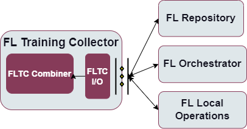

.. _FL Training Collector enabler:

#############################
FL Training Collector enabler
#############################

.. contents::
  :local:
  :depth: 1

Introduction
============

The FL training process involves several independent parties that
commonly collaborate in order to provide an enhanced ML model. In this
process, the different local updates suggestions shall be aggregated
accordingly. This duty within ASSIST-IoT will be tackled by the FL
Training Collector, which will also be in charge of delivering back the
updated model.

Features
========

-  Aggregate local updates of the ML model prepared by independent
   parties as part of a model enhancement process.

-  Allow for the flexible use of the custom aggregation strategies
   located in FL Repository.

-  Allow for the use of selected privacy mechanisms (Adaptive
   Differential Privacy, Homomorphic Encryption) during the Federated
   Learning process.

-  Performing global evaluation throughout the FL training process,

-  Delivering the results of the training (final aggregated weights and
   metrics) to the FL Repository for storage.

Place in architecture
=====================

FL Training Collector enabler is one of the Federated Learning enablers
that together allow to deploy a federated learning environment.
Functionally, it operates on scalability and manageability verticals in
the Assist-IoT architecture.

More specifically the following figure provides the semantic diagam of the enabler:

User guide
==========

Interactions with this enabler are done through a REST API. In the FL
environment the FL Orchestrator enabler sends the appropriate
configuration to FL Training Collector.

The enabler exposes REST API (see endpoints below) to communicate with
external enablers/applications but also uses gRPC to communicate with FL
Local Operations during model trainings.

+-----------------+----------------------+-----------------------------+
| Method          | Endpoint             | Description                 |
+=================+======================+=============================+
| POST            | /job/config/{id}     | Receive configuration for   |
|                 |                      | the specific training of a  |
|                 |                      | selected model for job with |
|                 |                      | identifier id               |
+-----------------+----------------------+-----------------------------+
| GET             | /job/status/{id}     | Retrieve status of the      |
|                 |                      | training process with       |
|                 |                      | identifier id               |
+-----------------+----------------------+-----------------------------+

Prerequisities
==============

There are three possible ways to run the FL Local Operations. The first,
no longer supported mode of deployment necessitates a local installation
of Python 3.8+, along with all the packages located in
``requirements.txt`` files already preinstalled. A second, much more
strongly encouraged mode of deployment uses Docker and docker-compose to
locally create the appropriate containers. The third and final mode of
deployment relies on the inclusion of the appropriate Helm charts. In
order to use this mode of deployment, the local machine needs a
preinstalled version of Kubernetes.

Installation
============

In order to properly set up the enabler with the use of Helm charts,
first you have to set up the appropriate configuration. For this
purposes, the ``training-collector-config-map.yaml`` is included in this
repository. This is a ConfigMap containing information that may be
specific to this deployment that the application must be able to access.

After performing appropriate modifications, run
``kubectl apply -f training-collector-config-map.yaml`` to create the
ConfigMap. Finally, run
``helm install trainingcollectorlocal trainingcollector`` in order to
properly install the release using Helm charts.

Configuration options
=====================

The configuration of the training process for the FL Training Collector
enabler is done with a request to REST API where the following
parameters for a training job to be executed can be set:

-  strategy - name of the strategy to be used in this training job,
   e.g. “avg”
-  model_name - the name of the model used throughout training,
   e.g. “custom_resnet”
-  model_version - the version of the model selected for training,
   e.g. “version_0”
-  server_conf - the training configuration accepted by and specific to
   FL Flower server, e.g. “num_rounds”
-  strategy_conf - the configuration accepted by and specific to the
   selected strategy, containing fields like e.g. “min_fit_clients”
-  adapt_config e.g. “custom”
-  configuration_id - identifier of the configuration to be used
-  privacy_mechanisms - the configuration specifying the selected
   privacy mechanisms and their parameters
-  client_conf - the configuration specifying the client side of
   training
-  learning_rate - tuning parameter in an optimization algorithm,
   e.g. “0.001”

Developer guide
===============

Components
~~~~~~~~~~

The enabler provides a REST API to allow the input and output
communication to and from the FL Training Collector enabler. On the one
hand it is responsible of receiving FL local updates that are sent to
the FLC Combiner component. On the other hand, it is responsible of
communicating updates of the new FL model obtained in the FLC Component
to the FL Repository. The communication capabilities of this component
are designed so that it can conceptually deal with situations in which
more complex topologies are used.

The enabler will receive weight updates from a certain number (possibly
all) local nodes and combine them to generate an updated FL model. It
can include both homogeneous and heterogeneous FedAvg solutions for
e.g., logistic regression models, decision-tree models, or even neural
network models.

Additionally, the enabler allows for the usage of selected privacy
mechanisms. Here, it is important to mention that Homomorphic Encryption
can only be used currently with very small models, like Logistic
Regression.

Technologies
~~~~~~~~~~~~

Python
^^^^^^

Python is an interpreted high-level general-purpose programming language
with a set of libraries. Very popular for data analysis and ML
applications.

FastAPI
^^^^^^^

A popular web microframework written in Python, FastAPI is known for
being both robust and high performing. It is based on OpenAPI
(previously Swagger) standards.

Flower
^^^^^^

A federated learning framework designed to work with a large number of
clients. It is both compatible with a variety of ML frameworks and
supports a wide range of devices.

TenSEAL
^^^^^^^

A library that empowers users to easily conduct Homomorphic Encryption
operations on tensors, built on top of Microsoft SEAL. Since the
underlying implementation uses C++, the resulting methods consume as
little resources as possible.

Version control and release
===========================

Version control and release details will be provided in the next release
of the documentation.

Licence
=======

The FL Local Operations is licensed under the **Apache License,
Version2.0** (the “License”).

You may obtain a copy of the License at:
http://www.apache.org/licenses/LICENSE-2.0

Notice (dependencies)
=====================

The information about the dependencies needed to run a specific part of
the application can be found described in the appropriate
``requirements.txt`` files located. However, since they are downloaded
automatically during the construction of the appropriate Docker images,
the local dependencies needed to deploy the application include only a
local Docker along with Docker Compose or Kubernetes installation.

