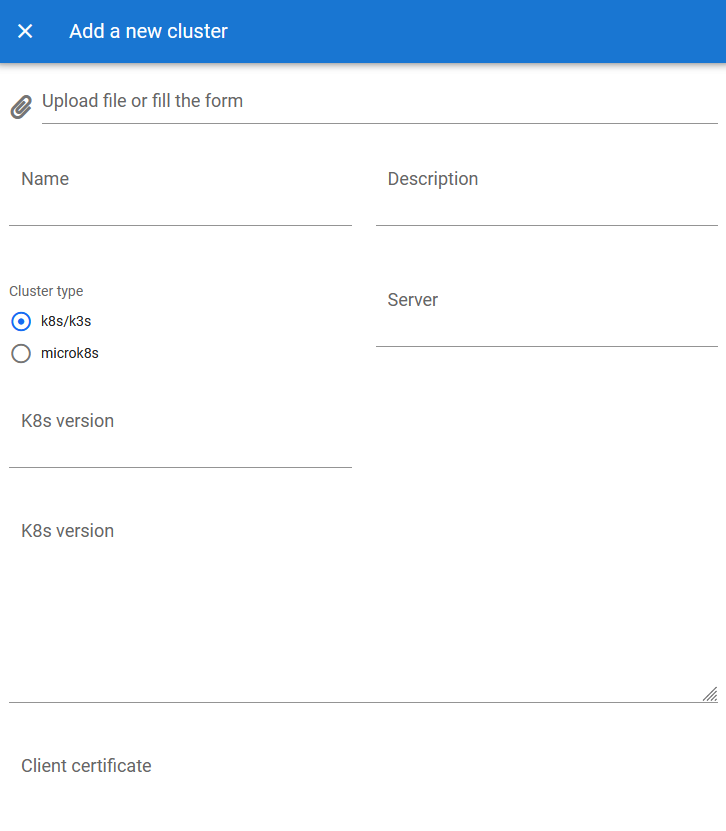

.. _Devices managment enabler:

#########################
Devices managment enabler
#########################

.. contents::
  :local:
  :depth: 1

***************
Introduction
***************
The main functionality of this enabler will be to register: (i) a smart IoT device in a deployment, and (ii) a cluster in an ASSIST-IoT deployment, including in the latter case 
all the necessary messages to notify it to the smart orchestrator. It will also execute all the required actions related to networking for enabling connectivity among isolated/independent clusters, 
including those that have been added via VPN/SD-WAN technology. Besides, it will allow monitoring any registered node and device in the deployment, including its status (i.e., available and used resources) 
and current instantiated enablers' components.

***************
Features
***************
This enabler is on charge of managing the two types of devices that are used in the project:

- **Kubernetes clusters**: register, delete and manage the status of the clusters in synchronization with the Smart Orchestrator.
- **Smart IoT devices**: register, delete and manage the status of the physical IoT devices where some applications will be deployed. This feature is under development.

In future versions, K8s clusters that make use of SD-WAN or VPN connections will also be managed by the enabler.

*********************
Place in architecture
*********************
The Devices managment enabler is part of the vertical plane manageability enablers. Moreover, this enabler is a user interface that is part of the Tactile dashboard enabler.

.. figure:: ./dashboard-manageability-architecture.png
  :alt: Dashboard architecture
  :align: center

***************
User guide
***************
This enabler is included in the Tactile Dashboard of the project, so a logged user with the right permissions can access to it by clicking its menu entry.

+--------+----------+-------------------------------+---------------------+-----------------+
| Method | Endpoint | Description                   | Payload (if needed) | Response format |
+========+==========+===============================+=====================+=================+
| GET    | /devices | Devices view of the dashboard |                     | Web page        |
+--------+----------+-------------------------------+---------------------+-----------------+

The enabler shows a table with the registered devices (at the moment only the registered clusters in the Smart Orchestrator) 
and some information: ID, name, K8s version, server url, status and creation date.

.. figure:: ./k8sclusters.png
  :alt: Devices management user interface
  :align: center

To register a new K8s cluster, click on the *Add a new cluster* button and a form will appear. There are two options to register a new cluster: (i) click on the file input field
and upload a kubeconfig JSON file (a example can be found below) or (ii) fill in the form manually.

Kubeconfig JSON file example:

.. code-block:: json

  {
    "name": "cluster test",
    "description": "cluster test",
    "credentials": {
      "apiVersion": "v1",
      "clusters": [
        {
          "cluster": {
            "certificate-authority-data": "LS0tLS1CRUdJTiBDRVJUSUZJQ0FURS0tLS0tCk1JSUM...",
            "server": "https://192.168.250.232:6443"
          },
          "name": "cluster test"
        }
      ],
      "contexts": [
        {
          "context": {
            "cluster": "cluster test",
            "user": "kubernetes-admin1"
          },
          "name": "cluster test"
        }
      ],
      "current-context": "cluster test",
      "kind": "Config",
      "preferences": {},
      "users": [
        {
          "name": "kubernetes-admin1",
          "user": {
            "client-certificate-data": "LS0tLS1CRUdJTiBDRVJUSUZJQ0FURS0tLS0tCk1JSURJVE...",
            "client-key-data": "LS0tLS1CRUdJTiBSU0EgUFJJVkFURSBLRVktLS0tLQpNSUlFcEFJQk..."
          }
        }
      ]
    },
    "k8s_version": "1.23"
  }

To delete a registered cluster, click on the *Delete cluster* button of the selected cluster and confirm the action in the dialog.

.. figure:: ./k8scluster_delete.png
  :alt: Delete a registered K8s cluster
  :align: center

***************
Prerequisites
***************
The Smart Orchestrator must be previously installed.

***************
Installation
***************
This enabler is part of the Tactile dashboard enabler, so see the installation section of the Tactile dashboard enabler entry.

*********************
Configuration options
*********************
Not applicable.

***************
Developer guide
***************
For more information, read the `Tactile dashboard enabler entry <https://assist-iot-enablers-documentation.readthedocs.io/en/latest/horizontal_planes/application/tactile_dashboard_enabler.html>`_

***************************
Version control and release
***************************
Version 0.1. Under development.

***************
License
***************
The licenses of internal code are under analysis. The code is developed using open source technologies (Vue.js, Spring framework, ...) and PUI9, a framework that is property of
Prodevelop. For more information about PUI9 licenses, read the `Tactile dashboard enabler entry <https://assist-iot-enablers-documentation.readthedocs.io/en/latest/horizontal_planes/application/tactile_dashboard_enabler.html>`_

********************
Notice(dependencies)
********************
This enabler depends on the Smart Orchestrator enabler and it's part of the Tactile dashboard enabler.