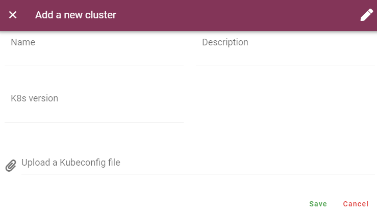
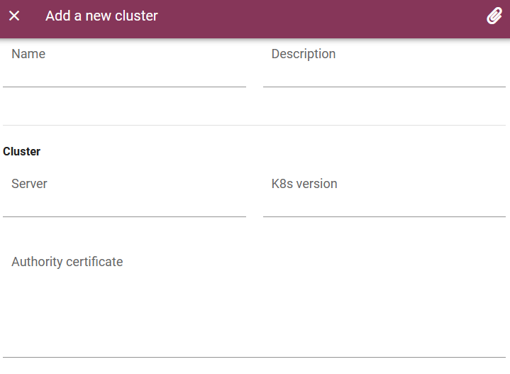
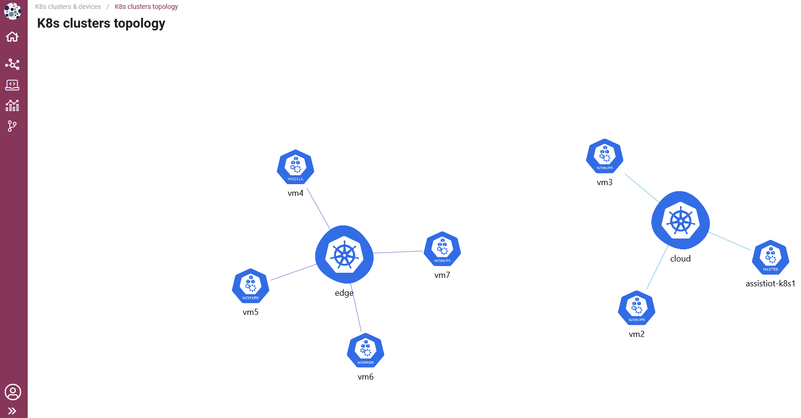

.. _Cluster and topology manager:

#############################
Cluster and topology manager
#############################

.. contents::
  :local:
  :depth: 1

***************
Introduction
***************
The main functionality of this enabler will be to register: (i) a smart IoT device in a deployment, and (ii) a K8s cluster in an ASSIST-IoT deployment, including in the latter case 
all the necessary messages to notify it to the Smart Orchestrator. Besides, it will allow monitoring any registered node and device in the deployment, including its status (i.e., available and used resources) 
and current instantiated enablers' components.

***************
Features
***************
This enabler is on charge of managing the two types of devices that are used in the project:

- **Kubernetes clusters**: register, delete, inspect the topology and manage the status of the clusters in synchronization with the Smart Orchestrator.
- **Smart IoT devices**: register, delete and manage the status of the physical IoT devices where some applications will be deployed.

*********************
Place in architecture
*********************
The Cluster and topology manager is part of the vertical plane manageability enablers. Moreover, this enabler is a user interface that is part of the Tactile dashboard enabler.

.. figure:: ./dashboard-manageability-architecture.png
  :alt: Dashboard architecture
  :align: center

***************
User guide
***************
This enabler is included in the Tactile Dashboard of the project, so a logged user with the right permissions can access to it by clicking its menu entry.

+--------+------------------+---------------------------------------------+---------------------+-----------------+
| Method | Endpoint         | Description                                 | Payload (if needed) | Response format |
+========+==================+=============================================+=====================+=================+
| GET    | /k8scluster      | K8s clusters view of the dashboard          |                     | Web page        |
+--------+------------------+---------------------------------------------+---------------------+-----------------+
| GET    | /clustertopology | K8s clusters topology view of the dashboard |                     | Web page        |
+--------+------------------+---------------------------------------------+---------------------+-----------------+

Kubernetes clusters
*********************
The enabler shows a **table with the registered K8s clusters** in the Smart Orchestrator and some information: ID, name, K8s version, server URL, status and creation date.

.. figure:: ./k8sclusters.png
  :alt: Devices management user interface
  :align: center

To **register a new K8s cluster**, click on the *Add a new cluster* button and a form will appear. There are two options to register a new cluster 
(click on the top right button to switch between these options): 

.. warning:: 
  - Ensure that all the K8s nodes are added to the K8s cluster prior to adding the cluster to the Smart Orchestrator.

  - The first cluster to be added must be the *cloud* cluster (the cluster where is installed the Smart Orchestrator).

  - Cluster name and all names in the Kubeconfig must be the same.

  For more information about adding K8s clusters, please visit the `Smart Orchestraror enabler entry <https://assist-iot-enablers-documentation.readthedocs.io/en/latest/horizontal_planes/smart/smart_orchestrator.html>`_

**(i) upload a kubeconfig JSON/YAML file** (examples can be found below)

Kubeconfig JSON file example:

.. code-block:: json

  {
    "apiVersion": "v1",
    "clusters": [
      {
        "cluster": {
          "certificate-authority-data": "LS0tLS1CRUdJTiBDRVJUSUZJQ0FURS0tLS0tCk1JSUMvakNDQWVhZ0F3SUJBZ0lCQURBTkJna3Foa2lHOXcwQkFRc0ZBREFWTVJNd0VRWURWUVFERXdwcmRXSmwKY201bGRHVnpNQjRYRFRJeU1EVXdPVEE1TWpFek5Gb1hEVE15TURVd05qQTVNakV6TkZvd0ZURVRNQkVHQTFVRQpBeE1LYTNWaVpYSnVaWFJsY3pDQ0FTSXdEUVlKS29aSWh2Y05BUUVCQlFBRGdnRVBBRENDQVFvQ2dnRUJBTWdhCjZ0YytGMmpOMTMzMy82clpjMkRpQW5pVWZDcC9BcEVRWTdJOGxsTE5RTTJab3VybThuc01kWXZwY3hQdzRkYmUKQkE3enNWNHBGejcxVTRtWUFaTUE0NjRxaFNFTTRZRFBBQjJ3NDdNWk1xOWd3bk5HY09oQkpHblIraGRxeVJzdApOTG9IK1lRR0FhSmd2dWpOY3hxOTJIKyswV2N2QkNPRWxVbDNad09YM1MrWnRkNVNQSHEyWXJnRCswTXZHcHpmCjI2aUNLWVkzOTNIb2htK2N1MlVwVy9ZTi91b2hQVTRNRXduNHZEOGxhN0ZCWWgwdThORFFCS2dwMVdleGlrOXIKSzlhWlR6TlVYYjFNa2MyUWRpRm1pWTQxN1FmcWZCVUxpbnFndWZaTTBXZnFWeFdiWkdRWlVlR05DUmMyMTYwdwo3SnJnWXVCd2ZRL2ZlOVI3SEUwQ0F3RUFBYU5aTUZjd0RnWURWUjBQQVFIL0JBUURBZ0trTUE4R0ExVWRFd0VCCi93UUZNQU1CQWY4d0hRWURWUjBPQkJZRUZQWmppb2xVYlQ0QUovSHl0QW9XMnM0ZVpvS0xNQlVHQTFVZEVRUU8KTUF5Q0NtdDFZbVZ5Ym1WMFpYTXdEUVlKS29aSWh2Y05BUUVMQlFBRGdnRUJBQTFYL2UrM2xSTUJBL0N6SmN4Nwo2ZG1LQTFIRUQ3bldoN2hqbFY4TDEvR2t5SUxjMHZRNjhjQ2FmRVNWT085VjJuUVVndzQ4VURnMDVZL2lYUDZUCjhPZzcvV1RnMFUvb05vYStGNGRseGxGSmdFYi96NDJBVlFMMy9BKzR4dk1CTTNZTkMxUlE3ZlBsc3JXZ0hWU2kKcG52dXU0NHRsNmsraE1FLzlMaTl1NG1JZGJITHRVK04wMngybnVyRUFCSHIrVmdyUC9MTHhjSWlJSkRwWlBuUwpmM3hWc1EyUUhGWFFlTkdPckIxUDkwbGQ0dlRKL3psdkVZMC9qaGp0L09WTFM2MWJLdWFzZkRBeHpxc3VFbFZECm1QSExsRGVIU3lBeitSVXJXVXdwS2lOdy9XZ2JISWdWbzB3WmJrdnV5VVBSamNabnhEemhZc083YjlUMEFxNmYKYzVjPQotLS0tLUVORCBDRVJUSUZJQ0FURS0tLS0tCg==",
          "server": "https://192.168.250.200:6443"
        },
        "name": "cloud"
      }
    ],
    "contexts": [
      {
        "context": {
          "cluster": "cloud",
          "user": "cloud"
        },
        "name": "cloud"
      }
    ],
    "current-context": "cloud",
    "kind": "Config",
    "preferences": {},
    "users": [
      {
        "name": "cloud",
        "user": {
          "client-certificate-data": "LS0tLS1CRUdJTiBDRVJUSUZJQ0FURS0tLS0tCk1JSURJVENDQWdtZ0F3SUJBZ0lJY0oyQ2xXZWNMYk13RFFZSktvWklodmNOQVFFTEJRQXdGVEVUTUJFR0ExVUUKQXhNS2EzVmlaWEp1WlhSbGN6QWVGdzB5TWpBMU1Ea3dPVEl4TXpSYUZ3MHlNekExTURrd09USXhNemRhTURReApGekFWQmdOVkJBb1REbk41YzNSbGJUcHRZWE4wWlhKek1Sa3dGd1lEVlFRREV4QnJkV0psY201bGRHVnpMV0ZrCmJXbHVNSUlCSWpBTkJna3Foa2lHOXcwQkFRRUZBQU9DQVE4QU1JSUJDZ0tDQVFFQXRXQmhGSVdCTkdXOW42KzMKQUhJSU5lL0p3c0V3VzhVK29WMmFjNTU3ZnlVRUdFOFpCcWZuT2VWNEkwS2RIZ3lSaEpaeEtQa3QvdFdTN0l6egpweWw3UlFYUmM5em9tL3poeG9TWkV3bjcraEptVDNHajJsR2NkbHhYbk9DcUpIUThHZGJCU0MvS3NCWFZpWExmCkFxMUlscjYvcEZkZERaTmlqVFVKTnIrdzFTbkhtekxTcThJY3V1SXhrcFVpQU1mUWRlY0dRbnFXMGE0TkNpMmwKZkQzUUpHdUpIcW1zVzRVb0Nqb1lwOWliRVp6emJ2ZjdCYko2YUNyT3hHZmlpZjNpdGJEWUhtcDl6dW5PbDNiaQoxRmphNEhYTWptZW5oNFN1UzFNR1FzOW13ZkoyQ0U0SmNENGVXVC9BbkMyWitGNHpxdnZ4UEE1NHNPOGNaZVE1CjErRmdpUUlEQVFBQm8xWXdWREFPQmdOVkhROEJBZjhFQkFNQ0JhQXdFd1lEVlIwbEJBd3dDZ1lJS3dZQkJRVUgKQXdJd0RBWURWUjBUQVFIL0JBSXdBREFmQmdOVkhTTUVHREFXZ0JUMlk0cUpWRzArQUNmeDhyUUtGdHJPSG1hQwppekFOQmdrcWhraUc5dzBCQVFzRkFBT0NBUUVBZ3F2UHJsbEtCenRsRXNUeEpEaGNObEdaYzlhNXU4K0ZBRXNSCjBGOWdXSU5tRDZnVFhZd2tBaHFpaHNPSUFjZDE0dEFvRmZ2NDExdVdDS05kS1dPNTdZRjNSOWVEZlBaQndjN1QKWW9DM1hJK1FTdjNiY1ZpTjZIOHlGaFVVeGFKVmEzbjFPekVFRjczaHBaSDRZdk5UUW5zcnczcG9zMW9QOHRsawpJRHg4YTBrSDVGODR6ZWE1eWd3alRlTk45eDVCS05SZVcwSzVvcW54NXlRcER3ZGxlQW9hVU9sK0cyZ3NHMHppCkhNbUpJMkkvaWNDMDdZWEI5cDQybFJCTTE4bm9mUlJ3cWx6bGNJa1A2em5kU3Z5SS9VK2Q1aWhXeCtaVWJudnkKWFVGemt3QTVNN3NUa1lkU1hvMWsvY0VvRnBDbGpOaDRlNTExaGVISUlPdzY2VXpDWEE9PQotLS0tLUVORCBDRVJUSUZJQ0FURS0tLS0tCg==",
          "client-key-data": "LS0tLS1CRUdJTiBSU0EgUFJJVkFURSBLRVktLS0tLQpNSUlFb2dJQkFBS0NBUUVBdFdCaEZJV0JOR1c5bjYrM0FISUlOZS9Kd3NFd1c4VStvVjJhYzU1N2Z5VUVHRThaCkJxZm5PZVY0STBLZEhneVJoSlp4S1BrdC90V1M3SXp6cHlsN1JRWFJjOXpvbS96aHhvU1pFd243K2hKbVQzR2oKMmxHY2RseFhuT0NxSkhROEdkYkJTQy9Lc0JYVmlYTGZBcTFJbHI2L3BGZGREWk5palRVSk5yK3cxU25IbXpMUwpxOEljdXVJeGtwVWlBTWZRZGVjR1FucVcwYTROQ2kybGZEM1FKR3VKSHFtc1c0VW9Dam9ZcDlpYkVaenpidmY3CkJiSjZhQ3JPeEdmaWlmM2l0YkRZSG1wOXp1bk9sM2JpMUZqYTRIWE1qbWVuaDRTdVMxTUdRczltd2ZKMkNFNEoKY0Q0ZVdUL0FuQzJaK0Y0enF2dnhQQTU0c084Y1plUTUxK0ZnaVFJREFRQUJBb0lCQUhpUFNiaEVUVyt3dU94dAo5ZXhiMzgxS1NBZ21OYWlxWVVrTldON0ZWejFhTTNDZEV2dHptNlRHUEtialhtQmM1bFVGVXM1ell2bGlxVGlICk1HWEtrdDk4VUk3OUpiaVp6TkVSemxYemF3UDhPdmxQaGlSVjN2Umx5TzdEL3hRZ0Z0cnQvcWVtN01sQ21oKzAKdFR1b1J2bThiTkltSi9vZ0gzL1E0d0Q3UmVWSnNqSmFxRFV5dnVsc0ZDVlJKNGNWVW1ueVhxR1c5VXFiQ2NSNgpCT0pITjh4N25qWFBNWUxWTWtCbWdHbElBdGtmL29qSzhQb0lRcW5mS3huUEVPTGQ1UUZUNGtOYm95SlEvRHFoCks0R1RMcjFldjNlU3NPVUxwSnVUdklGT0FZQU56ZE95RjhFbjdHbUg4N3YyVTZzcDFGM1RuRDVZdFBSZWoraTQKZEVlUUhxa0NnWUVBd3M5VTBWZ01yaC9ZQ2M2K3ZQRjdKVzJ4NncxTnU1MGp0dUlwSTJtV3gwUUM1UThNclVDMQpiNTYxekdnVzlXYVFMVHhHQ1lVSTZ0Znk0RDdic1ZIczVkazJYZ1poUnNJb1Z5aWJPSnp5Q0lIRGxoOW5tbUM5CndMYXBlU01TZFVCUThKNFJrQzV6VjFiWW1DRXZ0K1c1Zlp3bVhWcGlQeVpXUkJSK2xTSWhZR01DZ1lFQTdsamUKQm4vVFF1M2NHN0tsZStzdEtRaEwvNWxzRElaZ2loWGxLbWNjamx4K0VDdjZSbktPejl2SzBER09Uc1RVOHA4QgpZcjJTb0RxVm43S244eHBXWjJMMGhyaXhmQ3Z2eTRyWXFzQ3dTa2xGMUhlcFdCU3BkdU5aVzRyTDQ1RUlMUHhSCnVock8zcjRkSU1WTzBhVUYwZmxsY3o0aGdRSGNlK1RMT01wYzhTTUNnWUEyMC8yT01kYlh4dlNaeGd0ZXlDUWQKbzZMNGdiVUlBYkVFanVCL0svK1lzNmFRNjB4cEVwWStCUkFycUh3VnN6a08wakR3Q3ZZNGluQzc5bFVFc2djWApwYXVzaU9VbDhnMUNncFkxTjg3UzRCcTVETHV1OGwxVmVOTjMyWXdmWGV1cDNRTWFia2hlSTM0d1N0N1FSaUtQCm5Md2JlQTNBc2p5RFNyVlpxZEowK3dLQmdEdVRNT1BVL1h4RU1ma21YU0N0TnR1RHZHTkYrUERrZ2FyaU1DYTYKSVRRZ1FFNVFmNzB1RXk0M1ZPbFhDYWY4b1BHSDl2TzBTTHNPQ2FvaUlNS3QrWnpiNmh6bWUwNTdPUFBhWDYvRwpmQW9GYUpQajJRc3dGdStsZ2dkVW1RUG5rM0NUSE9aMG52S2orR25oaDRMMVNaQWpVMDFMNFZuNm1oN0pvRll3CmxxeWJBb0dBTDViT0JuNEd6SS92anVHczd3YTFNMGFlQ0hSYldPdUJmMXBSRUltR2JXNE91QU9BQmZHdTlPRGoKeUVkanVlRSszOW9tYzMzZitYWi9Cdk5HREZ3Q2tPQzRYRnVEZWhPeG4zaCtjbjg2Zzl3N3lOVDF2U1R2VVk1ZQorc295NUFTQUxJVElxRlJlQ1YwczlUdDlVVGtiSUI0Z240R0N5WVdmNUVTbXM2OG9hUkE9Ci0tLS0tRU5EIFJTQSBQUklWQVRFIEtFWS0tLS0tCg=="
        }
      }
    ]
  }

Kubeconfig YAML file example:

.. code-block:: yaml

  apiVersion: v1
  clusters:
      - cluster:
            certificate-authority-data: LS0tLS1CRUdJTiBDRVJUSUZJQ0FURS0tLS0tCk1JSUMvakNDQWVhZ0F3SUJBZ0lCQURBTkJna3Foa2lHOXcwQkFRc0ZBREFWTVJNd0VRWURWUVFERXdwcmRXSmwKY201bGRHVnpNQjRYRFRJeU1EVXdPVEE1TWpFek5Gb1hEVE15TURVd05qQTVNakV6TkZvd0ZURVRNQkVHQTFVRQpBeE1LYTNWaVpYSnVaWFJsY3pDQ0FTSXdEUVlKS29aSWh2Y05BUUVCQlFBRGdnRVBBRENDQVFvQ2dnRUJBTWdhCjZ0YytGMmpOMTMzMy82clpjMkRpQW5pVWZDcC9BcEVRWTdJOGxsTE5RTTJab3VybThuc01kWXZwY3hQdzRkYmUKQkE3enNWNHBGejcxVTRtWUFaTUE0NjRxaFNFTTRZRFBBQjJ3NDdNWk1xOWd3bk5HY09oQkpHblIraGRxeVJzdApOTG9IK1lRR0FhSmd2dWpOY3hxOTJIKyswV2N2QkNPRWxVbDNad09YM1MrWnRkNVNQSHEyWXJnRCswTXZHcHpmCjI2aUNLWVkzOTNIb2htK2N1MlVwVy9ZTi91b2hQVTRNRXduNHZEOGxhN0ZCWWgwdThORFFCS2dwMVdleGlrOXIKSzlhWlR6TlVYYjFNa2MyUWRpRm1pWTQxN1FmcWZCVUxpbnFndWZaTTBXZnFWeFdiWkdRWlVlR05DUmMyMTYwdwo3SnJnWXVCd2ZRL2ZlOVI3SEUwQ0F3RUFBYU5aTUZjd0RnWURWUjBQQVFIL0JBUURBZ0trTUE4R0ExVWRFd0VCCi93UUZNQU1CQWY4d0hRWURWUjBPQkJZRUZQWmppb2xVYlQ0QUovSHl0QW9XMnM0ZVpvS0xNQlVHQTFVZEVRUU8KTUF5Q0NtdDFZbVZ5Ym1WMFpYTXdEUVlKS29aSWh2Y05BUUVMQlFBRGdnRUJBQTFYL2UrM2xSTUJBL0N6SmN4Nwo2ZG1LQTFIRUQ3bldoN2hqbFY4TDEvR2t5SUxjMHZRNjhjQ2FmRVNWT085VjJuUVVndzQ4VURnMDVZL2lYUDZUCjhPZzcvV1RnMFUvb05vYStGNGRseGxGSmdFYi96NDJBVlFMMy9BKzR4dk1CTTNZTkMxUlE3ZlBsc3JXZ0hWU2kKcG52dXU0NHRsNmsraE1FLzlMaTl1NG1JZGJITHRVK04wMngybnVyRUFCSHIrVmdyUC9MTHhjSWlJSkRwWlBuUwpmM3hWc1EyUUhGWFFlTkdPckIxUDkwbGQ0dlRKL3psdkVZMC9qaGp0L09WTFM2MWJLdWFzZkRBeHpxc3VFbFZECm1QSExsRGVIU3lBeitSVXJXVXdwS2lOdy9XZ2JISWdWbzB3WmJrdnV5VVBSamNabnhEemhZc083YjlUMEFxNmYKYzVjPQotLS0tLUVORCBDRVJUSUZJQ0FURS0tLS0tCg==
            server: https://192.168.250.200:6443
        name: cloud
  contexts:
      - context:
            cluster: cloud
            user: user
        name: cloud
  current-context: cloud
  kind: Config
  preferences: {}
  users:
      - name: cloud
        user:
            client-certificate-data: LS0tLS1CRUdJTiBDRVJUSUZJQ0FURS0tLS0tCk1JSURJVENDQWdtZ0F3SUJBZ0lJY0oyQ2xXZWNMYk13RFFZSktvWklodmNOQVFFTEJRQXdGVEVUTUJFR0ExVUUKQXhNS2EzVmlaWEp1WlhSbGN6QWVGdzB5TWpBMU1Ea3dPVEl4TXpSYUZ3MHlNekExTURrd09USXhNemRhTURReApGekFWQmdOVkJBb1REbk41YzNSbGJUcHRZWE4wWlhKek1Sa3dGd1lEVlFRREV4QnJkV0psY201bGRHVnpMV0ZrCmJXbHVNSUlCSWpBTkJna3Foa2lHOXcwQkFRRUZBQU9DQVE4QU1JSUJDZ0tDQVFFQXRXQmhGSVdCTkdXOW42KzMKQUhJSU5lL0p3c0V3VzhVK29WMmFjNTU3ZnlVRUdFOFpCcWZuT2VWNEkwS2RIZ3lSaEpaeEtQa3QvdFdTN0l6egpweWw3UlFYUmM5em9tL3poeG9TWkV3bjcraEptVDNHajJsR2NkbHhYbk9DcUpIUThHZGJCU0MvS3NCWFZpWExmCkFxMUlscjYvcEZkZERaTmlqVFVKTnIrdzFTbkhtekxTcThJY3V1SXhrcFVpQU1mUWRlY0dRbnFXMGE0TkNpMmwKZkQzUUpHdUpIcW1zVzRVb0Nqb1lwOWliRVp6emJ2ZjdCYko2YUNyT3hHZmlpZjNpdGJEWUhtcDl6dW5PbDNiaQoxRmphNEhYTWptZW5oNFN1UzFNR1FzOW13ZkoyQ0U0SmNENGVXVC9BbkMyWitGNHpxdnZ4UEE1NHNPOGNaZVE1CjErRmdpUUlEQVFBQm8xWXdWREFPQmdOVkhROEJBZjhFQkFNQ0JhQXdFd1lEVlIwbEJBd3dDZ1lJS3dZQkJRVUgKQXdJd0RBWURWUjBUQVFIL0JBSXdBREFmQmdOVkhTTUVHREFXZ0JUMlk0cUpWRzArQUNmeDhyUUtGdHJPSG1hQwppekFOQmdrcWhraUc5dzBCQVFzRkFBT0NBUUVBZ3F2UHJsbEtCenRsRXNUeEpEaGNObEdaYzlhNXU4K0ZBRXNSCjBGOWdXSU5tRDZnVFhZd2tBaHFpaHNPSUFjZDE0dEFvRmZ2NDExdVdDS05kS1dPNTdZRjNSOWVEZlBaQndjN1QKWW9DM1hJK1FTdjNiY1ZpTjZIOHlGaFVVeGFKVmEzbjFPekVFRjczaHBaSDRZdk5UUW5zcnczcG9zMW9QOHRsawpJRHg4YTBrSDVGODR6ZWE1eWd3alRlTk45eDVCS05SZVcwSzVvcW54NXlRcER3ZGxlQW9hVU9sK0cyZ3NHMHppCkhNbUpJMkkvaWNDMDdZWEI5cDQybFJCTTE4bm9mUlJ3cWx6bGNJa1A2em5kU3Z5SS9VK2Q1aWhXeCtaVWJudnkKWFVGemt3QTVNN3NUa1lkU1hvMWsvY0VvRnBDbGpOaDRlNTExaGVISUlPdzY2VXpDWEE9PQotLS0tLUVORCBDRVJUSUZJQ0FURS0tLS0tCg==
            client-key-data: LS0tLS1CRUdJTiBSU0EgUFJJVkFURSBLRVktLS0tLQpNSUlFb2dJQkFBS0NBUUVBdFdCaEZJV0JOR1c5bjYrM0FISUlOZS9Kd3NFd1c4VStvVjJhYzU1N2Z5VUVHRThaCkJxZm5PZVY0STBLZEhneVJoSlp4S1BrdC90V1M3SXp6cHlsN1JRWFJjOXpvbS96aHhvU1pFd243K2hKbVQzR2oKMmxHY2RseFhuT0NxSkhROEdkYkJTQy9Lc0JYVmlYTGZBcTFJbHI2L3BGZGREWk5palRVSk5yK3cxU25IbXpMUwpxOEljdXVJeGtwVWlBTWZRZGVjR1FucVcwYTROQ2kybGZEM1FKR3VKSHFtc1c0VW9Dam9ZcDlpYkVaenpidmY3CkJiSjZhQ3JPeEdmaWlmM2l0YkRZSG1wOXp1bk9sM2JpMUZqYTRIWE1qbWVuaDRTdVMxTUdRczltd2ZKMkNFNEoKY0Q0ZVdUL0FuQzJaK0Y0enF2dnhQQTU0c084Y1plUTUxK0ZnaVFJREFRQUJBb0lCQUhpUFNiaEVUVyt3dU94dAo5ZXhiMzgxS1NBZ21OYWlxWVVrTldON0ZWejFhTTNDZEV2dHptNlRHUEtialhtQmM1bFVGVXM1ell2bGlxVGlICk1HWEtrdDk4VUk3OUpiaVp6TkVSemxYemF3UDhPdmxQaGlSVjN2Umx5TzdEL3hRZ0Z0cnQvcWVtN01sQ21oKzAKdFR1b1J2bThiTkltSi9vZ0gzL1E0d0Q3UmVWSnNqSmFxRFV5dnVsc0ZDVlJKNGNWVW1ueVhxR1c5VXFiQ2NSNgpCT0pITjh4N25qWFBNWUxWTWtCbWdHbElBdGtmL29qSzhQb0lRcW5mS3huUEVPTGQ1UUZUNGtOYm95SlEvRHFoCks0R1RMcjFldjNlU3NPVUxwSnVUdklGT0FZQU56ZE95RjhFbjdHbUg4N3YyVTZzcDFGM1RuRDVZdFBSZWoraTQKZEVlUUhxa0NnWUVBd3M5VTBWZ01yaC9ZQ2M2K3ZQRjdKVzJ4NncxTnU1MGp0dUlwSTJtV3gwUUM1UThNclVDMQpiNTYxekdnVzlXYVFMVHhHQ1lVSTZ0Znk0RDdic1ZIczVkazJYZ1poUnNJb1Z5aWJPSnp5Q0lIRGxoOW5tbUM5CndMYXBlU01TZFVCUThKNFJrQzV6VjFiWW1DRXZ0K1c1Zlp3bVhWcGlQeVpXUkJSK2xTSWhZR01DZ1lFQTdsamUKQm4vVFF1M2NHN0tsZStzdEtRaEwvNWxzRElaZ2loWGxLbWNjamx4K0VDdjZSbktPejl2SzBER09Uc1RVOHA4QgpZcjJTb0RxVm43S244eHBXWjJMMGhyaXhmQ3Z2eTRyWXFzQ3dTa2xGMUhlcFdCU3BkdU5aVzRyTDQ1RUlMUHhSCnVock8zcjRkSU1WTzBhVUYwZmxsY3o0aGdRSGNlK1RMT01wYzhTTUNnWUEyMC8yT01kYlh4dlNaeGd0ZXlDUWQKbzZMNGdiVUlBYkVFanVCL0svK1lzNmFRNjB4cEVwWStCUkFycUh3VnN6a08wakR3Q3ZZNGluQzc5bFVFc2djWApwYXVzaU9VbDhnMUNncFkxTjg3UzRCcTVETHV1OGwxVmVOTjMyWXdmWGV1cDNRTWFia2hlSTM0d1N0N1FSaUtQCm5Md2JlQTNBc2p5RFNyVlpxZEowK3dLQmdEdVRNT1BVL1h4RU1ma21YU0N0TnR1RHZHTkYrUERrZ2FyaU1DYTYKSVRRZ1FFNVFmNzB1RXk0M1ZPbFhDYWY4b1BHSDl2TzBTTHNPQ2FvaUlNS3QrWnpiNmh6bWUwNTdPUFBhWDYvRwpmQW9GYUpQajJRc3dGdStsZ2dkVW1RUG5rM0NUSE9aMG52S2orR25oaDRMMVNaQWpVMDFMNFZuNm1oN0pvRll3CmxxeWJBb0dBTDViT0JuNEd6SS92anVHczd3YTFNMGFlQ0hSYldPdUJmMXBSRUltR2JXNE91QU9BQmZHdTlPRGoKeUVkanVlRSszOW9tYzMzZitYWi9Cdk5HREZ3Q2tPQzRYRnVEZWhPeG4zaCtjbjg2Zzl3N3lOVDF2U1R2VVk1ZQorc295NUFTQUxJVElxRlJlQ1YwczlUdDlVVGtiSUI0Z240R0N5WVdmNUVTbXM2OG9hUkE9Ci0tLS0tRU5EIFJTQSBQUklWQVRFIEtFWS0tLS0tCg==

or **(ii) fill in the form manually.**

.. figure:: ./k8scluster_form_manual2.png
  :alt: Register a new K8s cluster manually (2)
  :align: center

To **delete a registered cluster**, click on the *Delete cluster* button of the selected cluster and confirm the action in the dialog.

Kubernetes clusters topology
*****************************
The enabler displays a **topology graph of the K8 clusters** registered with the Smart Orchestrator, including all the K8 nodes (differentiating between master and worker nodes) that make up each cluster.

Click on a cluster to **display a list of the deployed enablers in the cluster**.

.. figure:: ./k8scluster_topology_enabler_list.png
  :alt: List of the deployed enablers in a cluster
  :align: center

Click on a node to **deploy an enabler in the node** (the whole enabler is deployed on the same node, which means that all the components included in the 
Helm chart will be deloyed in the selected node) and then a form will appear.

.. figure:: ./k8scluster_topology_deploy_enabler_node.png
  :alt: Deploy an enabler on a node
  :align: center

***************
Prerequisites
***************
The Smart Orchestrator must be previously installed.

***************
Installation
***************
This enabler is part of the Tactile dashboard enabler, so it is installed along with the Smart Orchestrator in the latter's installation script.

However, it can be installed using dashboard's Helm chart, which can be found in the Package registry of the Gitlab's public repository:

1. Add the Helm chart repository:

   ``helm repo add assist-public-repo https://gitlab.assist-iot.eu/api/v4/projects/85/packages/helm/stable``

2. Install the last version of the dashboard's Helm chart

   ``helm install assist-public-repo/dashboard``

*********************
Configuration options
*********************

The dashboard's Helm chart can be configured using the following environment variables:

- Frontend:

  - **BACKEND_SCHEMA**: schema of the backend endpoint (*http* or *https*).
  - **BACKEND_HOST**: hostname of the backend.
  - **BACKEND_PORT**: port of the backend.

- Backend:

  - **JAVA_OPTS**: Java options of Apache Tomcat. The database connection is configured using these options.
  - **ORCHESTRATOR_API_URL**: URL of the Smart Orchestrator's API.

- Frontend:

  - **POSTGRES_USER**: PostgreSQL database user.
  - **POSTGRES_PASSWORD**: PostgreSQL database user password.
  - **POSTGRES_DB**: PostgreSQL database name.

***************
Developer guide
***************
For more information, read the `Tactile dashboard enabler entry <https://assist-iot-enablers-documentation.readthedocs.io/en/latest/horizontal_planes/application/tactile_dashboard_enabler.html>`_.

***************************
Version control and release
***************************
Version 2.0.0. Fully functional and aligned with the version 4.0.0 of the Smart Orchestrator enabler.

***************
License
***************
Apache License Version 2.0

*********************
Notice (dependencies)
*********************

ASSIST-IoT - Architecture for Scalable, Self-*, human-centric, Intelligent, Se-cure, and Tactile next generation IoT

This project has received funding from the European Union's Horizon 2020
research and innovation programme under grant agreement No 957258.

Manageability dashboard, which includes included 2 of the 3 manageability enablers:
- Enabler for registration and status of enablers
- Devices management enabler of the Manageability enablers

Copyright 2020-2023 Universitat Politècnica de València

I. Included Software

- ASSIST-IoT tactile dashboard enabler (https://github.com/assist-iot/tactile_dashboard), GNU AGPLv3

II. Used Software

- PUI9 framework server 1.17.0 (https://github.com/Prodevelop/pui9-server), Apache-2.0 license
- Spring framework (https://github.com/spring-projects/spring-framework), Apache-2.0 license
- amcharts/amcharts5 (https://github.com/amcharts/amcharts5), Custom: https://www.amcharts.com/ license
- foliojs-fork/fontkit (https://github.com/foliojs-fork/fontkit), MIT license
- foliojs-fork/linebreak (https://github.com/foliojs-fork/linebreaker), MIT license
- foliojs-fork/pdfkit (https://github.com/foliojs-fork/pdfkit), MIT license
- foliojs-fork/restructure (https://github.com/foliojs-fork/restructure), MIT license
- fortawesome/fontawesome-pro (https://github.com/FortAwesome/Font-Awesome), Custom: https://fontawesome.com/license. license
- interactjs (https://github.com/taye/interact.js), MIT license
- tinymce/tinymce-vue (https://github.com/tinymce/tinymce-vue), Apache-2.0 license
- types/d3-array (https://github.com/DefinitelyTyped/DefinitelyTyped), MIT license
- types/d3-axis (https://github.com/DefinitelyTyped/DefinitelyTyped), MIT license
- types/d3-brush (https://github.com/DefinitelyTyped/DefinitelyTyped), MIT license
- types/d3-chord (https://github.com/DefinitelyTyped/DefinitelyTyped), MIT license
- types/d3-color (https://github.com/DefinitelyTyped/DefinitelyTyped), MIT license
- types/d3-contour (https://github.com/DefinitelyTyped/DefinitelyTyped), MIT license
- types/d3-delaunay (https://github.com/DefinitelyTyped/DefinitelyTyped), MIT license
- types/d3-dispatch (https://github.com/DefinitelyTyped/DefinitelyTyped), MIT license
- types/d3-drag (https://github.com/DefinitelyTyped/DefinitelyTyped), MIT license
- types/d3-dsv (https://github.com/DefinitelyTyped/DefinitelyTyped), MIT license
- types/d3-ease (https://github.com/DefinitelyTyped/DefinitelyTyped), MIT license
- types/d3-fetch (https://github.com/DefinitelyTyped/DefinitelyTyped), MIT license
- types/d3-force (https://github.com/DefinitelyTyped/DefinitelyTyped), MIT license
- types/d3-format (https://github.com/DefinitelyTyped/DefinitelyTyped), MIT license
- types/d3-geo (https://github.com/DefinitelyTyped/DefinitelyTyped), MIT license
- types/d3-hierarchy (https://github.com/DefinitelyTyped/DefinitelyTyped), MIT license
- types/d3-interpolate (https://github.com/DefinitelyTyped/DefinitelyTyped), MIT license
- types/d3-path (https://github.com/DefinitelyTyped/DefinitelyTyped), MIT license
- types/d3-polygon (https://github.com/DefinitelyTyped/DefinitelyTyped), MIT license
- types/d3-quadtree (https://github.com/DefinitelyTyped/DefinitelyTyped), MIT license
- types/d3-random (https://github.com/DefinitelyTyped/DefinitelyTyped), MIT license
- types/d3-sankey (https://github.com/DefinitelyTyped/DefinitelyTyped), MIT license
- types/d3-scale-chromatic (https://github.com/DefinitelyTyped/DefinitelyTyped), MIT license
- types/d3-scale (https://github.com/DefinitelyTyped/DefinitelyTyped), MIT license
- types/d3-selection (https://github.com/DefinitelyTyped/DefinitelyTyped), MIT license
- types/d3-shape (https://github.com/DefinitelyTyped/DefinitelyTyped), MIT license
- types/d3-time-format (https://github.com/DefinitelyTyped/DefinitelyTyped), MIT license
- types/d3-time (https://github.com/DefinitelyTyped/DefinitelyTyped), MIT license
- types/d3-timer (https://github.com/DefinitelyTyped/DefinitelyTyped), MIT license
- types/d3-transition (https://github.com/DefinitelyTyped/DefinitelyTyped), MIT license
- types/d3-zoom (https://github.com/DefinitelyTyped/DefinitelyTyped), MIT license
- types/d3 (https://github.com/DefinitelyTyped/DefinitelyTyped), MIT license
- types/geojson (https://github.com/DefinitelyTyped/DefinitelyTyped), MIT license
- types/polylabel (https://github.com/DefinitelyTyped/DefinitelyTyped), MIT license
- types/svg-arc-to-cubic-bezier (https://github.com/DefinitelyTyped/DefinitelyTyped), MIT license
- acorn-node 1.8.2 (https://github.com/browserify/acorn-node), Apache-2.0 license
- acorn-walk 7.2.0 (https://github.com/acornjs/acorn), MIT license
- acorn 7.4.1 (https://github.com/acornjs/acorn), MIT license
- adler-32 1.3.1 (https://github.com/SheetJS/js-adler32), Apache-2.0 license
- amdefine 1.0.1 (https://github.com/jrburke/amdefine), BSD-3-Clause OR MIT license
- array-from 2.1.1 (https://github.com/studio-b12/array-from), MIT license
- ast-transform 0.0.0 (https://github.com/hughsk/ast-transform), MIT license
- ast-types 0.7.8 (https://github.com/benjamn/ast-types), MIT license
- axios 0.22.0 (https://github.com/axios/axios), MIT license
- base64-js 1.3.1 (https://github.com/beatgammit/base64-js), MIT license
- base64-js 1.5.1 (https://github.com/beatgammit/base64-js), MIT license
- batch-processor 1.0.0 (https://github.com/wnr/batch-processor), MIT license
- brfs 2.0.2 (https://github.com/substack/brfs), MIT license
- brotli 1.3.2 (https://github.com/devongovett/brotli.js), MIT license
- browser-resolve 1.11.3 (https://github.com/shtylman/node-browser-resolve), MIT license
- browserify-optional 1.0.1 (https://github.com/devongovett/browserify-optional), MIT license
- buffer-equal 0.0.1 (https://github.com/substack/node-buffer-equal), MIT license
- buffer-from 1.1.2 (https://github.com/LinusU/buffer-from), MIT license
- call-bind 1.0.2 (https://github.com/ljharb/call-bind), MIT license
- cfb 1.2.2 (https://github.com/SheetJS/js-cfb), Apache-2.0 license
- clone 1.0.4 (https://github.com/pvorb/node-clone), MIT license
- codemirror 5.65.2 (https://github.com/codemirror/CodeMirror), MIT license
- codepage 1.15.0 (https://github.com/SheetJS/js-codepage), Apache-2.0 license
- commander 7.2.0 (https://github.com/tj/commander.js), MIT license
- concat-stream 1.6.2 (https://github.com/maxogden/concat-stream), MIT license
- convert-source-map 1.8.0 (https://github.com/thlorenz/convert-source-map), MIT license
- core-js 3.18.1 (https://github.com/zloirock/core-js), MIT license
- core-util-is 1.0.3 (https://github.com/isaacs/core-util-is), MIT license
- crc-32 1.2.2 (https://github.com/SheetJS/js-crc32), Apache-2.0 license
- crypto-js 4.1.1 (https://github.com/brix/crypto-js), MIT license
- current-device 0.10.2 (https://github.com/matthewhudson/current-device), MIT license
- d3-array 2.12.1 (https://github.com/d3/d3-array), BSD-3-Clause license
- d3-array 3.1.6 (https://github.com/d3/d3-array), ISC license
- d3-axis 3.0.0 (https://github.com/d3/d3-axis), ISC license
- d3-brush 3.0.0 (https://github.com/d3/d3-brush), ISC license
- d3-chord 3.0.1 (https://github.com/d3/d3-chord), ISC license
- d3-color 3.1.0 (https://github.com/d3/d3-color), ISC license
- d3-contour 3.0.1 (https://github.com/d3/d3-contour), ISC license
- d3-delaunay 6.0.2 (https://github.com/d3/d3-delaunay), ISC license
- d3-dispatch 3.0.1 (https://github.com/d3/d3-dispatch), ISC license
- d3-drag 3.0.0 (https://github.com/d3/d3-drag), ISC license
- d3-dsv 3.0.1 (https://github.com/d3/d3-dsv), ISC license
- d3-ease 3.0.1 (https://github.com/d3/d3-ease), BSD-3-Clause license
- d3-fetch 3.0.1 (https://github.com/d3/d3-fetch), ISC license
- d3-force 3.0.0 (https://github.com/d3/d3-force), ISC license
- d3-format 3.1.0 (https://github.com/d3/d3-format), ISC license
- d3-geo 3.0.1 (https://github.com/d3/d3-geo), ISC license
- d3-hierarchy 3.1.2 (https://github.com/d3/d3-hierarchy), ISC license
- d3-interpolate 3.0.1 (https://github.com/d3/d3-interpolate), ISC license
- d3-path 1.0.9 (https://github.com/d3/d3-path), BSD-3-Clause license
- d3-path 3.0.1 (https://github.com/d3/d3-path), ISC license
- d3-polygon 3.0.1 (https://github.com/d3/d3-polygon), ISC license
- d3-quadtree 3.0.1 (https://github.com/d3/d3-quadtree), ISC license
- d3-random 3.0.1 (https://github.com/d3/d3-random), ISC license
- d3-sankey 0.12.3 (https://github.com/d3/d3-sankey), BSD-3-Clause license
- d3-scale-chromatic 3.0.0 (https://github.com/d3/d3-scale-chromatic), ISC license
- d3-scale 4.0.2 (https://github.com/d3/d3-scale), ISC license
- d3-selection 3.0.0 (https://github.com/d3/d3-selection), ISC license
- d3-shape 1.3.7 (https://github.com/d3/d3-shape), BSD-3-Clause license
- d3-shape 3.1.0 (https://github.com/d3/d3-shape), ISC license
- d3-time-format 4.1.0 (https://github.com/d3/d3-time-format), ISC license
- d3-time 3.0.0 (https://github.com/d3/d3-time), ISC license
- d3-timer 3.0.1 (https://github.com/d3/d3-timer), ISC license
- d3-transition 3.0.1 (https://github.com/d3/d3-transition), ISC license
- d3-zoom 3.0.0 (https://github.com/d3/d3-zoom), ISC license
- d3 7.4.4 (https://github.com/d3/d3), ISC license
- d 1.0.1 (https://github.com/medikoo/d), ISC license
- dash-ast 2.0.1 (https://github.com/goto-bus-stop/dash-ast), Apache-2.0 license
- datatables.net-colreorder-dt 1.5.3 (https://github.com/DataTables/Dist-DataTables-ColReorder-DataTables), MIT license
- datatables.net-colreorder 1.5.3 (https://github.com/DataTables/Dist-DataTables-ColReorder), MIT license
- datatables.net-dt 1.10.23 (https://github.com/DataTables/Dist-DataTables-DataTables), MIT license
- datatables.net-fixedcolumns-dt 3.3.2 (https://github.com/DataTables/Dist-DataTables-FixedColumns-DataTables), MIT license
- datatables.net-fixedcolumns 3.3.2 (https://github.com/DataTables/Dist-DataTables-FixedColumns), MIT license
- datatables.net-fixedheader-dt 3.1.8 (https://github.com/DataTables/Dist-DataTables-FixedHeader-DataTables), MIT license
- datatables.net-fixedheader 3.1.8 (https://github.com/DataTables/Dist-DataTables-FixedHeader), MIT license
- datatables.net-keytable-dt 2.6.0 (https://github.com/DataTables/Dist-DataTables-KeyTable-DataTables), MIT license
- datatables.net-keytable 2.6.0 (https://github.com/DataTables/Dist-DataTables-KeyTable), MIT license
- datatables.net-select-dt 1.3.1 (https://github.com/DataTables/Dist-DataTables-Select-DataTables), MIT license
- datatables.net-select 1.3.1 (https://github.com/DataTables/Dist-DataTables-Select), MIT license
- datatables.net 1.10.23 (https://github.com/DataTables/Dist-DataTables), MIT license
- deep-equal 1.1.1 (https://github.com/substack/node-deep-equal), MIT license
- deep-is 0.1.4 (https://github.com/thlorenz/deep-is), MIT license
- deepmerge 4.2.2 (https://github.com/TehShrike/deepmerge), MIT license
- define-properties 1.1.3 (https://github.com/ljharb/define-properties), MIT license
- delaunator 5.0.0 (https://github.com/mapbox/delaunator), ISC license
- dfa 1.2.0 (https://github.com/devongovett/dfa), MIT license
- diff-match-patch 1.0.5 (https://github.com/JackuB/diff-match-patch), Apache-2.0 license
- dom-serializer 1.3.2 (https://github.com/cheeriojs/dom-renderer), MIT license
- domelementtype 2.2.0 (https://github.com/fb55/domelementtype), BSD-2-Clause license
- domhandler 4.3.1 (https://github.com/fb55/domhandler), BSD-2-Clause license
- domutils 2.8.0 (https://github.com/fb55/domutils), BSD-2-Clause license
- duplexer2 0.1.4 (https://github.com/deoxxa/duplexer2), BSD-3-Clause license
- echarts 5.2.1 (https://github.com/apache/echarts), Apache-2.0 license
- element-resize-detector 1.2.4 (https://github.com/wnr/element-resize-detector), MIT license
- entities 2.2.0 (https://github.com/fb55/entities), BSD-2-Clause license
- es5-ext 0.10.61 (https://github.com/medikoo/es5-ext), ISC license
- es6-iterator 2.0.3 (https://github.com/medikoo/es6-iterator), MIT license
- es6-map 0.1.5 (https://github.com/medikoo/es6-map), MIT license
- es6-set 0.1.5 (https://github.com/medikoo/es6-set), MIT license
- es6-symbol 3.1.1 (https://github.com/medikoo/es6-symbol), MIT license
- es6-symbol 3.1.3 (https://github.com/medikoo/es6-symbol), ISC license
- escape-string-regexp 4.0.0 (https://github.com/sindresorhus/escape-string-regexp), MIT license
- escodegen 1.14.3 (https://github.com/estools/escodegen), BSD-2-Clause license
- escodegen 1.2.0 (https://github.com/Constellation/escodegen), BSD license
- esprima 1.0.4 (https://github.com/ariya/esprima), BSD license
- esprima 4.0.1 (https://github.com/jquery/esprima), BSD-2-Clause license
- estraverse 1.5.1 (https://github.com/Constellation/estraverse), BSD license
- estraverse 4.3.0 (https://github.com/estools/estraverse), BSD-2-Clause license
- estree-is-function 1.0.0 (https://github.com/goto-bus-stop/estree-is-function), Apache-2.0 license
- esutils 1.0.0 (https://github.com/Constellation/esutils), BSD license
- esutils 2.0.3 (https://github.com/estools/esutils), BSD-2-Clause license
- event-emitter 0.3.5 (https://github.com/medikoo/event-emitter), MIT license
- ext 1.6.0 (https://github.com/medikoo/es5-ext.git#ext), ISC license
- fast-levenshtein 2.0.6 (https://github.com/hiddentao/fast-levenshtein), MIT license
- flatpickr 4.6.13 (https://github.com/chmln/flatpickr), MIT license
- follow-redirects 1.14.9 (https://github.com/follow-redirects/follow-redirects), MIT license
- frac 1.1.2 (https://github.com/SheetJS/frac), Apache-2.0 license
- function-bind 1.1.1 (https://github.com/Raynos/function-bind), MIT license
- get-assigned-identifiers 1.2.0 (https://github.com/goto-bus-stop/get-assigned-identifiers), Apache-2.0 license
- get-intrinsic 1.1.1 (https://github.com/ljharb/get-intrinsic), MIT license
- has-symbols 1.0.3 (https://github.com/inspect-js/has-symbols), MIT license
- has-tostringtag 1.0.0 (https://github.com/inspect-js/has-tostringtag), MIT license
- has 1.0.3 (https://github.com/tarruda/has), MIT license
- htmlparser2 6.1.0 (https://github.com/fb55/htmlparser2), MIT license
- iconv-lite 0.6.3 (https://github.com/ashtuchkin/iconv-lite), MIT license
- inherits 2.0.4 (https://github.com/isaacs/inherits), ISC license
- internmap 1.0.1 (https://github.com/mbostock/internmap), ISC license
- internmap 2.0.3 (https://github.com/mbostock/internmap), ISC license
- is-arguments 1.1.1 (https://github.com/inspect-js/is-arguments), MIT license
- is-core-module 2.8.1 (https://github.com/inspect-js/is-core-module), MIT license
- is-date-object 1.0.5 (https://github.com/inspect-js/is-date-object), MIT license
- is-plain-object 5.0.0 (https://github.com/jonschlinkert/is-plain-object), MIT license
- is-regex 1.1.4 (https://github.com/inspect-js/is-regex), MIT license
- isarray 1.0.0 (https://github.com/juliangruber/isarray), MIT license
- jquery 3.5.1 (https://github.com/jquery/jquery), MIT license
- levn 0.3.0 (https://github.com/gkz/levn), MIT license
- magic-string 0.25.1 (https://github.com/rich-harris/magic-string), MIT license
- markerjs2 2.21.4 (https://github.com/ailon/markerjs2), MIT* license
- merge-source-map 1.0.4 (https://github.com/keik/merge-source-map), MIT license
- minimist 1.2.5 (https://github.com/substack/minimist), MIT license
- moment-timezone 0.5.33 (https://github.com/moment/moment-timezone), MIT license
- moment 2.29.1 (https://github.com/moment/moment), MIT license
- nanoid 3.3.1 (https://github.com/ai/nanoid), MIT license
- next-tick 1.1.0 (https://github.com/medikoo/next-tick), ISC license
- object-inspect 1.12.0 (https://github.com/inspect-js/object-inspect), MIT license
- object-is 1.1.5 (https://github.com/es-shims/object-is), MIT license
- object-keys 1.1.1 (https://github.com/ljharb/object-keys), MIT license
- optionator 0.8.3 (https://github.com/gkz/optionator), MIT license
- pako 0.2.9 (https://github.com/nodeca/pako), MIT license
- parse-srcset 1.0.2 (https://github.com/albell/parse-srcset), MIT license
- path-parse 1.0.7 (https://github.com/jbgutierrez/path-parse), MIT license
- pdfmake 0.2.5 (https://github.com/bpampuch/pdfmake), MIT license
- picocolors 1.0.0 (https://github.com/alexeyraspopov/picocolors), ISC license
- png-js 1.0.0 (https://github.com/devongovett/png.js), MIT* license
- polylabel 1.1.0, ISC license
- postcss 8.4.12 (https://github.com/postcss/postcss), MIT license
- prelude-ls 1.1.2 (https://github.com/gkz/prelude-ls), MIT license
- process-nextick-args 2.0.1 (https://github.com/calvinmetcalf/process-nextick-args), MIT license
- pui9-admin 1.17.0-beta.54 (https://github.com/Prodevelop/pui9-client), Apache-2.0 license
- pui9-base 1.17.0-beta.54 (https://github.com/Prodevelop/pui9-client), Apache-2.0 license
- pui9-components 1.17.0-beta.54 (https://github.com/Prodevelop/pui9-client), Apache-2.0 license
- pui9-dashboard 1.17.0-beta.54 (https://github.com/Prodevelop/pui9-client), Apache-2.0 license
- pui9-datatables 1.17.0-beta.54 (https://github.com/Prodevelop/pui9-client), Apache-2.0 license
- pui9-login 1.17.0-beta.54 (https://github.com/Prodevelop/pui9-client), Apache-2.0 license
- pui9-menu 1.17.0-beta.54 (https://github.com/Prodevelop/pui9-client), Apache-2.0 license
- pui9-mixins 1.17.0-beta.54 (https://github.com/Prodevelop/pui9-client), Apache-2.0 license
- pui9-notifications 1.17.0-beta.54 (https://github.com/Prodevelop/pui9-client), Apache-2.0 license
- pui9-requests 1.17.0-beta.54 (https://github.com/Prodevelop/pui9-client), Apache-2.0 license
- pui9-store 1.17.0-beta.54 (https://github.com/Prodevelop/pui9-client), Apache-2.0 license
- pui9-styles 1.17.0-beta.54 (https://github.com/Prodevelop/pui9-client), Apache-2.0 license
- pui9-translations 1.17.0-beta.54 (https://github.com/Prodevelop/pui9-client), Apache-2.0 license
- quote-stream 1.0.2 (https://github.com/substack/quote-stream), MIT license
- readable-stream 2.3.7 (https://github.com/nodejs/readable-stream), MIT license
- regexp.prototype.flags 1.4.1 (https://github.com/es-shims/RegExp.prototype.flags), MIT license
- regression 2.0.1 (https://github.com/Tom-Alexander/regression-js), MIT license
- resolve 1.1.7 (https://github.com/substack/node-resolve), MIT license
- resolve 1.22.0 (https://github.com/browserify/resolve), MIT license
- robust-predicates 3.0.1 (https://github.com/mourner/robust-predicates), Unlicense license
- rw 1.3.3 (https://github.com/mbostock/rw), BSD-3-Clause license
- safe-buffer 5.1.2 (https://github.com/feross/safe-buffer), MIT license
- safer-buffer 2.1.2 (https://github.com/ChALkeR/safer-buffer), MIT license
- sanitize-html 2.7.0 (https://github.com/apostrophecms/sanitize-html), MIT license
- sax 1.2.4 (https://github.com/isaacs/sax-js), ISC license
- scope-analyzer 2.1.2 (https://github.com/goto-bus-stop/scope-analyzer), Apache-2.0 license
- shallow-copy 0.0.1 (https://github.com/substack/shallow-copy), MIT license
- sortablejs 1.10.2 (https://github.com/SortableJS/Sortable), MIT license
- source-map-js 1.0.2 (https://github.com/7rulnik/source-map-js), BSD-3-Clause license
- source-map 0.1.43 (https://github.com/mozilla/source-map), BSD license
- source-map 0.5.7 (https://github.com/mozilla/source-map), BSD-3-Clause license
- source-map 0.6.1 (https://github.com/mozilla/source-map), BSD-3-Clause license
- sourcemap-codec 1.4.8 (https://github.com/Rich-Harris/sourcemap-codec), MIT license
- ssf 0.11.2 (https://github.com/SheetJS/ssf), Apache-2.0 license
- static-eval 2.1.0 (https://github.com/browserify/static-eval), MIT license
- static-module 3.0.4 (https://github.com/substack/static-module), MIT license
- string_decoder 1.1.1 (https://github.com/nodejs/string_decoder), MIT license
- supports-preserve-symlinks-flag 1.0.0 (https://github.com/inspect-js/node-supports-preserve-symlinks-flag), MIT license
- svg-arc-to-cubic-bezier 3.2.0 (https://github.com/colinmeinke/svg-arc-to-cubic-bezier), ISC license
- through2 2.0.5 (https://github.com/rvagg/through2), MIT license
- through 2.3.8 (https://github.com/dominictarr/through), MIT license
- tiny-inflate 1.0.3 (https://github.com/devongovett/tiny-inflate), MIT license
- tinyqueue 2.0.3 (https://github.com/mourner/tinyqueue), ISC license
- tslib 2.3.0 (https://github.com/Microsoft/tslib), 0BSD license
- type-check 0.3.2 (https://github.com/gkz/type-check), MIT license
- type 1.2.0 (https://github.com/medikoo/type), ISC license
- type 2.6.0 (https://github.com/medikoo/type), ISC license
- typedarray 0.0.6 (https://github.com/substack/typedarray), MIT license
- unicode-properties 1.3.1 (https://github.com/devongovett/unicode-properties), MIT license
- unicode-trie 2.0.0 (https://github.com/devongovett/unicode-trie), MIT license
- util-deprecate 1.0.2 (https://github.com/TooTallNate/util-deprecate), MIT license
- velocity-animate 1.5.2 (https://github.com/julianshapiro/velocity), MIT license
- vue-codemirror 4.0.6 (https://github.com/surmon-china/vue-codemirror), MIT license
- vue-grid-layout 2.3.12 (https://github.com/jbaysolutions/vue-grid-layout), MIT* license
- vue-i18n 8.26.5 (https://github.com/kazupon/vue-i18n), MIT license
- vue-infinite-loading 2.4.5 (https://github.com/PeachScript/vue-infinite-loading), MIT license
- vue-router 3.5.2 (https://github.com/vuejs/vue-router), MIT license
- vue-sanitize 0.2.1 (https://github.com/daichirata/vue-sanitize), MIT license
- vue2-notify 1.4.0 (https://github.com/websmurf/vue2-notify), MIT license
- vue 2.6.14 (https://github.com/vuejs/vue), MIT license
- vuedraggable 2.24.3 (https://github.com/SortableJS/Vue.Draggable), MIT license
- vuetify 2.5.9 (https://github.com/vuetifyjs/vuetify), MIT license
- vuex 3.6.2 (https://github.com/vuejs/vuex), MIT license
- wmf 1.0.2 (https://github.com/SheetJS/js-wmf), Apache-2.0 license
- word-wrap 1.2.3 (https://github.com/jonschlinkert/word-wrap), MIT license
- word 0.3.0 (https://github.com/SheetJS/js-word), Apache-2.0 license
- xlsx 0.18.5 (https://github.com/SheetJS/sheetjs), Apache-2.0 license
- xmldoc 1.1.2 (https://github.com/nfarina/xmldoc), MIT license
- xtend 4.0.2 (https://github.com/Raynos/xtend), MIT license
- zrender 5.2.1 (https://github.com/ecomfe/zrender), BSD-3-Clause license

III. List of licenses

- Amcharts custom license (https://www.amcharts.com/online-store/licenses-explained/)
- MIT license (https://opensource.org/licenses/MIT)
- Apache-2.0 license (https://www.apache.org/licenses/LICENSE-2.0)
- BSD-3-Clause license (https://opensource.org/licenses/BSD-3-Clause)
- BSD-2-Clause license (https://opensource.org/licenses/BSD-2-Clause)
- BSD-1-Clause license (https://opensource.org/licenses/BSD-1-Clause)
- ISC license (https://opensource.org/licenses/ISC)
