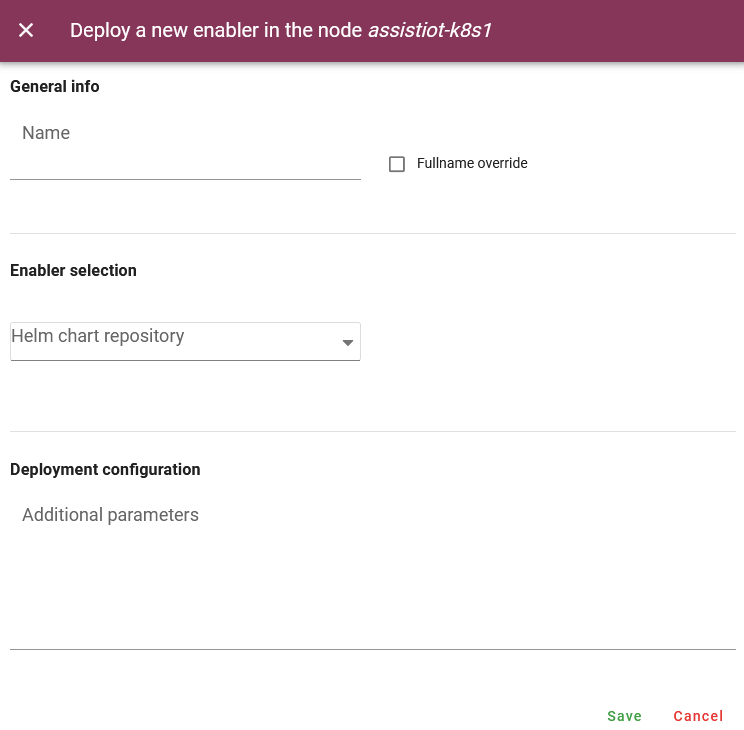

.. _Devices managment enabler:

#########################
Devices managment enabler
#########################

.. contents::
  :local:
  :depth: 1

***************
Introduction
***************
The main functionality of this enabler will be to register: (i) a smart IoT device in a deployment, and (ii) a cluster in an ASSIST-IoT deployment, including in the latter case 
all the necessary messages to notify it to the Smart Orchestrator. It will also execute all the required actions related to networking for enabling connectivity among isolated/independent clusters, 
including those that have been added via VPN/SD-WAN technology. Besides, it will allow monitoring any registered node and device in the deployment, including its status (i.e., available and used resources) 
and current instantiated enablers' components.

***************
Features
***************
This enabler is on charge of managing the two types of devices that are used in the project:

- **Kubernetes clusters**: register, delete, inspect the topology and manage the status of the clusters in synchronization with the Smart Orchestrator.
- **Smart IoT devices**: register, delete and manage the status of the physical IoT devices where some applications will be deployed. This feature is under development.

In future versions, K8s clusters that make use of SD-WAN or VPN connections will also be managed by the enabler.

*********************
Place in architecture
*********************
The Devices managment enabler is part of the vertical plane manageability enablers. Moreover, this enabler is a user interface that is part of the Tactile dashboard enabler.

.. figure:: ./dashboard-manageability-architecture.png
  :alt: Dashboard architecture
  :align: center

***************
User guide
***************
This enabler is included in the Tactile Dashboard of the project, so a logged user with the right permissions can access to it by clicking its menu entry.

+--------+------------------+---------------------------------------------+---------------------+-----------------+
| Method | Endpoint         | Description                                 | Payload (if needed) | Response format |
+========+==================+=============================================+=====================+=================+
| GET    | /k8scluster      | K8s clusters view of the dashboard          |                     | Web page        |
+--------+------------------+---------------------------------------------+---------------------+-----------------+
| GET    | /clustertopology | K8s clusters topology view of the dashboard |                     | Web page        |
+--------+------------------+---------------------------------------------+---------------------+-----------------+

Kubernetes clusters
*********************
The enabler shows a **table with the registered K8s clusters** in the Smart Orchestrator and some information: ID, name, K8s version, server url, status and creation date.

.. figure:: ./k8sclusters.png
  :alt: Devices management user interface
  :align: center

To **register a new K8s cluster**, click on the *Add a new cluster* button and a form will appear. There are two options to register a new cluster 
(click on the top right button to switch between these options): 

.. warning:: 
  - Ensure that all the K8s nodes are added to the K8s cluster prior to adding the cluster to the Smart Orchestrator.

  - The first cluster to be added must be the *cloud* cluster (the cluster where is installed the Smart Orchestrator).

  - Cluster name and all names in the Kubeconfig must be the same.

  For more information about adding K8s clusters, please visit the `Smart Orchestraror enabler entry <https://assist-iot-enablers-documentation.readthedocs.io/en/latest/horizontal_planes/smart/smart_orchestrator.html>`_

**(i) upload a kubeconfig JSON/YAML file** (examples can be found below)

.. figure:: ./k8scluster_form_file.png
  :alt: Register a new K8s cluster uploading a Kubeconfig file
  :align: center

Kubeconfig JSON file example:

.. code-block:: json

  {
    "apiVersion": "v1",
    "clusters": [
      {
        "cluster": {
          "certificate-authority-data": "LS0tLS1CRUdJTiBDRVJUSUZJQ0FURS0tLS0tCk1JSUMvakNDQWVhZ0F3SUJBZ0lCQURBTkJna3Foa2lHOXcwQkFRc0ZBREFWTVJNd0VRWURWUVFERXdwcmRXSmwKY201bGRHVnpNQjRYRFRJeU1EVXdPVEE1TWpFek5Gb1hEVE15TURVd05qQTVNakV6TkZvd0ZURVRNQkVHQTFVRQpBeE1LYTNWaVpYSnVaWFJsY3pDQ0FTSXdEUVlKS29aSWh2Y05BUUVCQlFBRGdnRVBBRENDQVFvQ2dnRUJBTWdhCjZ0YytGMmpOMTMzMy82clpjMkRpQW5pVWZDcC9BcEVRWTdJOGxsTE5RTTJab3VybThuc01kWXZwY3hQdzRkYmUKQkE3enNWNHBGejcxVTRtWUFaTUE0NjRxaFNFTTRZRFBBQjJ3NDdNWk1xOWd3bk5HY09oQkpHblIraGRxeVJzdApOTG9IK1lRR0FhSmd2dWpOY3hxOTJIKyswV2N2QkNPRWxVbDNad09YM1MrWnRkNVNQSHEyWXJnRCswTXZHcHpmCjI2aUNLWVkzOTNIb2htK2N1MlVwVy9ZTi91b2hQVTRNRXduNHZEOGxhN0ZCWWgwdThORFFCS2dwMVdleGlrOXIKSzlhWlR6TlVYYjFNa2MyUWRpRm1pWTQxN1FmcWZCVUxpbnFndWZaTTBXZnFWeFdiWkdRWlVlR05DUmMyMTYwdwo3SnJnWXVCd2ZRL2ZlOVI3SEUwQ0F3RUFBYU5aTUZjd0RnWURWUjBQQVFIL0JBUURBZ0trTUE4R0ExVWRFd0VCCi93UUZNQU1CQWY4d0hRWURWUjBPQkJZRUZQWmppb2xVYlQ0QUovSHl0QW9XMnM0ZVpvS0xNQlVHQTFVZEVRUU8KTUF5Q0NtdDFZbVZ5Ym1WMFpYTXdEUVlKS29aSWh2Y05BUUVMQlFBRGdnRUJBQTFYL2UrM2xSTUJBL0N6SmN4Nwo2ZG1LQTFIRUQ3bldoN2hqbFY4TDEvR2t5SUxjMHZRNjhjQ2FmRVNWT085VjJuUVVndzQ4VURnMDVZL2lYUDZUCjhPZzcvV1RnMFUvb05vYStGNGRseGxGSmdFYi96NDJBVlFMMy9BKzR4dk1CTTNZTkMxUlE3ZlBsc3JXZ0hWU2kKcG52dXU0NHRsNmsraE1FLzlMaTl1NG1JZGJITHRVK04wMngybnVyRUFCSHIrVmdyUC9MTHhjSWlJSkRwWlBuUwpmM3hWc1EyUUhGWFFlTkdPckIxUDkwbGQ0dlRKL3psdkVZMC9qaGp0L09WTFM2MWJLdWFzZkRBeHpxc3VFbFZECm1QSExsRGVIU3lBeitSVXJXVXdwS2lOdy9XZ2JISWdWbzB3WmJrdnV5VVBSamNabnhEemhZc083YjlUMEFxNmYKYzVjPQotLS0tLUVORCBDRVJUSUZJQ0FURS0tLS0tCg==",
          "server": "https://192.168.250.200:6443"
        },
        "name": "cloud"
      }
    ],
    "contexts": [
      {
        "context": {
          "cluster": "cloud",
          "user": "cloud"
        },
        "name": "cloud"
      }
    ],
    "current-context": "cloud",
    "kind": "Config",
    "preferences": {},
    "users": [
      {
        "name": "cloud",
        "user": {
          "client-certificate-data": "LS0tLS1CRUdJTiBDRVJUSUZJQ0FURS0tLS0tCk1JSURJVENDQWdtZ0F3SUJBZ0lJY0oyQ2xXZWNMYk13RFFZSktvWklodmNOQVFFTEJRQXdGVEVUTUJFR0ExVUUKQXhNS2EzVmlaWEp1WlhSbGN6QWVGdzB5TWpBMU1Ea3dPVEl4TXpSYUZ3MHlNekExTURrd09USXhNemRhTURReApGekFWQmdOVkJBb1REbk41YzNSbGJUcHRZWE4wWlhKek1Sa3dGd1lEVlFRREV4QnJkV0psY201bGRHVnpMV0ZrCmJXbHVNSUlCSWpBTkJna3Foa2lHOXcwQkFRRUZBQU9DQVE4QU1JSUJDZ0tDQVFFQXRXQmhGSVdCTkdXOW42KzMKQUhJSU5lL0p3c0V3VzhVK29WMmFjNTU3ZnlVRUdFOFpCcWZuT2VWNEkwS2RIZ3lSaEpaeEtQa3QvdFdTN0l6egpweWw3UlFYUmM5em9tL3poeG9TWkV3bjcraEptVDNHajJsR2NkbHhYbk9DcUpIUThHZGJCU0MvS3NCWFZpWExmCkFxMUlscjYvcEZkZERaTmlqVFVKTnIrdzFTbkhtekxTcThJY3V1SXhrcFVpQU1mUWRlY0dRbnFXMGE0TkNpMmwKZkQzUUpHdUpIcW1zVzRVb0Nqb1lwOWliRVp6emJ2ZjdCYko2YUNyT3hHZmlpZjNpdGJEWUhtcDl6dW5PbDNiaQoxRmphNEhYTWptZW5oNFN1UzFNR1FzOW13ZkoyQ0U0SmNENGVXVC9BbkMyWitGNHpxdnZ4UEE1NHNPOGNaZVE1CjErRmdpUUlEQVFBQm8xWXdWREFPQmdOVkhROEJBZjhFQkFNQ0JhQXdFd1lEVlIwbEJBd3dDZ1lJS3dZQkJRVUgKQXdJd0RBWURWUjBUQVFIL0JBSXdBREFmQmdOVkhTTUVHREFXZ0JUMlk0cUpWRzArQUNmeDhyUUtGdHJPSG1hQwppekFOQmdrcWhraUc5dzBCQVFzRkFBT0NBUUVBZ3F2UHJsbEtCenRsRXNUeEpEaGNObEdaYzlhNXU4K0ZBRXNSCjBGOWdXSU5tRDZnVFhZd2tBaHFpaHNPSUFjZDE0dEFvRmZ2NDExdVdDS05kS1dPNTdZRjNSOWVEZlBaQndjN1QKWW9DM1hJK1FTdjNiY1ZpTjZIOHlGaFVVeGFKVmEzbjFPekVFRjczaHBaSDRZdk5UUW5zcnczcG9zMW9QOHRsawpJRHg4YTBrSDVGODR6ZWE1eWd3alRlTk45eDVCS05SZVcwSzVvcW54NXlRcER3ZGxlQW9hVU9sK0cyZ3NHMHppCkhNbUpJMkkvaWNDMDdZWEI5cDQybFJCTTE4bm9mUlJ3cWx6bGNJa1A2em5kU3Z5SS9VK2Q1aWhXeCtaVWJudnkKWFVGemt3QTVNN3NUa1lkU1hvMWsvY0VvRnBDbGpOaDRlNTExaGVISUlPdzY2VXpDWEE9PQotLS0tLUVORCBDRVJUSUZJQ0FURS0tLS0tCg==",
          "client-key-data": "LS0tLS1CRUdJTiBSU0EgUFJJVkFURSBLRVktLS0tLQpNSUlFb2dJQkFBS0NBUUVBdFdCaEZJV0JOR1c5bjYrM0FISUlOZS9Kd3NFd1c4VStvVjJhYzU1N2Z5VUVHRThaCkJxZm5PZVY0STBLZEhneVJoSlp4S1BrdC90V1M3SXp6cHlsN1JRWFJjOXpvbS96aHhvU1pFd243K2hKbVQzR2oKMmxHY2RseFhuT0NxSkhROEdkYkJTQy9Lc0JYVmlYTGZBcTFJbHI2L3BGZGREWk5palRVSk5yK3cxU25IbXpMUwpxOEljdXVJeGtwVWlBTWZRZGVjR1FucVcwYTROQ2kybGZEM1FKR3VKSHFtc1c0VW9Dam9ZcDlpYkVaenpidmY3CkJiSjZhQ3JPeEdmaWlmM2l0YkRZSG1wOXp1bk9sM2JpMUZqYTRIWE1qbWVuaDRTdVMxTUdRczltd2ZKMkNFNEoKY0Q0ZVdUL0FuQzJaK0Y0enF2dnhQQTU0c084Y1plUTUxK0ZnaVFJREFRQUJBb0lCQUhpUFNiaEVUVyt3dU94dAo5ZXhiMzgxS1NBZ21OYWlxWVVrTldON0ZWejFhTTNDZEV2dHptNlRHUEtialhtQmM1bFVGVXM1ell2bGlxVGlICk1HWEtrdDk4VUk3OUpiaVp6TkVSemxYemF3UDhPdmxQaGlSVjN2Umx5TzdEL3hRZ0Z0cnQvcWVtN01sQ21oKzAKdFR1b1J2bThiTkltSi9vZ0gzL1E0d0Q3UmVWSnNqSmFxRFV5dnVsc0ZDVlJKNGNWVW1ueVhxR1c5VXFiQ2NSNgpCT0pITjh4N25qWFBNWUxWTWtCbWdHbElBdGtmL29qSzhQb0lRcW5mS3huUEVPTGQ1UUZUNGtOYm95SlEvRHFoCks0R1RMcjFldjNlU3NPVUxwSnVUdklGT0FZQU56ZE95RjhFbjdHbUg4N3YyVTZzcDFGM1RuRDVZdFBSZWoraTQKZEVlUUhxa0NnWUVBd3M5VTBWZ01yaC9ZQ2M2K3ZQRjdKVzJ4NncxTnU1MGp0dUlwSTJtV3gwUUM1UThNclVDMQpiNTYxekdnVzlXYVFMVHhHQ1lVSTZ0Znk0RDdic1ZIczVkazJYZ1poUnNJb1Z5aWJPSnp5Q0lIRGxoOW5tbUM5CndMYXBlU01TZFVCUThKNFJrQzV6VjFiWW1DRXZ0K1c1Zlp3bVhWcGlQeVpXUkJSK2xTSWhZR01DZ1lFQTdsamUKQm4vVFF1M2NHN0tsZStzdEtRaEwvNWxzRElaZ2loWGxLbWNjamx4K0VDdjZSbktPejl2SzBER09Uc1RVOHA4QgpZcjJTb0RxVm43S244eHBXWjJMMGhyaXhmQ3Z2eTRyWXFzQ3dTa2xGMUhlcFdCU3BkdU5aVzRyTDQ1RUlMUHhSCnVock8zcjRkSU1WTzBhVUYwZmxsY3o0aGdRSGNlK1RMT01wYzhTTUNnWUEyMC8yT01kYlh4dlNaeGd0ZXlDUWQKbzZMNGdiVUlBYkVFanVCL0svK1lzNmFRNjB4cEVwWStCUkFycUh3VnN6a08wakR3Q3ZZNGluQzc5bFVFc2djWApwYXVzaU9VbDhnMUNncFkxTjg3UzRCcTVETHV1OGwxVmVOTjMyWXdmWGV1cDNRTWFia2hlSTM0d1N0N1FSaUtQCm5Md2JlQTNBc2p5RFNyVlpxZEowK3dLQmdEdVRNT1BVL1h4RU1ma21YU0N0TnR1RHZHTkYrUERrZ2FyaU1DYTYKSVRRZ1FFNVFmNzB1RXk0M1ZPbFhDYWY4b1BHSDl2TzBTTHNPQ2FvaUlNS3QrWnpiNmh6bWUwNTdPUFBhWDYvRwpmQW9GYUpQajJRc3dGdStsZ2dkVW1RUG5rM0NUSE9aMG52S2orR25oaDRMMVNaQWpVMDFMNFZuNm1oN0pvRll3CmxxeWJBb0dBTDViT0JuNEd6SS92anVHczd3YTFNMGFlQ0hSYldPdUJmMXBSRUltR2JXNE91QU9BQmZHdTlPRGoKeUVkanVlRSszOW9tYzMzZitYWi9Cdk5HREZ3Q2tPQzRYRnVEZWhPeG4zaCtjbjg2Zzl3N3lOVDF2U1R2VVk1ZQorc295NUFTQUxJVElxRlJlQ1YwczlUdDlVVGtiSUI0Z240R0N5WVdmNUVTbXM2OG9hUkE9Ci0tLS0tRU5EIFJTQSBQUklWQVRFIEtFWS0tLS0tCg=="
        }
      }
    ]
  }

Kubeconfig YAML file example:

.. code-block:: yaml

  apiVersion: v1
  clusters:
      - cluster:
            certificate-authority-data: LS0tLS1CRUdJTiBDRVJUSUZJQ0FURS0tLS0tCk1JSUMvakNDQWVhZ0F3SUJBZ0lCQURBTkJna3Foa2lHOXcwQkFRc0ZBREFWTVJNd0VRWURWUVFERXdwcmRXSmwKY201bGRHVnpNQjRYRFRJeU1EVXdPVEE1TWpFek5Gb1hEVE15TURVd05qQTVNakV6TkZvd0ZURVRNQkVHQTFVRQpBeE1LYTNWaVpYSnVaWFJsY3pDQ0FTSXdEUVlKS29aSWh2Y05BUUVCQlFBRGdnRVBBRENDQVFvQ2dnRUJBTWdhCjZ0YytGMmpOMTMzMy82clpjMkRpQW5pVWZDcC9BcEVRWTdJOGxsTE5RTTJab3VybThuc01kWXZwY3hQdzRkYmUKQkE3enNWNHBGejcxVTRtWUFaTUE0NjRxaFNFTTRZRFBBQjJ3NDdNWk1xOWd3bk5HY09oQkpHblIraGRxeVJzdApOTG9IK1lRR0FhSmd2dWpOY3hxOTJIKyswV2N2QkNPRWxVbDNad09YM1MrWnRkNVNQSHEyWXJnRCswTXZHcHpmCjI2aUNLWVkzOTNIb2htK2N1MlVwVy9ZTi91b2hQVTRNRXduNHZEOGxhN0ZCWWgwdThORFFCS2dwMVdleGlrOXIKSzlhWlR6TlVYYjFNa2MyUWRpRm1pWTQxN1FmcWZCVUxpbnFndWZaTTBXZnFWeFdiWkdRWlVlR05DUmMyMTYwdwo3SnJnWXVCd2ZRL2ZlOVI3SEUwQ0F3RUFBYU5aTUZjd0RnWURWUjBQQVFIL0JBUURBZ0trTUE4R0ExVWRFd0VCCi93UUZNQU1CQWY4d0hRWURWUjBPQkJZRUZQWmppb2xVYlQ0QUovSHl0QW9XMnM0ZVpvS0xNQlVHQTFVZEVRUU8KTUF5Q0NtdDFZbVZ5Ym1WMFpYTXdEUVlKS29aSWh2Y05BUUVMQlFBRGdnRUJBQTFYL2UrM2xSTUJBL0N6SmN4Nwo2ZG1LQTFIRUQ3bldoN2hqbFY4TDEvR2t5SUxjMHZRNjhjQ2FmRVNWT085VjJuUVVndzQ4VURnMDVZL2lYUDZUCjhPZzcvV1RnMFUvb05vYStGNGRseGxGSmdFYi96NDJBVlFMMy9BKzR4dk1CTTNZTkMxUlE3ZlBsc3JXZ0hWU2kKcG52dXU0NHRsNmsraE1FLzlMaTl1NG1JZGJITHRVK04wMngybnVyRUFCSHIrVmdyUC9MTHhjSWlJSkRwWlBuUwpmM3hWc1EyUUhGWFFlTkdPckIxUDkwbGQ0dlRKL3psdkVZMC9qaGp0L09WTFM2MWJLdWFzZkRBeHpxc3VFbFZECm1QSExsRGVIU3lBeitSVXJXVXdwS2lOdy9XZ2JISWdWbzB3WmJrdnV5VVBSamNabnhEemhZc083YjlUMEFxNmYKYzVjPQotLS0tLUVORCBDRVJUSUZJQ0FURS0tLS0tCg==
            server: https://192.168.250.200:6443
        name: cloud
  contexts:
      - context:
            cluster: cloud
            user: user
        name: cloud
  current-context: cloud
  kind: Config
  preferences: {}
  users:
      - name: cloud
        user:
            client-certificate-data: LS0tLS1CRUdJTiBDRVJUSUZJQ0FURS0tLS0tCk1JSURJVENDQWdtZ0F3SUJBZ0lJY0oyQ2xXZWNMYk13RFFZSktvWklodmNOQVFFTEJRQXdGVEVUTUJFR0ExVUUKQXhNS2EzVmlaWEp1WlhSbGN6QWVGdzB5TWpBMU1Ea3dPVEl4TXpSYUZ3MHlNekExTURrd09USXhNemRhTURReApGekFWQmdOVkJBb1REbk41YzNSbGJUcHRZWE4wWlhKek1Sa3dGd1lEVlFRREV4QnJkV0psY201bGRHVnpMV0ZrCmJXbHVNSUlCSWpBTkJna3Foa2lHOXcwQkFRRUZBQU9DQVE4QU1JSUJDZ0tDQVFFQXRXQmhGSVdCTkdXOW42KzMKQUhJSU5lL0p3c0V3VzhVK29WMmFjNTU3ZnlVRUdFOFpCcWZuT2VWNEkwS2RIZ3lSaEpaeEtQa3QvdFdTN0l6egpweWw3UlFYUmM5em9tL3poeG9TWkV3bjcraEptVDNHajJsR2NkbHhYbk9DcUpIUThHZGJCU0MvS3NCWFZpWExmCkFxMUlscjYvcEZkZERaTmlqVFVKTnIrdzFTbkhtekxTcThJY3V1SXhrcFVpQU1mUWRlY0dRbnFXMGE0TkNpMmwKZkQzUUpHdUpIcW1zVzRVb0Nqb1lwOWliRVp6emJ2ZjdCYko2YUNyT3hHZmlpZjNpdGJEWUhtcDl6dW5PbDNiaQoxRmphNEhYTWptZW5oNFN1UzFNR1FzOW13ZkoyQ0U0SmNENGVXVC9BbkMyWitGNHpxdnZ4UEE1NHNPOGNaZVE1CjErRmdpUUlEQVFBQm8xWXdWREFPQmdOVkhROEJBZjhFQkFNQ0JhQXdFd1lEVlIwbEJBd3dDZ1lJS3dZQkJRVUgKQXdJd0RBWURWUjBUQVFIL0JBSXdBREFmQmdOVkhTTUVHREFXZ0JUMlk0cUpWRzArQUNmeDhyUUtGdHJPSG1hQwppekFOQmdrcWhraUc5dzBCQVFzRkFBT0NBUUVBZ3F2UHJsbEtCenRsRXNUeEpEaGNObEdaYzlhNXU4K0ZBRXNSCjBGOWdXSU5tRDZnVFhZd2tBaHFpaHNPSUFjZDE0dEFvRmZ2NDExdVdDS05kS1dPNTdZRjNSOWVEZlBaQndjN1QKWW9DM1hJK1FTdjNiY1ZpTjZIOHlGaFVVeGFKVmEzbjFPekVFRjczaHBaSDRZdk5UUW5zcnczcG9zMW9QOHRsawpJRHg4YTBrSDVGODR6ZWE1eWd3alRlTk45eDVCS05SZVcwSzVvcW54NXlRcER3ZGxlQW9hVU9sK0cyZ3NHMHppCkhNbUpJMkkvaWNDMDdZWEI5cDQybFJCTTE4bm9mUlJ3cWx6bGNJa1A2em5kU3Z5SS9VK2Q1aWhXeCtaVWJudnkKWFVGemt3QTVNN3NUa1lkU1hvMWsvY0VvRnBDbGpOaDRlNTExaGVISUlPdzY2VXpDWEE9PQotLS0tLUVORCBDRVJUSUZJQ0FURS0tLS0tCg==
            client-key-data: LS0tLS1CRUdJTiBSU0EgUFJJVkFURSBLRVktLS0tLQpNSUlFb2dJQkFBS0NBUUVBdFdCaEZJV0JOR1c5bjYrM0FISUlOZS9Kd3NFd1c4VStvVjJhYzU1N2Z5VUVHRThaCkJxZm5PZVY0STBLZEhneVJoSlp4S1BrdC90V1M3SXp6cHlsN1JRWFJjOXpvbS96aHhvU1pFd243K2hKbVQzR2oKMmxHY2RseFhuT0NxSkhROEdkYkJTQy9Lc0JYVmlYTGZBcTFJbHI2L3BGZGREWk5palRVSk5yK3cxU25IbXpMUwpxOEljdXVJeGtwVWlBTWZRZGVjR1FucVcwYTROQ2kybGZEM1FKR3VKSHFtc1c0VW9Dam9ZcDlpYkVaenpidmY3CkJiSjZhQ3JPeEdmaWlmM2l0YkRZSG1wOXp1bk9sM2JpMUZqYTRIWE1qbWVuaDRTdVMxTUdRczltd2ZKMkNFNEoKY0Q0ZVdUL0FuQzJaK0Y0enF2dnhQQTU0c084Y1plUTUxK0ZnaVFJREFRQUJBb0lCQUhpUFNiaEVUVyt3dU94dAo5ZXhiMzgxS1NBZ21OYWlxWVVrTldON0ZWejFhTTNDZEV2dHptNlRHUEtialhtQmM1bFVGVXM1ell2bGlxVGlICk1HWEtrdDk4VUk3OUpiaVp6TkVSemxYemF3UDhPdmxQaGlSVjN2Umx5TzdEL3hRZ0Z0cnQvcWVtN01sQ21oKzAKdFR1b1J2bThiTkltSi9vZ0gzL1E0d0Q3UmVWSnNqSmFxRFV5dnVsc0ZDVlJKNGNWVW1ueVhxR1c5VXFiQ2NSNgpCT0pITjh4N25qWFBNWUxWTWtCbWdHbElBdGtmL29qSzhQb0lRcW5mS3huUEVPTGQ1UUZUNGtOYm95SlEvRHFoCks0R1RMcjFldjNlU3NPVUxwSnVUdklGT0FZQU56ZE95RjhFbjdHbUg4N3YyVTZzcDFGM1RuRDVZdFBSZWoraTQKZEVlUUhxa0NnWUVBd3M5VTBWZ01yaC9ZQ2M2K3ZQRjdKVzJ4NncxTnU1MGp0dUlwSTJtV3gwUUM1UThNclVDMQpiNTYxekdnVzlXYVFMVHhHQ1lVSTZ0Znk0RDdic1ZIczVkazJYZ1poUnNJb1Z5aWJPSnp5Q0lIRGxoOW5tbUM5CndMYXBlU01TZFVCUThKNFJrQzV6VjFiWW1DRXZ0K1c1Zlp3bVhWcGlQeVpXUkJSK2xTSWhZR01DZ1lFQTdsamUKQm4vVFF1M2NHN0tsZStzdEtRaEwvNWxzRElaZ2loWGxLbWNjamx4K0VDdjZSbktPejl2SzBER09Uc1RVOHA4QgpZcjJTb0RxVm43S244eHBXWjJMMGhyaXhmQ3Z2eTRyWXFzQ3dTa2xGMUhlcFdCU3BkdU5aVzRyTDQ1RUlMUHhSCnVock8zcjRkSU1WTzBhVUYwZmxsY3o0aGdRSGNlK1RMT01wYzhTTUNnWUEyMC8yT01kYlh4dlNaeGd0ZXlDUWQKbzZMNGdiVUlBYkVFanVCL0svK1lzNmFRNjB4cEVwWStCUkFycUh3VnN6a08wakR3Q3ZZNGluQzc5bFVFc2djWApwYXVzaU9VbDhnMUNncFkxTjg3UzRCcTVETHV1OGwxVmVOTjMyWXdmWGV1cDNRTWFia2hlSTM0d1N0N1FSaUtQCm5Md2JlQTNBc2p5RFNyVlpxZEowK3dLQmdEdVRNT1BVL1h4RU1ma21YU0N0TnR1RHZHTkYrUERrZ2FyaU1DYTYKSVRRZ1FFNVFmNzB1RXk0M1ZPbFhDYWY4b1BHSDl2TzBTTHNPQ2FvaUlNS3QrWnpiNmh6bWUwNTdPUFBhWDYvRwpmQW9GYUpQajJRc3dGdStsZ2dkVW1RUG5rM0NUSE9aMG52S2orR25oaDRMMVNaQWpVMDFMNFZuNm1oN0pvRll3CmxxeWJBb0dBTDViT0JuNEd6SS92anVHczd3YTFNMGFlQ0hSYldPdUJmMXBSRUltR2JXNE91QU9BQmZHdTlPRGoKeUVkanVlRSszOW9tYzMzZitYWi9Cdk5HREZ3Q2tPQzRYRnVEZWhPeG4zaCtjbjg2Zzl3N3lOVDF2U1R2VVk1ZQorc295NUFTQUxJVElxRlJlQ1YwczlUdDlVVGtiSUI0Z240R0N5WVdmNUVTbXM2OG9hUkE9Ci0tLS0tRU5EIFJTQSBQUklWQVRFIEtFWS0tLS0tCg==

or **(ii) fill in the form manually.**

.. figure:: ./k8scluster_form_manual.png
  :alt: Register a new K8s cluster manually
  :align: center

To **delete a registered cluster**, click on the *Delete cluster* button of the selected cluster and confirm the action in the dialog.

.. figure:: ./k8scluster_delete.png
  :alt: Delete a registered K8s cluster
  :align: center

Kubernetes clusters topology
*****************************
The enabler displays a **topology graph of the K8 clusters** registered with the Smart Orchestrator, including all the K8 nodes (differentiating between master and worker nodes) that make up each cluster.

.. figure:: ./k8scluster_topology.png
  :alt: K8s clusters topology
  :align: center

Click on a cluster to **display a list of the deployed enablers in the cluster**.

Click on a node to **deploy an enabler in the node** (the whole enabler is deployed on the same node, which means that all the components included in the 
Helm chart will be deloyed in the selected node) and then a form will appear.

***************
Prerequisites
***************
The Smart Orchestrator must be previously installed.

***************
Installation
***************
This enabler is part of the Tactile dashboard enabler, so it is installed along with the Smart Orchestrator in the latter's installation script.

However, it can be installed using its Helm chart, which can be found in the Package registry of the Gitlab's public repository:

1. Add the Helm chart repository:

   ``helm repo add assist-public-repo https://gitlab.assist-iot.eu/api/v4/projects/85/packages/helm/stable``

2. Install the last version of the dashboard's Helm chart

   ``helm install assist-public-repo/dashboard``

*********************
Configuration options
*********************
Will be determined after the release of the enabler.

***************
Developer guide
***************
For more information, read the `Tactile dashboard enabler entry <https://assist-iot-enablers-documentation.readthedocs.io/en/latest/horizontal_planes/application/tactile_dashboard_enabler.html>`_.

***************************
Version control and release
***************************
Version 1.0.0. Fully functional and aligned with the version 3.0.0 of the Smart Orchestrator enabler.

***************
License
***************
The licenses of internal code are under analysis. The code is developed using open source technologies (Vue.js, Spring framework, ...) and PUI9, a framework that is property of
Prodevelop. For more information about PUI9 licenses, read the `Tactile dashboard enabler entry <https://assist-iot-enablers-documentation.readthedocs.io/en/latest/horizontal_planes/application/tactile_dashboard_enabler.html>`_

********************
Notice (dependencies)
********************
This enabler depends on the Smart Orchestrator enabler and it's part of the Tactile dashboard enabler.