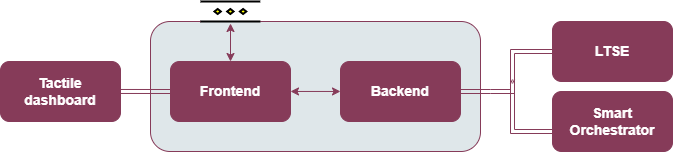

.. _Composite services manager:

###########################
Composite services manager
###########################

.. contents::
  :local:
  :depth: 1

***************
Introduction
***************
Integrated in the tactile dashboard, this enabler will present a graphical environment where ASSIST-IoT administrators can instantiate the enablers required to work, and also to connect them to compose a composite service (i.e., a workflow or a pipeline). Having information about the physical topology and available K8s nodes/clusters, it will allow the user to decide whether to select the proper node or cluster for deploying an enabler, or let the system decide based on pre-defined architectural rules.

***************
Features
***************
The component is in an early development stage, as it greatly depends on its interaction with other enablers (and hence, need to have their APIs and environment variables in place). 
At the moment, it is not possible to describe concise features, therefore for the sake of avoiding adding content that might be likely modified, features are not indicated yet.

*********************
Place in architecture
*********************
The Composite services manager is part of the vertical plane manageability enablers. Moreover, the frontend component of this enabler will be part of the Tactile dashboard enabler.

***************
User guide
***************
This enabler will be included in the Tactile Dashboard of the project, so a logged user with the right permissions will be able to access to it by clicking its menu entry.

+--------+-----------------------------+--------------------------------------------------+---------------------+-----------------+
| Method | Endpoint                    | Description                                      | Payload (if needed) | Response format |
+========+=============================+==================================================+=====================+=================+
| GET    | /composite-services-manager | Composite services manager view of the dashboard |                     | Web page        |
+--------+-----------------------------+--------------------------------------------------+---------------------+-----------------+

The specific endpoints of the enabler (frontend and backend components) and a guide explaining how to define and deploy pipelines will be added after the next release of the enabler.

***************
Prerequisites
***************
The Smart Orchestrator and the LTSE must be previously installed.

.. warning::
  This enabler has some prerequisites regarding the Smart Orchestrator:

  - At least one K8s cluster must be registered
  - The ASSIST-IoT enabler's Helm chart public repository must be resgistered

***************
Installation
***************
The enabler will be installed using its Helm chart.

1. Add the Helm chart repository:

   ``helm repo add assist-public-repo https://gitlab.assist-iot.eu/api/v4/projects/85/packages/helm/stable``

2. Install the last version of the dashboard's Helm chart

   ``helm install assist-public-repo/composite-service-manager``

*********************
Configuration options
*********************
Will be completed after the next release of the enabler.

***************
Developer guide
***************
Will be completed after the next release of the enabler.

***************************
Version control and release
***************************
Version 1.0.0 under a final development stage, at this moment the enabler is fully functional but with limited functionalities, so it is open to the addition of more features. Furthermore, it is aligned with the version 3.0.0 of the Smart Orchestrator enabler.

***************
License
***************
Apache 2.0.

*********************
Notice (dependencies)
*********************
This enabler depends on the Smart Orchestrator enabler and the Long Term data Storage Enabler (LTSE). Furthermore, is part of the Tactile dashboard enabler as an iframe.

Furthermore, this enabler uses Node-RED for its frontend component, which is also under an Apache 2.0 license.