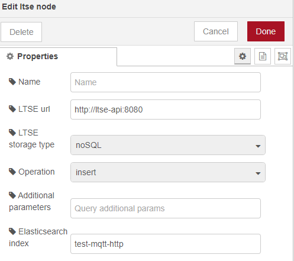
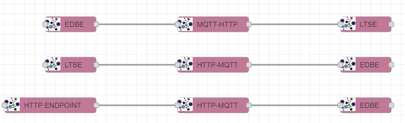

.. _Composite services manager:

###########################
Composite services manager
###########################

.. contents::
  :local:
  :depth: 1

***************
Introduction
***************
This enabler presents a graphical environment where ASSIST-IoT administrators can connect previously deployed enablers
to compose a composite service (i.e., a workflow or a pipeline). Having information about the physical topology and available K8s nodes/clusters, 
it allows the user to decide whether to select the proper node or cluster for deploying an enabler, or let the system decide based on pre-defined architectural rules.

The composite services manager can be integrated in the tactile dashboard enabler.

***************
Features
***************
Users can define flows among ASSIST-IoT enablers (previously defined as nodes) to move data among them, facilitating the translation between different communication protocols. 
For instance, published messages on an MQTT topic of the EDBE are needed to be stored in the LTSE, or some data available through an HTTP REST API needs to be published
in an MQTT topic to be available for the subscribers.

List of available nodes:

- EDBE
- LTSE
- HTTP ENDPOINT
- MQTT-HTTP
- HTTP-MQTT

List of available translation agents:

- MQTT-HTTP
- HTTP-MQTT

*********************
Place in architecture
*********************
The Composite services manager is part of the vertical plane manageability enablers. Moreover, the frontend component of this enabler will be part of the Tactile dashboard enabler.

.. figure:: ./composite-service-manager-architecture.png
  :alt: Composite services manager architecture
  :align: center

***************
User guide
***************

REST API endpoints
*******************
This enabler will be included in the Tactile Dashboard of the project, so a logged user with the right permissions will be able to access to it by clicking its menu entry.

+--------+-----------------------------+--------------------------------------------------+---------------------+-----------------+
| Method | Endpoint                    | Description                                      | Payload (if needed) | Response format |
+========+=============================+==================================================+=====================+=================+
| GET    | /composite-services-manager | Composite services manager view of the dashboard |                     | Web page        |
+--------+-----------------------------+--------------------------------------------------+---------------------+-----------------+

Endpoints of the Backend component:

+--------+-------------+-----------------------------------------------+-------------------------------+-----------------------------------------------+
| Method | Endpoint    | Description                                   | Payload (if needed)           | Response format                               |
+========+=============+===============================================+===============================+===============================================+
| GET    | /version    | Get the enabler version                       |                               | { "enabler": String, "version": String }      |
+--------+-------------+-----------------------------------------------+-------------------------------+-----------------------------------------------+
| GET    | /health     | Get the enabler's health status               |                               |                                               |
+--------+-------------+-----------------------------------------------+-------------------------------+-----------------------------------------------+
| GET    | /metrics    | Obtain some enabler metrics                   |                               | { "flows": Number, "deployedAgents": Number } |
+--------+-------------+-----------------------------------------------+-------------------------------+-----------------------------------------------+
| GET    | /api-export | Get the OpenAPI specification in JSON         |                               | OpenAPI specification in JSON                 |
+--------+-------------+-----------------------------------------------+-------------------------------+-----------------------------------------------+
| POST   | /           | Update flows as defined in the front endpoint | Node-RED flows format in JSON | { "message": String }                         |
+--------+-------------+-----------------------------------------------+-------------------------------+-----------------------------------------------+

Frontend dashboard
*******************
.. figure:: ./composite-service-manager-dashboard.png
  :alt: Composite services manager dashboard
  :align: center

Create a flow
****************
1. Drag a node of an enabler from the ASSIST-IoT group from the left side menu and drop it onto the dashboard.
2. Double-click on the enabler node to configure it and save the configuration.

3. Drag an agent node, drop it on the dashboard and connect the two nodes by clicking on the edge of the node.
4. Double-click on the agent node to configure it and save the configuration.
5. Drag a node of another enabler, drop it on the dashboard and connect it to the agent by clicking on the node border.
6. Double-click on the enabler node to configure it and save the configuration.
7. Click on the *Deploy* button at the top right of the dashboard.
8. A JSON with the response of the Backend API will be displayed in the *Debug* section.
9. The Smart Orchestrator will deploy the configured agents in the flows in the corresponding K8s cluster.

Example of working flows:

Delete a flow
****************
1. Select and delete the flows from the dashboard.
2. Click on the *Deploy* button at the top right of the dashboard.
3. A JSON with the response of the Backend API will be displayed in the *Debug* section.
4. The Smart Orchestrator will deploy the configured agents in the flows in the corresponding K8s cluster.

.. note:: 
  It's better to click on the *Deploy* button after the creation and deletion of all the flows.

***************
Prerequisites
***************
The Smart Orchestrator and the LTSE must be previously installed.

.. warning::
  This enabler has some prerequisites regarding the Smart Orchestrator:
  - At least the *cloud* K8s cluster must be registered
  - The ASSIST-IoT enabler's Helm chart public repository must be resgistered

***************
Installation
***************
The enabler can be installed using its Helm chart, but in future releases it will be installed along with the Smart Orchestrator in the latter's installation script.

1. Add the Helm chart repository:

   ``helm repo add assist-public-repo https://gitlab.assist-iot.eu/api/v4/projects/85/packages/helm/stable``

2. Install the last version of the enabler:

   ``helm install assist-public-repo/composite-services``

*********************
Configuration options
*********************
The backend of the enabler can be configured using the following environment variables in the Helm chart:

- **smartOrchestratorUrl**: complete URL of the Smart Orchestrator.
- **validNodes**: list of valid nodes (Node-RED nodes) to be used to define the flows in the frontend dashboard.
- **helmChartRepository**: name of the Helm chart repository which contains the charts of the agents.
- **ltseUrl**: complete URL of the LTSE API.
- **ltseIndex**: name of the Elasticsearch index to store the defined flows.

***************
Developer guide
***************
The intention of this enabler is to be open to the development of `new Node-RED nodes <https://nodered.org/docs/creating-nodes/>`_ and translation agents. Please, use the developed `nodes <https://github.com/assist-iot/composite_services/tree/master/node-red>`_ 
and `agents <https://github.com/assist-iot/composite_services/tree/master/agents>`_  as a reference.

***************************
Version control and release
***************************
Version 1.1.0 fully functional, but it is open to the addition of more agents, nodes and features. Furthermore, it is aligned with the version 4.0.0 of the Smart Orchestrator enabler.

***************
License
***************
Apache License Version 2.0

*********************
Notice (dependencies)
*********************

ASSIST-IoT - Architecture for Scalable, Self-\*, human-centric, Intelligent, Se-cure, and Tactile next generation IoT

This project has received funding from the European Union's Horizon 2020
research and innovation programme under grant agreement No 957258.

Composite services manager of the Manageability enablers

Copyright 2020-2023 Universitat Politècnica de València

I. Included Software

II. Used Software

- Node-RED (https://github.com/node-red/node-red), Apache-2.0 license
- elastic/elasticsearch (https://github.com/elastic/elasticsearch-js), Apache-2.0 license
- elastic/transport (https://github.com/elastic/elastic-transport-js), Apache-2.0 license
- accepts 1.3.8 (https://github.com/jshttp/accepts), MIT license
- array-flatten 1.1.1 (https://github.com/blakeembrey/array-flatten), MIT license
- asynckit 0.4.0 (https://github.com/alexindigo/asynckit), MIT license
- axios 1.1.3 (https://github.com/axios/axios), MIT license
- body-parser 1.20.1 (https://github.com/expressjs/body-parser), MIT license
- busboy 1.6.0 (https://github.com/mscdex/busboy), MIT license
- bytes 3.1.2 (https://github.com/visionmedia/bytes.js), MIT license
- call-bind 1.0.2 (https://github.com/ljharb/call-bind), MIT license
- combined-stream 1.0.8 (https://github.com/felixge/node-combined-stream), MIT license
- content-disposition 0.5.4 (https://github.com/jshttp/content-disposition), MIT license
- content-type 1.0.4 (https://github.com/jshttp/content-type), MIT license
- cookie-signature 1.0.6 (https://github.com/visionmedia/node-cookie-signature), MIT license
- cookie 0.5.0 (https://github.com/jshttp/cookie), MIT license
- debug 2.6.9 (https://github.com/visionmedia/debug), MIT license
- debug 4.3.4 (https://github.com/debug-js/debug), MIT license
- delayed-stream 1.0.0 (https://github.com/felixge/node-delayed-stream), MIT license
- depd 2.0.0 (https://github.com/dougwilson/nodejs-depd), MIT license
- destroy 1.2.0 (https://github.com/stream-utils/destroy), MIT license
- ee-first 1.1.1 (https://github.com/jonathanong/ee-first), MIT license
- encodeurl 1.0.2 (https://github.com/pillarjs/encodeurl), MIT license
- escape-html 1.0.3 (https://github.com/component/escape-html), MIT license
- etag 1.8.1 (https://github.com/jshttp/etag), MIT license
- express 4.18.2 (https://github.com/expressjs/express), MIT license
- finalhandler 1.2.0 (https://github.com/pillarjs/finalhandler), MIT license
- follow-redirects 1.15.2 (https://github.com/follow-redirects/follow-redirects), MIT license
- form-data 4.0.0 (https://github.com/form-data/form-data), MIT license
- forwarded 0.2.0 (https://github.com/jshttp/forwarded), MIT license
- fresh 0.5.2 (https://github.com/jshttp/fresh), MIT license
- function-bind 1.1.1 (https://github.com/Raynos/function-bind), MIT license
- get-intrinsic 1.1.3 (https://github.com/ljharb/get-intrinsic), MIT license
- has-symbols 1.0.3 (https://github.com/inspect-js/has-symbols), MIT license
- has 1.0.3 (https://github.com/tarruda/has), MIT license
- hpagent 1.2.0 (https://github.com/delvedor/hpagent), MIT license
- http-errors 2.0.0 (https://github.com/jshttp/http-errors), MIT license
- iconv-lite 0.4.24 (https://github.com/ashtuchkin/iconv-lite), MIT license
- inherits 2.0.4 (https://github.com/isaacs/inherits), ISC license
- ipaddr.js 1.9.1 (https://github.com/whitequark/ipaddr.js), MIT license
- media-typer 0.3.0 (https://github.com/jshttp/media-typer), MIT license
- merge-descriptors 1.0.1 (https://github.com/component/merge-descriptors), MIT license
- methods 1.1.2 (https://github.com/jshttp/methods), MIT license
- mime-db 1.52.0 (https://github.com/jshttp/mime-db), MIT license
- mime-types 2.1.35 (https://github.com/jshttp/mime-types), MIT license
- mime 1.6.0 (https://github.com/broofa/node-mime), MIT license
- ms 2.0.0 (https://github.com/zeit/ms), MIT license
- ms 2.1.2 (https://github.com/zeit/ms), MIT license
- ms 2.1.3 (https://github.com/vercel/ms), MIT license
- negotiator 0.6.3 (https://github.com/jshttp/negotiator), MIT license
- object-inspect 1.12.2 (https://github.com/inspect-js/object-inspect), MIT license
- on-finished 2.4.1 (https://github.com/jshttp/on-finished), MIT license
- parseurl 1.3.3 (https://github.com/pillarjs/parseurl), MIT license
- path-to-regexp 0.1.7 (https://github.com/component/path-to-regexp), MIT license
- proxy-addr 2.0.7 (https://github.com/jshttp/proxy-addr), MIT license
- proxy-from-env 1.1.0 (https://github.com/Rob--W/proxy-from-env), MIT license
- qs 6.11.0 (https://github.com/ljharb/qs), BSD-3-Clause license
- range-parser 1.2.1 (https://github.com/jshttp/range-parser), MIT license
- raw-body 2.5.1 (https://github.com/stream-utils/raw-body), MIT license
- safe-buffer 5.2.1 (https://github.com/feross/safe-buffer), MIT license
- safer-buffer 2.1.2 (https://github.com/ChALkeR/safer-buffer), MIT license
- secure-json-parse 2.7.0 (https://github.com/fastify/secure-json-parse), BSD-3-Clause license
- send 0.18.0 (https://github.com/pillarjs/send), MIT license
- serve-static 1.15.0 (https://github.com/expressjs/serve-static), MIT license
- setprototypeof 1.2.0 (https://github.com/wesleytodd/setprototypeof), ISC license
- side-channel 1.0.4 (https://github.com/ljharb/side-channel), MIT license
- statuses 2.0.1 (https://github.com/jshttp/statuses), MIT license
- streamsearch 1.1.0 (https://github.com/mscdex/streamsearch), MIT license
- toidentifier 1.0.1 (https://github.com/component/toidentifier), MIT license
- tslib 2.5.0 (https://github.com/Microsoft/tslib), 0BSD license
- type-is 1.6.18 (https://github.com/jshttp/type-is), MIT license
- undici 5.20.0 (https://github.com/nodejs/undici), MIT license
- unpipe 1.0.0 (https://github.com/stream-utils/unpipe), MIT license
- utils-merge 1.0.1 (https://github.com/jaredhanson/utils-merge), MIT license
- uuid 9.0.0 (https://github.com/uuidjs/uuid), MIT license
- vary 1.1.2 (https://github.com/jshttp/vary), MIT license

III. List of licenses

- Apache-2.0 license (https://www.apache.org/licenses/LICENSE-2.0)
- MIT license (https://opensource.org/licenses/MIT)
- ISC license (https://opensource.org/licenses/ISC)
- BSD-3-Clause license (https://opensource.org/licenses/BSD-3-Clause)
- 0BSD license (https://www.openbsd.org/)
