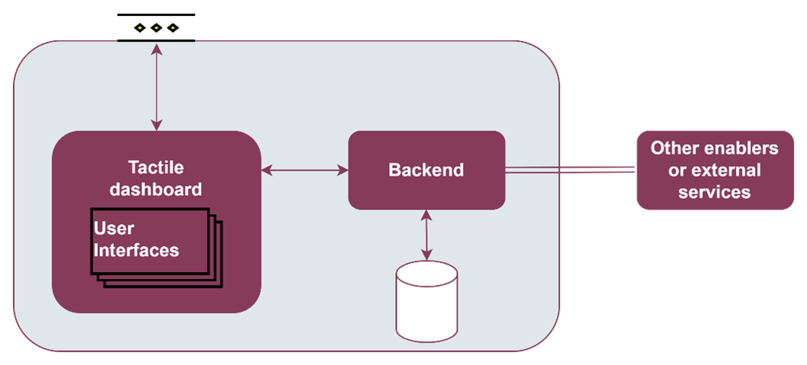
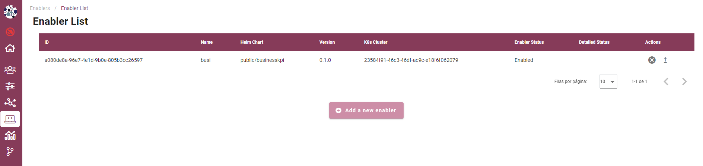
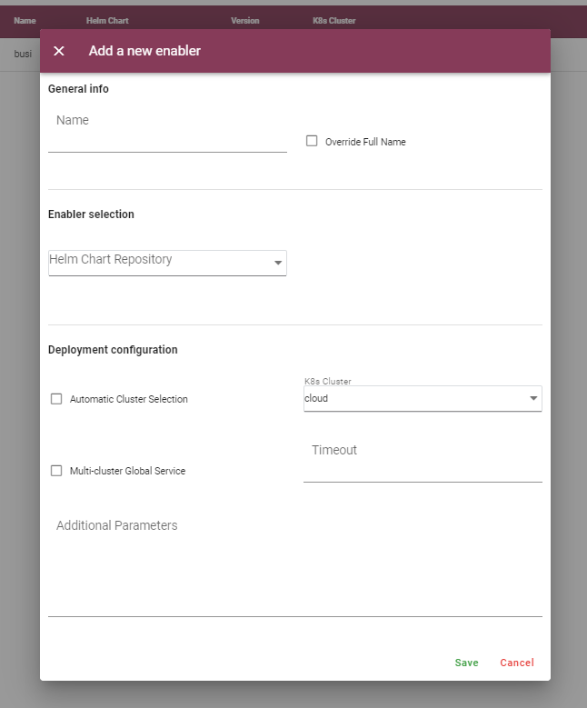
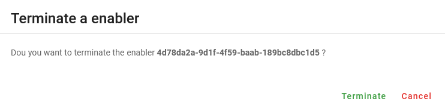
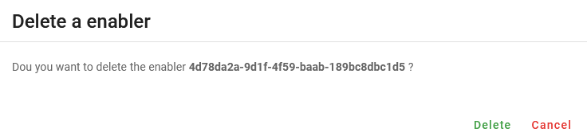

.. _Enabler for registration and status of enablers:

###############################################
Enabler for registration and status of enablers
###############################################

.. contents::
  :local:
  :depth: 1

***************
Introduction
***************
This enabler will serve as a registry of enablers and, in case they are deployed, the retrieval of their status. In particular, it will: (a) Allow the registration of an enabler (this is, from an ASSIST-IoT re-pository). Essential enablers will be pre-registered, (b) Retrieve a list of currently-running enablers, (c) Depict the status and the specific logs of an enabler (the latter only if the enabler with log collection capabilities is in place), (d) facilitate the deployment of standalone enablers (mostly for those that have to be present at any deployment).

***************
Features
***************
This enabler presents a visual interface to deploy, terminate and delete enablers by the interaction with the Smart Orchestrator.

In future versions, the user will be able to see the logs of each deployed enabler in a user-friendly way.

*********************
Place in architecture
*********************
The Enabler for registration and status of enablers is part of the vertical plane manageability enablers. Moreover, this enabler is a user interface that is part of the Tactile dashboard enabler.

***************
User guide
***************
This enabler is included in the Tactile Dashboard of the project, so a logged user with the right permissions can access to it by clicking its menu entry.

+--------+----------+-------------------------------+---------------------+-----------------+
| Method | Endpoint | Description                   | Payload (if needed) | Response format |
+========+==========+===============================+=====================+=================+
| GET    | /enabler | Enabler view of the dashboard |                     | Web page        |
+--------+----------+-------------------------------+---------------------+-----------------+

The enabler shows a table with the deployed enablers and some information: ID, name, operational status, detailed status and creation date.

To deploy a new enabler, click on the *Add a new enabler* button and a form will appear. There are two options to deploy a new enabler: 

- **Select manually the K8s where will be deployed**: uncheck the *Auto scheduler* checkbox and select a cluster.
- **Use the Auto scheduler functionality of the Smart Orchestrator**: check the *Auto scheduler* checkbox and select a *Placement policy*. For more infomation about these policies,
  see the Smart Orchestrator entry.

The deployment of the new enabler can be configured by filling the *Additional parameters* box with a raw JSON object. The values included in this JSON object will replace the default values 
of the *values.yaml* file of the enabler Helm chart. In future versions, the challenge is to customize this form for each enabler, including all the customizable parameters in a user-friendly way.

A deployed enabler cannot be deleted until it has been terminated. To terminate a deployed enabler, click on the *Terminate enabler* button of the selected enabler and confirm the action in the dialog.

To delete a terminated enabler, click on the *Delete enabler* button of the selected enabler and confirm the action in the dialog.

***************
Prerequisites
***************
The Smart Orchestrator must be previously installed.

***************
Installation
***************
This enabler is part of the Tactile dashboard enabler, so see the installation section of the Tactile dashboard enabler entry.

*********************
Configuration options
*********************
TBD

***************
Developer guide
***************
For more information, read the `PUI9 wiki <https://gitlab.assist-iot.eu/wp4/applications/dashboard-pui9/-/wikis/home>`_ at Gitlab
or read the `Tactile dashboard enabler entry <https://assist-iot-enablers-documentation.readthedocs.io/en/latest/horizontal_planes/application/tactile_dashboard_enabler.html>`_

***************************
Version control and release
***************************
Version 0.1. Under development.

***************
License
***************
TBD

********************
Notice(dependencies)
********************
TBD