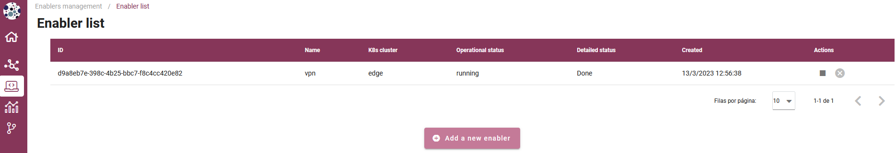
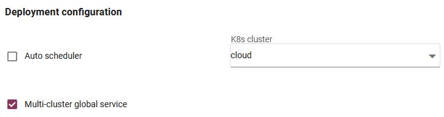
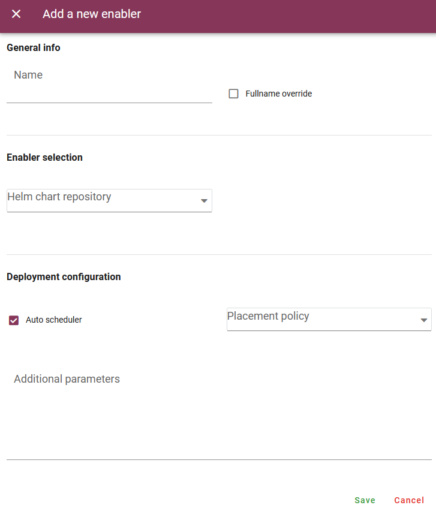
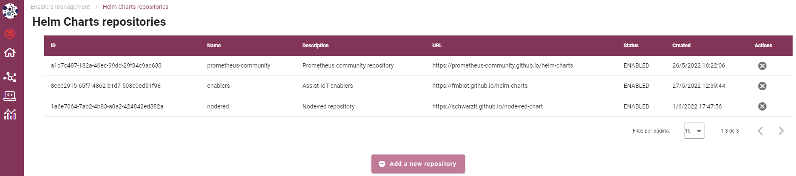
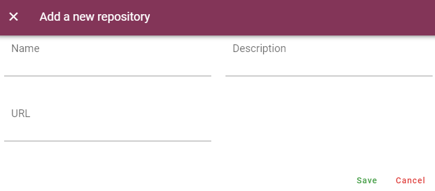

.. _Enablers manager:

#################
Enablers manager
#################

.. contents::
  :local:
  :depth: 1

***************
Introduction
***************
This enabler will serve as a registry of enablers and, in case they are deployed, the retrieval of their status. In particular, it will: (a) Allow the registration of an enabler (this is, from an ASSIST-IoT re-pository). Essential enablers will be pre-registered, (b) Retrieve a list of currently-running enablers, (c) Depict the status and the specific logs of an enabler (the latter only if the enabler with log collection capabilities is in place), (d) facilitate the deployment of standalone enablers (mostly for those that have to be present at any deployment).

***************
Features
***************
This enabler presents a visual interface to deploy, terminate and delete enablers by the interaction with the Smart Orchestrator.

In future versions, the user will be able to see the logs of each deployed enabler in a user-friendly way.

*********************
Place in architecture
*********************
The Enablers manager is part of the vertical plane manageability enablers. Moreover, this enabler is a user interface that is part of the Tactile dashboard enabler.

.. figure:: ./dashboard-manageability-architecture.png
   :alt: Dashboard architecture
   :align: center

***************
User guide
***************
This enabler is included in the Tactile Dashboard of the project, so a logged user with the right permissions can access to it by clicking its menu entry.

+--------+-----------------+---------------------------------------------+---------------------+-----------------+
| Method | Endpoint        | Description                                 | Payload (if needed) | Response format |
+========+=================+=============================================+=====================+=================+
| GET    | /enabler        | Enabler view of the dashboard               |                     | Web page        |
+--------+-----------------+---------------------------------------------+---------------------+-----------------+
| GET    | /helmrepository | Helm chart repository view of the dashboard |                     | Web page        |
+--------+-----------------+---------------------------------------------+---------------------+-----------------+

Enablers
*********************
The enabler shows a table with the deployed enablers and some information: ID, name, K8s cluster where it is deployed, operational status, detailed status and creation date.

To **deploy a new enabler**, click on the *Add a new enabler* button and a form will appear. 

The first step it to fill in the enabler name. The full name of the enabler can be overrided by checking the *Fullname override* checkbox. This means that the value of the field *Name* of the form will be used to populate the *fullnameOverride* value 
of the enabler's Helm chart, so the K8s services names of the enabler will follow this schema: *<fullnameOverride>-<component_name>*. For more information, please read the D6.7 of the project.

In order to select the enabler to deploy, first select a Helm chart repository from the list. Then a selectable will appear containing all the enablers of the selected repository. 
Select the desired enabler and, finally, choose a version from another selectable that will appear containing the available versions of the chosen enabler.

There are two options to deploy a new enabler: 

- **Select manually the K8s where will be deployed**: uncheck the *Auto scheduler* checkbox and select a cluster.
- **Use the Auto scheduler functionality of the Smart Orchestrator**: check the *Auto scheduler* checkbox and select a *Placement policy*. 
  For more infomation about these policies, see the `Smart Orchestrator entry <https://assist-iot-enablers-documentation.readthedocs.io/en/latest/horizontal_planes/smart/smart_orchestrator.html>`_.

Only if the *cloud* cluster has been manually selected to deploy the enabler on it, the *Multi-cluster global service* checkbox will appear. This option makes the service 
of the enabler's main interface available to the enablers deployed on the other clusters.

The deployment of the new enabler can be configured by filling the *Additional parameters* box with a raw JSON object. The values included in this JSON object will replace the default values 
of the *values.yaml* file of the enabler Helm chart. In future versions, the challenge is to customize this form for each enabler, including all the customizable parameters in a user-friendly way.

A deployed enabler cannot be deleted until it has been terminated. To **terminate a deployed enabler**, click on the *Terminate enabler* button of the selected enabler and confirm the action in the dialog.

.. figure:: ./enabler_terminate.png
   :alt: Terminate a deployed enabler
   :align: center

To **delete a terminated enabler**, click on the *Delete enabler* button of the selected enabler and confirm the action in the dialog.

.. figure:: ./enabler_delete.png
   :alt: Delete a terminated enabler
   :align: center

Helm chart repositories
************************
The enabler shows a table with the registered Helm chart repositories and some information: ID, name, description, URL, status and creation date. 
This registered repositories will be listed in the *Add a new enabler* form.

To **register a new Helm chart repository**, click on the *Add a new repository* button and a form will appear.

To **delete a repository**, click on the *Delete repository* button of the selected repository and confirm the action in the dialog.

***************
Prerequisites
***************
The Smart Orchestrator must be previously installed.

***************
Installation
***************
This enabler is part of the Tactile dashboard enabler, so it is installed along with the Smart Orchestrator in the latter's installation script.

However, it can be installed using the dashboard's Helm chart, which can be found in the Package registry of the Gitlab's public repository:

1. Add the Helm chart repository:

   ``helm repo add assist-public-repo https://gitlab.assist-iot.eu/api/v4/projects/85/packages/helm/stable``

2. Install the last version of the dashboard's Helm chart

   ``helm install assist-public-repo/dashboard``

*********************
Configuration options
*********************

The dashboard's Helm chart can be configured using the following environment variables:

- Frontend:

  - **BACKEND_SCHEMA**: schema of the backend endpoint (*http* or *https*).
  - **BACKEND_HOST**: hostname of the backend.
  - **BACKEND_PORT**: port of the backend.

- Backend:

  - **JAVA_OPTS**: Java options of Apache Tomcat. The database connection is configured using these options.
  - **ORCHESTRATOR_API_URL**: URL of the Smart Orchestrator's API.

- Frontend:

  - **POSTGRES_USER**: PostgreSQL database user.
  - **POSTGRES_PASSWORD**: PostgreSQL database user password.
  - **POSTGRES_DB**: PostgreSQL database name.

***************
Developer guide
***************
For more information, read the `Tactile dashboard enabler entry <https://assist-iot-enablers-documentation.readthedocs.io/en/latest/horizontal_planes/application/tactile_dashboard_enabler.html>`_

***************************
Version control and release
***************************
Version 1.0.0. Fully functional and aligned with the version 3.0.0 of the Smart Orchestrator enabler.

***************
License
***************
The licenses of internal code are under analysis. The code is developed using open source technologies (Vue.js, Spring framework, ...) and PUI9, a framework that is property of
Prodevelop. For more information about PUI9 licenses, read the `Tactile dashboard enabler entry <https://assist-iot-enablers-documentation.readthedocs.io/en/latest/horizontal_planes/application/tactile_dashboard_enabler.html>`_

**********************
Notice (dependencies)
**********************
This enabler depends on the Smart Orchestrator enabler and it's part of the Tactile dashboard enabler.