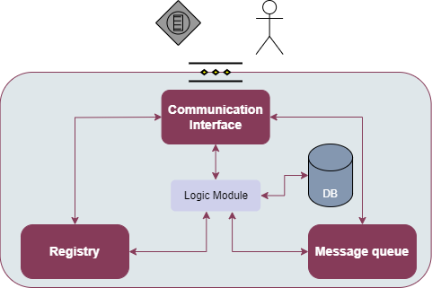

.. _Monitoring and Notifying enabler:

################################
Monitoring and Notifying enabler
################################

.. contents::
  :local:
  :depth: 1

***************
Introduction
***************
This enabler could be viewed as a general purpose by representing it as a combination of high-level monitoring module (which would allow to monitor devices, logs, etc.) and notifying module that could send custom messages to predefined system components.

**NOTE**: This enabler started with different technologies and approcah and was refactored in the duration of the project. Both implementations are documented and can be accessed through the corresponding GitHub repository.

***************
Features
***************
The monitoring and notifying enabler has the following functionalities:

- Monitor the uninterrupted functionality of edge devices
- Create a notification when an unexpected incident occurs
- Common interfaces for quering log-data and notifications

The web service performs Cronjob to automatically check the health of endpoints in the registry and post any unreachable endpoints to the DLT distributed broker enabler. The health check can also be done on demand via the API.

*********************
Place in architecture
*********************

The monitoring and notifying enabler is part of the vertical plane enablers Self-*. It is directly connected to the Edge Data Broker Enabler by subscribing to its topics.

***************
User guide
***************

The enabler has the following API endpoints.

+--------+--------------------------------+----------------------------------------+---------------------+---------------------------------------------------------------+
| Method | Endpoint                       | Description                            | Payload (if needed) | Response format                                               |
+========+================================+========================================+=====================+===============================================================+
| GET    | /ping/device                   | Ping all devices in registry           | No payload          | List of devices with health information in json array format  |
+--------+--------------------------------+----------------------------------------+---------------------+---------------------------------------------------------------+
| GET    | /ping/gateway                  | Ping all gateways in registry          | No payload          | List of gateways with health information in json array format |
+--------+--------------------------------+----------------------------------------+---------------------+---------------------------------------------------------------+
| GET    | /endpoints/device              | Get all devices in the registry        | No payload          | List of all the devices in json array format                  |
+--------+--------------------------------+----------------------------------------+---------------------+---------------------------------------------------------------+
| GET    | /endpoints/gateway             | Get all the gateways in the registry   | No payload          | List of all the gateways in json array format                 |
+--------+--------------------------------+----------------------------------------+---------------------+---------------------------------------------------------------+
| GET    | /endpoints/alive/device        | Get all alive devices in the registry  | No payload          | List of alive devices in json array format                    |
+--------+--------------------------------+----------------------------------------+---------------------+---------------------------------------------------------------+
| GET    | /endpoints/alive/gateway       | Get all alive gateways in the registry | No payload          | List of alive gateways in json array format                   |
+--------+--------------------------------+----------------------------------------+---------------------+---------------------------------------------------------------+
| POST   | /endpoints/                    | Add new device/gateway in the registry | Described below     | Json with device / gateway information                        |
+--------+--------------------------------+----------------------------------------+---------------------+---------------------------------------------------------------+
| DELETE | /endpoints/device/$device_id   | Remove a device from the registry      | No payload          | Json with the id of the device deleted                        |
+--------+--------------------------------+----------------------------------------+---------------------+---------------------------------------------------------------+
| DELETE | /endpoints/gateway/$gateway_id | Remove a gateway from the registry     | No payload          | Json with the id of the gateway deleted                       |
+--------+--------------------------------+----------------------------------------+---------------------+---------------------------------------------------------------+

For the post request the payload is:

.. code:: python

  {
    "type": "String",
    "endpoint": "String",
  }

You can also check the API documentation at: https://documenter.getpostman.com/view/25916089/2s9YXh4MqF

***************
Prerequisites
***************

- Kubernetes cluster
- Docker
- kubectl
- Helm

***************
Installation
***************

======
Installing the new chart
======

.. code:: bash

  cd monitoring
  helm install monitoring .

======
Installing the old chart (Deprecated)
======

**Zookeeper**

.. code:: bash

  cd Zookeeper-Chart

  $ helm install myzookeeper . --set auth.enabled=false --set allowAnonymousLogin=true

- In your terminal you will see: Zookeeper can be accessed via port 2181 on the following DNS name from within your cluster:

.. code:: bash
  
  myzookeeper.default.svc.cluster.local
  
- And the above is your <ZOOKEEPER_SERVICE_NAME>

**Kafka**

.. code:: bash
  
  $cd Kafka-Chart

  $ helm install mykafka . --set externalZookeeper.servers=<ZOOKEPER_SERVICE_NAME>  \
  --set externalAccess.service.type=NodePort \
  --set externalAccess.service.nodePorts[0]=30910 \
  --set externalAccess.enabled=true \
  --set externalAccess.service.domain=<NODE_IP>

- In your terminal you will see: Kafka can be accessed via port 9092 on the following DNS name from within your cluster:

.. code:: bash
  
  mykafka-0.mykafka-headless.default.svc.cluster.local
  
- And the above is your <KAFKA_SERVICE_NAME>

======
Testing the deployment:
======

In order to test the deployment we are going to create a topic and test if producers/consumers can exchange messages both inside the k8s cluster and from outside as well.

**Create a topic**

- Create a topic named mytopic using the commands below. Replace the KAFKA_SERVICE_NAME placeholder with the one mentioned above.

.. code:: bash

  export POD_NAME=$(kubectl get pods --namespace default -l "app.kubernetes.io/name=kafka,app.kubernetes.io/instance=mykafka,app.kubernetes.io/component=kafka" -o jsonpath="{.items[0].metadata.name}")

  kubectl --namespace default exec -it $POD_NAME -- kafka-topics.sh --create --bootstrap-server <KAFKA_SERVICE_NAME>:9092 --replication-factor 1 --partitions 1 --topic mytopic

**Create a producer/consumer inside the cluster**

- Start a Kafka message **consumer**. This consumer will connect to the cluster and retrieve and display messages as they are published to the mytopic topic. Replace the KAFKA_SERVICE_NAME placeholder with the one mentioned above. (If you are in the same terminal you created the topic then ignore the first line).

.. code:: bash
  
  export POD_NAME=$(kubectl get pods --namespace default -l "app.kubernetes.io/name=kafka,app.kubernetes.io/instance=mykafka,app.kubernetes.io/component=kafka" -o jsonpath="{.items[0].metadata.name}")

  kubectl --namespace default exec -it $POD_NAME -- kafka-console-consumer.sh --bootstrap-server <KAFKA_SERVICE_NAME>:9092 --topic <TOPIC_NAME> --consumer.config /opt/bitnami/kafka/config/consumer.properties

Using a different console, start a Kafka message producer and produce some messages by running the command below and then entering some messages, each on a separate line. Replace the KAFKA_SERVICE_NAME placeholder with the one mentioned above.

.. code:: bash

  export POD_NAME=$(kubectl get pods --namespace default -l "app.kubernetes.io/name=kafka,app.kubernetes.io/instance=mykafka,app.kubernetes.io/component=kafka" -o jsonpath="{.items[0].metadata.name}")

  kubectl --namespace default exec -it $POD_NAME -- kafka-console-producer.sh --bootstrap-server <KAFKA_SERVICE_NAME>:9092 --topic <TOPIC_NAME> --producer.config /opt/bitnami/kafka/config/producer.properties

======
Run the custom producer outside the cluster and the custom consumer inside the cluster
======

Assuming we have an IoT or Edge device outside the k8s cluster we create a virtual temperature generator with the following assumptions:

- The device generates temperatures between (1, 30) degrees Celsius in fixed 1sec time intervals (normal distribution).
- If the temperature published by the producer exceeds 20°C, the consumer produces a warning that the temperature is high.
- If the temperature published by the producer exceeds 27°C, the producer stops for the sake of not looping forever.

Assuming that we can create the consumer in the form of a "dashboard" that exists in the cluster, so we can constantly watch the temperatures generated, as well as the warnings, we run the following commands:

.. code:: bash

  cd consumer

  helm install myconsumer .

In order to be able to watch what the logs of the consumer we run in the terminal:

.. code:: bash
  
  kubectl get pods

  kubectl logs -f <POD_NAME>

Where <POD_NAME> is the name of the pod created. Copy it from the first command.

------------

In order to create the custom temperature producer outside the cluster we need to have java installed. In a new terminal we type:

.. code:: bash

  sudo apt install default-jdk

Verify the installation:

.. code:: bash

  java -version

Then we run:

.. code:: bash

  java -jar <PATH_TO_FILE>/TempGenK8s.jar

*********************
Configuration options
*********************

======
New configuration options
======

==================== ========================================== ============================ 
 Variable             Description                                Example                   
==================== ========================================== ============================ 
 NodePort             Port that the server listens to            "30566"       
 SWAGGER_SERVER_URL   The URL that the swagger UI runs           "http://10.10.10.2:30566"    
 DLT_URL              The URL of the distributed broker          "http://broker-dltbroker-api:9899/api/DLTbroker/insert"                
==================== ========================================== ============================ 

======
Old configuration options (Deprecated)
======

================== ========================================== ========================== 
 Variable           Description                                Example                   
================== ========================================== ========================== 
 BootstrapServers   Broker adress and port                     "localhost:9092"       
 groupId            Group of devices the consumer belongs      "TemperatureSensors"    
 topic              Topic to subscribe                         "device1", "device2"  
 threshold          Threshold value to produce notifications   "20"                  
================== ========================================== ========================== 

***************
Developer guide
***************

Note: The value of the "status" field of the endpoints in the registry is either "alive" or "unreachable" (see response of GET get all gateways/devices ) ie the status field has the same value ("unreachable") for both offline (unreachable) and not known (non existent) endpoints (urls). The difference between the two is visible in the responses of ping device/gateway - post alive. Only offline endpoints are posted to the DLT.

***************************
Version control and release
***************************

Version 0.1.0. Fully functional and able to retrieve all data even if the cluster fails.

***************
License
***************

Monitoring and notifying enabler is under BSD 3-Clause "New" or "Revised" License.

********************
Notice(dependencies)
********************
ASSIST-IoT - Architecture for Scalable, Self-*, human-centric, Intelligent, Se-cure, and Tactile next generation IoT

This project has received funding from the European Union's Horizon 2020 research and innovation programme under grant agreement No 957258.

The software included is:

- Apache Kafka (https://github.com/apache/kafka) Apache 2.0 License

- Apache Zookeeper (https://github.com/apache/zookeeper) Apache 2.0 License

- Java 8 programming language (https://www.java.com/en/)

- Monbgo DB (https://github.com/mongodb/mongo) Server Side Public License (SSPL) v1.0

- Express JS (https://github.com/expressjs/express) MIT License
