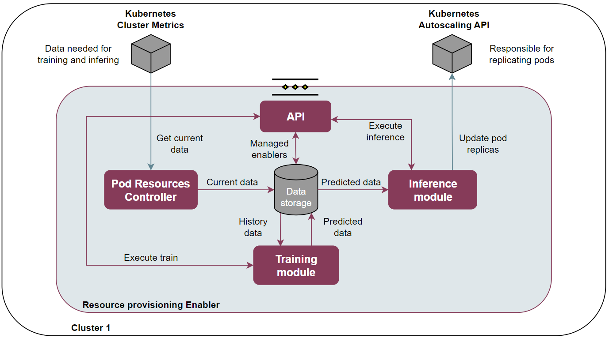

.. _Resource provisioning enabler:

.. image:: https://user-images.githubusercontent.com/100677511/170439941-58810f43-b437-41e5-9976-899b60cf1e5e.png

#############################
Resource provisioning enabler
#############################

.. contents::
  :local:
  :depth: 1

***************
Introduction
***************
This enabler will be able to horizontally scale (up or down) the resources devoted to a specific enabler (inside a node) in a dynamic fashion, based on time series inference and custom logic.

***************
Features
***************
Resource provisioning enabler shall store time series with the usage metrics of the components of each active enabler in the host cluster. Deep learning techniques based on time series models are used to predict usage metrics and horizontally scale the resources dedicated to each enabler component. The software will be self-contained and will act accordingly to the dynamic behaviour of each enabler.

*********************
Place in architecture
*********************
When the administrator user enables the resources provisioning controller enabler it automatically starts working. It accesses the metrics and stores them in its internal database, performs the deep learning process and infers to create the horizontal objects pod autoscalers dynamically. All this with pre-set values in the initial configuration.

- **API REST**: Contains the logic necessary to make GET and POST calls to intervene with the system behaviour, change default values or collect information.
- **Pod Resources Controller**: Performs the collection of metrics and is responsible for storing the values in 15-minute intervals.
- **Database storage**: Contains the history and predicted data of all components of each active enabler. Also, contains the relative information about if each enabler are activated to infer or not.
- **Training module**: Collects the raw data from the history databases and converts it to the format needed for the deep learning process. Executes the data predictions and stores them in a new database.
- **Inference module**: Adds logic to the data in the future database and generates the inference process. Creates or replaces the horizontal pod autoscaler objects. Changes the previous values to the new ones based on the results obtained.

***************
User guide
***************
The enabler has a management API that provides a flask-based REST interface that can be interacted with to configure certain values. The url must include not only the address of the enabler, but also the action to be performed and the message body if necessary. The response shall include the requested information or the result of the execution of a command.

+---------+-------------------+-----------------------------------------+--------------------------------------------------------------------------------------------------------------------+--------------------------------------------------------------------------------------------------------------------------------------------+
| Method  | Endpoint          | Description                             | Payload (if need)                                                                                                  | Response format                                                                                                                            |
+=========+===================+=========================================+====================================================================================================================+============================================================================================================================================+
| GET     | /v1/enablers      | Return enablers and components          |                                                                                                                    | {"enablers": [{"name": "resource-provisioning","managed": true,"components": [{"name": "api","managed": true}]}]}                          |
+---------+-------------------+-----------------------------------------+--------------------------------------------------------------------------------------------------------------------+--------------------------------------------------------------------------------------------------------------------------------------------+
| POST    | /v1/enablers      | Update managed enablers and components  | {"enablers": [{"name": "resource-provisioning","managed": true,"components": [{"name": "api","managed": true}]}]}  | ["Enablers managed updates sucessfully","Content-Type not supported!","Invalid JSON","Managed enablers/components must be true or false"]  |
+---------+-------------------+-----------------------------------------+--------------------------------------------------------------------------------------------------------------------+--------------------------------------------------------------------------------------------------------------------------------------------+
| GET     | /v1/train-values  | Return train values                     |                                                                                                                    | {"Future_data": "1", "History_data": "5"}                                                                                                  |
+---------+-------------------+-----------------------------------------+--------------------------------------------------------------------------------------------------------------------+--------------------------------------------------------------------------------------------------------------------------------------------+
| POST    | /v1/train-values  | Update train values                     | {"Future_data": "1", "History_data": "5"}                                                                          | ["Train values changed","Content-Type not supported!","Error in json body","Values must be positive numbers"]                              |
+---------+-------------------+-----------------------------------------+--------------------------------------------------------------------------------------------------------------------+--------------------------------------------------------------------------------------------------------------------------------------------+
| GET     | /v1/train         | Execute the train                       |                                                                                                                    | ["Train module executed successfully","Not components to train","Insufficient data"]                                                       |
+---------+-------------------+-----------------------------------------+--------------------------------------------------------------------------------------------------------------------+--------------------------------------------------------------------------------------------------------------------------------------------+
| GET     | /v1/inference     | Execute the inference                   |                                                                                                                    | ["Infence complete sucessfully","Error in execution Inference Module"]                                                                     |
+---------+-------------------+-----------------------------------------+--------------------------------------------------------------------------------------------------------------------+--------------------------------------------------------------------------------------------------------------------------------------------+
| GET     | /version          | Return version                          |                                                                                                                    | {"enabler": "resource-provisioning","version": "1.0.0"}                                                                                    |
+---------+-------------------+-----------------------------------------+--------------------------------------------------------------------------------------------------------------------+--------------------------------------------------------------------------------------------------------------------------------------------+
| GET     | /v1/health        | Return health status                    |                                                                                                                    | {"status": "healthy"}                                                                                                                      |
+---------+-------------------+-----------------------------------------+--------------------------------------------------------------------------------------------------------------------+--------------------------------------------------------------------------------------------------------------------------------------------+
| GET     | /v1/api-export    | Return OpenAPI JSON format              |                                                                                                                    | {"openapi": "3.0.0","info": {...}}                                                                                                         |
+---------+-------------------+-----------------------------------------+--------------------------------------------------------------------------------------------------------------------+--------------------------------------------------------------------------------------------------------------------------------------------+

***************
Prerequisites
***************
1. **Kubernetes cluster** (e.g. microk8s, k8s).
2. **Helm** package manager for kubernetes.
3. **Enable metrics server** to get the metrics from cluster.

***************
Installation
***************
Enabler is provided as a Helm chart. Refer to specific deployment instructions.
Documentation availabe at: https://gitlab.assist-iot.eu/wp5/t51/resource-provisioning

***************
Developer guide
***************
Will be determined after the release of the enabler.

***************************
Version control and release
***************************
Version 1.0.0

***************
License
***************

This software is licensed under the `Apache 2.0 license <https://www.apache.org/licenses/LICENSE-2.0>`_.

********************
Notice(dependencies)
********************
ASSIST-IoT - Architecture for Scalable, Self-*, human-centric, Intelligent, Se-cure, and Tactile next generation IoT

This project has received funding from the European Union's Horizon 2020
research and innovation programme under grant agreement No 957258.

Resource Provisioning enabler

Copyright 2020-2023 Universitat Politècnica de València

I. Included Software

II. Used Software

-	click 8.0.3 (https://github.com/pallets/click/tree/8.0.x), BSD-3-Clause li-cense
-	colorama 0.4.4 (https://github.com/tartley/colorama/tree/0.4.4), BSD-3-Clause license
-	Flask 2.0.2 (https://github.com/pallets/flask/tree/2.0.x), BSD-3-Clause li-cense
-	itsdangerous 2.0.1 (https://github.com/pallets/itsdangerous/tree/2.0.1) BSD-3-Clause license
-	Jinja2 3.0.3 (https://github.com/pallets/jinja/tree/3.0.3), BSD-3-Clause license
-	MarkupSafe 2.0.1 (https://github.com/pallets/markupsafe/tree/2.0.1), BSD-3-Clause license
-	Werkzeug 2.0.2 (https://github.com/pallets/werkzeug/tree/2.0.x), BSD-3-Clause license
-	gunicorn 20.1.0 (https://github.com/benoitc/gunicorn/tree/20.x), custom li-cense (see list below)
-	requests 2.27.1 (https://github.com/psf/requests/tree/v2.27.x), Apache-2.0 license
-	flask_wtf 1.0.0 (https://github.com/wtforms/flask-wtf/tree/1.0.x), BSD-3-Clause license
-	peewee 3.14.10 (https://github.com/coleifer/peewee/tree/3.14.10), MIT license
-	wtforms (https://github.com/wtforms/wtforms), BSD-3-Clause license
- kubernetes (https://github.com/kubernetes-client/python), Apache-2.0 license
- pint (https://github.com/hgrecco/pint/tree/master), BSD-3-Clause li-cense
- pymsql (https://github.com/PyMySQL/PyMySQL), MIT license
- pandas (https://github.com/pandas-dev/pandas), BSD-3-Clause license
- neuralprophet (https://github.com/ourownstory/neural_prophet), MIT license

III. List of licenses

-	BSD-3-Clause license (https://opensource.org/license/bsd-3-clause/)
-	Gunicorn license (https://github.com/benoitc/gunicorn/blob/master/LICENSE)
-	Apache-2.0 license (https://www.apache.org/licenses/LICENSE-2.0)
-	MIT license (https://opensource.org/license/mit/)
