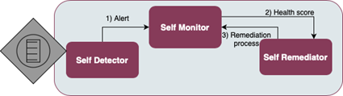
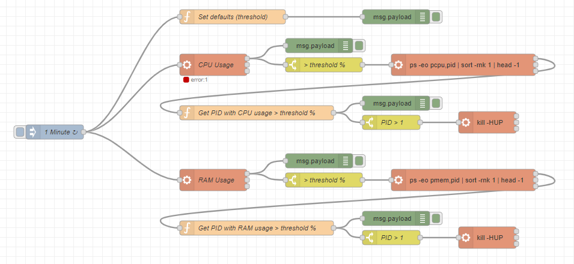
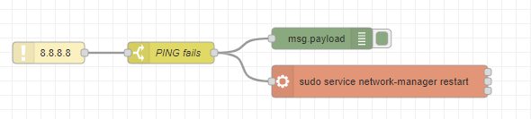

.. _Self-healing device enabler:

############################
Self-healing device enabler
############################

.. contents::
  :local:
  :depth: 1

***************
Introduction
***************
This enabler aims at providing the IoT devices with the capabilities of actively attempting to recover themselves from abnormal states, based on a pre-established routines schedule. Hence, it should not require high computation capabilities in order to be deployed on any customizable device.

***************
Features
***************
As it can be seen in the figure below, the self-healing device enabler is divided in three components:

- **Self-detector:** The goal of this component is to collect information from the IoT device.
- **Self-monitor:** The Self monitor component is responsible for assessing the device’s state of health. It collects and analyses data from multiple sources of information received from the self-detector, such as memory usage, CPU usage, or network connection metrics, providing a health score. The health score metrics are fed to a predefined set of thesholds that determines whether the device is in a healthy state or not.
- **Self-remediator:** When the Self-monitor component notices malfunctioning symptoms, it informs to this component, which itss job is to determine from a set of remediation processes, which should be used for a proper treatment. If after the remediation, the device is not back to its normal state, another remediation process from the list may be triggered.

*********************
Place in architecture
*********************
The self-healing device enabler is part of the Self-* transversal plane. However, since its functionalities are limited to edge devices, it is directly related with the edge and devices horizontal plane.

***************
User guide
***************

1. First of all, please proceed with the Installation following the commands explained in that section.

2. Next, the user can open a browser and in the address bar type the following: ``http://localhost:1885/``.

3. This will automatically open a node-red browser with the predefined self-healing features.

They can be divided between CPU/RAM usage and network availability:

CPU usage and RAM usage
******************************
The following figure illustrates the nodes and flows associated to these self-healing functionalities:

Self-detector
##############

- The following command obtains the overall **CPU usage:** ``echo $[100-$(vmstat 1 2|tail -1|awk '{print $15}')]``
- The following command obtains the overall **RAM usage:** ``free | grep Mem | awk '{print $3/$2 * 100.0}'``

Self-monitor
############

- If CPU usage > 80\% (customizable parameter via API, as described below) during an amount of time, look for the process with the most CPU consumption. To do so, the following command gets the process with the most CPU consumption: ``ps -eo pcpu,pid | sort -rnk 1 | head -1``. In this command, sort is being used with the -r (reverse), the -n (numeric) and the -k (key) options which are telling the command to sort the output in reverse numeric order based on the first column (cpu usage) in the output from ps.
- If RAM usage > 80% (customizable parameter via API, as described below) during an amount of time, look for the process with the most RAM consumption. To do so, the following command gets the process with the most RAM consumption: ``ps -eo pmem,pid | sort -rnk 1 | head -1``. In this command, sort is being used with the -r (reverse), the -n (numeric) and the -k (key) options which are telling the command to sort the output in reverse numeric order based on the first column (memory usage) in the output from ps.

Self-Remediator
################

The following remediation command is performed (either with CPU usage or with RAM usage): ``CMD=``cat /proc/<pid>/cmdline |sed 's/\x0/ /g' \`\` && kill <pid> && \`\`$CMD\`\` &``. It will reload the process ``<pid>`` with the kill command

Network availability
**********************
The following figure illustrates the nodes and flows associated to this self-healing functionality:

Self-detector
#############
- A Node-RED node to ping a remote server, for use as a keep-alive check) and use this node to ping a known service like www.google.es (IP = 8.8.8.8)

Self-monitor
#############

- If response of the ping node is false, the ethernet connection could be off.

Self-Remediator
################

- Restarts network manager service with the following command: ``sudo service network-manager restart``

REST API endpoints
******************

The currently supported REST API endpoints are:

+---------+-----------+------------------------------------------------------------------------------------------+----------------------+------------------+
| Method  | Endpoint  | Description                                                                              | Payload (if needed)  | Response format  |
+=========+===========+==========================================================================================+======================+==================+
| POST    | /cpuusage | Change the maximum threshold of CPU usage to XX                                          | ?threshold=XX        |                  |
+---------+-----------+------------------------------------------------------------------------------------------+----------------------+------------------+
| POST    | /ramusage | Change the maximum threshold of RAM usage to XX                                          | ?threshold=XX        |                  |
+---------+-----------+------------------------------------------------------------------------------------------+----------------------+------------------+
| POST    | /network  | Change the IP address over which the service should ping to check network availability   | ?IP=XX               |                  |
+---------+-----------+------------------------------------------------------------------------------------------+----------------------+------------------+

***************
Prerequisites
***************
- Linux 
- Docker, Docker-compose
- The main technological dependencies of the self-healing enabler Docker are:

+----------------+--------------------------------------------------------------------------------------------------------------------------------------------------------------------------------------------+-------------------------------------------------+
| Technology     | Justification                                                                                                                                                                              | Component(s)                                    |
+================+============================================================================================================================================================================================+=================================================+
| Node-RED       | Is a low-code programming tool for wiring together hardware devices, APIs and online services. Provides all it is needed to implement self-healing devices (hardware and software access)  |  Self-detector, Self-monitor, Self-remediator   |
+----------------+--------------------------------------------------------------------------------------------------------------------------------------------------------------------------------------------+-------------------------------------------------+
| Unix commands  | Used to access device hardware & software                                                                                                                                                  | Self-detector, Self-monitor, Self-remediator    |
+----------------+--------------------------------------------------------------------------------------------------------------------------------------------------------------------------------------------+-------------------------------------------------+
| Javascript     | Main language for developing custom functions over all components of the enabler. Selected for its familiarity                                                                             | Self-detector, Self-monitor, Self-remediator    |
+----------------+--------------------------------------------------------------------------------------------------------------------------------------------------------------------------------------------+-------------------------------------------------+

***************
Installation
***************
1. Download or clone the repository
2. Once downloaded, browse to that folder with a terminal
3. Run the following command: ``docker-compose up``

*********************
Configuration options
*********************

- The threshold of the CPU and RAM usage can be configured via the supported restAPI endpoints

***************************
Version control and release
***************************

- Version 1.0 includes: 

  - CPU usage, RAM usage, and network accessibility are the HW resources monitored by the enabler
  - Kill PID (for the CPU, RAM usage monitoring), and restarting of the device’s network manager are the remediation actions supported

- Version 2.0 will include: 

  - Additional metrics (e.g., storage status, battery status)
  - More advanced monitoring options (i.e., smarter ML-based solutions)
  - Other remediation rules (e.g., isolate the device, shut down network ports, or reboot) 

***************
License
***************
TBD

